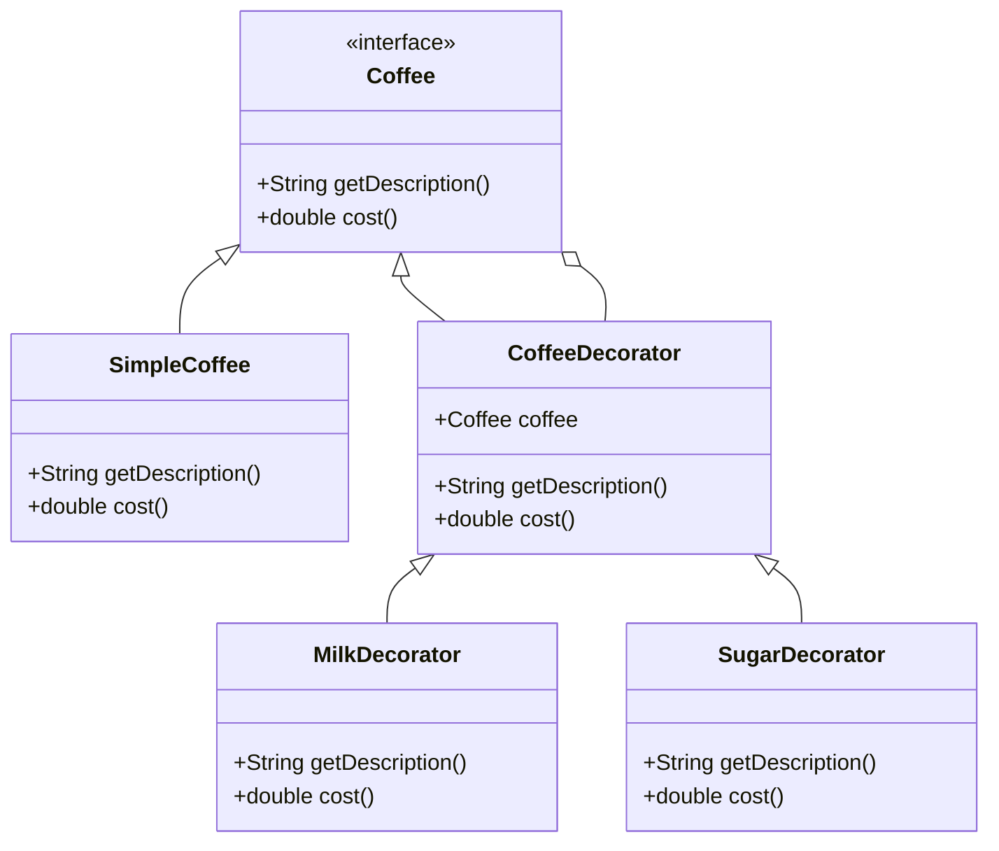

## 5.4 Decorator Design Pattern

The Decorator Design Pattern is a structural pattern that allows behavior to be added to individual objects, either statically or dynamically, without affecting the behavior of other objects from the same class. This pattern is particularly useful in Dart and Flutter development for enhancing the functionality of widgets and data streams in a flexible and reusable manner.

### Intent

The primary intent of the Decorator Pattern is to attach additional responsibilities to an object dynamically. Decorators provide a flexible alternative to subclassing for extending functionality. This pattern is especially beneficial when you want to add features to objects without modifying their structure or creating a complex inheritance hierarchy.

### Key Participants

1. **Component Interface**: This defines the interface for objects that can have responsibilities added to them dynamically. Both concrete components and decorators implement this interface.

2. **Concrete Component**: This is the class of objects to which additional responsibilities can be attached.

3. **Decorator Class**: This class wraps a component and provides additional behavior. It maintains a reference to a component object and defines an interface that conforms to the component's interface.

4. **Concrete Decorators**: These are classes that extend the functionality of the component by adding new behavior.

### Applicability

Use the Decorator Pattern when:

- You need to add responsibilities to individual objects dynamically and transparently, without affecting other objects.
- You want to extend the behavior of classes in a flexible and reusable way.
- You want to avoid an explosion of subclasses to support every combination of features.

### Implementing Decorator in Dart

#### Component Interface

In Dart, the component interface can be defined using an abstract class or an interface. This interface will be implemented by both the concrete component and the decorators.

```dart
abstract class Coffee {
  String getDescription();
  double cost();
}
```

#### Concrete Component

The concrete component implements the component interface. It represents the core object to which additional responsibilities can be added.

```dart
class SimpleCoffee implements Coffee {
  @override
  String getDescription() => "Simple Coffee";

  @override
  double cost() => 5.0;
}
```

#### Decorator Class

The decorator class also implements the component interface and contains a reference to a component object. It delegates the component's behavior to the component object and can add its own behavior.

```dart
abstract class CoffeeDecorator implements Coffee {
  final Coffee coffee;

  CoffeeDecorator(this.coffee);

  @override
  String getDescription() => coffee.getDescription();

  @override
  double cost() => coffee.cost();
}
```

#### Concrete Decorators

Concrete decorators extend the functionality of the component by adding new behavior.

```dart
class MilkDecorator extends CoffeeDecorator {
  MilkDecorator(Coffee coffee) : super(coffee);

  @override
  String getDescription() => "${coffee.getDescription()}, Milk";

  @override
  double cost() => coffee.cost() + 1.5;
}

class SugarDecorator extends CoffeeDecorator {
  SugarDecorator(Coffee coffee) : super(coffee);

  @override
  String getDescription() => "${coffee.getDescription()}, Sugar";

  @override
  double cost() => coffee.cost() + 0.5;
}
```

#### Usage Example

```dart
void main() {
  Coffee coffee = SimpleCoffee();
  print("${coffee.getDescription()} costs \$${coffee.cost()}");

  coffee = MilkDecorator(coffee);
  print("${coffee.getDescription()} costs \$${coffee.cost()}");

  coffee = SugarDecorator(coffee);
  print("${coffee.getDescription()} costs \$${coffee.cost()}");
}
```

### Visualizing the Decorator Pattern

To better understand the Decorator Pattern, let's visualize the relationships between the components using a class diagram.



### Use Cases and Examples

#### Enhancing Widgets

In Flutter, the Decorator Pattern is often used to enhance widgets by adding decoration, padding, or behavior. For example, you can create a custom widget decorator that adds a border or shadow to an existing widget.

```dart
class BorderDecorator extends StatelessWidget {
  final Widget child;

  BorderDecorator({required this.child});

  @override
  Widget build(BuildContext context) {
    return Container(
      decoration: BoxDecoration(
        border: Border.all(color: Colors.blue, width: 2.0),
      ),
      child: child,
    );
  }
}

void main() {
  runApp(
    MaterialApp(
      home: Scaffold(
        body: Center(
          child: BorderDecorator(
            child: Text('Hello, Flutter!'),
          ),
        ),
      ),
    ),
  );
}
```

#### Modifying Data Streams

The Decorator Pattern can also be applied to modify data streams. For instance, you can create a stream decorator that transforms data as it flows through the stream.

```dart
Stream<int> addFive(Stream<int> input) async* {
  await for (var value in input) {
    yield value + 5;
  }
}

void main() async {
  final stream = Stream.fromIterable([1, 2, 3, 4, 5]);
  final decoratedStream = addFive(stream);

  await for (var value in decoratedStream) {
    print(value); // Outputs: 6, 7, 8, 9, 10
  }
}
```

### Design Considerations

When implementing the Decorator Pattern in Dart, consider the following:

- **Performance**: Each decorator adds a layer of abstraction, which can impact performance. Use decorators judiciously to avoid excessive overhead.
- **Complexity**: While decorators provide flexibility, they can also increase the complexity of the code. Ensure that the added complexity is justified by the benefits.
- **Dart Features**: Take advantage of Dart's features such as mixins and extensions to enhance the functionality of decorators.

### Differences and Similarities

The Decorator Pattern is often confused with the Proxy Pattern. While both patterns involve wrapping an object, they serve different purposes:

- **Decorator Pattern**: Focuses on adding new behavior to an object.
- **Proxy Pattern**: Provides a surrogate or placeholder for another object to control access to it.

### Try It Yourself

To deepen your understanding of the Decorator Pattern, try modifying the code examples provided:

- Create additional decorators for the coffee example, such as `WhippedCreamDecorator` or `CaramelDecorator`.
- Experiment with different widget decorators in Flutter, such as adding shadows or gradients.
- Modify the data stream example to perform different transformations, such as multiplying values or filtering them.

### Knowledge Check

Before moving on, let's reinforce what we've learned:

- What is the primary purpose of the Decorator Pattern?
- How does the Decorator Pattern differ from subclassing?
- Can you identify a real-world scenario where the Decorator Pattern would be beneficial?

### Embrace the Journey

Remember, mastering design patterns is a journey. As you continue to explore and apply the Decorator Pattern in your Dart and Flutter projects, you'll gain a deeper understanding of its power and flexibility. Keep experimenting, stay curious, and enjoy the journey!

## Quiz Time!



### What is the primary intent of the Decorator Pattern?

- [x] To add responsibilities to objects dynamically
- [ ] To provide a surrogate for another object
- [ ] To create a complex inheritance hierarchy
- [ ] To simplify object creation

> **Explanation:** The Decorator Pattern is intended to add responsibilities to objects dynamically without affecting other objects.

### Which of the following is a key participant in the Decorator Pattern?

- [x] Component Interface
- [ ] Singleton Instance
- [ ] Factory Method
- [ ] Observer

> **Explanation:** The Component Interface is a key participant in the Decorator Pattern, defining the interface for objects that can have responsibilities added.

### How does the Decorator Pattern differ from subclassing?

- [x] It adds behavior dynamically without modifying the object's structure
- [ ] It requires creating a new class for each feature
- [ ] It simplifies the code by reducing the number of classes
- [ ] It is only applicable to UI components

> **Explanation:** The Decorator Pattern adds behavior dynamically without modifying the object's structure, unlike subclassing, which requires creating new classes.

### In Flutter, what can the Decorator Pattern be used for?

- [x] Enhancing widgets by adding decoration or behavior
- [ ] Simplifying state management
- [ ] Creating complex animations
- [ ] Managing network requests

> **Explanation:** In Flutter, the Decorator Pattern is often used to enhance widgets by adding decoration or behavior.

### What is a potential downside of using the Decorator Pattern?

- [x] Increased complexity
- [ ] Reduced flexibility
- [ ] Limited reusability
- [ ] Poor performance

> **Explanation:** While the Decorator Pattern provides flexibility, it can also increase the complexity of the code.

### Which Dart feature can enhance the functionality of decorators?

- [x] Mixins
- [ ] Generics
- [ ] Null Safety
- [ ] Futures

> **Explanation:** Mixins in Dart can be used to enhance the functionality of decorators by adding reusable behavior.

### What is the difference between the Decorator and Proxy Patterns?

- [x] Decorator adds behavior, Proxy controls access
- [ ] Decorator controls access, Proxy adds behavior
- [ ] Both add behavior and control access
- [ ] Neither adds behavior nor controls access

> **Explanation:** The Decorator Pattern adds behavior to objects, while the Proxy Pattern controls access to objects.

### Which of the following is a concrete decorator in the coffee example?

- [x] MilkDecorator
- [ ] CoffeeDecorator
- [ ] SimpleCoffee
- [ ] Coffee

> **Explanation:** `MilkDecorator` is a concrete decorator that extends the functionality of the coffee component.

### What is the role of the Decorator Class in the pattern?

- [x] It wraps a component and provides additional behavior
- [ ] It defines the interface for objects
- [ ] It represents the core object
- [ ] It controls access to the component

> **Explanation:** The Decorator Class wraps a component and provides additional behavior, conforming to the component's interface.

### True or False: The Decorator Pattern can be used to modify data streams in Dart.

- [x] True
- [ ] False

> **Explanation:** True. The Decorator Pattern can be applied to modify data streams by transforming data as it flows through the stream.


