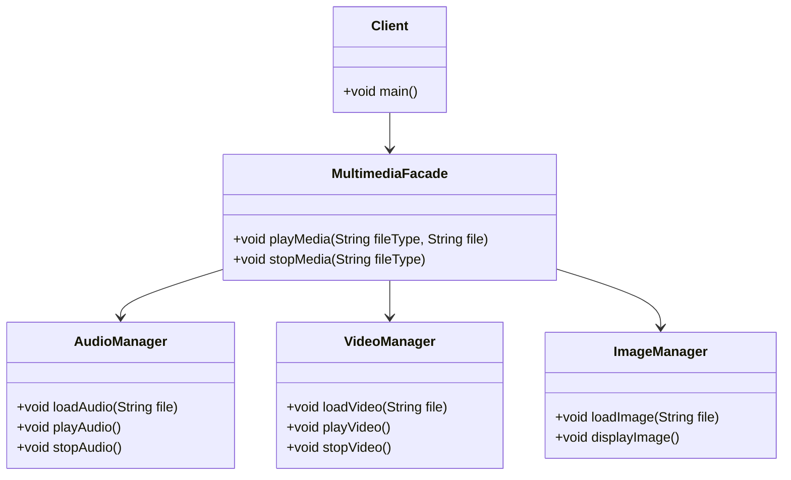

## 5.5 Facade Design Pattern

In the world of software development, complexity is often an unavoidable reality. As systems grow, they tend to become more intricate, with numerous components interacting in various ways. The Facade Design Pattern is a structural pattern that addresses this complexity by providing a simplified interface to a complex subsystem. This pattern is particularly useful in Dart and Flutter development, where managing complexity is crucial for building scalable and maintainable applications.

### **Intent of the Facade Design Pattern**

The primary intent of the Facade Design Pattern is to provide a unified and simplified interface to a set of interfaces in a subsystem. It defines a higher-level interface that makes the subsystem easier to use. By doing so, it reduces the complexity of interacting with the subsystem and promotes a cleaner and more organized codebase.

### **Key Participants**

1. **Facade**: The main class that provides a simplified interface to the complex subsystem. It delegates client requests to the appropriate subsystem objects.
2. **Subsystem Classes**: These are the classes that perform the actual work. They are complex and have intricate interactions, which the facade aims to simplify.
3. **Client**: The entity that interacts with the facade instead of directly interacting with the subsystem classes.

### **Applicability**

The Facade Design Pattern is applicable in the following scenarios:

- When you want to provide a simple interface to a complex subsystem.
- When there are many interdependent classes in a subsystem.
- When you want to layer your subsystems. The facade can be used to define an entry point to each subsystem level.

### **Implementing Facade in Dart**

Let's explore how to implement the Facade Design Pattern in Dart. We'll start by defining a complex subsystem and then create a facade to simplify its usage.

#### **Subsystem Classes**

Consider a scenario where we have a complex subsystem for managing a multimedia library. This subsystem consists of several classes responsible for different tasks such as audio management, video management, and image processing.

```dart
class AudioManager {
  void loadAudio(String file) {
    print('Loading audio file: $file');
  }

  void playAudio() {
    print('Playing audio');
  }

  void stopAudio() {
    print('Stopping audio');
  }
}

class VideoManager {
  void loadVideo(String file) {
    print('Loading video file: $file');
  }

  void playVideo() {
    print('Playing video');
  }

  void stopVideo() {
    print('Stopping video');
  }
}

class ImageManager {
  void loadImage(String file) {
    print('Loading image file: $file');
  }

  void displayImage() {
    print('Displaying image');
  }
}
```

#### **Facade Class**

The facade class will provide a simplified interface to interact with the multimedia subsystem. It will wrap the subsystem classes and expose only the necessary methods.

```dart
class MultimediaFacade {
  final AudioManager _audioManager;
  final VideoManager _videoManager;
  final ImageManager _imageManager;

  MultimediaFacade()
      : _audioManager = AudioManager(),
        _videoManager = VideoManager(),
        _imageManager = ImageManager();

  void playMedia(String fileType, String file) {
    switch (fileType) {
      case 'audio':
        _audioManager.loadAudio(file);
        _audioManager.playAudio();
        break;
      case 'video':
        _videoManager.loadVideo(file);
        _videoManager.playVideo();
        break;
      case 'image':
        _imageManager.loadImage(file);
        _imageManager.displayImage();
        break;
      default:
        print('Unsupported media type');
    }
  }

  void stopMedia(String fileType) {
    switch (fileType) {
      case 'audio':
        _audioManager.stopAudio();
        break;
      case 'video':
        _videoManager.stopVideo();
        break;
      default:
        print('Unsupported media type');
    }
  }
}
```

#### **Client Code**

The client interacts with the facade instead of directly interacting with the subsystem classes.

```dart
void main() {
  final multimediaFacade = MultimediaFacade();

  multimediaFacade.playMedia('audio', 'song.mp3');
  multimediaFacade.stopMedia('audio');

  multimediaFacade.playMedia('video', 'movie.mp4');
  multimediaFacade.stopMedia('video');

  multimediaFacade.playMedia('image', 'photo.jpg');
}
```

### **Simplifying API Usage**

The facade pattern simplifies API usage by exposing only the necessary methods and hiding the complexity of the subsystem. This makes it easier for clients to interact with the subsystem without needing to understand its intricacies.

### **Use Cases and Examples**

#### **Networking Libraries**

In Dart and Flutter, networking libraries can be complex, with various classes and methods for handling HTTP requests, responses, and errors. A facade can simplify this by providing a unified interface for making network requests.

```dart
class NetworkFacade {
  final HttpClient _httpClient;

  NetworkFacade() : _httpClient = HttpClient();

  Future<String> fetchData(String url) async {
    final request = await _httpClient.getUrl(Uri.parse(url));
    final response = await request.close();
    return await response.transform(utf8.decoder).join();
  }
}
```

#### **Complex Services**

In applications with complex services such as authentication, caching, and data retrieval, a facade can manage these services and provide a simple interface for interacting with them.

```dart
class ServiceFacade {
  final AuthenticationService _authService;
  final CacheService _cacheService;
  final DataService _dataService;

  ServiceFacade()
      : _authService = AuthenticationService(),
        _cacheService = CacheService(),
        _dataService = DataService();

  Future<void> performUserLogin(String username, String password) async {
    if (await _authService.login(username, password)) {
      print('User logged in successfully');
    } else {
      print('Login failed');
    }
  }

  Future<String> fetchData(String key) async {
    var data = _cacheService.getData(key);
    if (data == null) {
      data = await _dataService.fetchData(key);
      _cacheService.storeData(key, data);
    }
    return data;
  }
}
```

### **Design Considerations**

When implementing the Facade Design Pattern, consider the following:

- **When to Use**: Use the facade pattern when you need to simplify a complex subsystem or when you want to provide a single entry point to a set of interfaces.
- **Dart-Specific Features**: Dart's factory constructors and named parameters can be useful when creating facades, as they allow for more flexible and readable code.
- **Pitfalls**: Avoid making the facade too complex. It should remain a simple interface that delegates tasks to the subsystem classes.

### **Differences and Similarities**

The Facade Design Pattern is often confused with the Adapter Pattern. While both patterns provide a simplified interface, the facade pattern is used to simplify a complex subsystem, whereas the adapter pattern is used to make two incompatible interfaces work together.

### **Visualizing the Facade Design Pattern**

To better understand the Facade Design Pattern, let's visualize the relationships between the facade, subsystem classes, and the client.



### **Try It Yourself**

Experiment with the code examples provided. Try modifying the `MultimediaFacade` class to add more functionality, such as pausing media or adjusting volume. This will help reinforce your understanding of the Facade Design Pattern and its implementation in Dart.

### **Knowledge Check**

- Explain the primary intent of the Facade Design Pattern.
- Describe a scenario where the Facade Design Pattern would be beneficial.
- How does the Facade Design Pattern differ from the Adapter Pattern?

### **Embrace the Journey**

Remember, mastering design patterns is a journey. As you continue to explore and implement these patterns, you'll gain a deeper understanding of software architecture and design. Keep experimenting, stay curious, and enjoy the journey!

### **References and Links**

- [Design Patterns: Elements of Reusable Object-Oriented Software](https://en.wikipedia.org/wiki/Design_Patterns)
- [Dart Language Tour](https://dart.dev/guides/language/language-tour)
- [Flutter Documentation](https://flutter.dev/docs)

## Quiz Time!



### What is the primary intent of the Facade Design Pattern?

- [x] To provide a simplified interface to a complex subsystem.
- [ ] To convert the interface of a class into another interface clients expect.
- [ ] To define a family of algorithms and make them interchangeable.
- [ ] To ensure a class has only one instance.

> **Explanation:** The Facade Design Pattern aims to provide a simplified interface to a complex subsystem, making it easier to use.

### Which of the following is a key participant in the Facade Design Pattern?

- [x] Facade
- [ ] Adapter
- [ ] Strategy
- [ ] Singleton

> **Explanation:** The Facade is the main class that provides a simplified interface to the complex subsystem.

### When should you consider using the Facade Design Pattern?

- [x] When you want to provide a simple interface to a complex subsystem.
- [ ] When you need to ensure a class has only one instance.
- [ ] When you want to make two incompatible interfaces work together.
- [ ] When you need to define a family of algorithms.

> **Explanation:** The Facade Design Pattern is used to provide a simple interface to a complex subsystem.

### What is the difference between the Facade and Adapter patterns?

- [x] The Facade simplifies a complex subsystem, while the Adapter makes two incompatible interfaces work together.
- [ ] The Facade ensures a class has only one instance, while the Adapter provides a simplified interface.
- [ ] The Facade defines a family of algorithms, while the Adapter converts interfaces.
- [ ] The Facade is used for state management, while the Adapter is used for concurrency.

> **Explanation:** The Facade simplifies a complex subsystem, while the Adapter makes two incompatible interfaces work together.

### Which of the following is an example of using the Facade Design Pattern?

- [x] Simplifying HTTP requests in a networking library.
- [ ] Ensuring a class has only one instance.
- [ ] Making two incompatible interfaces work together.
- [ ] Defining a family of interchangeable algorithms.

> **Explanation:** The Facade Design Pattern can be used to simplify HTTP requests in a networking library by providing a unified interface.

### What is a potential pitfall of the Facade Design Pattern?

- [x] Making the facade too complex.
- [ ] Ensuring a class has only one instance.
- [ ] Making two incompatible interfaces work together.
- [ ] Defining a family of interchangeable algorithms.

> **Explanation:** A potential pitfall of the Facade Design Pattern is making the facade too complex, which defeats its purpose.

### How does the Facade Design Pattern promote cleaner code?

- [x] By reducing the complexity of interacting with a subsystem.
- [ ] By ensuring a class has only one instance.
- [ ] By making two incompatible interfaces work together.
- [ ] By defining a family of interchangeable algorithms.

> **Explanation:** The Facade Design Pattern promotes cleaner code by reducing the complexity of interacting with a subsystem.

### What is the role of the client in the Facade Design Pattern?

- [x] To interact with the facade instead of directly interacting with the subsystem classes.
- [ ] To ensure a class has only one instance.
- [ ] To make two incompatible interfaces work together.
- [ ] To define a family of interchangeable algorithms.

> **Explanation:** The client interacts with the facade instead of directly interacting with the subsystem classes.

### Can the Facade Design Pattern be used in Flutter development?

- [x] True
- [ ] False

> **Explanation:** The Facade Design Pattern can be used in Flutter development to simplify complex subsystems and promote cleaner code.

### What is the benefit of using a facade in a complex service?

- [x] It manages services and provides a simple interface for interacting with them.
- [ ] It ensures a class has only one instance.
- [ ] It makes two incompatible interfaces work together.
- [ ] It defines a family of interchangeable algorithms.

> **Explanation:** A facade in a complex service manages services and provides a simple interface for interacting with them.


