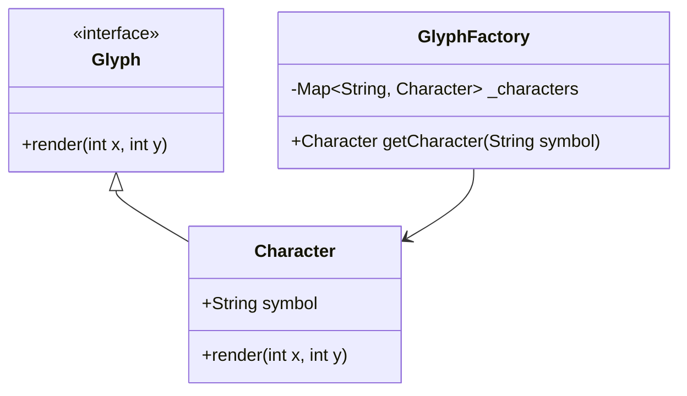

## 5.6 Flyweight Design Pattern

The Flyweight Design Pattern is a structural pattern that aims to minimize memory usage by sharing as much data as possible with similar objects. This pattern is particularly useful in applications where a large number of objects are used, and many of them share common data. By using the Flyweight pattern, we can significantly reduce the memory footprint of our applications, which is especially beneficial in resource-constrained environments like mobile devices.

### Intent

The primary intent of the Flyweight pattern is to share common parts of objects to reduce memory usage. This is achieved by separating the intrinsic state (shared data) from the extrinsic state (unique data) and managing shared instances through a factory.

### Key Participants

1. **Flyweight Interface**: Declares methods that flyweight objects can implement.
2. **Concrete Flyweight**: Implements the Flyweight interface and stores intrinsic state.
3. **Unshared Concrete Flyweight**: Represents flyweight objects that cannot be shared.
4. **Flyweight Factory**: Creates and manages flyweight objects, ensuring that shared instances are reused.
5. **Client**: Maintains references to flyweight objects and computes or stores extrinsic state.

### Intrinsic and Extrinsic States

In the Flyweight pattern, the intrinsic state is the part of the object that can be shared among multiple objects. This state is independent of the context in which the object is used. On the other hand, the extrinsic state is context-dependent and must be provided by the client.

#### Example: Text Rendering

Consider a text rendering system where each character is represented as an object. The intrinsic state could be the character glyph (shape), while the extrinsic state could be the position of the character on the screen.

### Implementing Flyweight in Dart

Let's explore how to implement the Flyweight pattern in Dart by creating a simple example of a text rendering system.

#### Step 1: Define the Flyweight Interface

```dart
abstract class Glyph {
  void render(int x, int y);
}
```

#### Step 2: Implement Concrete Flyweight

```dart
class Character implements Glyph {
  final String symbol;

  Character(this.symbol);

  @override
  void render(int x, int y) {
    print('Rendering character $symbol at position ($x, $y)');
  }
}
```

#### Step 3: Create the Flyweight Factory

```dart
class GlyphFactory {
  final Map<String, Character> _characters = {};

  Character getCharacter(String symbol) {
    if (!_characters.containsKey(symbol)) {
      _characters[symbol] = Character(symbol);
    }
    return _characters[symbol]!;
  }
}
```

#### Step 4: Use the Flyweight Pattern

```dart
void main() {
  GlyphFactory factory = GlyphFactory();

  List<Glyph> text = [
    factory.getCharacter('H'),
    factory.getCharacter('e'),
    factory.getCharacter('l'),
    factory.getCharacter('l'),
    factory.getCharacter('o')
  ];

  int x = 0;
  for (var glyph in text) {
    glyph.render(x, 0);
    x += 10;
  }
}
```

### Factory for Flyweights

The factory is responsible for managing the shared instances of flyweight objects. It ensures that each unique intrinsic state is only stored once, and it provides access to these shared instances.

### Use Cases and Examples

#### Text Rendering

In text rendering, each character can be represented as a flyweight object. The intrinsic state is the character glyph, and the extrinsic state is the position of the character on the screen. This approach can significantly reduce memory usage when rendering large amounts of text.

#### Game Development

In game development, the Flyweight pattern can be used to share textures or sprites among multiple game objects. For example, in a game with many identical trees, the texture of the tree can be shared among all tree objects, while the position and size of each tree are stored as extrinsic state.

### Visualizing the Flyweight Pattern

To better understand the Flyweight pattern, let's visualize the relationship between the different components using a class diagram.



**Diagram Description**: This class diagram illustrates the Flyweight pattern in a text rendering system. The `Glyph` interface is implemented by the `Character` class, which represents the concrete flyweight. The `GlyphFactory` manages the shared instances of `Character` objects.

### Design Considerations

- **When to Use**: The Flyweight pattern is most effective when an application uses a large number of objects that share common data. It is particularly useful in scenarios where memory usage is a concern.
- **Pitfalls**: Be cautious when managing extrinsic state, as it can lead to increased complexity in the client code. Ensure that the factory efficiently manages the lifecycle of shared instances.

### Differences and Similarities

The Flyweight pattern is often confused with the Singleton pattern, as both involve managing shared instances. However, the Flyweight pattern focuses on sharing parts of objects to reduce memory usage, while the Singleton pattern ensures a single instance of a class.

### Try It Yourself

To deepen your understanding of the Flyweight pattern, try modifying the code example to include additional glyph attributes, such as font size or color, and manage these attributes as part of the extrinsic state.

### Knowledge Check

- **Question**: What is the primary purpose of the Flyweight pattern?
- **Challenge**: Implement a Flyweight pattern for a game where multiple enemies share the same sprite but have different health values.

### Embrace the Journey

Remember, mastering design patterns like Flyweight is a journey. As you continue to explore and apply these patterns, you'll become more adept at creating efficient and scalable applications. Keep experimenting, stay curious, and enjoy the process!

## Quiz Time!



### What is the primary purpose of the Flyweight pattern?

- [x] To reduce memory usage by sharing common parts of objects.
- [ ] To ensure a single instance of a class.
- [ ] To separate the interface from the implementation.
- [ ] To provide a simplified interface to a complex system.

> **Explanation:** The Flyweight pattern aims to minimize memory usage by sharing as much data as possible with similar objects.

### Which state in the Flyweight pattern is shared among objects?

- [x] Intrinsic state
- [ ] Extrinsic state
- [ ] Contextual state
- [ ] Transient state

> **Explanation:** The intrinsic state is the part of the object that can be shared among multiple objects.

### In the Flyweight pattern, what is the role of the factory?

- [x] To manage shared instances of flyweight objects.
- [ ] To create unique instances of each object.
- [ ] To provide a unified interface to a set of interfaces.
- [ ] To encapsulate a group of individual factories.

> **Explanation:** The factory is responsible for managing the shared instances of flyweight objects, ensuring efficient memory usage.

### What is an example use case for the Flyweight pattern?

- [x] Text rendering where character glyphs are shared.
- [ ] Managing a single instance of a configuration object.
- [ ] Providing a simplified interface to a complex subsystem.
- [ ] Separating the construction of a complex object from its representation.

> **Explanation:** In text rendering, each character can be represented as a flyweight object, sharing the glyph as intrinsic state.

### How does the Flyweight pattern differ from the Singleton pattern?

- [x] Flyweight shares parts of objects; Singleton ensures a single instance.
- [ ] Flyweight ensures a single instance; Singleton shares parts of objects.
- [ ] Both patterns ensure a single instance.
- [ ] Both patterns share parts of objects.

> **Explanation:** The Flyweight pattern focuses on sharing parts of objects to reduce memory usage, while the Singleton pattern ensures a single instance of a class.

### What is the extrinsic state in the Flyweight pattern?

- [x] The context-dependent state provided by the client.
- [ ] The shared state independent of context.
- [ ] The state that determines the behavior of the object.
- [ ] The state that is stored within the factory.

> **Explanation:** The extrinsic state is context-dependent and must be provided by the client.

### In game development, how can the Flyweight pattern be used?

- [x] By sharing textures or sprites among multiple game objects.
- [ ] By ensuring a single instance of the game engine.
- [ ] By providing a simplified interface to game mechanics.
- [ ] By separating the game logic from the user interface.

> **Explanation:** The Flyweight pattern can be used to share textures or sprites among multiple game objects, reducing memory usage.

### What is a potential pitfall of the Flyweight pattern?

- [x] Increased complexity in managing extrinsic state.
- [ ] Difficulty in ensuring a single instance of a class.
- [ ] Overhead in creating unique instances of objects.
- [ ] Complexity in providing a unified interface.

> **Explanation:** Managing extrinsic state can lead to increased complexity in the client code.

### Which component in the Flyweight pattern stores the intrinsic state?

- [x] Concrete Flyweight
- [ ] Flyweight Factory
- [ ] Client
- [ ] Unshared Concrete Flyweight

> **Explanation:** The Concrete Flyweight stores the intrinsic state that can be shared among objects.

### True or False: The Flyweight pattern is only useful in text rendering systems.

- [ ] True
- [x] False

> **Explanation:** The Flyweight pattern is useful in various scenarios, such as game development and any application where objects share common data.


