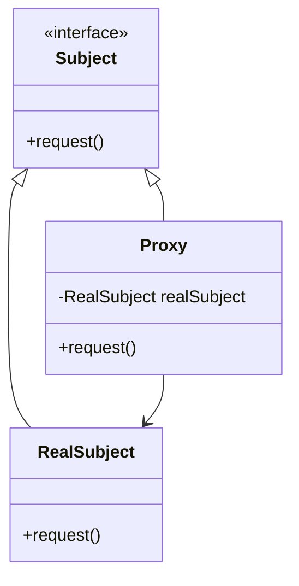

## 5.7 Proxy Design Pattern

In the realm of software design, the Proxy Design Pattern stands out as a powerful structural pattern that provides a surrogate or placeholder for another object to control access to it. This pattern is particularly useful in scenarios where direct access to an object is either not possible or not desirable. In this section, we will delve into the Proxy Design Pattern, explore its implementation in Dart, and examine its applicability in Flutter development.

### Intent

The primary intent of the Proxy Design Pattern is to provide a surrogate or placeholder for another object to control access to it. This pattern is used to create a representative object that controls access to another object, which may be remote, expensive to create, or in need of access control.

### Key Participants

1. **Subject**: Defines the common interface for RealSubject and Proxy so that a Proxy can be used anywhere a RealSubject is expected.
2. **RealSubject**: The real object that the proxy represents.
3. **Proxy**: Maintains a reference to the RealSubject and provides an interface identical to the Subject's interface. It controls access to the RealSubject and may be responsible for creating and deleting it.

### Applicability

Use the Proxy Design Pattern when:

- You need to control access to an object.
- You want to add a layer of security or access control.
- You need to manage remote objects or resources.
- You want to implement lazy initialization to delay the creation of an expensive object until it is needed.

### Implementing Proxy in Dart

In Dart, implementing the Proxy Design Pattern involves creating a Proxy class that implements the same interface as the RealSubject. The Proxy class controls access to the RealSubject, which can involve lazy initialization, access control, logging, or other operations.

#### Proxy Class

The Proxy class acts as an intermediary between the client and the RealSubject. It implements the same interface as the RealSubject, allowing it to be used interchangeably with the RealSubject.

```dart
// Define the Subject interface
abstract class Subject {
  void request();
}

// Implement the RealSubject class
class RealSubject implements Subject {
  @override
  void request() {
    print('RealSubject: Handling request.');
  }
}

// Implement the Proxy class
class Proxy implements Subject {
  RealSubject? _realSubject;

  @override
  void request() {
    if (_realSubject == null) {
      _realSubject = RealSubject();
    }
    print('Proxy: Logging the request.');
    _realSubject!.request();
  }
}
```

In this example, the `Proxy` class implements the `Subject` interface and maintains a reference to a `RealSubject` object. The `request` method in the Proxy class checks if the `RealSubject` is initialized, initializes it if necessary, logs the request, and then delegates the call to the `RealSubject`.

#### Controlling Access

The Proxy class can control access to the RealSubject in various ways, such as lazy initialization, access control, and logging.

- **Lazy Initialization**: The Proxy initializes the RealSubject only when it is needed, which can save resources if the RealSubject is expensive to create.

- **Access Control**: The Proxy can restrict access to the RealSubject based on certain conditions, such as user permissions.

- **Logging**: The Proxy can log requests to the RealSubject, which can be useful for debugging or auditing purposes.

### Use Cases and Examples

The Proxy Design Pattern is applicable in various scenarios, such as network proxies, lazy loading resources, and more.

#### Network Proxies

In network applications, a Proxy can manage remote objects, providing a local representative for a remote service. This can simplify the client code and improve performance by caching results or batching requests.

```dart
// Define the RemoteService interface
abstract class RemoteService {
  void fetchData();
}

// Implement the RealRemoteService class
class RealRemoteService implements RemoteService {
  @override
  void fetchData() {
    print('RealRemoteService: Fetching data from remote server.');
  }
}

// Implement the NetworkProxy class
class NetworkProxy implements RemoteService {
  RealRemoteService? _realRemoteService;

  @override
  void fetchData() {
    if (_realRemoteService == null) {
      _realRemoteService = RealRemoteService();
    }
    print('NetworkProxy: Checking network status.');
    _realRemoteService!.fetchData();
  }
}
```

In this example, the `NetworkProxy` class acts as a proxy for the `RealRemoteService`, checking the network status before delegating the call to fetch data.

#### Lazy Loading Resources

The Proxy Design Pattern can be used to implement lazy loading, where resources are loaded only when they are needed. This can improve performance by reducing the initial load time and memory usage.

```dart
// Define the Image interface
abstract class Image {
  void display();
}

// Implement the RealImage class
class RealImage implements Image {
  final String _filename;

  RealImage(this._filename) {
    _loadFromDisk();
  }

  void _loadFromDisk() {
    print('RealImage: Loading $_filename from disk.');
  }

  @override
  void display() {
    print('RealImage: Displaying $_filename.');
  }
}

// Implement the ImageProxy class
class ImageProxy implements Image {
  final String _filename;
  RealImage? _realImage;

  ImageProxy(this._filename);

  @override
  void display() {
    if (_realImage == null) {
      _realImage = RealImage(_filename);
    }
    _realImage!.display();
  }
}
```

In this example, the `ImageProxy` class acts as a proxy for the `RealImage`, loading the image from disk only when it is first displayed.

### Design Considerations

When implementing the Proxy Design Pattern in Dart, consider the following:

- **Performance**: While proxies can improve performance by reducing resource usage, they can also introduce overhead due to additional method calls and checks.
- **Complexity**: Proxies can add complexity to the codebase, so use them judiciously and only when necessary.
- **Security**: Proxies can be used to add security features, such as access control and logging, but ensure that these features are implemented correctly to avoid security vulnerabilities.

### Differences and Similarities

The Proxy Design Pattern is often confused with other patterns, such as the Decorator and Adapter patterns. Here are some key differences and similarities:

- **Proxy vs. Decorator**: Both patterns involve wrapping an object, but the Proxy pattern focuses on controlling access, while the Decorator pattern adds new behavior.
- **Proxy vs. Adapter**: The Adapter pattern changes the interface of an object, while the Proxy pattern provides the same interface as the RealSubject.

### Visualizing the Proxy Design Pattern

To better understand the Proxy Design Pattern, let's visualize it using a class diagram.



This diagram illustrates the relationship between the `Subject`, `RealSubject`, and `Proxy` classes. The `Proxy` class implements the `Subject` interface and maintains a reference to the `RealSubject`.

### Try It Yourself

To gain a deeper understanding of the Proxy Design Pattern, try modifying the code examples provided. For instance, you can:

- Add access control to the `Proxy` class by checking user permissions before delegating requests to the `RealSubject`.
- Implement caching in the `NetworkProxy` class to store and reuse data fetched from the remote service.
- Experiment with different types of resources in the `ImageProxy` class, such as audio or video files.

### Knowledge Check

Before we conclude, let's summarize the key takeaways from this section:

- The Proxy Design Pattern provides a surrogate or placeholder for another object to control access to it.
- In Dart, the Proxy class implements the same interface as the RealSubject and controls access to it.
- The Proxy Design Pattern is useful for network proxies, lazy loading resources, and more.
- Consider performance, complexity, and security when implementing proxies.

### Embrace the Journey

Remember, mastering design patterns is a journey, not a destination. As you continue to explore and experiment with the Proxy Design Pattern, you'll gain valuable insights into its applications and benefits. Keep experimenting, stay curious, and enjoy the journey!

## Quiz Time!



### What is the primary intent of the Proxy Design Pattern?

- [x] To provide a surrogate or placeholder for another object to control access to it.
- [ ] To add new behavior to an object.
- [ ] To change the interface of an object.
- [ ] To simplify complex interfaces.

> **Explanation:** The Proxy Design Pattern provides a surrogate or placeholder for another object to control access to it.

### Which class in the Proxy Design Pattern maintains a reference to the RealSubject?

- [ ] Subject
- [x] Proxy
- [ ] RealSubject
- [ ] Client

> **Explanation:** The Proxy class maintains a reference to the RealSubject and controls access to it.

### What is a common use case for the Proxy Design Pattern?

- [ ] Adding new behavior to an object.
- [x] Managing remote objects.
- [ ] Changing the interface of an object.
- [ ] Simplifying complex interfaces.

> **Explanation:** The Proxy Design Pattern is commonly used to manage remote objects by providing a local representative.

### How does the Proxy Design Pattern differ from the Decorator Pattern?

- [x] The Proxy pattern focuses on controlling access, while the Decorator pattern adds new behavior.
- [ ] The Proxy pattern changes the interface, while the Decorator pattern provides the same interface.
- [ ] The Proxy pattern simplifies interfaces, while the Decorator pattern adds complexity.
- [ ] The Proxy pattern is used for remote objects, while the Decorator pattern is used for local objects.

> **Explanation:** The Proxy pattern focuses on controlling access, while the Decorator pattern adds new behavior.

### What is lazy initialization in the context of the Proxy Design Pattern?

- [x] Delaying the creation of an expensive object until it is needed.
- [ ] Creating all objects at the start of the program.
- [ ] Initializing objects in parallel to improve performance.
- [ ] Loading objects from a remote server.

> **Explanation:** Lazy initialization involves delaying the creation of an expensive object until it is needed, which can save resources.

### Which of the following is a benefit of using the Proxy Design Pattern?

- [x] It can improve performance by reducing resource usage.
- [ ] It simplifies the codebase by reducing complexity.
- [ ] It changes the interface of an object to match another interface.
- [ ] It adds new behavior to an object.

> **Explanation:** The Proxy Design Pattern can improve performance by reducing resource usage through techniques like lazy initialization.

### What should be considered when implementing the Proxy Design Pattern?

- [x] Performance, complexity, and security.
- [ ] Only performance.
- [ ] Only security.
- [ ] Only complexity.

> **Explanation:** When implementing the Proxy Design Pattern, consider performance, complexity, and security.

### Which pattern is often confused with the Proxy Design Pattern?

- [ ] Singleton
- [x] Decorator
- [ ] Factory
- [ ] Observer

> **Explanation:** The Proxy Design Pattern is often confused with the Decorator Pattern because both involve wrapping an object.

### What is the role of the RealSubject in the Proxy Design Pattern?

- [x] It is the real object that the proxy represents.
- [ ] It controls access to the Proxy.
- [ ] It defines the interface for the Proxy.
- [ ] It logs requests to the Proxy.

> **Explanation:** The RealSubject is the real object that the proxy represents and to which the proxy delegates requests.

### True or False: The Proxy Design Pattern can be used to add security features such as access control and logging.

- [x] True
- [ ] False

> **Explanation:** The Proxy Design Pattern can be used to add security features such as access control and logging.


