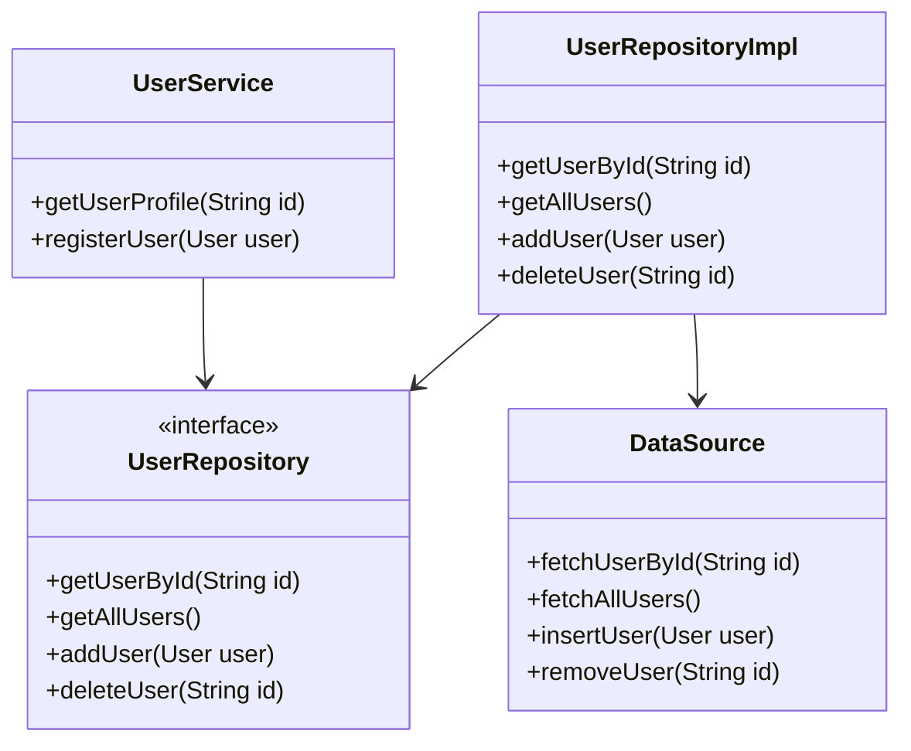

## 5.8.1 Repository Pattern

In the realm of software development, the Repository Pattern is a well-established design pattern that plays a crucial role in managing data access logic. This pattern provides a collection-like interface for accessing domain objects, abstracting the underlying data storage and retrieval mechanisms. In this section, we will delve into the intricacies of the Repository Pattern, its implementation in Dart, and its significance in Flutter development.

### Intent of the Repository Pattern

The primary intent of the Repository Pattern is to separate the data access logic from the business logic, thereby promoting a clean and maintainable codebase. By abstracting the data access layer, the pattern allows developers to focus on the core business logic without being bogged down by the complexities of data retrieval and storage.

### Key Participants

1. **Repository Interface**: Defines the contract for data access operations.
2. **Concrete Repository**: Implements the repository interface, handling the actual data operations.
3. **Data Source**: The underlying data storage mechanism, such as a database or a web service.
4. **Domain Model**: Represents the business entities that the repository manages.

### Applicability

The Repository Pattern is particularly useful in scenarios where:

- You need to abstract data access logic from the business logic.
- You want to switch between different data sources without affecting the business logic.
- You aim to facilitate unit testing by mocking data sources.
- You are implementing a clean architecture setup.

### Implementing Repository in Dart

#### Repository Classes

In Dart, implementing the Repository Pattern involves creating repository classes that handle data retrieval and storage. These classes provide a unified interface for accessing data, regardless of the underlying data source.

```dart
// Define a repository interface
abstract class UserRepository {
  Future<User> getUserById(String id);
  Future<List<User>> getAllUsers();
  Future<void> addUser(User user);
  Future<void> deleteUser(String id);
}

// Implement the repository interface
class UserRepositoryImpl implements UserRepository {
  final DataSource dataSource;

  UserRepositoryImpl(this.dataSource);

  @override
  Future<User> getUserById(String id) async {
    return await dataSource.fetchUserById(id);
  }

  @override
  Future<List<User>> getAllUsers() async {
    return await dataSource.fetchAllUsers();
  }

  @override
  Future<void> addUser(User user) async {
    await dataSource.insertUser(user);
  }

  @override
  Future<void> deleteUser(String id) async {
    await dataSource.removeUser(id);
  }
}
```

In this example, `UserRepository` is an abstract class that defines the contract for user-related data operations. `UserRepositoryImpl` is a concrete implementation that interacts with a `DataSource` to perform these operations.

#### Separation of Concerns

The Repository Pattern promotes the separation of concerns by keeping data access logic separate from business logic. This separation ensures that changes to the data source do not impact the business logic, and vice versa.

```dart
class UserService {
  final UserRepository userRepository;

  UserService(this.userRepository);

  Future<User> getUserProfile(String id) async {
    return await userRepository.getUserById(id);
  }

  Future<void> registerUser(User user) async {
    await userRepository.addUser(user);
  }
}
```

In the `UserService` class, the business logic is encapsulated, and the repository is used to interact with the data layer. This design allows for easy modification of the data access logic without affecting the business logic.

### Use Cases and Examples

#### Data Layer Architecture

In clean architecture setups, the Repository Pattern is often used to define the data layer. This pattern provides a clear boundary between the data layer and the business logic layer, facilitating maintainability and scalability.

```dart
class DataSource {
  Future<User> fetchUserById(String id) async {
    // Simulate fetching user from a database or API
    return User(id: id, name: 'John Doe');
  }

  Future<List<User>> fetchAllUsers() async {
    // Simulate fetching all users
    return [User(id: '1', name: 'John Doe'), User(id: '2', name: 'Jane Doe')];
  }

  Future<void> insertUser(User user) async {
    // Simulate inserting user into a database
  }

  Future<void> removeUser(String id) async {
    // Simulate removing user from a database
  }
}
```

The `DataSource` class simulates data operations, such as fetching, inserting, and removing users. By abstracting these operations, the repository can switch between different data sources, such as a local database or a remote API, without affecting the business logic.

#### Testing

One of the significant advantages of the Repository Pattern is its testability. By abstracting the data access logic, you can easily mock data sources and test the business logic in isolation.

```dart
class MockUserRepository implements UserRepository {
  @override
  Future<User> getUserById(String id) async {
    return User(id: id, name: 'Mock User');
  }

  @override
  Future<List<User>> getAllUsers() async {
    return [User(id: '1', name: 'Mock User 1'), User(id: '2', name: 'Mock User 2')];
  }

  @override
  Future<void> addUser(User user) async {
    // Simulate adding user
  }

  @override
  Future<void> deleteUser(String id) async {
    // Simulate deleting user
  }
}
```

In this example, `MockUserRepository` is a mock implementation of the `UserRepository` interface. It provides predefined responses for data operations, allowing you to test the `UserService` class without relying on a real data source.

### Visualizing the Repository Pattern

To better understand the Repository Pattern, let's visualize the interaction between the components using a class diagram.



**Diagram Description**: This class diagram illustrates the relationships between the `UserRepository`, `UserRepositoryImpl`, `DataSource`, and `UserService` classes. The `UserRepositoryImpl` class implements the `UserRepository` interface and interacts with the `DataSource` for data operations. The `UserService` class uses the `UserRepository` to perform business logic operations.

### Design Considerations

When implementing the Repository Pattern in Dart, consider the following:

- **Interface Segregation**: Define specific interfaces for different data operations to avoid bloated interfaces.
- **Dependency Injection**: Use dependency injection to provide the repository and data source instances, enhancing testability and flexibility.
- **Error Handling**: Implement robust error handling mechanisms to manage data access errors gracefully.
- **Caching**: Consider implementing caching strategies within the repository to improve performance and reduce data source load.

### Differences and Similarities

The Repository Pattern is often confused with the Data Access Object (DAO) pattern. While both patterns abstract data access logic, the Repository Pattern focuses on providing a collection-like interface for domain objects, whereas the DAO pattern is more concerned with low-level data operations.

### Try It Yourself

To deepen your understanding of the Repository Pattern, try modifying the code examples provided. Experiment with different data sources, such as a local database or a remote API, and observe how the repository abstracts these changes. Implement additional methods in the repository interface and explore how they can be utilized in the business logic.

### Knowledge Check

- What is the primary intent of the Repository Pattern?
- How does the Repository Pattern promote separation of concerns?
- What are the key participants in the Repository Pattern?
- How can the Repository Pattern facilitate unit testing?
- What are some design considerations when implementing the Repository Pattern in Dart?

### Embrace the Journey

Remember, mastering design patterns is a journey. As you continue to explore and implement the Repository Pattern in your Dart and Flutter projects, you'll gain a deeper understanding of its benefits and applications. Keep experimenting, stay curious, and enjoy the process of building robust and maintainable applications.

## Quiz Time!



### What is the primary intent of the Repository Pattern?

- [x] To separate data access logic from business logic
- [ ] To manage user authentication
- [ ] To handle UI rendering
- [ ] To optimize performance

> **Explanation:** The Repository Pattern aims to separate data access logic from business logic, promoting a clean and maintainable codebase.

### Which component defines the contract for data access operations in the Repository Pattern?

- [x] Repository Interface
- [ ] Data Source
- [ ] Domain Model
- [ ] User Service

> **Explanation:** The Repository Interface defines the contract for data access operations, ensuring consistency across different implementations.

### How does the Repository Pattern facilitate unit testing?

- [x] By allowing data sources to be easily mocked
- [ ] By providing a user interface for testing
- [ ] By optimizing database queries
- [ ] By handling network requests

> **Explanation:** The Repository Pattern abstracts data access logic, allowing data sources to be easily mocked for unit testing.

### What is a key difference between the Repository Pattern and the DAO pattern?

- [x] The Repository Pattern provides a collection-like interface for domain objects
- [ ] The Repository Pattern focuses on low-level data operations
- [ ] The DAO pattern abstracts business logic
- [ ] The DAO pattern handles UI rendering

> **Explanation:** The Repository Pattern provides a collection-like interface for domain objects, while the DAO pattern focuses on low-level data operations.

### What is a design consideration when implementing the Repository Pattern in Dart?

- [x] Use dependency injection for flexibility
- [ ] Implement UI components within the repository
- [ ] Focus on optimizing animations
- [ ] Avoid using interfaces

> **Explanation:** Using dependency injection enhances flexibility and testability when implementing the Repository Pattern in Dart.

### Which of the following is a benefit of using the Repository Pattern?

- [x] It abstracts data access logic
- [ ] It simplifies UI design
- [ ] It manages user sessions
- [ ] It handles error logging

> **Explanation:** The Repository Pattern abstracts data access logic, promoting a clean separation of concerns.

### What role does the Data Source play in the Repository Pattern?

- [x] It handles the actual data operations
- [ ] It defines the contract for data access
- [ ] It manages business logic
- [ ] It renders UI components

> **Explanation:** The Data Source handles the actual data operations, such as fetching and storing data.

### How can the Repository Pattern improve performance?

- [x] By implementing caching strategies
- [ ] By optimizing UI animations
- [ ] By reducing code complexity
- [ ] By managing user sessions

> **Explanation:** Implementing caching strategies within the repository can improve performance by reducing data source load.

### What is a common use case for the Repository Pattern?

- [x] Abstracting data access in clean architecture setups
- [ ] Managing UI components
- [ ] Handling user authentication
- [ ] Optimizing network requests

> **Explanation:** The Repository Pattern is commonly used to abstract data access in clean architecture setups, promoting maintainability.

### True or False: The Repository Pattern is only applicable to database operations.

- [ ] True
- [x] False

> **Explanation:** The Repository Pattern is not limited to database operations; it can abstract any data source, including APIs and local storage.


