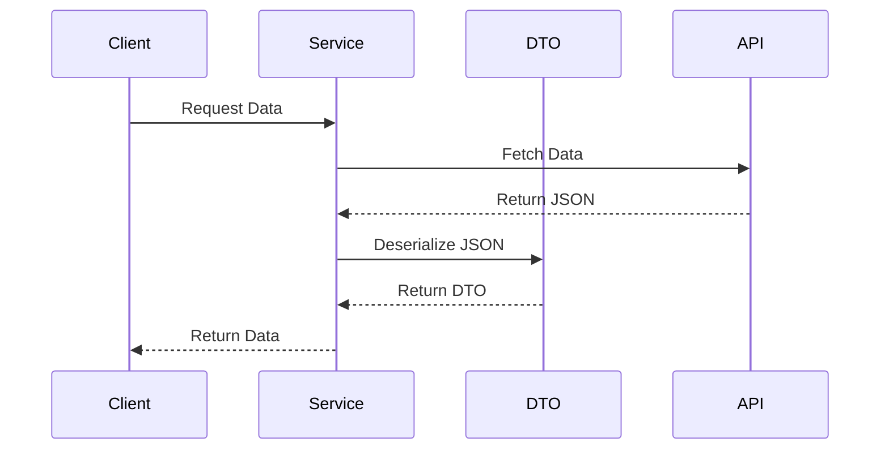

## 5.8.2 Data Transfer Object (DTO) Pattern

In the realm of software development, efficient data transfer between different parts of an application or over a network is crucial. The Data Transfer Object (DTO) pattern is a structural design pattern that facilitates this by encapsulating data into simple objects. This pattern is particularly useful in Dart and Flutter applications where data needs to be transferred between different layers or modules, or communicated over a network.

### Intent of the DTO Pattern

The primary intent of the DTO pattern is to encapsulate data in a way that is easy to transfer between different layers of an application or over a network. By using DTOs, we can ensure that data is structured and serialized efficiently, reducing the overhead associated with data transfer.

### Key Participants

- **DTO Classes**: These are simple classes that contain no business logic and are used solely for transferring data.
- **Serialization/Deserialization Logic**: Functions or methods that convert DTOs to and from formats suitable for transfer, such as JSON.
- **Data Access Layers**: The layers in an application that interact with DTOs to send or receive data.

### Applicability

The DTO pattern is applicable in scenarios where:

- Data needs to be transferred between different layers of an application, such as from the data access layer to the presentation layer.
- Data needs to be communicated over a network, such as in RESTful API calls.
- There is a need to reduce the number of method calls by aggregating multiple data fields into a single object.

### Implementing DTOs in Dart

#### Data Classes in Dart

In Dart, data classes are often used to implement DTOs. These classes are typically marked as `@immutable` to indicate that their instances should not be modified after creation. Dart's `json_serializable` package is commonly used to facilitate the serialization and deserialization of these data classes.

```dart
import 'package:meta/meta.dart';
import 'package:json_annotation/json_annotation.dart';

part 'user_dto.g.dart';

@immutable
@JsonSerializable()
class UserDTO {
  final int id;
  final String name;
  final String email;

  UserDTO({
    required this.id,
    required this.name,
    required this.email,
  });

  factory UserDTO.fromJson(Map<String, dynamic> json) => _$UserDTOFromJson(json);

  Map<String, dynamic> toJson() => _$UserDTOToJson(this);
}
```

In this example, `UserDTO` is a simple data class that represents a user. It is annotated with `@JsonSerializable()` to enable automatic generation of serialization logic.

#### Serialization and Deserialization

Serialization is the process of converting a DTO into a format suitable for transfer, such as JSON. Deserialization is the reverse process, converting data from a transfer format back into a DTO.

```dart
void main() {
  // Example JSON data
  String jsonData = '{"id": 1, "name": "John Doe", "email": "john.doe@example.com"}';

  // Deserialize JSON to UserDTO
  UserDTO user = UserDTO.fromJson(jsonDecode(jsonData));
  print('User Name: ${user.name}');

  // Serialize UserDTO to JSON
  String jsonString = jsonEncode(user.toJson());
  print('JSON String: $jsonString');
}
```

In this code snippet, we demonstrate how to deserialize a JSON string into a `UserDTO` object and then serialize it back to a JSON string.

### Use Cases and Examples

#### API Communication

One of the most common use cases for DTOs is in API communication. When interacting with RESTful services, DTOs can be used to structure the data being sent and received.

```dart
Future<UserDTO> fetchUser(int userId) async {
  final response = await http.get(Uri.parse('https://api.example.com/users/$userId'));

  if (response.statusCode == 200) {
    return UserDTO.fromJson(jsonDecode(response.body));
  } else {
    throw Exception('Failed to load user');
  }
}
```

In this example, we fetch user data from an API and deserialize it into a `UserDTO` object. This approach ensures that the data is structured and easy to work with within the application.

#### Inter-Module Communication

DTOs are also useful for passing data between different modules or layers within an application. For instance, a service layer might use DTOs to pass data to a presentation layer.

```dart
class UserService {
  Future<UserDTO> getUserDetails(int userId) async {
    // Fetch user data from a repository or API
    UserDTO user = await fetchUser(userId);
    return user;
  }
}

class UserPresenter {
  final UserService userService;

  UserPresenter(this.userService);

  void displayUser(int userId) async {
    UserDTO user = await userService.getUserDetails(userId);
    print('Displaying user: ${user.name}');
  }
}
```

Here, the `UserService` fetches user data and returns it as a `UserDTO`, which is then used by the `UserPresenter` to display the user's information.

### Design Considerations

When implementing the DTO pattern in Dart, consider the following:

- **Immutability**: Use the `@immutable` annotation to ensure that DTOs are not modified after creation. This helps maintain data integrity.
- **Serialization Libraries**: Utilize libraries like `json_serializable` to automate the serialization and deserialization process, reducing boilerplate code.
- **Data Validation**: Ensure that data is validated before being encapsulated in a DTO to prevent invalid data from being transferred.

### Differences and Similarities

The DTO pattern is often compared to other patterns like the Value Object pattern. While both encapsulate data, DTOs are specifically designed for data transfer, whereas Value Objects are used to represent domain-specific values with business logic.

### Visualizing DTO Pattern

To better understand the DTO pattern, let's visualize the flow of data using a sequence diagram.



This diagram illustrates how data flows from a client request through a service, is fetched from an API, deserialized into a DTO, and then returned to the client.

### Try It Yourself

To deepen your understanding of the DTO pattern, try modifying the `UserDTO` class to include additional fields, such as `address` or `phoneNumber`. Update the serialization and deserialization logic accordingly, and test the changes by fetching and displaying user data.

### Knowledge Check

- What is the primary purpose of the DTO pattern?
- How does the `@immutable` annotation benefit DTOs?
- What are the advantages of using `json_serializable` in Dart?
- How can DTOs improve API communication in Flutter applications?

### Embrace the Journey

Remember, mastering design patterns like DTO is a journey. As you continue to explore and implement these patterns, you'll enhance your ability to build efficient and scalable applications. Keep experimenting, stay curious, and enjoy the process of learning and growing as a developer!

## Quiz Time!



### What is the primary purpose of the DTO pattern?

- [x] To encapsulate data for efficient transfer between layers or over a network
- [ ] To add business logic to data objects
- [ ] To replace all data classes in an application
- [ ] To manage database connections

> **Explanation:** The DTO pattern is designed to encapsulate data for efficient transfer between different layers of an application or over a network, without adding business logic.

### Which annotation is commonly used to ensure DTOs are immutable in Dart?

- [x] @immutable
- [ ] @serializable
- [ ] @data
- [ ] @readonly

> **Explanation:** The `@immutable` annotation is used in Dart to indicate that instances of a class should not be modified after creation, ensuring data integrity.

### What package is commonly used in Dart for automating serialization and deserialization of DTOs?

- [x] json_serializable
- [ ] dart_convert
- [ ] http
- [ ] json_parser

> **Explanation:** The `json_serializable` package is widely used in Dart to automate the process of serialization and deserialization, reducing boilerplate code.

### In the context of DTOs, what does serialization refer to?

- [x] Converting a DTO into a format suitable for transfer, such as JSON
- [ ] Encrypting data for secure transfer
- [ ] Compressing data to reduce size
- [ ] Validating data before transfer

> **Explanation:** Serialization refers to converting a DTO into a format, like JSON, that is suitable for transfer over a network or between application layers.

### How can DTOs improve API communication in Flutter applications?

- [x] By structuring data for RESTful services
- [ ] By adding complex business logic
- [ ] By replacing all API calls with local database queries
- [ ] By encrypting all data transfers

> **Explanation:** DTOs improve API communication by structuring data in a way that is easy to send and receive in RESTful services, ensuring consistency and reducing errors.

### What is a common use case for DTOs within an application?

- [x] Passing data between different layers or modules
- [ ] Managing user authentication
- [ ] Handling UI animations
- [ ] Storing application settings

> **Explanation:** DTOs are commonly used to pass data between different layers or modules within an application, facilitating communication and data integrity.

### What is the main difference between a DTO and a Value Object?

- [x] DTOs are designed for data transfer, while Value Objects represent domain-specific values with business logic
- [ ] DTOs contain business logic, while Value Objects do not
- [ ] DTOs are mutable, while Value Objects are immutable
- [ ] DTOs are used for database operations, while Value Objects are not

> **Explanation:** DTOs are specifically designed for data transfer without business logic, while Value Objects represent domain-specific values and may contain business logic.

### What should you do to ensure data integrity when using DTOs?

- [x] Use the @immutable annotation
- [ ] Add complex business logic to DTOs
- [ ] Allow DTOs to be modified freely
- [ ] Use DTOs only for local data storage

> **Explanation:** Using the `@immutable` annotation ensures that DTOs are not modified after creation, maintaining data integrity.

### What is deserialization in the context of DTOs?

- [x] Converting data from a transfer format back into a DTO
- [ ] Encrypting data for secure storage
- [ ] Compressing data to save space
- [ ] Validating data before storage

> **Explanation:** Deserialization is the process of converting data from a transfer format, such as JSON, back into a DTO for use within an application.

### True or False: DTOs should contain business logic to improve data transfer efficiency.

- [ ] True
- [x] False

> **Explanation:** False. DTOs should not contain business logic; they are meant to encapsulate data for transfer without adding complexity.


