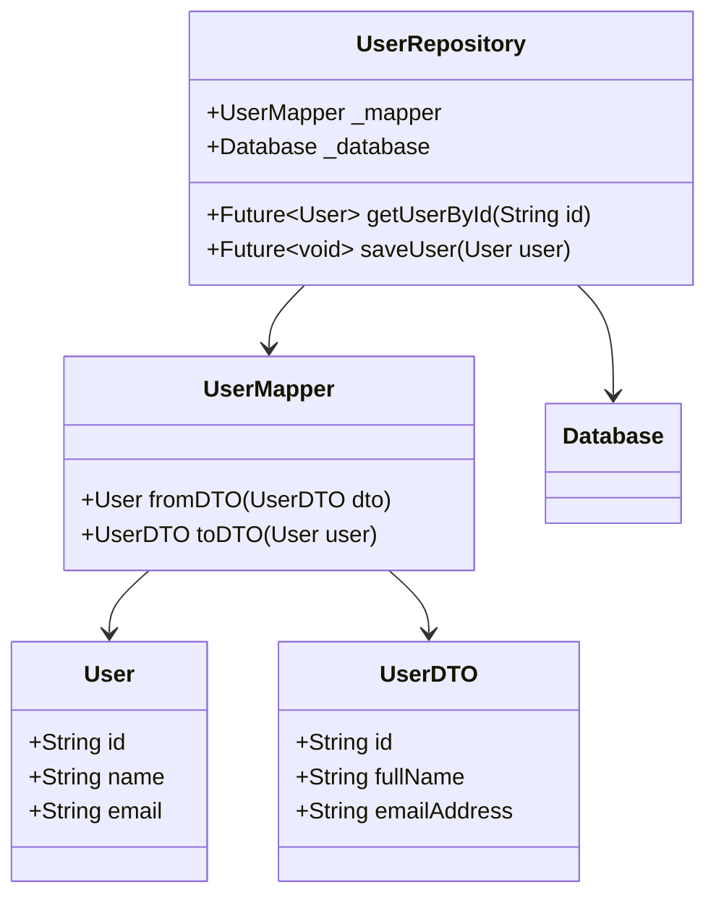

## 5.8.3 Data Mapper Pattern

In the realm of software design, the Data Mapper Pattern plays a crucial role in separating business logic from data mapping. This pattern is particularly useful in applications where the data representation in the database or an external API differs significantly from the domain model used within the application. By implementing the Data Mapper Pattern in Dart, developers can achieve a clean separation of concerns, making their code more maintainable and scalable.

### Introduction to the Data Mapper Pattern

The Data Mapper Pattern is a structural design pattern that provides a layer of abstraction between the domain model and the data source. It is responsible for transferring data between the two, ensuring that changes in one do not directly affect the other. This separation allows for more flexible and maintainable code, as the business logic is not tightly coupled with the data access logic.

#### Key Concepts

- **Domain Model**: Represents the business logic and rules of the application.
- **Data Source**: The database or external API where data is stored or retrieved.
- **Mapper**: A component that handles the conversion between the domain model and the data source.

### Implementing Data Mapper in Dart

Implementing the Data Mapper Pattern in Dart involves creating mapper classes that convert Data Transfer Objects (DTOs) to domain models and vice versa. This section will guide you through the process of implementing a Data Mapper in Dart, with practical examples and best practices.

#### Mapper Classes

Mapper classes are the core of the Data Mapper Pattern. They are responsible for converting data between the domain model and the data source. In Dart, you can define a mapper class that implements methods for mapping data in both directions.

```dart
// Domain model
class User {
  final String id;
  final String name;
  final String email;

  User({required this.id, required this.name, required this.email});
}

// Data Transfer Object (DTO)
class UserDTO {
  final String id;
  final String fullName;
  final String emailAddress;

  UserDTO({required this.id, required this.fullName, required this.emailAddress});
}

// Mapper class
class UserMapper {
  // Convert DTO to domain model
  User fromDTO(UserDTO dto) {
    return User(
      id: dto.id,
      name: dto.fullName,
      email: dto.emailAddress,
    );
  }

  // Convert domain model to DTO
  UserDTO toDTO(User user) {
    return UserDTO(
      id: user.id,
      fullName: user.name,
      emailAddress: user.email,
    );
  }
}
```

In this example, the `UserMapper` class provides methods to convert a `UserDTO` to a `User` domain model and vice versa. This separation ensures that changes in the data source do not directly impact the domain model.

#### Abstraction

One of the primary benefits of the Data Mapper Pattern is the abstraction it provides. By hiding the details of the database or API interactions, the business logic remains clean and focused on the application's core functionality.

```dart
class UserRepository {
  final UserMapper _mapper;
  final Database _database;

  UserRepository(this._mapper, this._database);

  Future<User> getUserById(String id) async {
    // Fetch data from the database
    final userDTO = await _database.fetchUserById(id);
    // Convert DTO to domain model
    return _mapper.fromDTO(userDTO);
  }

  Future<void> saveUser(User user) async {
    // Convert domain model to DTO
    final userDTO = _mapper.toDTO(user);
    // Save DTO to the database
    await _database.saveUser(userDTO);
  }
}
```

In the `UserRepository` class, the `UserMapper` is used to convert data between the domain model and the database. This abstraction allows the repository to focus on data retrieval and storage without being concerned with the specifics of data conversion.

### Use Cases and Examples

The Data Mapper Pattern is particularly useful in scenarios where complex data transformations are required, or when interacting with databases or external APIs. Let's explore some common use cases and examples.

#### Complex Data Transformations

When the data shapes differ significantly between the layers, the Data Mapper Pattern provides a clean way to handle these transformations. For instance, if the database stores user information in a flat structure, but the application requires a more complex object graph, the mapper can handle these conversions seamlessly.

```dart
// Complex domain model
class UserProfile {
  final String id;
  final String name;
  final Address address;

  UserProfile({required this.id, required this.name, required this.address});
}

class Address {
  final String street;
  final String city;

  Address({required this.street, required this.city});
}

// DTO with flat structure
class UserProfileDTO {
  final String id;
  final String name;
  final String street;
  final String city;

  UserProfileDTO({required this.id, required this.name, required this.street, required this.city});
}

// Mapper class
class UserProfileMapper {
  UserProfile fromDTO(UserProfileDTO dto) {
    return UserProfile(
      id: dto.id,
      name: dto.name,
      address: Address(street: dto.street, city: dto.city),
    );
  }

  UserProfileDTO toDTO(UserProfile profile) {
    return UserProfileDTO(
      id: profile.id,
      name: profile.name,
      street: profile.address.street,
      city: profile.address.city,
    );
  }
}
```

In this example, the `UserProfileMapper` handles the conversion between a complex domain model and a flat DTO structure, ensuring that the application logic remains clean and focused.

#### Database Interactions

When working with databases, the Data Mapper Pattern is invaluable for mapping ORM models to domain objects. This separation allows for more flexible and maintainable code, as changes in the database schema do not directly impact the domain model.

```dart
// ORM model
class UserEntity {
  final String id;
  final String name;
  final String email;

  UserEntity({required this.id, required this.name, required this.email});
}

// Domain model
class User {
  final String id;
  final String name;
  final String email;

  User({required this.id, required this.name, required this.email});
}

// Mapper class
class UserEntityMapper {
  User fromEntity(UserEntity entity) {
    return User(
      id: entity.id,
      name: entity.name,
      email: entity.email,
    );
  }

  UserEntity toEntity(User user) {
    return UserEntity(
      id: user.id,
      name: user.name,
      email: user.email,
    );
  }
}
```

In this example, the `UserEntityMapper` handles the conversion between an ORM model and a domain model, ensuring that the application logic remains decoupled from the database schema.

### Visualizing the Data Mapper Pattern

To better understand the Data Mapper Pattern, let's visualize the flow of data between the domain model and the data source using a class diagram.



**Diagram Description**: This class diagram illustrates the relationship between the `User`, `UserDTO`, `UserMapper`, and `UserRepository` classes. The `UserMapper` is responsible for converting data between the `User` domain model and the `UserDTO`. The `UserRepository` uses the `UserMapper` to interact with the `Database`, ensuring a clean separation of concerns.

### Design Considerations

When implementing the Data Mapper Pattern, there are several design considerations to keep in mind:

- **Performance**: Mapping data between different representations can introduce overhead. Ensure that the mapping logic is efficient and optimized for performance.
- **Complexity**: While the Data Mapper Pattern provides a clean separation of concerns, it can also introduce additional complexity. Consider whether the benefits of using the pattern outweigh the added complexity in your specific use case.
- **Consistency**: Ensure that the mapping logic is consistent across the application to avoid data inconsistencies.

### Differences and Similarities

The Data Mapper Pattern is often compared to the Active Record Pattern. While both patterns are used for data access, they have distinct differences:

- **Data Mapper**: Separates the domain model from the data access logic, providing a clean separation of concerns. The domain model is independent of the database schema.
- **Active Record**: Combines the domain model and data access logic, with the domain model directly interacting with the database. This pattern is simpler but can lead to tighter coupling between the domain model and the database schema.

### Try It Yourself

To deepen your understanding of the Data Mapper Pattern, try modifying the code examples provided in this section. Experiment with different domain models and data sources, and implement your own mapper classes to handle the conversions. Consider the following challenges:

- **Challenge 1**: Implement a Data Mapper for a complex domain model with nested objects.
- **Challenge 2**: Optimize the mapping logic for performance, ensuring that the conversions are efficient.
- **Challenge 3**: Extend the `UserRepository` class to handle additional CRUD operations, using the `UserMapper` for data conversions.

### Conclusion

The Data Mapper Pattern is a powerful tool for separating business logic from data mapping in Dart applications. By implementing this pattern, developers can achieve a clean separation of concerns, making their code more maintainable and scalable. Remember, this is just the beginning. As you progress, you'll build more complex and interactive applications. Keep experimenting, stay curious, and enjoy the journey!

## Quiz Time!



### What is the primary purpose of the Data Mapper Pattern?

- [x] To separate business logic from data mapping
- [ ] To combine domain model and data access logic
- [ ] To enhance the performance of database queries
- [ ] To simplify the user interface design

> **Explanation:** The Data Mapper Pattern is designed to separate business logic from data mapping, ensuring a clean separation of concerns.

### Which component is responsible for converting data between the domain model and the data source in the Data Mapper Pattern?

- [x] Mapper
- [ ] Repository
- [ ] Controller
- [ ] Service

> **Explanation:** The Mapper is responsible for converting data between the domain model and the data source in the Data Mapper Pattern.

### What is a key benefit of using the Data Mapper Pattern?

- [x] It provides a clean separation of concerns
- [ ] It simplifies the user interface design
- [ ] It enhances the performance of database queries
- [ ] It combines domain model and data access logic

> **Explanation:** The Data Mapper Pattern provides a clean separation of concerns, making the code more maintainable and scalable.

### In the Data Mapper Pattern, what is the role of the Repository?

- [x] To interact with the data source using the Mapper
- [ ] To convert data between the domain model and the data source
- [ ] To define the business logic of the application
- [ ] To manage user interface components

> **Explanation:** The Repository interacts with the data source using the Mapper, focusing on data retrieval and storage.

### How does the Data Mapper Pattern differ from the Active Record Pattern?

- [x] The Data Mapper separates domain model from data access logic
- [ ] The Data Mapper combines domain model and data access logic
- [ ] The Data Mapper is simpler than the Active Record Pattern
- [ ] The Data Mapper directly interacts with the database

> **Explanation:** The Data Mapper Pattern separates the domain model from the data access logic, unlike the Active Record Pattern, which combines them.

### What is a potential drawback of using the Data Mapper Pattern?

- [x] It can introduce additional complexity
- [ ] It simplifies the user interface design
- [ ] It enhances the performance of database queries
- [ ] It combines domain model and data access logic

> **Explanation:** While the Data Mapper Pattern provides a clean separation of concerns, it can also introduce additional complexity.

### What should be considered when implementing the Data Mapper Pattern?

- [x] Performance and consistency
- [ ] User interface design
- [ ] Simplifying database queries
- [ ] Combining domain model and data access logic

> **Explanation:** When implementing the Data Mapper Pattern, consider performance and consistency to ensure efficient and reliable data mapping.

### Which of the following is a common use case for the Data Mapper Pattern?

- [x] Complex data transformations
- [ ] Simplifying user interface design
- [ ] Enhancing database query performance
- [ ] Combining domain model and data access logic

> **Explanation:** The Data Mapper Pattern is commonly used for complex data transformations, where data shapes differ between layers.

### What is the role of the Mapper class in the Data Mapper Pattern?

- [x] To convert data between the domain model and the data source
- [ ] To interact with the data source
- [ ] To define the business logic of the application
- [ ] To manage user interface components

> **Explanation:** The Mapper class is responsible for converting data between the domain model and the data source in the Data Mapper Pattern.

### True or False: The Data Mapper Pattern directly interacts with the database.

- [ ] True
- [x] False

> **Explanation:** The Data Mapper Pattern does not directly interact with the database; it provides a layer of abstraction between the domain model and the data source.


