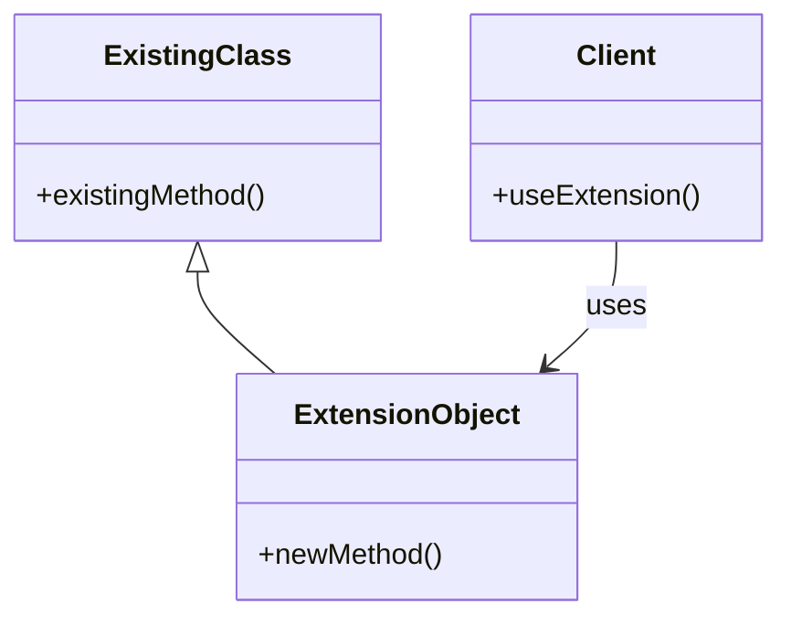

## 5.9 Extension Object Pattern

In the world of software development, the need to extend the functionality of existing classes without modifying their source code is a common requirement. This is where the Extension Object Pattern comes into play. In Dart, this pattern is particularly powerful due to the language's support for extension methods and mixins. This section will guide you through understanding and implementing the Extension Object Pattern in Dart, providing you with the tools to enhance your classes seamlessly.

### Understanding the Extension Object Pattern

The Extension Object Pattern is a structural design pattern that allows developers to add new functionality to existing classes without altering their structure. This is particularly useful when working with classes that are part of a library or framework where you do not have access to the source code. By using this pattern, you can extend the capabilities of these classes in a clean and maintainable way.

#### Intent

The primary intent of the Extension Object Pattern is to provide a mechanism for extending the behavior of objects dynamically. This is achieved by defining new methods or properties that can be added to existing classes without modifying their original implementation. This pattern promotes the open/closed principle, which states that software entities should be open for extension but closed for modification.

#### Key Participants

- **Existing Class**: The class that needs to be extended.
- **Extension Object**: The object that provides additional functionality to the existing class.
- **Client**: The entity that uses the extended functionality provided by the extension object.

### Implementing Extension Object in Dart

Dart provides two powerful features that facilitate the implementation of the Extension Object Pattern: extension methods and mixins. Let's explore each of these in detail.

#### Extension Methods

Extension methods in Dart allow you to add new functionality to existing classes without altering their source code. This feature is particularly useful for adding utility methods to classes that you do not own, such as those from the Dart core libraries.

**Example: Extending the String Class**

Let's consider an example where we want to add a method to the `String` class that checks if the string is a palindrome.

```dart
extension StringExtensions on String {
  bool isPalindrome() {
    String reversed = this.split('').reversed.join('');
    return this == reversed;
  }
}

void main() {
  String text = "radar";
  print(text.isPalindrome()); // Output: true
}
```

In this example, we define an extension on the `String` class called `StringExtensions`. We add a method `isPalindrome` that checks if the string is the same when reversed. This method can now be used on any `String` instance.

#### Mixins

Mixins in Dart provide a way to reuse a class's code in multiple class hierarchies. They allow you to add functionality to classes in a flexible and reusable manner.

**Example: Adding Logging Functionality**

Suppose we want to add logging functionality to multiple classes in our application. We can achieve this using a mixin.

```dart
mixin Logger {
  void log(String message) {
    print('Log: $message');
  }
}

class NetworkService with Logger {
  void fetchData() {
    log('Fetching data from network...');
    // Fetch data logic
  }
}

class DatabaseService with Logger {
  void queryData() {
    log('Querying data from database...');
    // Query data logic
  }
}

void main() {
  NetworkService networkService = NetworkService();
  networkService.fetchData();

  DatabaseService databaseService = DatabaseService();
  databaseService.queryData();
}
```

In this example, we define a mixin `Logger` that provides a `log` method. We then use this mixin in the `NetworkService` and `DatabaseService` classes to add logging functionality.

### Use Cases and Examples

The Extension Object Pattern is versatile and can be applied in various scenarios. Let's explore some common use cases and examples.

#### Utility Methods

One of the most common use cases for the Extension Object Pattern is adding utility methods to existing classes. This can be particularly useful when working with built-in classes like `String`, `List`, or `Map`.

**Example: Extending the List Class**

Let's add a method to the `List` class that calculates the sum of its elements.

```dart
extension ListExtensions on List<int> {
  int sum() {
    return this.fold(0, (previous, current) => previous + current);
  }
}

void main() {
  List<int> numbers = [1, 2, 3, 4, 5];
  print(numbers.sum()); // Output: 15
}
```

In this example, we define an extension on the `List<int>` class called `ListExtensions`. We add a method `sum` that calculates the sum of the list's elements.

#### Domain-Specific Enhancements

Another use case for the Extension Object Pattern is adding methods that are specific to your application's domain. This allows you to encapsulate domain logic in a clean and reusable way.

**Example: Extending a User Class**

Suppose we have a `User` class in our application, and we want to add a method that checks if the user is an adult.

```dart
class User {
  final String name;
  final int age;

  User(this.name, this.age);
}

extension UserExtensions on User {
  bool isAdult() {
    return this.age >= 18;
  }
}

void main() {
  User user = User('Alice', 20);
  print(user.isAdult()); // Output: true
}
```

In this example, we define an extension on the `User` class called `UserExtensions`. We add a method `isAdult` that checks if the user's age is 18 or older.

### Visualizing the Extension Object Pattern

To better understand the Extension Object Pattern, let's visualize it using a class diagram.



**Diagram Description**: This class diagram illustrates the relationship between the existing class, the extension object, and the client. The extension object extends the functionality of the existing class, and the client uses the extended functionality.

### Design Considerations

When implementing the Extension Object Pattern in Dart, there are several design considerations to keep in mind:

- **Compatibility**: Ensure that the extensions you add are compatible with the existing class's functionality. Avoid introducing methods that conflict with the class's existing methods.
- **Performance**: Be mindful of the performance implications of adding extensions, especially if they involve complex computations or operations.
- **Maintainability**: Keep your extensions organized and well-documented to ensure maintainability. Consider grouping related extensions into separate files or modules.

### Differences and Similarities

The Extension Object Pattern is often compared to other design patterns, such as the Decorator Pattern and the Adapter Pattern. Here are some key differences and similarities:

- **Decorator Pattern**: Both patterns allow you to add functionality to existing classes. However, the Decorator Pattern involves wrapping the existing class in a new class, while the Extension Object Pattern adds methods directly to the class.
- **Adapter Pattern**: The Adapter Pattern is used to make two incompatible interfaces compatible, while the Extension Object Pattern is used to add new functionality to a class.

### Try It Yourself

Now that we've explored the Extension Object Pattern in Dart, it's time to try it yourself. Here are some suggestions for experimenting with the concepts we've covered:

- **Modify the String Extension**: Add a method to the `String` extension that counts the number of vowels in the string.
- **Create a Mixin for Error Handling**: Define a mixin that provides error handling functionality, and use it in multiple classes.
- **Extend the Map Class**: Add a method to the `Map` class that returns a list of keys sorted by their corresponding values.

### Knowledge Check

Let's reinforce what we've learned with some questions and exercises:

- **Question**: What is the primary intent of the Extension Object Pattern?
- **Exercise**: Implement an extension on the `DateTime` class that adds a method to format the date as "YYYY-MM-DD".

### Embrace the Journey

Remember, this is just the beginning. As you progress, you'll build more complex and interactive applications using the Extension Object Pattern. Keep experimenting, stay curious, and enjoy the journey!

## Quiz Time!



### What is the primary intent of the Extension Object Pattern?

- [x] To add functionality to classes without altering their structure
- [ ] To modify the existing methods of a class
- [ ] To create new classes from scratch
- [ ] To remove functionality from classes

> **Explanation:** The primary intent of the Extension Object Pattern is to add new functionality to existing classes without altering their original structure.

### Which Dart feature allows you to add new methods to existing classes?

- [x] Extension methods
- [ ] Abstract classes
- [ ] Interfaces
- [ ] Inheritance

> **Explanation:** Extension methods in Dart allow you to add new functionality to existing classes without modifying their source code.

### What is a common use case for the Extension Object Pattern?

- [x] Adding utility methods to built-in classes
- [ ] Creating new classes from scratch
- [ ] Removing methods from existing classes
- [ ] Modifying the source code of a class

> **Explanation:** A common use case for the Extension Object Pattern is adding utility methods to existing classes, such as those from the Dart core libraries.

### How do mixins differ from extension methods in Dart?

- [x] Mixins allow code reuse across multiple classes, while extension methods add new methods to a single class
- [ ] Mixins modify the source code of a class, while extension methods do not
- [ ] Mixins are used for inheritance, while extension methods are not
- [ ] Mixins are only used for built-in classes, while extension methods are not

> **Explanation:** Mixins allow you to reuse code across multiple classes, whereas extension methods are used to add new methods to a single class.

### What should you consider when adding extensions to a class?

- [x] Compatibility with existing methods
- [x] Performance implications
- [ ] Removing existing methods
- [ ] Modifying the class's source code

> **Explanation:** When adding extensions, ensure they are compatible with existing methods and be mindful of performance implications.

### Which pattern is often compared to the Extension Object Pattern?

- [x] Decorator Pattern
- [ ] Singleton Pattern
- [ ] Factory Pattern
- [ ] Observer Pattern

> **Explanation:** The Decorator Pattern is often compared to the Extension Object Pattern because both allow adding functionality to existing classes.

### What is a benefit of using the Extension Object Pattern?

- [x] It promotes the open/closed principle
- [ ] It allows modifying the source code of a class
- [ ] It removes unnecessary methods from a class
- [ ] It creates new classes from scratch

> **Explanation:** The Extension Object Pattern promotes the open/closed principle by allowing classes to be extended without modification.

### How can you organize extensions for maintainability?

- [x] Group related extensions into separate files or modules
- [ ] Mix all extensions into a single file
- [ ] Avoid documenting extensions
- [ ] Use inheritance for all extensions

> **Explanation:** For maintainability, group related extensions into separate files or modules and ensure they are well-documented.

### What is a potential pitfall of the Extension Object Pattern?

- [x] Introducing methods that conflict with existing ones
- [ ] Creating new classes from scratch
- [ ] Removing methods from a class
- [ ] Modifying the class's source code

> **Explanation:** A potential pitfall is introducing methods that conflict with existing ones, which can lead to unexpected behavior.

### True or False: The Extension Object Pattern allows you to modify the source code of a class.

- [ ] True
- [x] False

> **Explanation:** False. The Extension Object Pattern allows you to add functionality to a class without modifying its source code.




