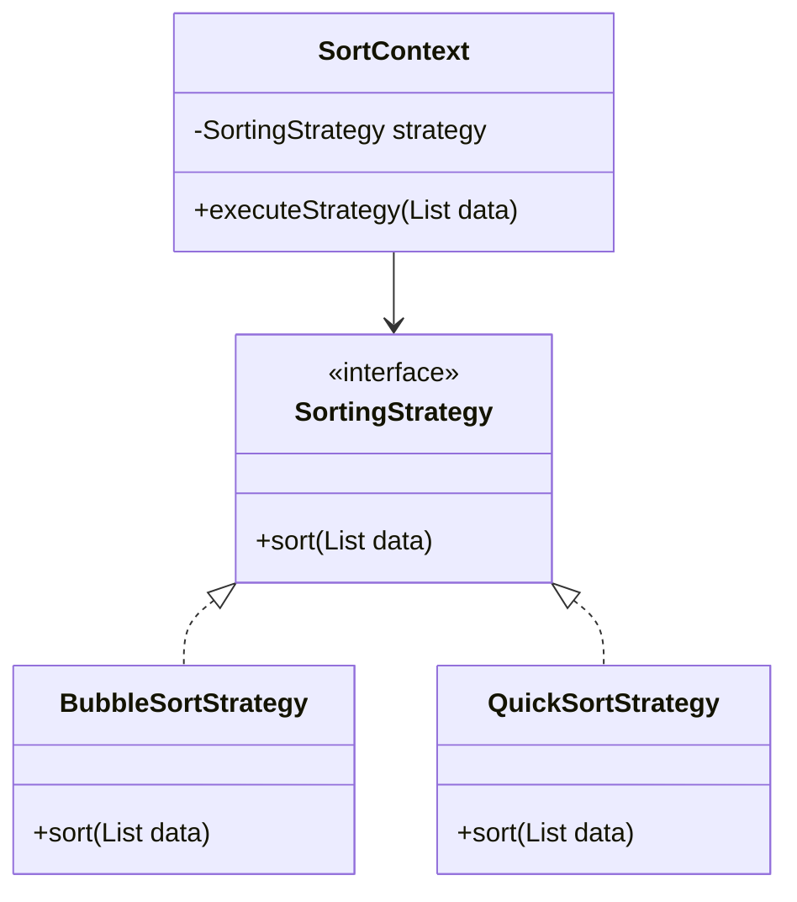

## 6.1 Strategy Design Pattern

The Strategy Design Pattern is a powerful behavioral design pattern that allows developers to define a family of algorithms, encapsulate each one, and make them interchangeable within a context. This pattern is particularly useful in scenarios where multiple algorithms are available for a specific task, and the choice of which algorithm to use can vary at runtime.

### Intent

The primary intent of the Strategy Design Pattern is to enable a client to choose from a family of algorithms at runtime. This is achieved by defining a strategy interface that encapsulates the algorithms, allowing them to be interchangeable without altering the client code.

### Key Participants

1. **Strategy Interface**: Defines a common interface for all supported algorithms.
2. **Concrete Strategies**: Implement the strategy interface with specific algorithms.
3. **Context Class**: Maintains a reference to a strategy object and allows it to vary.

### Implementing Strategy in Dart

In Dart, implementing the Strategy Design Pattern involves defining strategy interfaces, creating concrete strategies, and using a context class to manage and switch between these strategies.

#### Defining Strategy Interfaces

To define a strategy interface in Dart, you can use abstract classes or interfaces. This interface will declare the methods that all concrete strategies must implement.

```dart
// Strategy Interface
abstract class SortingStrategy {
  void sort(List<int> data);
}
```

#### Concrete Strategies

Concrete strategies implement the strategy interface, providing specific algorithms for the task at hand. For example, you might have different sorting algorithms implemented as concrete strategies.

```dart
// Concrete Strategy 1: Bubble Sort
class BubbleSortStrategy implements SortingStrategy {
  @override
  void sort(List<int> data) {
    for (int i = 0; i < data.length - 1; i++) {
      for (int j = 0; j < data.length - i - 1; j++) {
        if (data[j] > data[j + 1]) {
          int temp = data[j];
          data[j] = data[j + 1];
          data[j + 1] = temp;
        }
      }
    }
    print('Sorted using Bubble Sort: $data');
  }
}

// Concrete Strategy 2: Quick Sort
class QuickSortStrategy implements SortingStrategy {
  @override
  void sort(List<int> data) {
    _quickSort(data, 0, data.length - 1);
    print('Sorted using Quick Sort: $data');
  }

  void _quickSort(List<int> data, int low, int high) {
    if (low < high) {
      int pi = _partition(data, low, high);
      _quickSort(data, low, pi - 1);
      _quickSort(data, pi + 1, high);
    }
  }

  int _partition(List<int> data, int low, int high) {
    int pivot = data[high];
    int i = (low - 1);
    for (int j = low; j < high; j++) {
      if (data[j] < pivot) {
        i++;
        int temp = data[i];
        data[i] = data[j];
        data[j] = temp;
      }
    }
    int temp = data[i + 1];
    data[i + 1] = data[high];
    data[high] = temp;
    return i + 1;
  }
}
```

#### Context Class

The context class maintains a reference to a strategy object and allows it to vary. It delegates the algorithm execution to the strategy object.

```dart
// Context Class
class SortContext {
  SortingStrategy _strategy;

  SortContext(this._strategy);

  set strategy(SortingStrategy strategy) {
    _strategy = strategy;
  }

  void executeStrategy(List<int> data) {
    _strategy.sort(data);
  }
}
```

### Use Cases and Examples

The Strategy Design Pattern is widely applicable in various scenarios. Let's explore some common use cases and examples.

#### Sorting Algorithms

In applications where sorting is required, different algorithms may be more efficient depending on the data set. The Strategy Design Pattern allows you to switch between different sorting strategies at runtime.

```dart
void main() {
  List<int> data = [64, 34, 25, 12, 22, 11, 90];

  // Using Bubble Sort
  SortContext context = SortContext(BubbleSortStrategy());
  context.executeStrategy(data);

  // Using Quick Sort
  context.strategy = QuickSortStrategy();
  context.executeStrategy(data);
}
```

#### Payment Processing Systems

In payment processing systems, different payment methods (e.g., credit card, PayPal, bank transfer) can be implemented as strategies. The Strategy Design Pattern allows the system to select the appropriate payment method at runtime.

```dart
// Strategy Interface for Payment
abstract class PaymentStrategy {
  void pay(double amount);
}

// Concrete Strategy: Credit Card Payment
class CreditCardPayment implements PaymentStrategy {
  @override
  void pay(double amount) {
    print('Paid $amount using Credit Card.');
  }
}

// Concrete Strategy: PayPal Payment
class PayPalPayment implements PaymentStrategy {
  @override
  void pay(double amount) {
    print('Paid $amount using PayPal.');
  }
}

// Context Class for Payment
class PaymentContext {
  PaymentStrategy _strategy;

  PaymentContext(this._strategy);

  set strategy(PaymentStrategy strategy) {
    _strategy = strategy;
  }

  void executePayment(double amount) {
    _strategy.pay(amount);
  }
}

void main() {
  double amount = 100.0;

  // Using Credit Card Payment
  PaymentContext paymentContext = PaymentContext(CreditCardPayment());
  paymentContext.executePayment(amount);

  // Using PayPal Payment
  paymentContext.strategy = PayPalPayment();
  paymentContext.executePayment(amount);
}
```

### Visualizing the Strategy Design Pattern

To better understand the Strategy Design Pattern, let's visualize it using a class diagram.



**Diagram Description**: The class diagram above illustrates the Strategy Design Pattern. The `SortingStrategy` interface defines the `sort` method. `BubbleSortStrategy` and `QuickSortStrategy` are concrete implementations of the `SortingStrategy` interface. The `SortContext` class maintains a reference to a `SortingStrategy` and delegates the sorting task to it.

### Design Considerations

When implementing the Strategy Design Pattern, consider the following:

- **Flexibility**: The pattern provides flexibility by allowing the client to choose from a family of algorithms at runtime.
- **Encapsulation**: Each algorithm is encapsulated in its own class, promoting separation of concerns.
- **Complexity**: The pattern may introduce additional complexity due to the increased number of classes.
- **Performance**: Switching strategies at runtime may have performance implications, depending on the context.

### Differences and Similarities

The Strategy Design Pattern is often confused with the State Design Pattern. While both patterns involve changing behavior at runtime, the Strategy Pattern focuses on interchangeable algorithms, whereas the State Pattern deals with changing the state of an object.

### Try It Yourself

To deepen your understanding of the Strategy Design Pattern, try modifying the code examples provided. Experiment with adding new sorting algorithms or payment methods. Observe how the context class can switch between strategies seamlessly.

### Knowledge Check

- What is the primary intent of the Strategy Design Pattern?
- How does the Strategy Design Pattern promote flexibility in software design?
- What are some common use cases for the Strategy Design Pattern?
- How does the Strategy Design Pattern differ from the State Design Pattern?

### Embrace the Journey

Remember, mastering design patterns is a journey. As you progress, you'll build more complex and interactive applications. Keep experimenting, stay curious, and enjoy the journey!

## Quiz Time!



### What is the primary intent of the Strategy Design Pattern?

- [x] To enable a client to choose from a family of algorithms at runtime.
- [ ] To manage the state of an object.
- [ ] To provide a way to create objects.
- [ ] To define a one-to-many dependency between objects.

> **Explanation:** The Strategy Design Pattern allows a client to choose from a family of algorithms at runtime, making them interchangeable.

### Which of the following is a key participant in the Strategy Design Pattern?

- [x] Strategy Interface
- [ ] Singleton
- [ ] Observer
- [ ] Factory

> **Explanation:** The Strategy Interface is a key participant in the Strategy Design Pattern, defining a common interface for all supported algorithms.

### How does the Strategy Design Pattern promote flexibility?

- [x] By allowing the client to choose from a family of algorithms at runtime.
- [ ] By reducing the number of classes in the system.
- [ ] By enforcing a single algorithm for all scenarios.
- [ ] By eliminating the need for interfaces.

> **Explanation:** The Strategy Design Pattern promotes flexibility by allowing the client to choose from a family of algorithms at runtime.

### What is a common use case for the Strategy Design Pattern?

- [x] Sorting Algorithms
- [ ] Singleton Pattern
- [ ] Observer Pattern
- [ ] Factory Pattern

> **Explanation:** Sorting algorithms are a common use case for the Strategy Design Pattern, allowing different sorting strategies to be used interchangeably.

### How does the Strategy Design Pattern differ from the State Design Pattern?

- [x] The Strategy Pattern focuses on interchangeable algorithms, while the State Pattern deals with changing the state of an object.
- [ ] The Strategy Pattern is used for creating objects, while the State Pattern is used for managing state.
- [ ] The Strategy Pattern is a creational pattern, while the State Pattern is a structural pattern.
- [ ] The Strategy Pattern is used for one-to-many dependencies, while the State Pattern is used for one-to-one dependencies.

> **Explanation:** The Strategy Pattern focuses on interchangeable algorithms, while the State Pattern deals with changing the state of an object.

### What is a potential drawback of using the Strategy Design Pattern?

- [x] It may introduce additional complexity due to the increased number of classes.
- [ ] It eliminates the need for interfaces.
- [ ] It enforces a single algorithm for all scenarios.
- [ ] It reduces flexibility in software design.

> **Explanation:** The Strategy Design Pattern may introduce additional complexity due to the increased number of classes.

### In the context of payment processing systems, what role does the Strategy Design Pattern play?

- [x] It allows the system to select the appropriate payment method at runtime.
- [ ] It enforces a single payment method for all transactions.
- [ ] It eliminates the need for payment interfaces.
- [ ] It reduces the number of payment methods available.

> **Explanation:** The Strategy Design Pattern allows the system to select the appropriate payment method at runtime.

### What is the role of the Context Class in the Strategy Design Pattern?

- [x] It maintains a reference to a strategy object and allows it to vary.
- [ ] It defines a common interface for all supported algorithms.
- [ ] It implements specific algorithms for the task at hand.
- [ ] It manages the state of an object.

> **Explanation:** The Context Class maintains a reference to a strategy object and allows it to vary.

### Which of the following is a concrete strategy in the provided sorting example?

- [x] BubbleSortStrategy
- [ ] SortingStrategy
- [ ] SortContext
- [ ] PaymentContext

> **Explanation:** BubbleSortStrategy is a concrete strategy in the provided sorting example, implementing the SortingStrategy interface.

### True or False: The Strategy Design Pattern can be used to switch between different sorting strategies at runtime.

- [x] True
- [ ] False

> **Explanation:** True. The Strategy Design Pattern allows switching between different sorting strategies at runtime.


