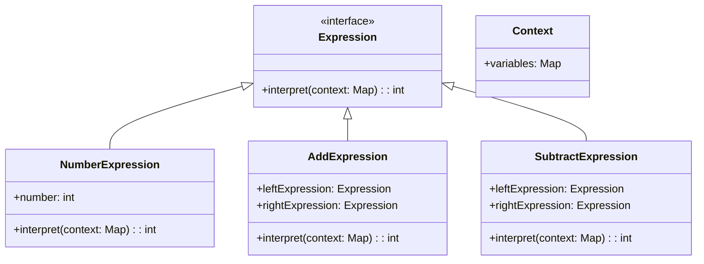

## 6.10 Interpreter Design Pattern

The Interpreter Design Pattern is a powerful tool in the arsenal of software developers, particularly when dealing with languages and grammars. It provides a way to evaluate sentences in a language by defining a representation for its grammar and an interpreter that uses this representation to interpret the sentences. In this section, we will delve into the intricacies of the Interpreter Design Pattern, its implementation in Dart, and its practical applications.

### Intent of the Interpreter Design Pattern

The primary intent of the Interpreter Design Pattern is to define a grammatical representation for a language and provide an interpreter to process and evaluate sentences in that language. This pattern is particularly useful in scenarios where you need to interpret or execute a set of instructions written in a specific language or notation.

### Key Participants

1. **Abstract Expression**: Declares an `interpret` method that is common to all nodes in the abstract syntax tree.
2. **Terminal Expression**: Implements the `interpret` method for terminal symbols in the grammar.
3. **Nonterminal Expression**: Implements the `interpret` method for nonterminal symbols, which are composed of other expressions.
4. **Context**: Contains information that is global to the interpreter, such as variable values or other state information.

### Implementing the Interpreter Pattern in Dart

Let's explore how to implement the Interpreter Design Pattern in Dart by building a simple arithmetic expression interpreter. This interpreter will evaluate expressions containing addition and subtraction.

#### Step 1: Define the Abstract Expression

The abstract expression declares the `interpret` method, which all concrete expressions must implement.

```dart
abstract class Expression {
  int interpret(Map<String, int> context);
}
```

#### Step 2: Implement Terminal Expressions

Terminal expressions represent the leaf nodes in the abstract syntax tree. In our example, these are the numbers.

```dart
class NumberExpression implements Expression {
  final int number;

  NumberExpression(this.number);

  @override
  int interpret(Map<String, int> context) {
    return number;
  }
}
```

#### Step 3: Implement Nonterminal Expressions

Nonterminal expressions represent the composite nodes in the abstract syntax tree. These nodes are composed of other expressions.

```dart
class AddExpression implements Expression {
  final Expression leftExpression;
  final Expression rightExpression;

  AddExpression(this.leftExpression, this.rightExpression);

  @override
  int interpret(Map<String, int> context) {
    return leftExpression.interpret(context) + rightExpression.interpret(context);
  }
}

class SubtractExpression implements Expression {
  final Expression leftExpression;
  final Expression rightExpression;

  SubtractExpression(this.leftExpression, this.rightExpression);

  @override
  int interpret(Map<String, int> context) {
    return leftExpression.interpret(context) - rightExpression.interpret(context);
  }
}
```

#### Step 4: Define the Context

The context contains information that is global to the interpreter. In this example, we use a map to store variable values.

```dart
class Context {
  final Map<String, int> variables;

  Context(this.variables);
}
```

#### Step 5: Putting It All Together

Let's see how we can use these classes to interpret an arithmetic expression.

```dart
void main() {
  // Create a context with variable values
  var context = Context({'x': 5, 'y': 10});

  // Create expressions
  var expression = AddExpression(
    NumberExpression(3),
    SubtractExpression(
      NumberExpression(10),
      NumberExpression(5),
    ),
  );

  // Interpret the expression
  var result = expression.interpret(context.variables);
  print('Result: $result'); // Output: Result: 8
}
```

### Visualizing the Interpreter Pattern

To better understand the structure of the Interpreter Design Pattern, let's visualize it using a class diagram.



### Use Cases and Examples

The Interpreter Design Pattern is particularly useful in the following scenarios:

1. **Parsing and Evaluating Expressions**: This pattern is ideal for building simple calculators or scripting languages where expressions need to be parsed and evaluated.

2. **Regular Expressions**: The pattern can be used to match patterns in strings, similar to how regular expressions work.

3. **Configuration Files**: Interpreting configuration files or scripts that define application behavior.

4. **Domain-Specific Languages (DSLs)**: Creating interpreters for DSLs that are tailored to specific problem domains.

### Design Considerations

- **Complexity**: The Interpreter Design Pattern can become complex when the grammar is large. Consider using other patterns like the Visitor pattern to manage complexity.
- **Performance**: Interpreters can be slower than compiled code. Consider optimizing performance-critical sections.
- **Extensibility**: The pattern is highly extensible, allowing you to add new expressions easily.

### Differences and Similarities

- **Interpreter vs. Visitor Pattern**: Both patterns deal with operations on a structure of objects. The Interpreter pattern focuses on interpreting a language, while the Visitor pattern separates algorithms from the objects on which they operate.
- **Interpreter vs. Strategy Pattern**: The Strategy pattern defines a family of algorithms, encapsulates each one, and makes them interchangeable. The Interpreter pattern, on the other hand, is about interpreting sentences in a language.

### Try It Yourself

To deepen your understanding of the Interpreter Design Pattern, try modifying the code example to include multiplication and division operations. Consider how you would handle operator precedence and parentheses.

### Knowledge Check

- What is the primary intent of the Interpreter Design Pattern?
- How does the Interpreter Design Pattern differ from the Visitor Pattern?
- What are some common use cases for the Interpreter Design Pattern?

### Embrace the Journey

Remember, mastering design patterns is a journey. As you experiment with the Interpreter Design Pattern, you'll gain insights into how languages and grammars can be represented and interpreted. Keep exploring, stay curious, and enjoy the process!

## Quiz Time!



### What is the primary intent of the Interpreter Design Pattern?

- [x] To define a grammatical representation for a language and provide an interpreter to process and evaluate sentences in that language.
- [ ] To separate the construction of a complex object from its representation.
- [ ] To encapsulate a request as an object, thereby allowing for parameterization of clients with queues, requests, and operations.
- [ ] To define a family of algorithms, encapsulate each one, and make them interchangeable.

> **Explanation:** The Interpreter Design Pattern is intended to define a representation for a language's grammar and provide an interpreter to process and evaluate sentences in that language.

### Which of the following is a key participant in the Interpreter Design Pattern?

- [x] Abstract Expression
- [ ] Concrete Factory
- [ ] Singleton
- [ ] Observer

> **Explanation:** The Abstract Expression is a key participant in the Interpreter Design Pattern, declaring the interpret method common to all nodes in the abstract syntax tree.

### What is a common use case for the Interpreter Design Pattern?

- [x] Parsing and evaluating expressions
- [ ] Managing object creation
- [ ] Observing changes in state
- [ ] Implementing a singleton

> **Explanation:** A common use case for the Interpreter Design Pattern is parsing and evaluating expressions, such as in calculators or scripting languages.

### How does the Interpreter Design Pattern differ from the Visitor Pattern?

- [x] The Interpreter pattern focuses on interpreting a language, while the Visitor pattern separates algorithms from the objects on which they operate.
- [ ] The Interpreter pattern is used for managing object creation, while the Visitor pattern is used for observing changes in state.
- [ ] The Interpreter pattern is used for defining a family of algorithms, while the Visitor pattern is used for encapsulating a request as an object.
- [ ] The Interpreter pattern is used for managing object creation, while the Visitor pattern is used for encapsulating a request as an object.

> **Explanation:** The Interpreter pattern focuses on interpreting a language, while the Visitor pattern separates algorithms from the objects on which they operate.

### What is a potential drawback of using the Interpreter Design Pattern?

- [x] Complexity can increase when the grammar is large.
- [ ] It is difficult to extend with new expressions.
- [ ] It is not suitable for parsing expressions.
- [ ] It cannot be used with domain-specific languages.

> **Explanation:** A potential drawback of the Interpreter Design Pattern is that complexity can increase when the grammar is large.

### What is the role of the Context in the Interpreter Design Pattern?

- [x] It contains information that is global to the interpreter, such as variable values.
- [ ] It defines a family of algorithms and encapsulates each one.
- [ ] It encapsulates a request as an object.
- [ ] It separates algorithms from the objects on which they operate.

> **Explanation:** The Context in the Interpreter Design Pattern contains information that is global to the interpreter, such as variable values.

### Which pattern is commonly confused with the Interpreter Pattern?

- [x] Visitor Pattern
- [ ] Factory Pattern
- [ ] Singleton Pattern
- [ ] Observer Pattern

> **Explanation:** The Visitor Pattern is commonly confused with the Interpreter Pattern because both deal with operations on a structure of objects.

### What is a terminal expression in the Interpreter Design Pattern?

- [x] A terminal expression represents the leaf nodes in the abstract syntax tree.
- [ ] A terminal expression is a composite node in the abstract syntax tree.
- [ ] A terminal expression is a context that contains global information.
- [ ] A terminal expression is an algorithm encapsulated as an object.

> **Explanation:** A terminal expression represents the leaf nodes in the abstract syntax tree in the Interpreter Design Pattern.

### True or False: The Interpreter Design Pattern is suitable for implementing regular expressions.

- [x] True
- [ ] False

> **Explanation:** True. The Interpreter Design Pattern is suitable for implementing regular expressions as it involves matching patterns in strings.

### What should you consider when using the Interpreter Design Pattern?

- [x] Performance and complexity
- [ ] Singleton usage
- [ ] Observer notifications
- [ ] Factory creation

> **Explanation:** When using the Interpreter Design Pattern, consider performance and complexity, especially when dealing with large grammars.


