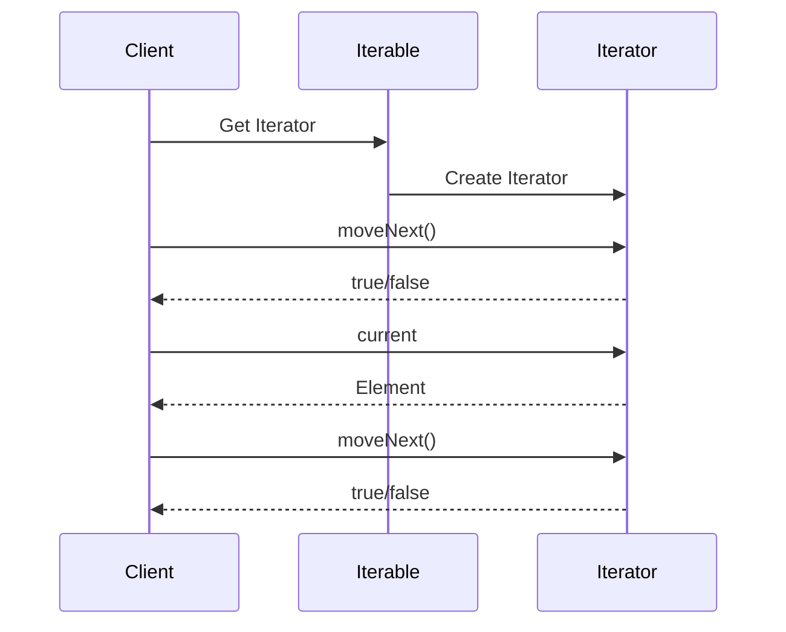

## 6.11 Iterator Design Pattern

The Iterator Design Pattern is a fundamental behavioral pattern that provides a way to access the elements of a collection sequentially without exposing its underlying representation. This pattern is particularly useful when you need to traverse complex data structures, such as trees or graphs, or when you want to provide a uniform way to iterate over different types of collections.

### Intent

The primary intent of the Iterator Design Pattern is to provide a standard way to traverse a collection of objects without exposing the collection's internal structure. By doing so, it allows for a separation of concerns, where the client code can focus on the iteration logic without worrying about how the collection is implemented.

### Key Participants

- **Iterator**: An interface or abstract class that defines methods for accessing and traversing elements.
- **Concrete Iterator**: A class that implements the Iterator interface and provides the actual traversal logic.
- **Iterable**: An interface or abstract class that defines a method to return an iterator.
- **Concrete Iterable**: A class that implements the Iterable interface and provides an iterator for its collection.

### Implementing Iterator in Dart

In Dart, the Iterator pattern is implemented using the `Iterator` and `Iterable` interfaces. Dart's standard library provides these interfaces, making it easy to create custom iterators and iterables.

#### Iterator Interface

The `Iterator` interface in Dart provides two main methods:

- **`bool moveNext()`**: Advances the iterator to the next element. Returns `true` if there is a next element and `false` otherwise.
- **`T get current`**: Returns the current element in the iteration. This property is only valid after `moveNext()` has been called and returned `true`.

#### Iterable Interface

The `Iterable` interface provides a single getter:

- **`Iterator<T> get iterator`**: Returns an iterator that can be used to iterate over the elements of the collection.

#### Custom Iterators

To create a custom iterator in Dart, you need to implement both the `Iterator` and `Iterable` interfaces. Let's walk through an example of creating a custom collection and iterator.

### Example: Custom Collection and Iterator

Suppose we have a custom collection of numbers, and we want to iterate over them using a custom iterator.

```dart
class NumberIterator implements Iterator<int> {
  final List<int> _numbers;
  int _currentIndex = -1;

  NumberIterator(this._numbers);

  @override
  bool moveNext() {
    if (_currentIndex < _numbers.length - 1) {
      _currentIndex++;
      return true;
    }
    return false;
  }

  @override
  int get current => _numbers[_currentIndex];
}

class NumberCollection implements Iterable<int> {
  final List<int> _numbers;

  NumberCollection(this._numbers);

  @override
  Iterator<int> get iterator => NumberIterator(_numbers);
}

void main() {
  final numbers = NumberCollection([1, 2, 3, 4, 5]);
  for (var number in numbers) {
    print(number);
  }
}
```

**Explanation:**

- **`NumberIterator`**: Implements the `Iterator<int>` interface. It maintains a list of numbers and a current index. The `moveNext()` method advances the index and returns `true` if there are more elements.
- **`NumberCollection`**: Implements the `Iterable<int>` interface. It provides an iterator for its internal list of numbers.
- **`main()`**: Demonstrates how to use the custom collection with a for-loop.

### Visualizing the Iterator Pattern

To better understand the flow of the Iterator pattern, let's visualize it using a sequence diagram.



**Diagram Explanation:**

- The client requests an iterator from the iterable.
- The iterable creates and returns an iterator.
- The client uses `moveNext()` to advance the iterator and `current` to access elements.

### Use Cases and Examples

#### Custom Collections

Custom collections benefit from the Iterator pattern by providing a standard way to traverse their elements. This is particularly useful when creating collections that have specific traversal requirements, such as reverse iteration or skipping elements.

#### Traversal Algorithms

The Iterator pattern is ideal for implementing traversal algorithms over complex data structures like trees or graphs. By encapsulating the traversal logic within an iterator, you can easily change the traversal strategy without affecting the client code.

### Design Considerations

- **When to Use**: Use the Iterator pattern when you need to provide a standard way to traverse a collection without exposing its internal structure.
- **Dart-Specific Features**: Dart's `Iterable` and `Iterator` interfaces make it easy to implement custom iterators. Use these interfaces to integrate seamlessly with Dart's collection framework.
- **Pitfalls**: Ensure that the iterator correctly handles edge cases, such as empty collections or reaching the end of the collection.

### Differences and Similarities

The Iterator pattern is often confused with the **Composite pattern**, which is used to treat individual objects and compositions of objects uniformly. While both patterns deal with collections, the Iterator pattern focuses on traversal, whereas the Composite pattern focuses on structure.

### Try It Yourself

To deepen your understanding of the Iterator pattern, try modifying the example code:

- Implement a reverse iterator that iterates over the collection in reverse order.
- Create an iterator that skips every other element in the collection.

### Knowledge Check

- What is the primary purpose of the Iterator pattern?
- How does the `Iterator` interface in Dart differ from the `Iterable` interface?
- What are some common use cases for the Iterator pattern?

### Embrace the Journey

Remember, mastering design patterns is a journey. The Iterator pattern is just one of many tools in your toolkit. As you continue to explore Dart and Flutter, you'll discover new ways to apply these patterns to create efficient and maintainable code. Keep experimenting, stay curious, and enjoy the journey!

## Quiz Time!



### What is the primary purpose of the Iterator Design Pattern?

- [x] To provide a way to access elements of a collection sequentially without exposing its underlying representation.
- [ ] To allow objects to be composed into tree structures to represent part-whole hierarchies.
- [ ] To define a family of algorithms, encapsulate each one, and make them interchangeable.
- [ ] To ensure a class has only one instance and provide a global point of access to it.

> **Explanation:** The Iterator Design Pattern is used to access elements of a collection sequentially without exposing the collection's internal structure.

### Which method is part of the Dart `Iterator` interface?

- [x] `moveNext()`
- [ ] `add()`
- [ ] `remove()`
- [ ] `contains()`

> **Explanation:** The `moveNext()` method is part of the Dart `Iterator` interface and is used to advance the iterator to the next element.

### What does the `current` property of a Dart `Iterator` return?

- [x] The current element in the iteration.
- [ ] The total number of elements in the collection.
- [ ] The previous element in the iteration.
- [ ] A boolean indicating if the iteration is complete.

> **Explanation:** The `current` property returns the current element in the iteration.

### In Dart, which interface provides a method to return an iterator?

- [x] `Iterable`
- [ ] `Collection`
- [ ] `List`
- [ ] `Map`

> **Explanation:** The `Iterable` interface provides a method to return an iterator.

### What is a common use case for the Iterator pattern?

- [x] Traversing complex data structures like trees or graphs.
- [ ] Creating a single instance of a class.
- [ ] Defining a family of algorithms.
- [ ] Composing objects into tree structures.

> **Explanation:** The Iterator pattern is commonly used for traversing complex data structures like trees or graphs.

### How can you create a custom iterator in Dart?

- [x] By implementing the `Iterator` and `Iterable` interfaces.
- [ ] By extending the `List` class.
- [ ] By using the `Stream` class.
- [ ] By implementing the `Collection` interface.

> **Explanation:** To create a custom iterator in Dart, you need to implement both the `Iterator` and `Iterable` interfaces.

### What does the `moveNext()` method of a Dart `Iterator` do?

- [x] Advances the iterator to the next element.
- [ ] Resets the iterator to the first element.
- [ ] Removes the current element from the collection.
- [ ] Checks if the collection contains a specific element.

> **Explanation:** The `moveNext()` method advances the iterator to the next element.

### What is the relationship between the `Iterator` and `Iterable` interfaces in Dart?

- [x] `Iterable` provides an iterator through the `iterator` getter.
- [ ] `Iterator` provides an iterable through the `iterable` getter.
- [ ] `Iterator` and `Iterable` are unrelated.
- [ ] `Iterable` is a subclass of `Iterator`.

> **Explanation:** The `Iterable` interface provides an iterator through the `iterator` getter.

### What is a potential pitfall when implementing a custom iterator?

- [x] Incorrectly handling edge cases, such as empty collections.
- [ ] Overloading the `add()` method.
- [ ] Using the `Stream` class instead of `Iterator`.
- [ ] Implementing the `Collection` interface.

> **Explanation:** A potential pitfall when implementing a custom iterator is incorrectly handling edge cases, such as empty collections.

### True or False: The Iterator pattern is often confused with the Composite pattern.

- [x] True
- [ ] False

> **Explanation:** True. The Iterator pattern is often confused with the Composite pattern, but they serve different purposes.


