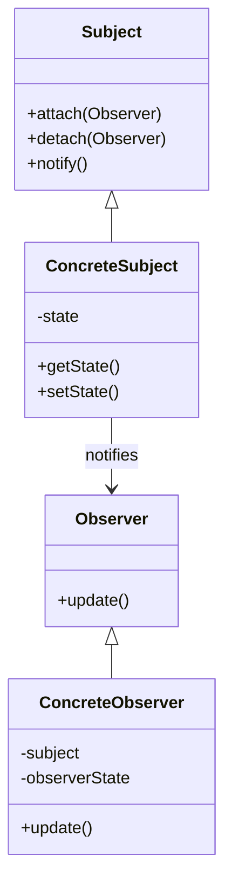
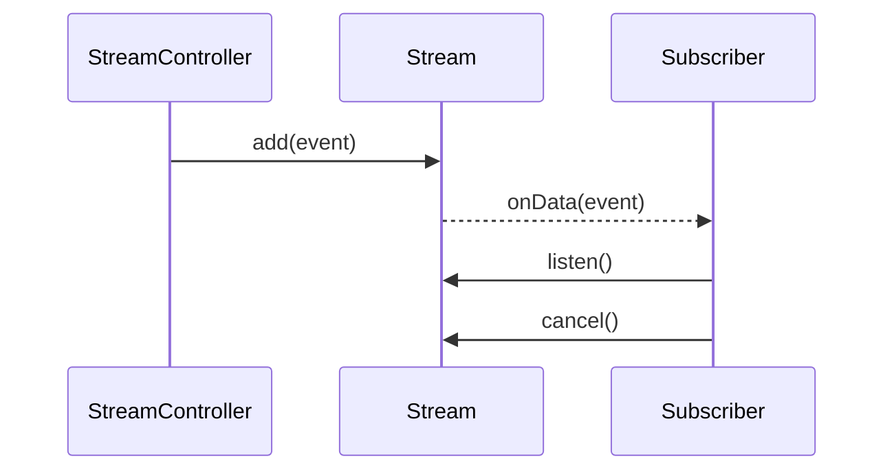
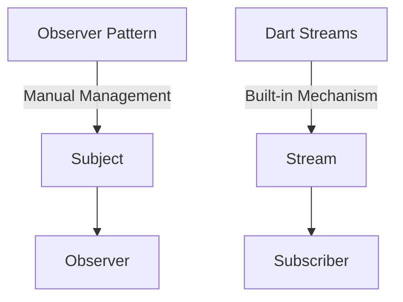

## 6.12 Observer Pattern vs. Stream Subscriptions

In the realm of software design patterns, the Observer Pattern is a well-established technique for implementing a one-to-many dependency between objects, allowing one object (the subject) to notify multiple observers about changes in its state. In Dart, however, we have a more modern and powerful tool at our disposal: Streams. Dart Streams provide built-in support for reactive programming, enabling asynchronous data handling and event-driven architectures. In this section, we will delve into the nuances of the Observer Pattern and Dart Streams, compare their use cases, and explore best practices for implementing reactive patterns in Flutter development.

### Comparing Traditional Observer Pattern with Dart Streams

#### Observer Pattern

The Observer Pattern is a behavioral design pattern that defines a subscription mechanism to allow multiple objects to listen and react to events or changes in another object. This pattern is particularly useful when you need to maintain consistency between related objects without tightly coupling them.

**Key Participants:**

- **Subject**: Maintains a list of observers and notifies them of any state changes.
- **Observer**: Defines an updating interface for objects that should be notified of changes in a subject.
- **ConcreteSubject**: Stores the state of interest to ConcreteObservers and sends notifications to its observers.
- **ConcreteObserver**: Implements the Observer interface to keep its state consistent with the subject's.

**Diagram:**



**Sample Code Snippet:**

```dart
// Observer interface
abstract class Observer {
  void update(String state);
}

// Concrete Observer
class ConcreteObserver implements Observer {
  final String name;
  ConcreteObserver(this.name);

  @override
  void update(String state) {
    print('$name received update: $state');
  }
}

// Subject interface
abstract class Subject {
  void attach(Observer observer);
  void detach(Observer observer);
  void notify();
}

// Concrete Subject
class ConcreteSubject implements Subject {
  final List<Observer> _observers = [];
  String _state;

  void setState(String state) {
    _state = state;
    notify();
  }

  @override
  void attach(Observer observer) {
    _observers.add(observer);
  }

  @override
  void detach(Observer observer) {
    _observers.remove(observer);
  }

  @override
  void notify() {
    for (var observer in _observers) {
      observer.update(_state);
    }
  }
}

void main() {
  var subject = ConcreteSubject();
  var observer1 = ConcreteObserver('Observer 1');
  var observer2 = ConcreteObserver('Observer 2');

  subject.attach(observer1);
  subject.attach(observer2);

  subject.setState('New State');
}
```

**Design Considerations:**

- **When to Use**: The Observer Pattern is ideal when an object needs to notify multiple other objects about changes in its state without knowing who those objects are.
- **Pitfalls**: Manual management of observers can lead to memory leaks if observers are not properly detached.

#### Dart Streams

Dart Streams provide a more modern and flexible approach to handling asynchronous data and events. Streams are part of Dart's core libraries and offer a built-in mechanism for reactive programming.

**Key Concepts:**

- **Stream**: A sequence of asynchronous events. Streams can be single-subscription or broadcast.
- **StreamController**: Manages the stream and allows you to add events to it.
- **Subscription**: Represents a listener's connection to a stream.

**Diagram:**



**Sample Code Snippet:**

```dart
import 'dart:async';

void main() {
  // Create a StreamController
  final controller = StreamController<String>();

  // Listen to the stream
  final subscription = controller.stream.listen(
    (data) {
      print('Received: $data');
    },
    onDone: () {
      print('Stream closed');
    },
  );

  // Add data to the stream
  controller.add('Hello');
  controller.add('World');

  // Close the stream
  controller.close();

  // Cancel the subscription
  subscription.cancel();
}
```

**Design Considerations:**

- **When to Use**: Streams are suitable for handling asynchronous data flows, such as user input events, network responses, or any data that arrives over time.
- **Pitfalls**: Failing to cancel subscriptions can lead to memory leaks.

### Implementing Reactive Patterns

#### Using Streams for Event Handling

Streams simplify asynchronous communication by providing a consistent interface for handling events over time. They are particularly useful in Flutter applications, where user interactions and data updates are inherently asynchronous.

**Example:**

Consider a Flutter application where you need to update the UI based on user input. Using a Stream, you can listen for changes and update the UI accordingly.

```dart
import 'dart:async';
import 'package:flutter/material.dart';

void main() => runApp(MyApp());

class MyApp extends StatelessWidget {
  @override
  Widget build(BuildContext context) {
    return MaterialApp(
      home: StreamExample(),
    );
  }
}

class StreamExample extends StatefulWidget {
  @override
  _StreamExampleState createState() => _StreamExampleState();
}

class _StreamExampleState extends State<StreamExample> {
  final StreamController<int> _controller = StreamController<int>();
  int _counter = 0;

  @override
  void dispose() {
    _controller.close();
    super.dispose();
  }

  void _incrementCounter() {
    _counter++;
    _controller.add(_counter);
  }

  @override
  Widget build(BuildContext context) {
    return Scaffold(
      appBar: AppBar(
        title: Text('Stream Example'),
      ),
      body: Center(
        child: StreamBuilder<int>(
          stream: _controller.stream,
          initialData: _counter,
          builder: (context, snapshot) {
            return Text(
              'Counter: ${snapshot.data}',
              style: TextStyle(fontSize: 24),
            );
          },
        ),
      ),
      floatingActionButton: FloatingActionButton(
        onPressed: _incrementCounter,
        child: Icon(Icons.add),
      ),
    );
  }
}
```

**Try It Yourself**: Modify the code to decrement the counter when a different button is pressed.

#### Managing Subscriptions

Properly managing subscriptions is crucial to prevent memory leaks. Always cancel subscriptions when they are no longer needed, such as when a widget is disposed of.

**Example:**

```dart
@override
void dispose() {
  _subscription.cancel();
  super.dispose();
}
```

### Best Practices

#### Choosing the Right Approach

- **Observer Pattern**: Use when you need a simple, manual implementation of subject-observer relationships.
- **Dart Streams**: Use for more complex, asynchronous data handling and when leveraging Dart's built-in reactive programming capabilities.

#### Avoiding Memory Leaks

- **Observer Pattern**: Ensure observers are detached when no longer needed.
- **Dart Streams**: Always cancel subscriptions and close StreamControllers when they are no longer in use.

### Differences and Similarities

- **Differences**: The Observer Pattern requires manual management of observers, while Streams provide a built-in mechanism for handling asynchronous events.
- **Similarities**: Both patterns facilitate communication between objects and can be used to implement reactive architectures.

### Visualizing Observer Pattern vs. Stream Subscriptions



**Description**: This diagram illustrates the manual management required in the Observer Pattern compared to the built-in mechanism provided by Dart Streams.

### Knowledge Check

- **Question**: What is the primary advantage of using Dart Streams over the Observer Pattern?
- **Exercise**: Implement a simple chat application using Dart Streams to handle incoming messages.

### Embrace the Journey

Remember, mastering design patterns and reactive programming in Dart is a journey. As you continue to explore these concepts, you'll gain the skills needed to build more efficient and scalable Flutter applications. Keep experimenting, stay curious, and enjoy the process!

## Quiz Time!



### What is the primary purpose of the Observer Pattern?

- [x] To define a one-to-many dependency between objects
- [ ] To encapsulate a request as an object
- [ ] To provide a way to access the elements of an aggregate object sequentially
- [ ] To define a family of algorithms

> **Explanation:** The Observer Pattern is used to define a one-to-many dependency between objects, allowing one object to notify multiple observers about changes in its state.

### How do Dart Streams differ from the traditional Observer Pattern?

- [x] Streams provide built-in support for asynchronous data handling
- [ ] Streams require manual management of observers
- [ ] Streams are only used for synchronous data
- [ ] Streams do not support multiple subscribers

> **Explanation:** Dart Streams provide built-in support for asynchronous data handling, unlike the traditional Observer Pattern which requires manual management of observers.

### What is a key benefit of using Dart Streams in Flutter applications?

- [x] Simplifies asynchronous communication
- [ ] Requires more boilerplate code
- [ ] Limits the number of subscribers
- [ ] Only works with synchronous data

> **Explanation:** Dart Streams simplify asynchronous communication, making them particularly useful in Flutter applications where user interactions and data updates are inherently asynchronous.

### What should you always do when managing Stream subscriptions?

- [x] Cancel subscriptions when no longer needed
- [ ] Keep subscriptions open indefinitely
- [ ] Avoid using StreamControllers
- [ ] Use only single-subscription streams

> **Explanation:** Always cancel subscriptions when they are no longer needed to prevent memory leaks.

### Which pattern is more suitable for handling complex asynchronous data flows?

- [x] Dart Streams
- [ ] Observer Pattern
- [ ] Singleton Pattern
- [ ] Factory Pattern

> **Explanation:** Dart Streams are more suitable for handling complex asynchronous data flows due to their built-in support for reactive programming.

### What is a common pitfall when using the Observer Pattern?

- [x] Memory leaks due to improper detachment of observers
- [ ] Lack of support for asynchronous data
- [ ] Inability to notify multiple observers
- [ ] Overhead of managing StreamControllers

> **Explanation:** A common pitfall when using the Observer Pattern is memory leaks due to improper detachment of observers.

### What is the role of a StreamController in Dart?

- [x] Manages the stream and allows adding events
- [ ] Observes changes in a subject
- [ ] Provides a way to access elements sequentially
- [ ] Encapsulates a request as an object

> **Explanation:** A StreamController in Dart manages the stream and allows you to add events to it.

### How can you prevent memory leaks when using Dart Streams?

- [x] Cancel subscriptions and close StreamControllers
- [ ] Keep all subscriptions open
- [ ] Use only broadcast streams
- [ ] Avoid using StreamBuilders

> **Explanation:** To prevent memory leaks, always cancel subscriptions and close StreamControllers when they are no longer needed.

### What is a key similarity between the Observer Pattern and Dart Streams?

- [x] Both facilitate communication between objects
- [ ] Both require manual observer management
- [ ] Both are used for synchronous data only
- [ ] Both are limited to a single subscriber

> **Explanation:** A key similarity is that both the Observer Pattern and Dart Streams facilitate communication between objects.

### True or False: Dart Streams require manual management of observers.

- [ ] True
- [x] False

> **Explanation:** False. Dart Streams provide a built-in mechanism for handling asynchronous events, eliminating the need for manual management of observers.




