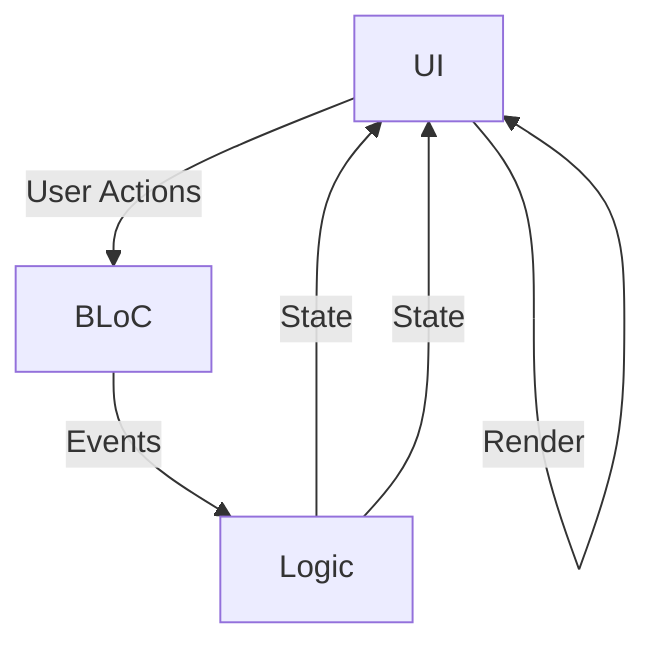

## 6.13 BLoC Pattern in Depth

The Business Logic Component (BLoC) pattern is a powerful design pattern in Flutter that helps manage state and separate business logic from UI components. This pattern is particularly useful in large applications where maintaining a clean architecture is crucial. In this section, we will delve deep into the BLoC pattern, exploring its concepts, implementation, and best practices.

### Introduction to BLoC

The BLoC pattern was introduced by Google to provide a predictable state management solution for Flutter applications. It leverages Dart's asynchronous programming capabilities, using Streams to handle events and state changes. The core idea is to separate the business logic from the UI, making the code more modular, testable, and reusable.

#### Key Concepts

1. **Separation of Concerns**: BLoC promotes a clear separation between the UI and business logic. This separation ensures that the UI components are only responsible for rendering the interface, while the BLoC handles the logic and state management.

2. **Streams and Sinks**: Streams are used to input events and output states. A Sink is used to add events to the stream, and the stream itself is used to listen to state changes.

3. **Event-Driven Architecture**: BLoC follows an event-driven approach where user interactions and data changes are treated as events. These events are processed by the BLoC to produce new states.

### Implementing BLoC in Dart

Let's explore how to implement the BLoC pattern in a Flutter application. We will build a simple counter app to demonstrate the core concepts.

#### Step 1: Define Events

Events represent user actions or data changes. In our counter app, we will have two events: increment and decrement.

```dart
// counter_event.dart
abstract class CounterEvent {}

class IncrementEvent extends CounterEvent {}

class DecrementEvent extends CounterEvent {}
```

#### Step 2: Define States

States represent the data that the UI will render. In our example, the state is simply the current count.

```dart
// counter_state.dart
class CounterState {
  final int count;

  CounterState(this.count);
}
```

#### Step 3: Create the BLoC

The BLoC will handle the logic for processing events and updating the state. It will use a StreamController to manage the flow of events and states.

```dart
// counter_bloc.dart
import 'dart:async';
import 'counter_event.dart';
import 'counter_state.dart';

class CounterBloc {
  int _count = 0;

  final _eventController = StreamController<CounterEvent>();
  Sink<CounterEvent> get eventSink => _eventController.sink;

  final _stateController = StreamController<CounterState>();
  Stream<CounterState> get stateStream => _stateController.stream;

  CounterBloc() {
    _eventController.stream.listen(_mapEventToState);
  }

  void _mapEventToState(CounterEvent event) {
    if (event is IncrementEvent) {
      _count++;
    } else if (event is DecrementEvent) {
      _count--;
    }

    _stateController.sink.add(CounterState(_count));
  }

  void dispose() {
    _eventController.close();
    _stateController.close();
  }
}
```

#### Step 4: Integrate BLoC with the UI

Now, let's integrate the BLoC with a simple Flutter UI.

```dart
// main.dart
import 'package:flutter/material.dart';
import 'counter_bloc.dart';
import 'counter_event.dart';
import 'counter_state.dart';

void main() => runApp(MyApp());

class MyApp extends StatelessWidget {
  @override
  Widget build(BuildContext context) {
    return MaterialApp(
      home: CounterScreen(),
    );
  }
}

class CounterScreen extends StatefulWidget {
  @override
  _CounterScreenState createState() => _CounterScreenState();
}

class _CounterScreenState extends State<CounterScreen> {
  final CounterBloc _bloc = CounterBloc();

  @override
  void dispose() {
    _bloc.dispose();
    super.dispose();
  }

  @override
  Widget build(BuildContext context) {
    return Scaffold(
      appBar: AppBar(
        title: Text('BLoC Counter'),
      ),
      body: StreamBuilder<CounterState>(
        stream: _bloc.stateStream,
        initialData: CounterState(0),
        builder: (context, snapshot) {
          return Center(
            child: Text(
              'Count: ${snapshot.data?.count ?? 0}',
              style: TextStyle(fontSize: 24),
            ),
          );
        },
      ),
      floatingActionButton: Column(
        mainAxisAlignment: MainAxisAlignment.end,
        children: [
          FloatingActionButton(
            onPressed: () => _bloc.eventSink.add(IncrementEvent()),
            child: Icon(Icons.add),
          ),
          SizedBox(height: 10),
          FloatingActionButton(
            onPressed: () => _bloc.eventSink.add(DecrementEvent()),
            child: Icon(Icons.remove),
          ),
        ],
      ),
    );
  }
}
```

### Visualizing the BLoC Architecture

To better understand the BLoC pattern, let's visualize its architecture using a Mermaid.js diagram.



**Diagram Description**: This diagram illustrates the flow of data in the BLoC pattern. User actions trigger events that are processed by the BLoC. The BLoC updates the state, which is then rendered by the UI.

### Use Cases and Examples

The BLoC pattern is particularly useful in large Flutter applications where state management can become complex. Here are some common use cases:

1. **Scalable State Management**: BLoC provides a scalable solution for managing state in large applications. By separating business logic from the UI, it becomes easier to manage and test the code.

2. **Reusability**: BLoC components can be reused across multiple widgets, promoting code reuse and reducing duplication.

3. **Testability**: Since the business logic is separated from the UI, it becomes easier to write unit tests for the BLoC components.

### Best Practices for BLoC

1. **Keep BLoC Pure**: Ensure that the BLoC only contains business logic and does not depend on any UI components.

2. **Use Streams Wisely**: Use streams to manage the flow of events and states. Avoid using streams for simple state management tasks that can be handled by other means.

3. **Dispose Resources**: Always dispose of StreamControllers to prevent memory leaks.

4. **Modularize BLoC Components**: Break down complex BLoC components into smaller, modular components for better maintainability.

### Differences and Similarities with Other Patterns

The BLoC pattern is often compared with other state management solutions like Provider, Redux, and MobX. Here's how it differs:

- **Provider**: While Provider is a simple dependency injection solution, BLoC provides a more structured approach to state management with streams.
- **Redux**: Redux follows a similar unidirectional data flow but uses a central store for state management, whereas BLoC uses streams.
- **MobX**: MobX is a reactive state management solution that automatically updates the UI when the state changes, while BLoC requires explicit event handling.

### Try It Yourself

Experiment with the BLoC pattern by modifying the counter app. Try adding new events, such as resetting the counter, and observe how the BLoC handles these changes. This hands-on approach will help solidify your understanding of the BLoC pattern.

### Knowledge Check

- What are the key benefits of using the BLoC pattern in Flutter?
- How does the BLoC pattern promote separation of concerns?
- What is the role of streams in the BLoC pattern?

### Conclusion

The BLoC pattern is a powerful tool for managing state in Flutter applications. By separating business logic from the UI, it promotes a clean architecture that is easy to maintain and test. As you continue to explore Flutter, consider using the BLoC pattern to manage state in your applications.

## Quiz Time!



### What is the primary purpose of the BLoC pattern in Flutter?

- [x] To separate business logic from UI components
- [ ] To enhance UI rendering speed
- [ ] To simplify network requests
- [ ] To manage database connections

> **Explanation:** The BLoC pattern is designed to separate business logic from UI components, promoting a clean architecture.

### Which of the following is a key component of the BLoC pattern?

- [x] Streams
- [ ] Widgets
- [ ] HTTP requests
- [ ] JSON parsing

> **Explanation:** Streams are a key component of the BLoC pattern, used to manage the flow of events and states.

### In the BLoC pattern, what is the role of a Sink?

- [x] To add events to a stream
- [ ] To render UI components
- [ ] To fetch data from a server
- [ ] To manage database transactions

> **Explanation:** A Sink is used to add events to a stream in the BLoC pattern.

### How does the BLoC pattern handle user interactions?

- [x] By treating them as events
- [ ] By directly modifying the UI
- [ ] By storing them in a database
- [ ] By ignoring them

> **Explanation:** User interactions are treated as events in the BLoC pattern, which are then processed to update the state.

### What is a common advantage of using the BLoC pattern?

- [x] Improved testability
- [ ] Faster UI rendering
- [ ] Simplified database management
- [ ] Easier network requests

> **Explanation:** The separation of business logic from UI components in the BLoC pattern improves testability.

### Which of the following is NOT a benefit of the BLoC pattern?

- [ ] Reusability
- [ ] Scalability
- [x] Direct UI manipulation
- [ ] Testability

> **Explanation:** The BLoC pattern does not involve direct UI manipulation; it separates business logic from UI.

### What should you always do with StreamControllers in BLoC?

- [x] Dispose of them
- [ ] Render them
- [ ] Store them in a database
- [ ] Ignore them

> **Explanation:** StreamControllers should always be disposed of to prevent memory leaks.

### How does the BLoC pattern differ from Redux?

- [x] BLoC uses streams, while Redux uses a central store
- [ ] BLoC uses a central store, while Redux uses streams
- [ ] BLoC is for UI rendering, while Redux is for network requests
- [ ] BLoC is for database management, while Redux is for UI rendering

> **Explanation:** BLoC uses streams for state management, whereas Redux uses a central store.

### What is a common use case for the BLoC pattern?

- [x] Large Flutter applications
- [ ] Small command-line tools
- [ ] Simple web pages
- [ ] Basic database queries

> **Explanation:** The BLoC pattern is commonly used in large Flutter applications for scalable state management.

### True or False: The BLoC pattern requires explicit event handling.

- [x] True
- [ ] False

> **Explanation:** The BLoC pattern requires explicit event handling to manage state changes.



Remember, mastering the BLoC pattern is just the beginning. As you continue your journey in Flutter development, keep experimenting with different patterns and techniques to build robust and scalable applications. Happy coding!
