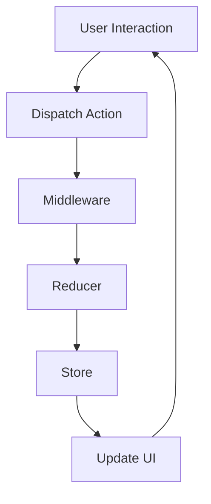

## 6.14 Redux Pattern in Dart

State management is a crucial aspect of modern application development, especially in complex applications where maintaining a consistent and predictable state is essential. The Redux pattern provides a robust solution for managing state in a centralized manner, ensuring that the application's state and logic are well-organized and easily traceable. In this section, we will delve into the Redux pattern in Dart, exploring its components, implementation, and use cases.

### Introduction to Redux Pattern

Redux is a predictable state container for JavaScript apps, but its principles can be applied to any language, including Dart. It is particularly popular in the Flutter ecosystem for managing state in a scalable and maintainable way. Redux centralizes the application's state and logic, making it easier to manage and debug.

#### Key Concepts of Redux

1. **Single Source of Truth**: The state of the entire application is stored in a single object tree within a single store. This makes it easy to track changes and debug the application.

2. **State is Read-Only**: The only way to change the state is to emit an action, an object describing what happened. This ensures that the state is predictable and changes are traceable.

3. **Changes are Made with Pure Functions**: To specify how the state tree is transformed by actions, you write pure reducers. Reducers are functions that take the current state and an action, and return a new state.

### Implementing Redux in Dart

To implement Redux in Dart, we need to understand its core components: Store, Actions, Reducers, and Middleware.

#### Store

The store holds the application's state. It is the single source of truth for the application's state and provides methods to access the state, dispatch actions, and subscribe to changes.

```dart
import 'package:redux/redux.dart';

// Define the state
class AppState {
  final int counter;

  AppState(this.counter);
}

// Create a store with an initial state
final store = Store<AppState>(
  counterReducer,
  initialState: AppState(0),
);
```

#### Actions

Actions are payloads of information that send data from your application to your store. They are the only source of information for the store.

```dart
// Define an action
class IncrementAction {}

// Dispatch an action
store.dispatch(IncrementAction());
```

#### Reducers

Reducers specify how the application's state changes in response to actions sent to the store. They are pure functions that take the previous state and an action, and return the next state.

```dart
// Define a reducer
AppState counterReducer(AppState state, dynamic action) {
  if (action is IncrementAction) {
    return AppState(state.counter + 1);
  }
  return state;
}
```

#### Middleware

Middleware provides a third-party extension point between dispatching an action and the moment it reaches the reducer. They are used for logging, crash reporting, performing asynchronous tasks, etc.

```dart
// Define a middleware
void loggingMiddleware(Store<AppState> store, dynamic action, NextDispatcher next) {
  print('Dispatching action: $action');
  next(action);
}

// Add middleware to the store
final storeWithMiddleware = Store<AppState>(
  counterReducer,
  initialState: AppState(0),
  middleware: [loggingMiddleware],
);
```

### Use Cases and Examples

Redux is particularly useful in complex applications where a single source of truth for state is beneficial. It is also ideal for applications that require time travel debugging, allowing developers to trace and roll back state changes.

#### Complex Applications

In applications with a large number of components that need to share state, Redux provides a centralized way to manage state, reducing the complexity of passing state through props or context.

#### Time Travel Debugging

Redux's architecture allows for time travel debugging, where developers can inspect every state change and revert to previous states. This is invaluable for debugging complex state interactions.

### Visualizing Redux Architecture

To better understand how Redux works, let's visualize its architecture using a flowchart.



**Figure 1: Redux Architecture Flowchart**

This flowchart illustrates the flow of data in a Redux application. User interactions trigger actions, which are dispatched to the store. Middleware can intercept actions for logging or asynchronous operations before they reach the reducer. The reducer then updates the state in the store, which in turn updates the UI.

### Design Considerations

When implementing Redux in Dart, consider the following:

- **Performance**: Redux can introduce performance overhead due to frequent state updates. Optimize by using selectors to minimize re-renders.
- **Boilerplate**: Redux requires a significant amount of boilerplate code. Consider using libraries like `redux_thunk` or `redux_saga` to simplify asynchronous operations.
- **Scalability**: Redux is highly scalable, making it suitable for large applications with complex state management needs.

### Differences and Similarities

Redux is often compared to other state management solutions like Provider, BLoC, and MobX. While Redux provides a centralized state management solution, other patterns may offer more flexibility or simplicity depending on the application's needs.

- **Redux vs. Provider**: Provider is simpler and more lightweight, suitable for smaller applications.
- **Redux vs. BLoC**: BLoC focuses on separating business logic from UI, using streams for state management.
- **Redux vs. MobX**: MobX uses observables for reactive state management, offering a more declarative approach.

### Try It Yourself

To get hands-on experience with Redux in Dart, try modifying the code examples provided. Experiment with adding new actions, creating more complex reducers, or implementing middleware for logging or asynchronous operations.

### Knowledge Check

- What are the core components of Redux?
- How does Redux ensure a single source of truth for state?
- What are the benefits of using middleware in Redux?
- How does Redux enable time travel debugging?

### Embrace the Journey

Remember, mastering Redux is just the beginning of your journey in state management. As you progress, you'll build more complex and interactive applications. Keep experimenting, stay curious, and enjoy the journey!

## Quiz Time!



### What is the primary purpose of the Redux store in Dart?

- [x] To hold the application's state
- [ ] To dispatch actions
- [ ] To handle asynchronous operations
- [ ] To define middleware

> **Explanation:** The Redux store is the single source of truth for the application's state.

### Which of the following is a characteristic of Redux actions?

- [x] They describe changes in the state
- [ ] They update the state directly
- [ ] They are asynchronous by default
- [ ] They are stored in the reducer

> **Explanation:** Actions are payloads of information that describe changes in the state.

### What is the role of reducers in Redux?

- [x] To specify how the state changes in response to actions
- [ ] To dispatch actions
- [ ] To handle side effects
- [ ] To store the application's state

> **Explanation:** Reducers are pure functions that take the current state and an action, and return a new state.

### How does middleware enhance Redux functionality?

- [x] By handling side effects like asynchronous operations
- [ ] By storing the application's state
- [ ] By dispatching actions
- [ ] By defining reducers

> **Explanation:** Middleware provides a third-party extension point between dispatching an action and the moment it reaches the reducer.

### What is a common use case for Redux in Dart applications?

- [x] Complex applications with shared state
- [ ] Simple applications with minimal state
- [ ] Applications without any state management needs
- [ ] Applications that do not require debugging

> **Explanation:** Redux is particularly useful in complex applications where a single source of truth for state is beneficial.

### How does Redux enable time travel debugging?

- [x] By allowing developers to trace and roll back state changes
- [ ] By storing actions in the middleware
- [ ] By using asynchronous operations
- [ ] By dispatching actions automatically

> **Explanation:** Redux's architecture allows for time travel debugging, where developers can inspect every state change and revert to previous states.

### Which of the following is a benefit of using Redux in Dart?

- [x] Centralized state management
- [ ] Reduced boilerplate code
- [ ] Automatic UI updates
- [ ] Built-in asynchronous handling

> **Explanation:** Redux centralizes the application's state and logic, making it easier to manage and debug.

### What is a potential drawback of using Redux?

- [x] Performance overhead due to frequent state updates
- [ ] Lack of scalability
- [ ] Difficulty in debugging
- [ ] Limited support for complex applications

> **Explanation:** Redux can introduce performance overhead due to frequent state updates.

### How can middleware be used in a Redux application?

- [x] For logging actions
- [ ] For storing state
- [ ] For defining reducers
- [ ] For dispatching actions

> **Explanation:** Middleware can intercept actions for logging or asynchronous operations before they reach the reducer.

### True or False: Redux is only suitable for large applications.

- [ ] True
- [x] False

> **Explanation:** While Redux is highly scalable and suitable for large applications, it can also be used in smaller applications where centralized state management is beneficial.


