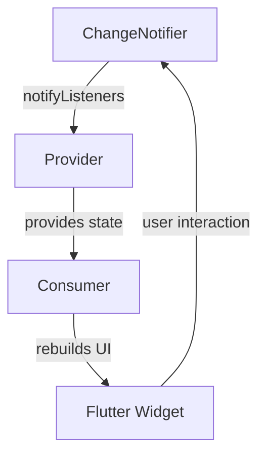

## 6.15 Provider and ChangeNotifier Patterns

State management is a crucial aspect of Flutter development, and understanding how to effectively manage state can significantly enhance the performance and maintainability of your applications. In this section, we will delve into the Provider and ChangeNotifier patterns, which are widely used in Flutter for managing state in a clean and efficient manner. These patterns simplify the process of building reactive UIs and are particularly well-suited for small to medium-sized applications.

### Simplifying State Management in Flutter

The Provider and ChangeNotifier patterns work hand-in-hand to offer a robust solution for state management in Flutter. By combining these patterns, developers can create applications where UI components automatically update in response to changes in the underlying data.

#### Implementing ChangeNotifier

The `ChangeNotifier` class is a part of the Flutter framework that provides a simple way to manage state. It is a special type of `Listenable` that can notify its listeners when a change occurs. This makes it an ideal choice for implementing reactive UIs.

##### Extending ChangeNotifier

To use `ChangeNotifier`, you typically create a class that extends it. This class will contain the state you want to manage and any methods that modify that state. When the state changes, you call `notifyListeners()` to update any UI components that are listening to this state.

```dart
import 'package:flutter/material.dart';

class CounterModel extends ChangeNotifier {
  int _count = 0;

  int get count => _count;

  void increment() {
    _count++;
    notifyListeners(); // Notify listeners about the change
  }
}
```

In this example, `CounterModel` is a simple class that manages an integer count. The `increment` method updates the count and calls `notifyListeners()` to inform any listeners that the state has changed.

##### Using Provider Package

The `provider` package is a popular Flutter package that makes it easy to inject and access `ChangeNotifier` objects throughout your widget tree. It simplifies the process of passing data down the widget tree and listening for changes.

To use the `provider` package, you first need to add it to your `pubspec.yaml` file:

```yaml
dependencies:
  flutter:
    sdk: flutter
  provider: ^6.0.0
```

Then, you can use the `ChangeNotifierProvider` widget to provide an instance of your `ChangeNotifier` to the widget tree:

```dart
import 'package:flutter/material.dart';
import 'package:provider/provider.dart';

void main() {
  runApp(
    ChangeNotifierProvider(
      create: (context) => CounterModel(),
      child: MyApp(),
    ),
  );
}

class MyApp extends StatelessWidget {
  @override
  Widget build(BuildContext context) {
    return MaterialApp(
      home: CounterScreen(),
    );
  }
}

class CounterScreen extends StatelessWidget {
  @override
  Widget build(BuildContext context) {
    return Scaffold(
      appBar: AppBar(title: Text('Counter')),
      body: Center(
        child: Consumer<CounterModel>(
          builder: (context, counter, child) {
            return Text('Count: ${counter.count}');
          },
        ),
      ),
      floatingActionButton: FloatingActionButton(
        onPressed: () => context.read<CounterModel>().increment(),
        child: Icon(Icons.add),
      ),
    );
  }
}
```

In this example, `ChangeNotifierProvider` is used to provide an instance of `CounterModel` to the widget tree. The `Consumer` widget listens for changes to `CounterModel` and rebuilds the `Text` widget whenever the count changes.

### Use Cases and Examples

The Provider and ChangeNotifier patterns are versatile and can be used in a variety of scenarios. Here are some common use cases:

#### Reactive UIs

One of the primary benefits of using the Provider and ChangeNotifier patterns is the ability to create reactive UIs. When the underlying data changes, the UI automatically updates to reflect those changes. This is particularly useful in applications where the state can change frequently, such as in response to user interactions or network requests.

#### Lightweight State Management

The Provider and ChangeNotifier patterns are lightweight and easy to use, making them ideal for small to medium-sized applications. They provide a simple way to manage state without the complexity of more advanced state management solutions.

### Visualizing the Provider and ChangeNotifier Patterns

To better understand how the Provider and ChangeNotifier patterns work together, let's visualize the flow of data and updates in a Flutter application using these patterns.



In this diagram, the `ChangeNotifier` notifies the `Provider` when the state changes. The `Provider` then updates any `Consumer` widgets that are listening for changes, causing them to rebuild the UI. User interactions with the UI can trigger changes in the `ChangeNotifier`, creating a continuous cycle of updates.

### Design Considerations

When using the Provider and ChangeNotifier patterns, there are a few design considerations to keep in mind:

- **Granularity of State**: Consider how granular your state should be. If your application has multiple independent pieces of state, it may be beneficial to use multiple `ChangeNotifier` classes to manage them separately.
- **Performance**: Be mindful of performance when using `notifyListeners()`. If your state changes frequently, it may cause excessive rebuilds of the UI. Consider using more advanced state management techniques if performance becomes an issue.
- **Testing**: The Provider and ChangeNotifier patterns make it easy to test your state management logic. You can create unit tests for your `ChangeNotifier` classes to ensure they behave as expected.

### Differences and Similarities

The Provider and ChangeNotifier patterns are often compared to other state management solutions in Flutter, such as BLoC and Redux. Here are some key differences and similarities:

- **Complexity**: Provider and ChangeNotifier are simpler and easier to use than BLoC and Redux, making them a good choice for smaller applications.
- **Reactivity**: All of these patterns support reactive programming, allowing the UI to automatically update in response to changes in the state.
- **Scalability**: BLoC and Redux are more scalable and suitable for larger applications with complex state management needs.

### Try It Yourself

To get a better understanding of how the Provider and ChangeNotifier patterns work, try modifying the code examples provided in this section. Here are some suggestions:

- **Add a Decrement Button**: Modify the `CounterModel` class to include a `decrement` method and add a button to the UI that calls this method.
- **Multiple Counters**: Create a new `ChangeNotifier` class that manages multiple counters and update the UI to display and control each counter individually.
- **Persisting State**: Implement a way to persist the state of the counters across app restarts, such as by using shared preferences or a local database.

### Knowledge Check

Before moving on to the next section, take a moment to review what you've learned about the Provider and ChangeNotifier patterns. Consider the following questions:

- How do the Provider and ChangeNotifier patterns simplify state management in Flutter?
- What are some common use cases for these patterns?
- How do these patterns compare to other state management solutions in Flutter?

### Embrace the Journey

Remember, mastering state management in Flutter is a journey. As you continue to build more complex applications, you'll gain a deeper understanding of how to effectively manage state using the Provider and ChangeNotifier patterns. Keep experimenting, stay curious, and enjoy the process!

## Quiz Time!



### What is the primary purpose of the ChangeNotifier class in Flutter?

- [x] To notify listeners of state changes
- [ ] To manage network requests
- [ ] To handle user input
- [ ] To render UI components

> **Explanation:** The ChangeNotifier class is used to notify listeners when the state changes, allowing the UI to update accordingly.

### How does the Provider package simplify state management in Flutter?

- [x] By injecting and accessing ChangeNotifier objects throughout the widget tree
- [ ] By managing network requests
- [ ] By handling animations
- [ ] By rendering UI components

> **Explanation:** The Provider package simplifies state management by making it easy to inject and access ChangeNotifier objects throughout the widget tree.

### What method do you call to notify listeners of a state change in a ChangeNotifier?

- [x] notifyListeners()
- [ ] setState()
- [ ] updateState()
- [ ] refreshUI()

> **Explanation:** The notifyListeners() method is called to notify listeners of a state change in a ChangeNotifier.

### Which widget is used to provide an instance of a ChangeNotifier to the widget tree?

- [x] ChangeNotifierProvider
- [ ] Consumer
- [ ] StreamBuilder
- [ ] FutureBuilder

> **Explanation:** The ChangeNotifierProvider widget is used to provide an instance of a ChangeNotifier to the widget tree.

### What is a common use case for the Provider and ChangeNotifier patterns?

- [x] Reactive UIs
- [ ] Network requests
- [ ] Animation handling
- [ ] Database management

> **Explanation:** A common use case for the Provider and ChangeNotifier patterns is creating reactive UIs that automatically update in response to state changes.

### How can you access a ChangeNotifier object in a widget?

- [x] Using the context.read<T>() method
- [ ] Using the setState() method
- [ ] Using the initState() method
- [ ] Using the build() method

> **Explanation:** You can access a ChangeNotifier object in a widget using the context.read<T>() method.

### What is a potential performance consideration when using notifyListeners()?

- [x] Excessive rebuilds of the UI
- [ ] Slow network requests
- [ ] Large image assets
- [ ] Complex animations

> **Explanation:** A potential performance consideration when using notifyListeners() is that it may cause excessive rebuilds of the UI if the state changes frequently.

### Which of the following is a benefit of using the Provider and ChangeNotifier patterns?

- [x] Lightweight state management
- [ ] Complex state management
- [ ] Advanced animation handling
- [ ] Network request optimization

> **Explanation:** The Provider and ChangeNotifier patterns offer lightweight state management, making them ideal for small to medium-sized applications.

### How do the Provider and ChangeNotifier patterns compare to BLoC and Redux?

- [x] They are simpler and easier to use
- [ ] They are more complex and scalable
- [ ] They are better for handling animations
- [ ] They are optimized for network requests

> **Explanation:** The Provider and ChangeNotifier patterns are simpler and easier to use compared to BLoC and Redux, making them a good choice for smaller applications.

### True or False: The Provider and ChangeNotifier patterns are suitable for large applications with complex state management needs.

- [ ] True
- [x] False

> **Explanation:** The Provider and ChangeNotifier patterns are more suitable for small to medium-sized applications. For larger applications with complex state management needs, more advanced solutions like BLoC or Redux may be more appropriate.


