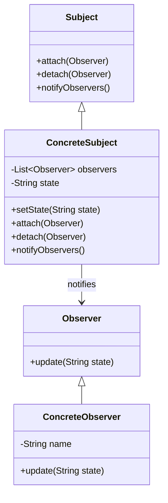

## 6.2 Observer Design Pattern

The Observer Design Pattern is a fundamental behavioral design pattern that establishes a one-to-many dependency between objects. When the state of one object changes, all its dependents are automatically notified and updated. This pattern is particularly useful in scenarios where a change in one object requires changes in others, such as in event handling systems and data binding in Flutter applications.

### Intent

The primary intent of the Observer Design Pattern is to define a subscription mechanism to allow multiple objects to listen and react to events or changes in another object. This pattern promotes loose coupling between the subject and its observers, enabling a flexible and dynamic interaction model.

### Key Participants

- **Subject**: The object that holds the state and notifies observers of changes. It maintains a list of observers and provides methods to attach and detach them.
- **Observer**: The object that needs to be notified of changes in the subject. It defines an updating interface for receiving notifications.
- **Concrete Subject**: A specific implementation of the subject that stores state and sends notifications to observers.
- **Concrete Observer**: A specific implementation of the observer that reacts to changes in the subject.

### Applicability

Use the Observer Design Pattern when:

- You have a one-to-many dependency between objects.
- Changes in one object require updates to others without tightly coupling them.
- You need to implement event handling systems or data binding mechanisms.

### Implementing Observer in Dart

In Dart, the Observer Design Pattern can be effectively implemented using interfaces and Dart's built-in Streams for event notification. Let's explore how to implement this pattern step-by-step.

#### Subject Interface

The Subject interface defines methods for attaching and detaching observers. It also includes a method for notifying observers of changes.

```dart
abstract class Subject {
  void attach(Observer observer);
  void detach(Observer observer);
  void notifyObservers();
}
```

#### Observer Interface

The Observer interface defines an updating interface for objects that should be notified of changes.

```dart
abstract class Observer {
  void update(String state);
}
```

#### Concrete Subject

The Concrete Subject maintains a list of observers and notifies them of any state changes.

```dart
class ConcreteSubject implements Subject {
  List<Observer> _observers = [];
  String _state;

  void setState(String state) {
    _state = state;
    notifyObservers();
  }

  @override
  void attach(Observer observer) {
    _observers.add(observer);
  }

  @override
  void detach(Observer observer) {
    _observers.remove(observer);
  }

  @override
  void notifyObservers() {
    for (var observer in _observers) {
      observer.update(_state);
    }
  }
}
```

#### Concrete Observer

The Concrete Observer implements the Observer interface and reacts to changes in the subject.

```dart
class ConcreteObserver implements Observer {
  final String _name;

  ConcreteObserver(this._name);

  @override
  void update(String state) {
    print('Observer $_name: State changed to $state');
  }
}
```

#### Using Streams

Dart's Streams provide a powerful mechanism for implementing the Observer pattern. Streams allow you to listen to asynchronous events and react to them.

```dart
class StreamSubject {
  final _controller = StreamController<String>();

  Stream<String> get stream => _controller.stream;

  void setState(String state) {
    _controller.add(state);
  }

  void dispose() {
    _controller.close();
  }
}

void main() {
  final subject = StreamSubject();

  final subscription1 = subject.stream.listen((state) {
    print('Observer 1: State changed to $state');
  });

  final subscription2 = subject.stream.listen((state) {
    print('Observer 2: State changed to $state');
  });

  subject.setState('State 1');
  subject.setState('State 2');

  subscription1.cancel();
  subscription2.cancel();
  subject.dispose();
}
```

### Diagrams

To better understand the Observer Design Pattern, let's visualize the interaction between the subject and observers using a class diagram.



### Use Cases and Examples

#### Event Handling Systems

In event handling systems, the Observer pattern is used to notify UI components of user actions. For example, when a button is clicked, all registered listeners are notified to perform specific actions.

#### Data Binding in Flutter

In Flutter, the Observer pattern is used for data binding, where changes in data models automatically update the UI. This is achieved using state management solutions like Provider, BLoC, and Riverpod, which leverage the Observer pattern to keep the UI in sync with the underlying data.

### Design Considerations

When implementing the Observer Design Pattern, consider the following:

- **Performance**: Notifying a large number of observers can impact performance. Use efficient data structures and algorithms to manage observers.
- **Memory Management**: Ensure that observers are properly detached to prevent memory leaks.
- **Concurrency**: When using Streams, be mindful of concurrency issues and ensure that the stream is properly managed.

### Differences and Similarities

The Observer Design Pattern is often confused with the Publish-Subscribe pattern. While both involve notifying multiple subscribers, the Observer pattern is more tightly coupled, with observers directly dependent on the subject. In contrast, the Publish-Subscribe pattern decouples publishers and subscribers using a message broker.

### Try It Yourself

To deepen your understanding of the Observer Design Pattern, try modifying the code examples:

- Add more observers and experiment with different state changes.
- Implement a custom StreamTransformer to modify the data before notifying observers.
- Use the Observer pattern in a Flutter application to update the UI based on user interactions.

### Knowledge Check

- What is the primary intent of the Observer Design Pattern?
- How does the Observer pattern promote loose coupling between objects?
- What are the key differences between the Observer and Publish-Subscribe patterns?

### Summary

The Observer Design Pattern is a powerful tool for establishing a one-to-many dependency between objects. By leveraging Dart's Streams, you can implement this pattern efficiently in your applications. Whether you're building event handling systems or data binding mechanisms in Flutter, the Observer pattern provides a flexible and dynamic way to manage changes and notifications.

Remember, mastering design patterns is a journey. As you continue to explore and experiment with different patterns, you'll gain a deeper understanding of how to build scalable and maintainable applications. Keep experimenting, stay curious, and enjoy the journey!

## Quiz Time!



### What is the primary intent of the Observer Design Pattern?

- [x] To define a subscription mechanism for multiple objects to listen and react to events or changes in another object.
- [ ] To establish a one-to-one dependency between objects.
- [ ] To decouple publishers and subscribers using a message broker.
- [ ] To manage memory efficiently in Dart applications.

> **Explanation:** The Observer Design Pattern's primary intent is to define a subscription mechanism for multiple objects to listen and react to events or changes in another object.

### How does the Observer pattern promote loose coupling between objects?

- [x] By allowing observers to be notified without knowing the details of the subject.
- [ ] By tightly coupling observers with the subject.
- [ ] By using a message broker to decouple publishers and subscribers.
- [ ] By managing memory efficiently in Dart applications.

> **Explanation:** The Observer pattern promotes loose coupling by allowing observers to be notified without knowing the details of the subject, enabling a flexible interaction model.

### What is a key difference between the Observer and Publish-Subscribe patterns?

- [x] The Observer pattern is more tightly coupled, with observers directly dependent on the subject.
- [ ] The Publish-Subscribe pattern is more tightly coupled, with subscribers directly dependent on the publisher.
- [ ] The Observer pattern uses a message broker to decouple publishers and subscribers.
- [ ] The Publish-Subscribe pattern is used for data binding in Flutter.

> **Explanation:** The Observer pattern is more tightly coupled, with observers directly dependent on the subject, whereas the Publish-Subscribe pattern decouples publishers and subscribers using a message broker.

### Which Dart feature is commonly used to implement the Observer pattern?

- [x] Streams
- [ ] Futures
- [ ] Isolates
- [ ] Mixins

> **Explanation:** Dart's Streams are commonly used to implement the Observer pattern, providing a mechanism for event notification.

### What should be considered when implementing the Observer Design Pattern?

- [x] Performance, memory management, and concurrency.
- [ ] Only performance.
- [ ] Only memory management.
- [ ] Only concurrency.

> **Explanation:** When implementing the Observer Design Pattern, consider performance, memory management, and concurrency to ensure efficient and reliable operation.

### In Flutter, what is a common use case for the Observer pattern?

- [x] Data binding to update the UI when data models change.
- [ ] Managing memory efficiently.
- [ ] Decoupling publishers and subscribers.
- [ ] Using a message broker for event notification.

> **Explanation:** In Flutter, a common use case for the Observer pattern is data binding, where changes in data models automatically update the UI.

### What is a potential pitfall when using the Observer pattern?

- [x] Memory leaks due to not properly detaching observers.
- [ ] Tightly coupling observers with the subject.
- [ ] Using a message broker to decouple publishers and subscribers.
- [ ] Inefficient use of Dart's Streams.

> **Explanation:** A potential pitfall when using the Observer pattern is memory leaks due to not properly detaching observers, which can lead to resource mismanagement.

### How can you experiment with the Observer pattern in Dart?

- [x] By adding more observers and experimenting with different state changes.
- [ ] By using a message broker to decouple publishers and subscribers.
- [ ] By managing memory efficiently in Dart applications.
- [ ] By tightly coupling observers with the subject.

> **Explanation:** You can experiment with the Observer pattern in Dart by adding more observers and experimenting with different state changes to understand its behavior.

### What is the role of the Concrete Subject in the Observer pattern?

- [x] To maintain a list of observers and notify them of any state changes.
- [ ] To define an updating interface for objects that should be notified.
- [ ] To decouple publishers and subscribers using a message broker.
- [ ] To manage memory efficiently in Dart applications.

> **Explanation:** The Concrete Subject maintains a list of observers and notifies them of any state changes, playing a central role in the Observer pattern.

### True or False: The Observer pattern is only applicable in Dart applications.

- [ ] True
- [x] False

> **Explanation:** False. The Observer pattern is a general design pattern applicable in various programming languages and contexts, not just Dart applications.


