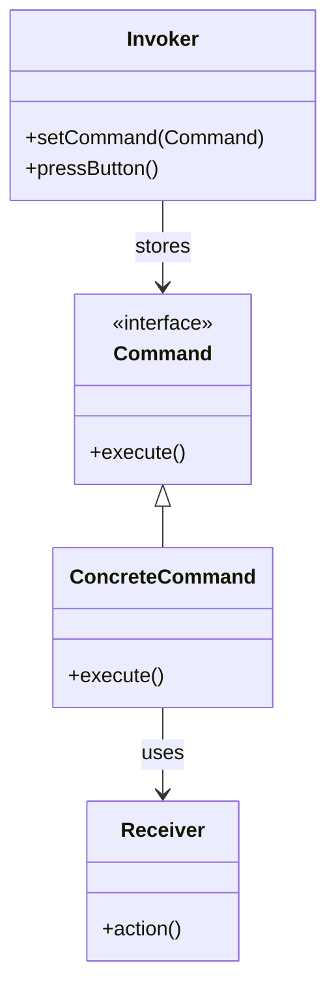

## 6.3 Command Design Pattern

In the realm of software design, the Command Design Pattern stands out as a powerful tool for encapsulating requests as objects. This pattern is particularly useful in scenarios where you need to parameterize, queue, or support undoable operations. In this section, we will delve into the intricacies of the Command Design Pattern, explore its implementation in Dart, and examine practical use cases such as undo/redo functionality and macro recording.

### Intent of the Command Design Pattern

The primary intent of the Command Design Pattern is to encapsulate a request as an object, thereby allowing you to parameterize clients with queues, requests, and operations. This encapsulation provides several benefits:

- **Decoupling the Invoker from the Receiver**: The pattern separates the object that invokes the operation from the one that knows how to perform it.
- **Enabling Undo/Redo Functionality**: By storing commands, you can easily reverse actions.
- **Supporting Macro Recording**: Commands can be recorded and replayed, enabling complex sequences of operations to be executed as a single action.
- **Facilitating Logging and Transactional Systems**: Commands can be logged for auditing purposes or used to implement transactional behavior.

### Key Participants in the Command Pattern

Before we dive into the implementation, let's outline the key participants in the Command Design Pattern:

1. **Command Interface**: Declares a method for executing a command.
2. **Concrete Command**: Implements the command interface and defines the binding between the action and the receiver.
3. **Invoker**: Asks the command to carry out the request.
4. **Receiver**: Knows how to perform the operations associated with carrying out a request.
5. **Client**: Creates a command and sets its receiver.

### Implementing Command in Dart

Let's explore how to implement the Command Design Pattern in Dart. We'll start by defining the command interface, followed by concrete commands, the invoker, and the receiver.

#### Command Interface

The command interface declares a method for executing a command. In Dart, we can define this interface using an abstract class:

```dart
abstract class Command {
  void execute();
}
```

#### Concrete Commands

Concrete commands implement the command interface and define the binding between the action and the receiver. Here's an example of a concrete command that turns on a light:

```dart
class Light {
  void turnOn() {
    print('The light is on');
  }

  void turnOff() {
    print('The light is off');
  }
}

class TurnOnLightCommand implements Command {
  final Light _light;

  TurnOnLightCommand(this._light);

  @override
  void execute() {
    _light.turnOn();
  }
}

class TurnOffLightCommand implements Command {
  final Light _light;

  TurnOffLightCommand(this._light);

  @override
  void execute() {
    _light.turnOff();
  }
}
```

In this example, `TurnOnLightCommand` and `TurnOffLightCommand` are concrete commands that encapsulate the actions of turning a light on and off, respectively.

#### Invoker

The invoker is responsible for executing the command. It stores the command and invokes its `execute` method:

```dart
class RemoteControl {
  Command? _command;

  void setCommand(Command command) {
    _command = command;
  }

  void pressButton() {
    _command?.execute();
  }
}
```

The `RemoteControl` class acts as the invoker, storing a command and executing it when the button is pressed.

#### Receiver

The receiver is the object that knows how to perform the operations associated with carrying out a request. In our example, the `Light` class is the receiver.

### Use Cases and Examples

The Command Design Pattern is versatile and can be applied to various scenarios. Let's explore some common use cases and examples.

#### Undo/Redo Functionality

One of the most powerful applications of the Command Design Pattern is implementing undo/redo functionality. By storing executed commands in a stack, you can easily reverse actions.

```dart
class CommandHistory {
  final List<Command> _history = [];

  void push(Command command) {
    _history.add(command);
  }

  Command? pop() {
    return _history.isNotEmpty ? _history.removeLast() : null;
  }
}

class UndoableRemoteControl extends RemoteControl {
  final CommandHistory _history = CommandHistory();

  @override
  void pressButton() {
    super.pressButton();
    if (_command != null) {
      _history.push(_command!);
    }
  }

  void undo() {
    final command = _history.pop();
    if (command != null) {
      // Assuming each command has an undo method
      command.undo();
    }
  }
}
```

In this example, `UndoableRemoteControl` extends `RemoteControl` to add undo functionality. The `CommandHistory` class manages the history of executed commands.

#### Macro Recording

Macro recording involves recording a sequence of commands and executing them as a single action. This can be useful in scenarios where repetitive tasks need to be automated.

```dart
class MacroCommand implements Command {
  final List<Command> _commands = [];

  void addCommand(Command command) {
    _commands.add(command);
  }

  @override
  void execute() {
    for (var command in _commands) {
      command.execute();
    }
  }
}
```

The `MacroCommand` class allows you to add multiple commands and execute them in sequence.

### Visualizing the Command Pattern

To better understand the Command Design Pattern, let's visualize the relationships between its components using a class diagram.



**Diagram Description**: This class diagram illustrates the relationships between the command interface, concrete commands, the invoker, and the receiver. The invoker stores a command and executes it, while the concrete command uses the receiver to perform the action.

### Design Considerations

When implementing the Command Design Pattern in Dart, consider the following:

- **Command Granularity**: Determine the level of granularity for commands. Fine-grained commands provide more flexibility but may increase complexity.
- **Undo/Redo Complexity**: Implementing undo/redo functionality requires careful management of command history and state.
- **Macro Command Efficiency**: Ensure that macro commands are efficient and do not introduce unnecessary overhead.
- **Dart-Specific Features**: Leverage Dart's language features, such as closures and first-class functions, to simplify command implementations.

### Differences and Similarities

The Command Design Pattern is often compared to other behavioral patterns, such as the Strategy and Observer patterns. Here are some key differences and similarities:

- **Command vs. Strategy**: Both patterns encapsulate behavior, but the Command pattern focuses on encapsulating requests, while the Strategy pattern encapsulates algorithms.
- **Command vs. Observer**: The Observer pattern is used for notifying multiple objects about state changes, whereas the Command pattern is used for encapsulating requests and actions.

### Try It Yourself

To deepen your understanding of the Command Design Pattern, try modifying the code examples provided. Here are some suggestions:

- **Add Undo Functionality**: Implement an `undo` method for each concrete command and modify the `UndoableRemoteControl` to support undo operations.
- **Create a Macro Command**: Record a sequence of commands and execute them as a macro.
- **Experiment with Different Receivers**: Implement commands for different receivers, such as a TV or a fan, and test the invoker with these commands.

### References and Links

For further reading on the Command Design Pattern and its applications, consider the following resources:

- [Design Patterns: Elements of Reusable Object-Oriented Software](https://en.wikipedia.org/wiki/Design_Patterns) by Erich Gamma, Richard Helm, Ralph Johnson, and John Vlissides.
- [Dart Language Tour](https://dart.dev/guides/language/language-tour) for an overview of Dart's language features.
- [Flutter Documentation](https://flutter.dev/docs) for insights into building applications with Flutter.

### Knowledge Check

Before we conclude, let's review some key takeaways from this section:

- The Command Design Pattern encapsulates requests as objects, enabling parameterization, queuing, and undoable operations.
- Key participants include the command interface, concrete commands, the invoker, and the receiver.
- Use cases include undo/redo functionality and macro recording.
- Consider command granularity, undo/redo complexity, and Dart-specific features when implementing the pattern.

### Embrace the Journey

Remember, mastering design patterns is a journey. As you continue to explore and implement the Command Design Pattern in your Dart and Flutter applications, you'll gain a deeper understanding of its power and versatility. Keep experimenting, stay curious, and enjoy the process of building robust and flexible software solutions.

## Quiz Time!



### What is the primary intent of the Command Design Pattern?

- [x] To encapsulate a request as an object
- [ ] To define a family of algorithms
- [ ] To notify multiple objects about state changes
- [ ] To provide a way to access the elements of an aggregate object

> **Explanation:** The Command Design Pattern encapsulates a request as an object, allowing for parameterization, queuing, and undoable operations.

### Which component in the Command Design Pattern is responsible for executing the command?

- [ ] Command Interface
- [ ] Concrete Command
- [x] Invoker
- [ ] Receiver

> **Explanation:** The Invoker is responsible for executing the command by calling its `execute` method.

### What is a common use case for the Command Design Pattern?

- [ ] Implementing a factory method
- [x] Undo/Redo functionality
- [ ] Observing state changes
- [ ] Defining a family of algorithms

> **Explanation:** The Command Design Pattern is commonly used to implement undo/redo functionality by storing executed commands.

### In the Command Design Pattern, what role does the Receiver play?

- [ ] It defines the command interface
- [ ] It stores and executes commands
- [x] It performs the actual work when a command is executed
- [ ] It creates commands and sets their receivers

> **Explanation:** The Receiver performs the actual work when a command is executed, as it knows how to carry out the request.

### How can macro recording be achieved using the Command Design Pattern?

- [ ] By using the Strategy pattern
- [x] By recording and replaying sequences of commands
- [ ] By notifying multiple objects about state changes
- [ ] By defining a family of algorithms

> **Explanation:** Macro recording can be achieved by recording and replaying sequences of commands, allowing complex operations to be executed as a single action.

### What is a key difference between the Command and Strategy patterns?

- [x] Command encapsulates requests, while Strategy encapsulates algorithms
- [ ] Command notifies multiple objects, while Strategy defines a family of algorithms
- [ ] Command is used for undo functionality, while Strategy is used for macro recording
- [ ] Command is a structural pattern, while Strategy is a creational pattern

> **Explanation:** The Command pattern encapsulates requests as objects, while the Strategy pattern encapsulates algorithms.

### Which Dart feature can simplify command implementations?

- [ ] Inheritance
- [x] Closures and first-class functions
- [ ] Mixins
- [ ] Generics

> **Explanation:** Dart's closures and first-class functions can simplify command implementations by allowing functions to be treated as objects.

### What should be considered when implementing undo/redo functionality?

- [ ] Command granularity
- [x] Command history management
- [ ] Macro command efficiency
- [ ] Receiver complexity

> **Explanation:** Implementing undo/redo functionality requires careful management of command history and state.

### Which of the following is NOT a participant in the Command Design Pattern?

- [ ] Command Interface
- [ ] Concrete Command
- [ ] Invoker
- [x] Observer

> **Explanation:** The Observer is not a participant in the Command Design Pattern. The pattern involves the Command Interface, Concrete Command, Invoker, and Receiver.

### True or False: The Command Design Pattern can be used to implement transactional behavior.

- [x] True
- [ ] False

> **Explanation:** True. The Command Design Pattern can be used to implement transactional behavior by encapsulating requests and managing their execution.


