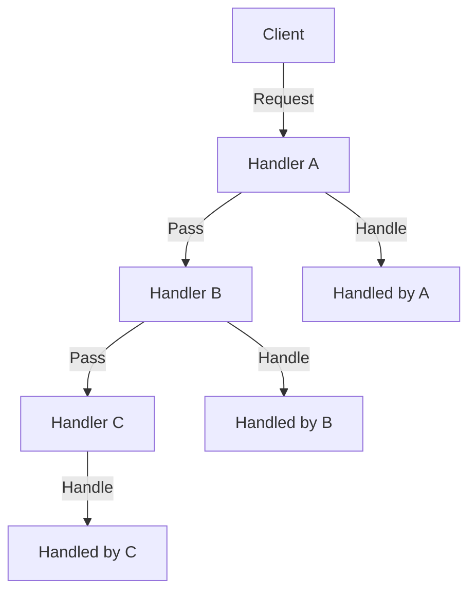

## 6.4 Chain of Responsibility Design Pattern

The Chain of Responsibility (CoR) design pattern is a behavioral pattern that allows a request to be passed along a chain of handlers. Each handler in the chain can either process the request or pass it to the next handler. This pattern is particularly useful in scenarios where multiple objects might handle a request, but the handler is not known beforehand. It promotes loose coupling between sender and receiver by giving more than one object a chance to handle the request.

### Intent

The primary intent of the Chain of Responsibility pattern is to decouple the sender of a request from its receiver by allowing multiple objects to handle the request. The pattern creates a chain of receiver objects for a request, allowing the request to be passed along the chain until it is handled.

### Key Participants

- **Handler Interface**: Defines a method for handling requests. It also defines a method for setting the next handler in the chain.
- **Concrete Handlers**: Implement the handler interface and decide whether to process or pass the request. Each handler can either handle the request or forward it to the next handler in the chain.
- **Client**: Initiates the request and sends it to the first handler in the chain.

### Implementing Chain of Responsibility in Dart

Let's explore how to implement the Chain of Responsibility pattern in Dart. We'll start by defining a handler interface, followed by concrete handlers, and finally linking these handlers to form a chain.

#### Handler Interface

The handler interface defines a method for handling requests and a method for setting the next handler in the chain.

```dart
abstract class Handler {
  Handler? nextHandler;

  void setNextHandler(Handler handler) {
    nextHandler = handler;
  }

  void handleRequest(String request);
}
```

#### Concrete Handlers

Concrete handlers implement the handler interface and decide whether to process or pass the request.

```dart
class ConcreteHandlerA extends Handler {
  @override
  void handleRequest(String request) {
    if (request == 'A') {
      print('ConcreteHandlerA handled the request.');
    } else if (nextHandler != null) {
      nextHandler!.handleRequest(request);
    }
  }
}

class ConcreteHandlerB extends Handler {
  @override
  void handleRequest(String request) {
    if (request == 'B') {
      print('ConcreteHandlerB handled the request.');
    } else if (nextHandler != null) {
      nextHandler!.handleRequest(request);
    }
  }
}
```

#### Linking Handlers

Handlers are linked to form a chain. The client sends a request to the first handler in the chain.

```dart
void main() {
  // Create handlers
  Handler handlerA = ConcreteHandlerA();
  Handler handlerB = ConcreteHandlerB();

  // Link handlers
  handlerA.setNextHandler(handlerB);

  // Send requests
  handlerA.handleRequest('A');
  handlerA.handleRequest('B');
  handlerA.handleRequest('C');
}
```

In this example, `ConcreteHandlerA` handles requests of type 'A', and `ConcreteHandlerB` handles requests of type 'B'. If a request is not handled by a handler, it is passed to the next handler in the chain. If no handler can process the request, it is simply ignored.

### Use Cases and Examples

The Chain of Responsibility pattern is widely used in various scenarios. Let's explore some common use cases and examples.

#### Logging Systems

In logging systems, different loggers handle messages of varying severity. For instance, a logger might handle error messages, while another handles warning messages. The Chain of Responsibility pattern allows these loggers to be linked, so a message can be passed along the chain until it is handled by the appropriate logger.

```dart
class Logger {
  static const int INFO = 1;
  static const int DEBUG = 2;
  static const int ERROR = 3;

  int level;
  Logger? nextLogger;

  Logger(this.level);

  void setNextLogger(Logger nextLogger) {
    this.nextLogger = nextLogger;
  }

  void logMessage(int level, String message) {
    if (this.level <= level) {
      write(message);
    }
    if (nextLogger != null) {
      nextLogger!.logMessage(level, message);
    }
  }

  void write(String message);
}

class ConsoleLogger extends Logger {
  ConsoleLogger(int level) : super(level);

  @override
  void write(String message) {
    print('Standard Console::Logger: $message');
  }
}

class ErrorLogger extends Logger {
  ErrorLogger(int level) : super(level);

  @override
  void write(String message) {
    print('Error Console::Logger: $message');
  }
}

void main() {
  Logger errorLogger = ErrorLogger(Logger.ERROR);
  Logger consoleLogger = ConsoleLogger(Logger.INFO);

  errorLogger.setNextLogger(consoleLogger);

  errorLogger.logMessage(Logger.INFO, 'This is an information.');
  errorLogger.logMessage(Logger.ERROR, 'This is an error message.');
}
```

In this example, the `ErrorLogger` handles error messages, while the `ConsoleLogger` handles informational messages. The log message is passed along the chain until it is handled by the appropriate logger.

#### Event Bubbling in UI

In user interfaces, events often propagate through the widget tree. The Chain of Responsibility pattern can be used to implement event bubbling, where an event is passed along the widget tree until it is handled by a widget.

```dart
abstract class Widget {
  Widget? parent;

  void handleEvent(String event) {
    if (parent != null) {
      parent!.handleEvent(event);
    }
  }
}

class Button extends Widget {
  @override
  void handleEvent(String event) {
    if (event == 'click') {
      print('Button handled the click event.');
    } else {
      super.handleEvent(event);
    }
  }
}

class Panel extends Widget {
  @override
  void handleEvent(String event) {
    if (event == 'hover') {
      print('Panel handled the hover event.');
    } else {
      super.handleEvent(event);
    }
  }
}

void main() {
  Panel panel = Panel();
  Button button = Button();
  button.parent = panel;

  button.handleEvent('click');
  button.handleEvent('hover');
}
```

In this example, the `Button` widget handles click events, while the `Panel` widget handles hover events. The event is passed along the widget tree until it is handled by the appropriate widget.

### Visualizing the Chain of Responsibility

To better understand the flow of requests in the Chain of Responsibility pattern, let's visualize it using a Mermaid.js diagram.



This diagram illustrates how a request is passed along a chain of handlers. Each handler can either handle the request or pass it to the next handler in the chain.

### Design Considerations

When implementing the Chain of Responsibility pattern, consider the following:

- **Order of Handlers**: The order in which handlers are linked can affect the behavior of the chain. Ensure that handlers are linked in the correct order to achieve the desired behavior.
- **Termination Condition**: Ensure that there is a termination condition for the chain. If no handler can process a request, it should be handled gracefully.
- **Performance**: Passing a request along a long chain of handlers can impact performance. Consider optimizing the chain to minimize the number of handlers.

### Differences and Similarities

The Chain of Responsibility pattern is often compared to other behavioral patterns, such as the Command and Observer patterns. Here are some key differences and similarities:

- **Command Pattern**: The Command pattern encapsulates a request as an object, allowing it to be parameterized and queued. Unlike the Chain of Responsibility pattern, the Command pattern does not pass requests along a chain of handlers.
- **Observer Pattern**: The Observer pattern defines a one-to-many dependency between objects, where a change in one object triggers updates to its dependents. The Chain of Responsibility pattern, on the other hand, passes a request along a chain of handlers until it is handled.

### Try It Yourself

Experiment with the Chain of Responsibility pattern by modifying the code examples provided. Here are some suggestions:

- **Add More Handlers**: Add additional handlers to the chain and observe how requests are passed along the chain.
- **Change the Order of Handlers**: Change the order in which handlers are linked and observe how it affects the behavior of the chain.
- **Implement a New Use Case**: Implement a new use case for the Chain of Responsibility pattern, such as a form validation system or a command processing system.

### Knowledge Check

Before we conclude, let's reinforce what we've learned with some questions and challenges:

- **Question**: What is the primary intent of the Chain of Responsibility pattern?
- **Challenge**: Implement a Chain of Responsibility pattern for a form validation system, where each handler validates a different field in the form.

### Embrace the Journey

Remember, mastering design patterns is a journey. As you progress, you'll build more complex and interactive applications. Keep experimenting, stay curious, and enjoy the journey!

## Quiz Time!



### What is the primary intent of the Chain of Responsibility pattern?

- [x] To decouple the sender of a request from its receiver by allowing multiple objects to handle the request.
- [ ] To encapsulate a request as an object, allowing it to be parameterized and queued.
- [ ] To define a one-to-many dependency between objects, where a change in one object triggers updates to its dependents.
- [ ] To create a chain of receiver objects for a request, allowing the request to be passed along the chain until it is handled.

> **Explanation:** The primary intent of the Chain of Responsibility pattern is to decouple the sender of a request from its receiver by allowing multiple objects to handle the request.

### Which of the following is a key participant in the Chain of Responsibility pattern?

- [x] Handler Interface
- [ ] Command Interface
- [ ] Observer Interface
- [ ] Subject Interface

> **Explanation:** The Handler Interface is a key participant in the Chain of Responsibility pattern, defining a method for handling requests.

### In a logging system, which logger handles informational messages?

- [ ] ErrorLogger
- [x] ConsoleLogger
- [ ] FileLogger
- [ ] NetworkLogger

> **Explanation:** In the provided example, the ConsoleLogger handles informational messages.

### What is the role of the client in the Chain of Responsibility pattern?

- [x] To initiate the request and send it to the first handler in the chain.
- [ ] To handle the request directly.
- [ ] To encapsulate the request as an object.
- [ ] To define a one-to-many dependency between objects.

> **Explanation:** The client initiates the request and sends it to the first handler in the chain.

### Which pattern is often compared to the Chain of Responsibility pattern?

- [x] Command Pattern
- [ ] Singleton Pattern
- [ ] Factory Pattern
- [x] Observer Pattern

> **Explanation:** The Chain of Responsibility pattern is often compared to the Command and Observer patterns.

### What should be considered when implementing the Chain of Responsibility pattern?

- [x] Order of Handlers
- [x] Termination Condition
- [ ] Singleton Instance
- [x] Performance

> **Explanation:** When implementing the Chain of Responsibility pattern, consider the order of handlers, termination condition, and performance.

### How can the Chain of Responsibility pattern be used in UI development?

- [x] To implement event bubbling, where an event is passed along the widget tree until it is handled by a widget.
- [ ] To encapsulate UI components as objects.
- [ ] To define a one-to-many dependency between UI components.
- [ ] To create a chain of UI components for a request.

> **Explanation:** The Chain of Responsibility pattern can be used to implement event bubbling in UI development.

### What happens if no handler can process a request in the Chain of Responsibility pattern?

- [x] The request is ignored.
- [ ] The request is encapsulated as an object.
- [ ] The request is sent back to the client.
- [ ] The request triggers updates to its dependents.

> **Explanation:** If no handler can process a request, it is simply ignored.

### Which of the following is a concrete handler in the provided example?

- [x] ConcreteHandlerA
- [ ] Handler Interface
- [ ] Client
- [ ] Observer

> **Explanation:** ConcreteHandlerA is a concrete handler in the provided example.

### True or False: The Chain of Responsibility pattern promotes loose coupling between sender and receiver.

- [x] True
- [ ] False

> **Explanation:** True. The Chain of Responsibility pattern promotes loose coupling between sender and receiver by allowing multiple objects to handle the request.


