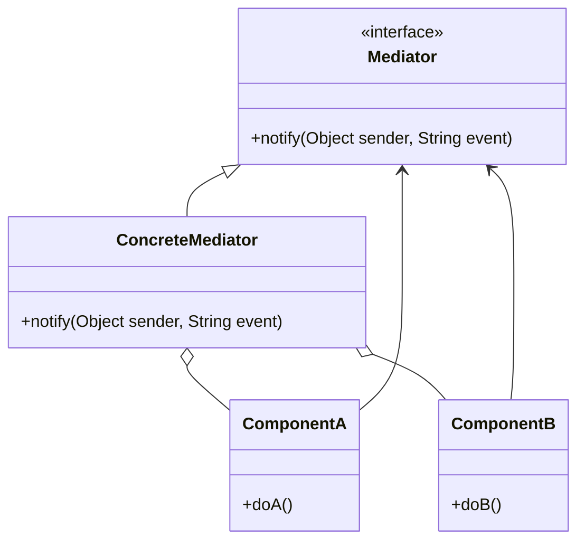

## 6.5 Mediator Design Pattern

In the realm of software design, the **Mediator Design Pattern** stands out as a pivotal tool for managing complex interactions between objects. By encapsulating how objects interact, the Mediator Pattern promotes loose coupling, thereby enhancing the maintainability and scalability of your code. In this section, we will delve deep into the Mediator Pattern, exploring its implementation in Dart and Flutter, and examining its practical applications through comprehensive examples.

### Understanding the Mediator Design Pattern

The Mediator Pattern defines an object that encapsulates how a set of objects interact. This pattern is particularly useful in scenarios where multiple objects need to communicate with each other, but direct communication would lead to a tangled web of dependencies. By introducing a mediator, we can centralize communication, allowing objects to interact indirectly through the mediator.

#### Key Concepts

- **Loose Coupling**: The Mediator Pattern reduces dependencies between communicating objects, promoting a more modular and flexible architecture.
- **Centralized Control**: The mediator acts as a central hub for communication, managing the interactions between objects.
- **Simplified Object Interactions**: Objects no longer need to be aware of each other, simplifying their interactions and responsibilities.

### Implementing the Mediator Pattern in Dart

To implement the Mediator Pattern in Dart, we need to define a few key components:

1. **Mediator Interface**: This interface declares the methods used by components to communicate with the mediator.
2. **Concrete Mediator**: This class implements the mediator interface and coordinates communication between components.
3. **Colleague Classes**: These are the components that communicate via the mediator.

#### Mediator Interface

The mediator interface defines the contract for communication. It typically includes methods for sending and receiving messages or events.

```dart
abstract class Mediator {
  void notify(Object sender, String event);
}
```

#### Concrete Mediator

The concrete mediator implements the mediator interface and contains the logic for coordinating communication between colleague classes.

```dart
class ConcreteMediator implements Mediator {
  late ComponentA componentA;
  late ComponentB componentB;

  @override
  void notify(Object sender, String event) {
    if (event == 'A') {
      print('Mediator reacts on A and triggers B');
      componentB.doB();
    }
    if (event == 'B') {
      print('Mediator reacts on B and triggers A');
      componentA.doA();
    }
  }
}
```

#### Colleague Classes

Colleague classes are the components that interact through the mediator. They hold a reference to the mediator and use it to communicate.

```dart
class ComponentA {
  final Mediator mediator;

  ComponentA(this.mediator);

  void doA() {
    print('Component A does A.');
    mediator.notify(this, 'A');
  }
}

class ComponentB {
  final Mediator mediator;

  ComponentB(this.mediator);

  void doB() {
    print('Component B does B.');
    mediator.notify(this, 'B');
  }
}
```

#### Putting It All Together

Let's see how these components work together in a simple example.

```dart
void main() {
  ConcreteMediator mediator = ConcreteMediator();
  ComponentA componentA = ComponentA(mediator);
  ComponentB componentB = ComponentB(mediator);

  mediator.componentA = componentA;
  mediator.componentB = componentB;

  print('Client triggers operation A.');
  componentA.doA();

  print('Client triggers operation B.');
  componentB.doB();
}
```

### Use Cases and Examples

The Mediator Pattern is versatile and can be applied in various scenarios. Let's explore some common use cases and examples.

#### Chat Applications

In a chat application, the mediator can manage the communication between users, ensuring that messages are routed correctly without users needing to know about each other.

```dart
class ChatRoom implements Mediator {
  final List<User> users = [];

  void registerUser(User user) {
    users.add(user);
  }

  @override
  void notify(Object sender, String message) {
    for (var user in users) {
      if (user != sender) {
        user.receive(message);
      }
    }
  }
}

class User {
  final String name;
  final Mediator mediator;

  User(this.name, this.mediator);

  void send(String message) {
    print('$name sends: $message');
    mediator.notify(this, message);
  }

  void receive(String message) {
    print('$name receives: $message');
  }
}

void main() {
  ChatRoom chatRoom = ChatRoom();

  User user1 = User('Alice', chatRoom);
  User user2 = User('Bob', chatRoom);

  chatRoom.registerUser(user1);
  chatRoom.registerUser(user2);

  user1.send('Hello, Bob!');
  user2.send('Hi, Alice!');
}
```

#### Form Validation

In a complex form with multiple fields, the mediator can coordinate validation logic, ensuring that fields are validated in a consistent manner.

```dart
class FormMediator implements Mediator {
  late TextField usernameField;
  late TextField passwordField;

  @override
  void notify(Object sender, String event) {
    if (event == 'usernameChanged') {
      print('Validating username...');
      // Perform validation logic
    }
    if (event == 'passwordChanged') {
      print('Validating password...');
      // Perform validation logic
    }
  }
}

class TextField {
  final Mediator mediator;
  final String name;

  TextField(this.mediator, this.name);

  void change(String value) {
    print('$name changed to: $value');
    mediator.notify(this, '${name}Changed');
  }
}

void main() {
  FormMediator formMediator = FormMediator();
  TextField usernameField = TextField(formMediator, 'username');
  TextField passwordField = TextField(formMediator, 'password');

  formMediator.usernameField = usernameField;
  formMediator.passwordField = passwordField;

  usernameField.change('newUser');
  passwordField.change('newPassword');
}
```

### Visualizing the Mediator Pattern

To better understand the Mediator Pattern, let's visualize the interaction between components using a class diagram.



### Design Considerations

When implementing the Mediator Pattern, consider the following:

- **Complexity**: While the mediator simplifies object interactions, it can become a complex component itself if not managed properly.
- **Single Responsibility Principle**: Ensure that the mediator only handles communication and does not take on additional responsibilities.
- **Performance**: In some cases, the mediator can become a bottleneck if it handles too many interactions.

### Differences and Similarities

The Mediator Pattern is often compared to the Observer Pattern. While both patterns manage communication between objects, the Mediator Pattern centralizes communication in a single mediator, whereas the Observer Pattern allows objects to communicate through a publish-subscribe mechanism.

### Try It Yourself

To deepen your understanding of the Mediator Pattern, try modifying the examples provided:

- **Add More Components**: Extend the chat application to include more users and different types of messages.
- **Enhance Validation Logic**: In the form validation example, add more fields and complex validation rules.
- **Experiment with Different Mediators**: Create different mediators for different scenarios and observe how they manage communication.

### Conclusion

The Mediator Design Pattern is a powerful tool for managing complex interactions between objects. By centralizing communication, it promotes loose coupling and enhances the maintainability of your code. As you continue to explore design patterns in Dart and Flutter, remember that the Mediator Pattern is just one of many tools available to you. Keep experimenting, stay curious, and enjoy the journey!

## Quiz Time!



### What is the primary purpose of the Mediator Design Pattern?

- [x] To encapsulate how objects interact and promote loose coupling.
- [ ] To provide a way to create objects without specifying their concrete classes.
- [ ] To define a family of algorithms and make them interchangeable.
- [ ] To ensure a class has only one instance and provide a global point of access to it.

> **Explanation:** The Mediator Pattern encapsulates how objects interact, promoting loose coupling by preventing direct communication between objects.

### Which component in the Mediator Pattern coordinates communication between objects?

- [ ] Colleague Classes
- [x] Concrete Mediator
- [ ] Mediator Interface
- [ ] Observer

> **Explanation:** The Concrete Mediator is responsible for coordinating communication between colleague classes.

### In the provided chat application example, what role does the `ChatRoom` class play?

- [x] It acts as the Concrete Mediator.
- [ ] It acts as a Colleague Class.
- [ ] It acts as the Mediator Interface.
- [ ] It acts as an Observer.

> **Explanation:** The `ChatRoom` class acts as the Concrete Mediator, managing communication between `User` instances.

### How does the Mediator Pattern promote loose coupling?

- [x] By centralizing communication in a mediator, reducing direct dependencies between objects.
- [ ] By allowing objects to communicate directly with each other.
- [ ] By using inheritance to share behavior among objects.
- [ ] By providing a global point of access to shared resources.

> **Explanation:** The Mediator Pattern centralizes communication, reducing direct dependencies between objects and promoting loose coupling.

### What is a potential drawback of using the Mediator Pattern?

- [x] The mediator can become a complex component if not managed properly.
- [ ] It increases the number of classes in the system.
- [ ] It makes it difficult to add new types of objects.
- [ ] It requires objects to be tightly coupled.

> **Explanation:** While the Mediator Pattern simplifies object interactions, the mediator itself can become complex if it handles too many interactions.

### Which pattern is often compared to the Mediator Pattern due to its communication management?

- [ ] Singleton Pattern
- [ ] Factory Pattern
- [x] Observer Pattern
- [ ] Strategy Pattern

> **Explanation:** The Observer Pattern is often compared to the Mediator Pattern as both manage communication between objects, but in different ways.

### In the form validation example, what triggers the mediator to perform validation logic?

- [ ] Direct communication between fields.
- [x] Notification from a field change event.
- [ ] A global validation function.
- [ ] A timer event.

> **Explanation:** The mediator is triggered to perform validation logic when it receives a notification from a field change event.

### What is the role of the `ComponentA` and `ComponentB` classes in the Mediator Pattern?

- [x] They are Colleague Classes that communicate via the mediator.
- [ ] They are Concrete Mediators that manage communication.
- [ ] They are Mediator Interfaces that define communication methods.
- [ ] They are Observers that subscribe to events.

> **Explanation:** `ComponentA` and `ComponentB` are Colleague Classes that communicate with each other through the mediator.

### True or False: The Mediator Pattern can be used to manage communication in a chat application.

- [x] True
- [ ] False

> **Explanation:** True. The Mediator Pattern can be effectively used to manage communication between users in a chat application.

### What should be considered when implementing the Mediator Pattern?

- [x] Complexity, Single Responsibility Principle, and Performance.
- [ ] Inheritance, Polymorphism, and Encapsulation.
- [ ] Data Structures, Algorithms, and Memory Management.
- [ ] User Interface Design, Accessibility, and Localization.

> **Explanation:** When implementing the Mediator Pattern, consider the complexity of the mediator, adhere to the Single Responsibility Principle, and be mindful of performance implications.


