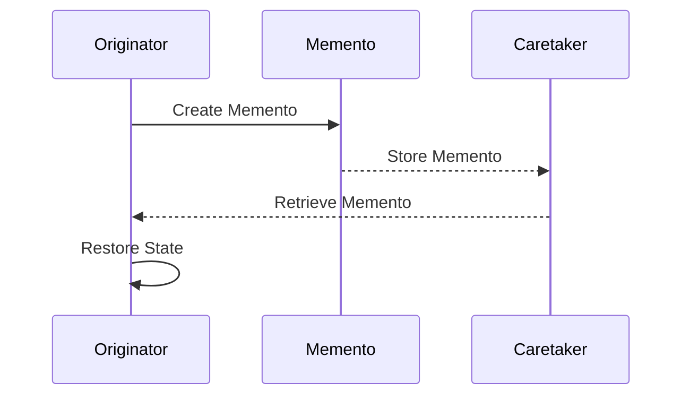

## 6.6 Memento Design Pattern

In the realm of software design, the Memento Design Pattern stands out as a powerful tool for capturing and restoring an object's state without violating encapsulation. This pattern is particularly useful in scenarios where you need to implement undo mechanisms or manage complex state transitions. In this section, we will delve into the intricacies of the Memento Design Pattern, explore its implementation in Dart, and examine its applications in Flutter development.

### Understanding the Memento Design Pattern

The Memento Design Pattern is a behavioral design pattern that allows you to capture and externalize an object's internal state so that it can be restored later. This is achieved without exposing the internal details of the object, thereby preserving encapsulation.

#### Key Participants

1. **Originator**: The object whose state needs to be saved. It creates a memento containing a snapshot of its current state and can restore its state from a memento.
2. **Memento**: A value object that acts as a snapshot of the Originator's state. It is immutable and does not expose its internal structure.
3. **Caretaker**: Manages the lifecycle of mementos. It is responsible for storing and retrieving mementos but does not operate on or inspect their contents.

### Intent

The primary intent of the Memento Design Pattern is to provide a way to capture and restore an object's state without breaking encapsulation. This is particularly useful in applications that require undo functionality or need to manage complex state transitions.

### Applicability

Consider using the Memento Design Pattern in the following scenarios:

- **Undo Mechanisms**: Implementing undo functionality in applications, such as text editors or drawing applications, where users can revert to previous states.
- **Stateful Widgets in Flutter**: Managing the state of UI components in Flutter applications, allowing for state restoration across sessions or navigation events.
- **State Management**: Capturing and restoring the state of complex objects in applications where state transitions are frequent and need to be reversible.

### Implementing Memento in Dart

Let's explore how to implement the Memento Design Pattern in Dart. We'll create a simple example to illustrate the key concepts.

#### Step 1: Define the Originator

The Originator is the object whose state we want to capture. It should provide methods to create and restore mementos.

```dart
class Originator {
  String _state;

  Originator(this._state);

  void setState(String state) {
    _state = state;
  }

  String getState() {
    return _state;
  }

  Memento saveStateToMemento() {
    return Memento(_state);
  }

  void getStateFromMemento(Memento memento) {
    _state = memento.getState();
  }
}
```

#### Step 2: Create the Memento

The Memento class stores the state of the Originator. It should be immutable and provide a method to retrieve the stored state.

```dart
class Memento {
  final String _state;

  Memento(this._state);

  String getState() {
    return _state;
  }
}
```

#### Step 3: Implement the Caretaker

The Caretaker is responsible for managing the mementos. It stores and retrieves mementos but does not modify them.

```dart
class Caretaker {
  final List<Memento> _mementoList = [];

  void add(Memento state) {
    _mementoList.add(state);
  }

  Memento get(int index) {
    return _mementoList[index];
  }
}
```

#### Step 4: Demonstrate the Memento Pattern

Let's see how these components work together in a simple example.

```dart
void main() {
  Originator originator = Originator("State1");
  Caretaker caretaker = Caretaker();

  // Save the initial state
  caretaker.add(originator.saveStateToMemento());

  // Change the state
  originator.setState("State2");
  caretaker.add(originator.saveStateToMemento());

  // Change the state again
  originator.setState("State3");

  print("Current State: ${originator.getState()}");

  // Restore to previous state
  originator.getStateFromMemento(caretaker.get(1));
  print("Restored to State: ${originator.getState()}");

  // Restore to initial state
  originator.getStateFromMemento(caretaker.get(0));
  print("Restored to Initial State: ${originator.getState()}");
}
```

### Visualizing the Memento Pattern

To better understand the interactions between the components of the Memento Design Pattern, let's visualize the process using a sequence diagram.



### Use Cases and Examples

#### Undo Mechanisms

One of the most common applications of the Memento Design Pattern is implementing undo functionality. In applications like text editors or drawing tools, users often need the ability to revert changes. The Memento pattern provides a straightforward way to capture and restore previous states.

**Example: Text Editor Undo Functionality**

Consider a simple text editor where users can type and undo their actions. The Memento pattern can be used to capture the state of the text after each change, allowing users to revert to previous versions.

```dart
class TextEditor {
  String _content;

  TextEditor(this._content);

  void type(String words) {
    _content += words;
  }

  String getContent() {
    return _content;
  }

  Memento save() {
    return Memento(_content);
  }

  void restore(Memento memento) {
    _content = memento.getState();
  }
}

void main() {
  TextEditor editor = TextEditor("");
  Caretaker caretaker = Caretaker();

  editor.type("Hello, ");
  caretaker.add(editor.save());

  editor.type("World!");
  caretaker.add(editor.save());

  print("Current Content: ${editor.getContent()}");

  editor.restore(caretaker.get(0));
  print("After Undo: ${editor.getContent()}");
}
```

#### Stateful Widgets in Flutter

In Flutter applications, managing the state of UI components is crucial for creating responsive and interactive user interfaces. The Memento pattern can be used to save and restore the state of stateful widgets, ensuring a seamless user experience across sessions or navigation events.

**Example: Saving and Restoring UI State**

Consider a Flutter application with a form that users can fill out. By using the Memento pattern, you can save the form's state when the user navigates away and restore it when they return.

```dart
class FormState {
  String name;
  String email;

  FormState(this.name, this.email);

  Memento save() {
    return Memento(name, email);
  }

  void restore(Memento memento) {
    name = memento.name;
    email = memento.email;
  }
}

class Memento {
  final String name;
  final String email;

  Memento(this.name, this.email);
}

void main() {
  FormState form = FormState("John Doe", "john@example.com");
  Caretaker caretaker = Caretaker();

  caretaker.add(form.save());

  form.name = "Jane Doe";
  form.email = "jane@example.com";

  print("Current Form State: ${form.name}, ${form.email}");

  form.restore(caretaker.get(0));
  print("Restored Form State: ${form.name}, ${form.email}");
}
```

### Design Considerations

When implementing the Memento Design Pattern, consider the following:

- **Encapsulation**: Ensure that the Memento class does not expose the internal state of the Originator. This is crucial for maintaining encapsulation.
- **Memory Usage**: Be mindful of memory usage, especially if the state being captured is large or if mementos are created frequently.
- **Performance**: Consider the performance implications of creating and storing mementos, particularly in applications with high-frequency state changes.

### Differences and Similarities

The Memento Design Pattern is often compared to other behavioral patterns, such as the Command and Observer patterns. Here are some key differences and similarities:

- **Memento vs. Command**: While both patterns deal with actions and state changes, the Command pattern focuses on encapsulating requests as objects, whereas the Memento pattern captures and restores state.
- **Memento vs. Observer**: The Observer pattern is about notifying observers of state changes, while the Memento pattern is about capturing and restoring state.

### Try It Yourself

To deepen your understanding of the Memento Design Pattern, try modifying the code examples provided. Here are some suggestions:

- Implement an undo/redo mechanism in a simple drawing application.
- Create a Flutter application that saves and restores the state of a complex form with multiple fields.
- Experiment with different types of state data, such as lists or maps, and implement memento functionality for them.

### Knowledge Check

Before we conclude, let's reinforce what we've learned with a few questions:

1. What is the primary purpose of the Memento Design Pattern?
2. How does the Memento pattern preserve encapsulation?
3. In what scenarios is the Memento pattern particularly useful?
4. What are the key components of the Memento Design Pattern?
5. How can the Memento pattern be applied in Flutter applications?

### Embrace the Journey

Remember, mastering design patterns is a journey. As you continue to explore and implement these patterns, you'll gain a deeper understanding of their power and versatility. Keep experimenting, stay curious, and enjoy the process of becoming a more proficient Dart and Flutter developer.

## Quiz Time!



### What is the primary purpose of the Memento Design Pattern?

- [x] To capture and restore an object's state without violating encapsulation.
- [ ] To notify observers of state changes.
- [ ] To encapsulate requests as objects.
- [ ] To manage dependencies between objects.

> **Explanation:** The Memento Design Pattern is used to capture and restore an object's state without exposing its internal structure, thus preserving encapsulation.

### Which component of the Memento Design Pattern is responsible for storing the state of the Originator?

- [ ] Originator
- [x] Memento
- [ ] Caretaker
- [ ] Observer

> **Explanation:** The Memento component is responsible for storing the state of the Originator.

### How does the Memento pattern preserve encapsulation?

- [x] By keeping the Memento class immutable and not exposing its internal structure.
- [ ] By notifying observers of state changes.
- [ ] By encapsulating requests as objects.
- [ ] By managing dependencies between objects.

> **Explanation:** The Memento pattern preserves encapsulation by keeping the Memento class immutable and not exposing its internal structure.

### In what scenarios is the Memento pattern particularly useful?

- [x] Undo mechanisms and state management.
- [ ] Dependency management.
- [ ] Notification systems.
- [ ] Command execution.

> **Explanation:** The Memento pattern is particularly useful in scenarios involving undo mechanisms and state management.

### What is the role of the Caretaker in the Memento Design Pattern?

- [x] To manage the lifecycle of mementos.
- [ ] To create mementos.
- [ ] To notify observers of state changes.
- [ ] To encapsulate requests as objects.

> **Explanation:** The Caretaker is responsible for managing the lifecycle of mementos, including storing and retrieving them.

### How can the Memento pattern be applied in Flutter applications?

- [x] By saving and restoring the state of stateful widgets.
- [ ] By notifying observers of widget changes.
- [ ] By encapsulating widget requests as objects.
- [ ] By managing widget dependencies.

> **Explanation:** The Memento pattern can be applied in Flutter applications by saving and restoring the state of stateful widgets.

### What is a key consideration when implementing the Memento Design Pattern?

- [x] Memory usage and performance.
- [ ] Notification frequency.
- [ ] Command execution speed.
- [ ] Dependency management.

> **Explanation:** When implementing the Memento Design Pattern, it's important to consider memory usage and performance, especially if the state being captured is large or if mementos are created frequently.

### Which pattern is often compared to the Memento pattern due to its focus on state changes?

- [ ] Command
- [x] Observer
- [ ] Strategy
- [ ] Factory

> **Explanation:** The Observer pattern is often compared to the Memento pattern due to its focus on state changes, although the Observer pattern is about notifying observers of state changes.

### What is the role of the Originator in the Memento Design Pattern?

- [x] To create and restore mementos.
- [ ] To manage the lifecycle of mementos.
- [ ] To notify observers of state changes.
- [ ] To encapsulate requests as objects.

> **Explanation:** The Originator is responsible for creating and restoring mementos.

### True or False: The Memento pattern can be used to implement redo functionality in applications.

- [x] True
- [ ] False

> **Explanation:** True. The Memento pattern can be used to implement both undo and redo functionality in applications by capturing and restoring previous states.


