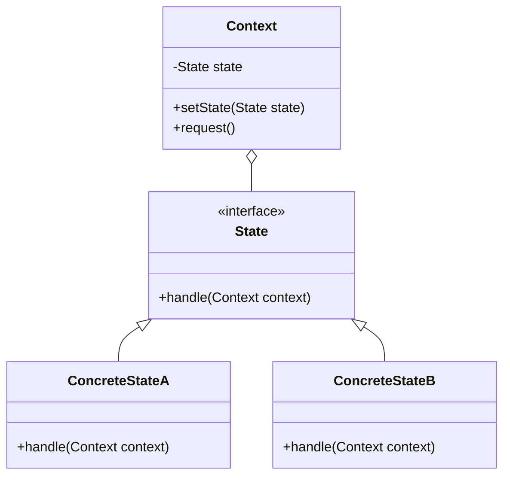

## 6.7 State Design Pattern

The State Design Pattern is a behavioral design pattern that allows an object to alter its behavior when its internal state changes. This pattern is particularly useful in scenarios where an object must change its behavior at runtime depending on its state. In this section, we will delve into the intricacies of the State Design Pattern, explore its implementation in Dart, and examine its application in Flutter development.

### Intent of the State Design Pattern

The primary intent of the State Design Pattern is to allow an object to change its behavior when its internal state changes. This pattern encapsulates state-specific behavior and delegates behavior to the current state object. The object appears to change its class by altering its behavior dynamically.

### Key Participants

1. **State Interface**: Defines the interface for encapsulating the behavior associated with a particular state of the Context.
2. **Concrete States**: Implement the state interface for different behaviors. Each concrete state corresponds to a specific state of the Context.
3. **Context**: Maintains an instance of a Concrete State and delegates state-specific behavior to the current state object.

### Implementing State in Dart

To implement the State Design Pattern in Dart, we need to define a State interface, create concrete state classes that implement this interface, and a Context class that maintains a reference to the current state.

#### State Interface

The State interface defines the methods that all concrete states must implement. This interface allows the Context to interact with different states in a uniform manner.

```dart
abstract class State {
  void handle(Context context);
}
```

#### Concrete States

Concrete states implement the State interface and define the behavior associated with a particular state of the Context.

```dart
class ConcreteStateA implements State {
  @override
  void handle(Context context) {
    print('State A handling request.');
    context.setState(ConcreteStateB());
  }
}

class ConcreteStateB implements State {
  @override
  void handle(Context context) {
    print('State B handling request.');
    context.setState(ConcreteStateA());
  }
}
```

#### Context

The Context class maintains an instance of a Concrete State and delegates state-specific behavior to the current state object.

```dart
class Context {
  State _state;

  Context(this._state);

  void setState(State state) {
    _state = state;
  }

  void request() {
    _state.handle(this);
  }
}
```

#### Example Usage

```dart
void main() {
  Context context = Context(ConcreteStateA());

  context.request(); // Output: State A handling request.
  context.request(); // Output: State B handling request.
  context.request(); // Output: State A handling request.
}
```

### Visualizing the State Design Pattern

Below is a class diagram illustrating the State Design Pattern:



### Use Cases and Examples

The State Design Pattern is widely applicable in scenarios where an object's behavior depends on its state. Let's explore some common use cases.

#### Authentication Flow

In an authentication flow, an application may need to transition between logged-in and logged-out states. The State Design Pattern can be used to encapsulate the behavior associated with each state.

```dart
abstract class AuthState {
  void handle(AuthContext context);
}

class LoggedOutState implements AuthState {
  @override
  void handle(AuthContext context) {
    print('User is logged out. Redirecting to login page.');
    context.setState(LoggedInState());
  }
}

class LoggedInState implements AuthState {
  @override
  void handle(AuthContext context) {
    print('User is logged in. Access granted.');
    context.setState(LoggedOutState());
  }
}

class AuthContext {
  AuthState _state;

  AuthContext(this._state);

  void setState(AuthState state) {
    _state = state;
  }

  void authenticate() {
    _state.handle(this);
  }
}

void main() {
  AuthContext authContext = AuthContext(LoggedOutState());

  authContext.authenticate(); // Output: User is logged out. Redirecting to login page.
  authContext.authenticate(); // Output: User is logged in. Access granted.
}
```

#### Game Development

In game development, the State Design Pattern can be used to change the behavior of a game character based on its current state, such as idle, running, or jumping.

```dart
abstract class CharacterState {
  void handle(CharacterContext context);
}

class IdleState implements CharacterState {
  @override
  void handle(CharacterContext context) {
    print('Character is idle.');
    context.setState(RunningState());
  }
}

class RunningState implements CharacterState {
  @override
  void handle(CharacterContext context) {
    print('Character is running.');
    context.setState(JumpingState());
  }
}

class JumpingState implements CharacterState {
  @override
  void handle(CharacterContext context) {
    print('Character is jumping.');
    context.setState(IdleState());
  }
}

class CharacterContext {
  CharacterState _state;

  CharacterContext(this._state);

  void setState(CharacterState state) {
    _state = state;
  }

  void performAction() {
    _state.handle(this);
  }
}

void main() {
  CharacterContext characterContext = CharacterContext(IdleState());

  characterContext.performAction(); // Output: Character is idle.
  characterContext.performAction(); // Output: Character is running.
  characterContext.performAction(); // Output: Character is jumping.
}
```

### Design Considerations

When implementing the State Design Pattern, consider the following:

- **State Explosion**: Be mindful of the potential for state explosion, where the number of states becomes unmanageable. Use strategies such as state hierarchies or state machines to manage complexity.
- **State Transitions**: Clearly define the transitions between states to ensure that the system behaves predictably.
- **Performance**: Consider the performance implications of frequently changing states, especially in performance-sensitive applications.

### Differences and Similarities

The State Design Pattern is often compared to the Strategy Design Pattern. While both patterns involve encapsulating behavior, the key difference is that the State Design Pattern is used to change behavior based on an object's state, whereas the Strategy Design Pattern is used to select an algorithm at runtime.

### Try It Yourself

Experiment with the State Design Pattern by modifying the code examples provided. Try adding new states or changing the transitions between states to see how the behavior of the application changes.

### Knowledge Check

- What is the primary intent of the State Design Pattern?
- How does the State Design Pattern differ from the Strategy Design Pattern?
- What are some common use cases for the State Design Pattern?

### Embrace the Journey

Remember, mastering design patterns is a journey. As you continue to explore and implement the State Design Pattern in your Flutter applications, you'll gain a deeper understanding of how to create flexible and maintainable code. Keep experimenting, stay curious, and enjoy the journey!

## Quiz Time!



### What is the primary intent of the State Design Pattern?

- [x] To allow an object to alter its behavior when its internal state changes.
- [ ] To encapsulate a family of algorithms.
- [ ] To provide a way to access the elements of an aggregate object sequentially.
- [ ] To define a one-to-many dependency between objects.

> **Explanation:** The State Design Pattern allows an object to change its behavior when its internal state changes, making it appear as if the object has changed its class.

### Which of the following is a key participant in the State Design Pattern?

- [x] State Interface
- [ ] Observer
- [ ] Command
- [ ] Proxy

> **Explanation:** The State Interface is a key participant in the State Design Pattern, defining the interface for encapsulating behavior associated with a particular state.

### In the State Design Pattern, what does the Context class do?

- [x] Maintains an instance of a Concrete State and delegates state-specific behavior to it.
- [ ] Defines the interface for encapsulating behavior.
- [ ] Implements the state interface for different behaviors.
- [ ] Provides a way to access the elements of an aggregate object.

> **Explanation:** The Context class maintains an instance of a Concrete State and delegates state-specific behavior to the current state object.

### How does the State Design Pattern differ from the Strategy Design Pattern?

- [x] The State Design Pattern changes behavior based on an object's state, while the Strategy Design Pattern selects an algorithm at runtime.
- [ ] The State Design Pattern selects an algorithm at runtime, while the Strategy Design Pattern changes behavior based on an object's state.
- [ ] Both patterns are identical in functionality.
- [ ] The State Design Pattern is used for structural changes, while the Strategy Design Pattern is used for behavioral changes.

> **Explanation:** The State Design Pattern changes behavior based on an object's state, whereas the Strategy Design Pattern is used to select an algorithm at runtime.

### What is a common use case for the State Design Pattern?

- [x] Authentication Flow
- [ ] Sorting Algorithms
- [ ] Data Access
- [ ] Event Handling

> **Explanation:** A common use case for the State Design Pattern is managing authentication flows, where an application transitions between logged-in and logged-out states.

### What is a potential drawback of the State Design Pattern?

- [x] State Explosion
- [ ] Lack of flexibility
- [ ] Poor performance
- [ ] Difficult to implement

> **Explanation:** A potential drawback of the State Design Pattern is state explosion, where the number of states becomes unmanageable.

### Which of the following is a Concrete State in the provided game development example?

- [x] IdleState
- [ ] AuthContext
- [ ] State Interface
- [ ] Context

> **Explanation:** In the provided game development example, IdleState is a Concrete State that implements the CharacterState interface.

### What should be considered when implementing the State Design Pattern?

- [x] State Transitions
- [ ] Algorithm Efficiency
- [ ] Data Structures
- [ ] User Interface Design

> **Explanation:** When implementing the State Design Pattern, it's important to clearly define state transitions to ensure predictable system behavior.

### How can you experiment with the State Design Pattern?

- [x] By modifying code examples to add new states or change transitions.
- [ ] By implementing sorting algorithms.
- [ ] By creating new data structures.
- [ ] By designing user interfaces.

> **Explanation:** You can experiment with the State Design Pattern by modifying code examples to add new states or change transitions, observing how the application's behavior changes.

### True or False: The State Design Pattern is used to encapsulate a family of algorithms.

- [ ] True
- [x] False

> **Explanation:** False. The State Design Pattern is used to allow an object to alter its behavior when its internal state changes, not to encapsulate a family of algorithms.


