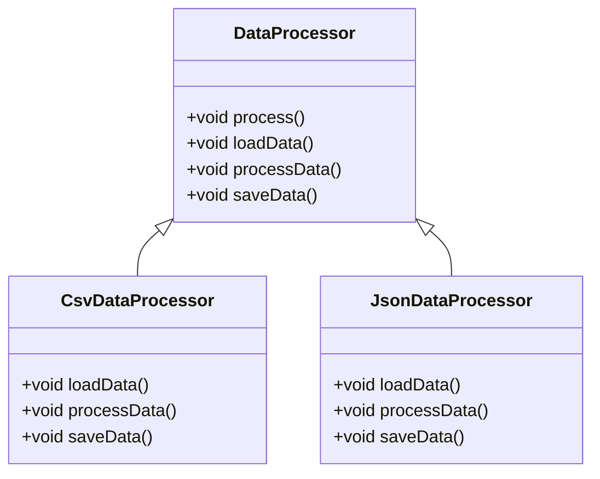

## 6.8 Template Method Design Pattern

The Template Method Design Pattern is a behavioral design pattern that defines the skeleton of an algorithm in a base class, allowing subclasses to override specific steps of the algorithm without altering its structure. This pattern is particularly useful when you have a series of steps that need to be executed in a specific order, but some of those steps can be customized or extended by subclasses.

### Intent

The primary intent of the Template Method Design Pattern is to define the outline of an algorithm in a base class and allow subclasses to provide specific implementations for certain steps. This approach promotes code reuse and ensures that the algorithm's structure remains consistent across different implementations.

### Key Participants

1. **Abstract Base Class**: Contains the template method, which defines the algorithm's structure, and abstract methods for steps that can be customized.
2. **Concrete Subclasses**: Implement the abstract methods to provide specific behavior for the customizable steps.

### Applicability

Use the Template Method Design Pattern when:

- You have an algorithm that consists of several steps, and some of these steps can be customized by subclasses.
- You want to enforce a specific sequence of steps in an algorithm while allowing flexibility in certain parts.
- You want to avoid code duplication by placing common behavior in a base class and allowing subclasses to extend or modify specific steps.

### Implementing Template Method in Dart

Let's explore how to implement the Template Method Design Pattern in Dart by defining an abstract base class and concrete subclasses.

#### Abstract Base Class

The abstract base class contains the template method, which defines the algorithm's structure, and abstract methods for the customizable steps.

```dart
abstract class DataProcessor {
  // Template method defining the skeleton of the algorithm
  void process() {
    loadData();
    processData();
    saveData();
  }

  // Abstract methods for steps that can be customized
  void loadData();
  void processData();
  void saveData();
}
```

#### Concrete Subclasses

Concrete subclasses implement the abstract methods to provide specific behavior for the customizable steps.

```dart
class CsvDataProcessor extends DataProcessor {
  @override
  void loadData() {
    print('Loading data from CSV file...');
  }

  @override
  void processData() {
    print('Processing CSV data...');
  }

  @override
  void saveData() {
    print('Saving processed data to CSV file...');
  }
}

class JsonDataProcessor extends DataProcessor {
  @override
  void loadData() {
    print('Loading data from JSON file...');
  }

  @override
  void processData() {
    print('Processing JSON data...');
  }

  @override
  void saveData() {
    print('Saving processed data to JSON file...');
  }
}
```

#### Usage Example

```dart
void main() {
  DataProcessor csvProcessor = CsvDataProcessor();
  csvProcessor.process();

  DataProcessor jsonProcessor = JsonDataProcessor();
  jsonProcessor.process();
}
```

### Diagrams

To better understand the Template Method Design Pattern, let's visualize the relationship between the abstract base class and the concrete subclasses using a class diagram.



### Use Cases and Examples

The Template Method Design Pattern is versatile and can be applied to various scenarios. Let's explore some common use cases and examples.

#### Data Processing Pipelines

In data processing pipelines, you often have a series of steps that need to be executed in a specific order. The Template Method Design Pattern allows you to define the pipeline's structure in a base class and customize specific steps in subclasses.

#### Algorithm Implementations

When implementing algorithms that share common logic but require customization in certain steps, the Template Method Design Pattern provides a structured approach to achieve this. For example, sorting algorithms may have a common structure but differ in the way elements are compared.

### Design Considerations

When using the Template Method Design Pattern, consider the following:

- **Consistency**: Ensure that the template method enforces a consistent structure for the algorithm across different implementations.
- **Flexibility**: Allow subclasses to customize specific steps without altering the overall algorithm.
- **Code Reuse**: Place common behavior in the base class to avoid code duplication.

### Differences and Similarities

The Template Method Design Pattern is often compared to other behavioral patterns, such as the Strategy Pattern. While both patterns allow for customization, the Template Method Pattern defines the algorithm's structure in a base class, whereas the Strategy Pattern encapsulates the algorithm in separate classes.

### Try It Yourself

Experiment with the Template Method Design Pattern by modifying the code examples provided. Try adding new data processors, such as XML or database processors, and implement the necessary steps in the subclasses.

### Knowledge Check

- What is the primary intent of the Template Method Design Pattern?
- How does the Template Method Design Pattern promote code reuse?
- What are some common use cases for the Template Method Design Pattern?

### Embrace the Journey

Remember, mastering design patterns is a journey. As you explore the Template Method Design Pattern, you'll gain a deeper understanding of how to structure algorithms and promote code reuse. Keep experimenting, stay curious, and enjoy the journey!

## Quiz Time!



### What is the primary intent of the Template Method Design Pattern?

- [x] To define the skeleton of an algorithm and allow subclasses to customize certain steps.
- [ ] To encapsulate algorithms in separate classes.
- [ ] To provide a way to create objects without specifying the exact class.
- [ ] To define a one-to-many dependency between objects.

> **Explanation:** The Template Method Design Pattern defines the skeleton of an algorithm in a base class and allows subclasses to customize specific steps.

### Which class contains the template method in the Template Method Design Pattern?

- [x] Abstract Base Class
- [ ] Concrete Subclass
- [ ] Interface
- [ ] Singleton Class

> **Explanation:** The abstract base class contains the template method, which defines the algorithm's structure.

### How does the Template Method Design Pattern promote code reuse?

- [x] By placing common behavior in a base class and allowing subclasses to extend or modify specific steps.
- [ ] By encapsulating algorithms in separate classes.
- [ ] By providing a way to create objects without specifying the exact class.
- [ ] By defining a one-to-many dependency between objects.

> **Explanation:** The Template Method Design Pattern promotes code reuse by placing common behavior in a base class and allowing subclasses to customize specific steps.

### What is a common use case for the Template Method Design Pattern?

- [x] Data Processing Pipelines
- [ ] Singleton Pattern
- [ ] Factory Method Pattern
- [ ] Observer Pattern

> **Explanation:** Data processing pipelines often have a series of steps that need to be executed in a specific order, making them a common use case for the Template Method Design Pattern.

### Which pattern is often compared to the Template Method Design Pattern?

- [x] Strategy Pattern
- [ ] Singleton Pattern
- [ ] Factory Method Pattern
- [ ] Observer Pattern

> **Explanation:** The Template Method Design Pattern is often compared to the Strategy Pattern, as both allow for customization, but they differ in how they structure the algorithm.

### In the Template Method Design Pattern, which class implements the abstract methods?

- [x] Concrete Subclass
- [ ] Abstract Base Class
- [ ] Interface
- [ ] Singleton Class

> **Explanation:** Concrete subclasses implement the abstract methods to provide specific behavior for the customizable steps.

### What should you consider when using the Template Method Design Pattern?

- [x] Consistency, Flexibility, and Code Reuse
- [ ] Encapsulation, Inheritance, and Polymorphism
- [ ] Abstraction, Interfaces, and Composition
- [ ] Modularity, Scalability, and Performance

> **Explanation:** When using the Template Method Design Pattern, consider consistency, flexibility, and code reuse.

### How can you experiment with the Template Method Design Pattern?

- [x] By adding new data processors and implementing the necessary steps in subclasses.
- [ ] By encapsulating algorithms in separate classes.
- [ ] By providing a way to create objects without specifying the exact class.
- [ ] By defining a one-to-many dependency between objects.

> **Explanation:** Experiment with the Template Method Design Pattern by adding new data processors and implementing the necessary steps in subclasses.

### What is the role of the template method in the Template Method Design Pattern?

- [x] To define the skeleton of an algorithm and enforce a specific sequence of steps.
- [ ] To encapsulate algorithms in separate classes.
- [ ] To provide a way to create objects without specifying the exact class.
- [ ] To define a one-to-many dependency between objects.

> **Explanation:** The template method defines the skeleton of an algorithm and enforces a specific sequence of steps.

### True or False: The Template Method Design Pattern allows subclasses to alter the algorithm's structure.

- [x] False
- [ ] True

> **Explanation:** The Template Method Design Pattern allows subclasses to customize specific steps, but the algorithm's structure remains consistent.



---
