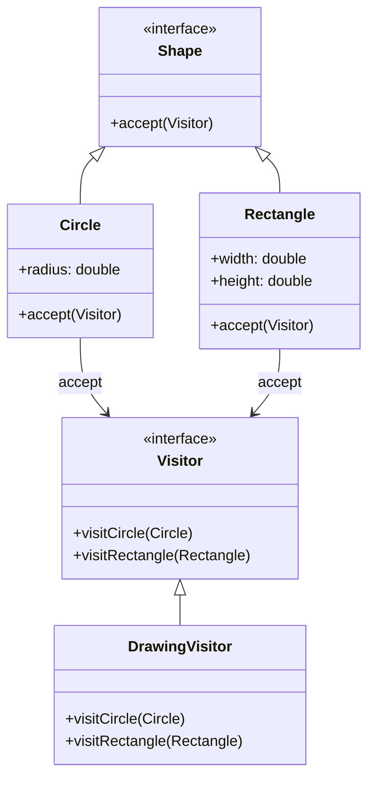

## 6.9 Visitor Design Pattern

The Visitor Design Pattern is a powerful behavioral pattern that allows you to define new operations on a set of objects without changing the objects themselves. This pattern is particularly useful when you need to perform operations across a collection of objects with varying types. In this section, we will delve into the Visitor Design Pattern, its implementation in Dart, and its applicability in Flutter development.

### Intent

The primary intent of the Visitor Design Pattern is to separate an algorithm from the object structure on which it operates. This separation allows you to add new operations without modifying the objects themselves, thus adhering to the Open/Closed Principle of software design.

### Key Participants

1. **Visitor Interface**: Declares visit methods for each type of element in the object structure.
2. **Concrete Visitors**: Implement the operations defined in the Visitor Interface for each element type.
3. **Element Interface**: Declares an `accept` method that takes a visitor as an argument.
4. **Concrete Elements**: Implement the `accept` method and call the appropriate visit method on the visitor.

### Applicability

The Visitor Design Pattern is applicable when:
- You need to perform operations on objects of different types in a collection.
- The object structure is stable, but you anticipate frequent changes to the operations performed on the objects.
- You want to add new operations without modifying the existing object structure.

### Implementing Visitor in Dart

Let's explore how to implement the Visitor Design Pattern in Dart with a practical example.

#### Visitor Interface

The Visitor Interface declares visit methods for each element type. In Dart, you can define this interface using an abstract class:

```dart
abstract class Visitor {
  void visitCircle(Circle circle);
  void visitRectangle(Rectangle rectangle);
}
```

#### Concrete Visitors

Concrete Visitors implement the operations for different element types. Here's an example of a `DrawingVisitor` that performs operations on shapes:

```dart
class DrawingVisitor implements Visitor {
  @override
  void visitCircle(Circle circle) {
    print('Drawing a circle with radius ${circle.radius}');
  }

  @override
  void visitRectangle(Rectangle rectangle) {
    print('Drawing a rectangle with width ${rectangle.width} and height ${rectangle.height}');
  }
}
```

#### Element Interface

The Element Interface declares an `accept` method that takes a visitor. In Dart, you can define this interface using an abstract class:

```dart
abstract class Shape {
  void accept(Visitor visitor);
}
```

#### Concrete Elements

Concrete Elements implement the `accept` method and call the appropriate visit method on the visitor. Here's how you can define `Circle` and `Rectangle` classes:

```dart
class Circle implements Shape {
  final double radius;

  Circle(this.radius);

  @override
  void accept(Visitor visitor) {
    visitor.visitCircle(this);
  }
}

class Rectangle implements Shape {
  final double width;
  final double height;

  Rectangle(this.width, this.height);

  @override
  void accept(Visitor visitor) {
    visitor.visitRectangle(this);
  }
}
```

#### Using the Visitor Pattern

Now that we have defined our Visitor and Element classes, let's see how to use them:

```dart
void main() {
  List<Shape> shapes = [
    Circle(5.0),
    Rectangle(3.0, 4.0),
  ];

  Visitor drawingVisitor = DrawingVisitor();

  for (var shape in shapes) {
    shape.accept(drawingVisitor);
  }
}
```

### Use Cases and Examples

The Visitor Design Pattern is versatile and can be applied in various scenarios. Here are some common use cases:

#### Syntax Trees

In compilers and interpreters, the Visitor Pattern is often used to perform operations like traversal, evaluation, or transformation on syntax trees. Each node in the tree can be visited by a visitor that performs specific operations.

#### Object Serialization

The Visitor Pattern can be used to serialize objects into different formats, such as JSON or XML. By defining a visitor for each format, you can easily extend the serialization capabilities without modifying the object structure.

### Visualizing the Visitor Pattern

To better understand the Visitor Design Pattern, let's visualize the relationships between the components using a class diagram.



### Design Considerations

When implementing the Visitor Design Pattern, consider the following:

- **Complexity**: The pattern can introduce complexity due to the need for multiple visitor classes and visit methods.
- **Extensibility**: While adding new operations is easy, adding new element types requires changes to the visitor interface and all concrete visitors.
- **Double Dispatch**: The pattern relies on double dispatch, which can be less intuitive for developers unfamiliar with the concept.

### Differences and Similarities

The Visitor Design Pattern is often compared to other behavioral patterns like the Strategy Pattern. While both patterns allow you to define operations separately from the objects they operate on, the Visitor Pattern is more suitable for operations that need to be performed across a collection of objects with varying types.

### Try It Yourself

To deepen your understanding of the Visitor Design Pattern, try modifying the code examples above. Here are some suggestions:

- Add a new shape, such as a `Triangle`, and implement the necessary visitor methods.
- Create a new visitor that calculates the area of each shape.
- Experiment with different ways to traverse the collection of shapes.

### Knowledge Check

Before we wrap up, let's reinforce what we've learned with a few questions:

- What is the primary intent of the Visitor Design Pattern?
- How does the Visitor Pattern adhere to the Open/Closed Principle?
- What are the key participants in the Visitor Pattern?

### Embrace the Journey

Remember, mastering design patterns is a journey. As you continue to explore and apply these patterns in your projects, you'll gain a deeper understanding of their benefits and limitations. Keep experimenting, stay curious, and enjoy the process of becoming a more effective Dart and Flutter developer!

## Quiz Time!



### What is the primary intent of the Visitor Design Pattern?

- [x] To separate an algorithm from the object structure on which it operates.
- [ ] To encapsulate a request as an object.
- [ ] To define a family of algorithms.
- [ ] To provide a way to access the elements of an aggregate object sequentially.

> **Explanation:** The Visitor Design Pattern aims to separate an algorithm from the object structure on which it operates, allowing new operations to be added without modifying the objects.

### Which of the following is a key participant in the Visitor Design Pattern?

- [x] Visitor Interface
- [ ] Strategy Interface
- [ ] Singleton Class
- [ ] Observer Interface

> **Explanation:** The Visitor Interface is a key participant in the Visitor Design Pattern, as it declares visit methods for each element type.

### What is a common use case for the Visitor Design Pattern?

- [x] Object Serialization
- [ ] Singleton Initialization
- [ ] Observer Notification
- [ ] Command Execution

> **Explanation:** Object Serialization is a common use case for the Visitor Design Pattern, as it allows objects to be serialized into different formats without modifying their structure.

### How does the Visitor Pattern adhere to the Open/Closed Principle?

- [x] By allowing new operations to be added without modifying existing objects.
- [ ] By ensuring that objects are closed for modification.
- [ ] By encapsulating the details of object creation.
- [ ] By providing a way to access elements sequentially.

> **Explanation:** The Visitor Pattern adheres to the Open/Closed Principle by allowing new operations to be added without modifying existing objects.

### What is the role of the Element Interface in the Visitor Pattern?

- [x] To declare an accept method that takes a visitor.
- [ ] To encapsulate a request as an object.
- [ ] To define a family of algorithms.
- [ ] To provide a way to access elements sequentially.

> **Explanation:** The Element Interface declares an accept method that takes a visitor, allowing the visitor to perform operations on the element.

### Which pattern is often compared to the Visitor Pattern?

- [x] Strategy Pattern
- [ ] Singleton Pattern
- [ ] Observer Pattern
- [ ] Command Pattern

> **Explanation:** The Strategy Pattern is often compared to the Visitor Pattern, as both allow operations to be defined separately from the objects they operate on.

### What is a potential drawback of the Visitor Pattern?

- [x] Complexity due to multiple visitor classes and visit methods.
- [ ] Difficulty in encapsulating requests as objects.
- [ ] Limited ability to define a family of algorithms.
- [ ] Challenges in accessing elements sequentially.

> **Explanation:** A potential drawback of the Visitor Pattern is the complexity introduced by the need for multiple visitor classes and visit methods.

### What is double dispatch in the context of the Visitor Pattern?

- [x] A technique that allows operations to be performed based on the type of two objects.
- [ ] A method for encapsulating requests as objects.
- [ ] A way to define a family of algorithms.
- [ ] A process for accessing elements sequentially.

> **Explanation:** Double dispatch is a technique used in the Visitor Pattern that allows operations to be performed based on the type of two objects: the visitor and the element.

### What is the role of Concrete Visitors in the Visitor Pattern?

- [x] To implement operations for different element types.
- [ ] To encapsulate requests as objects.
- [ ] To define a family of algorithms.
- [ ] To provide a way to access elements sequentially.

> **Explanation:** Concrete Visitors implement operations for different element types, allowing new operations to be added without modifying the elements.

### True or False: The Visitor Pattern is suitable for operations that need to be performed across a collection of objects with varying types.

- [x] True
- [ ] False

> **Explanation:** True. The Visitor Pattern is suitable for operations that need to be performed across a collection of objects with varying types, as it allows new operations to be added without modifying the objects.


