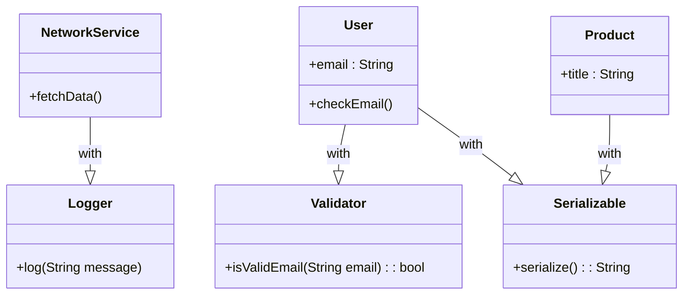

## 7.1 Using Mixins for Code Reuse

In the realm of Dart programming, mixins provide a powerful mechanism for code reuse, allowing developers to add functionality to classes without resorting to traditional inheritance. This section delves into the concept of mixins, their implementation, and practical use cases, equipping you with the knowledge to leverage them effectively in your Flutter applications.

### Mixins Allow for Horizontal Reuse

Mixins enable horizontal code reuse by allowing you to compose classes with shared behavior without establishing a parent-child relationship. This is particularly useful when you want to add functionality to multiple classes without creating a complex inheritance hierarchy.

#### Implementing Mixins in Dart

To implement mixins in Dart, you need to understand the syntax and semantics of defining and applying them. Let's explore these concepts in detail.

##### Defining Mixins

In Dart, mixins are defined using the `mixin` keyword. A mixin is essentially a class that is intended to be used as a building block for other classes. Here's a simple example:

```dart
mixin Logger {
  void log(String message) {
    print('Log: $message');
  }
}
```

In this example, `Logger` is a mixin that provides a `log` method. This method can be reused across multiple classes without duplicating code.

##### Applying Mixins to Classes

To apply a mixin to a class, use the `with` keyword. This allows you to compose a class with the functionality provided by the mixin:

```dart
class NetworkService with Logger {
  void fetchData() {
    log('Fetching data from the network...');
    // Network fetching logic
  }
}

void main() {
  var service = NetworkService();
  service.fetchData();
}
```

In this example, `NetworkService` uses the `Logger` mixin to gain logging capabilities. The `fetchData` method can now log messages without implementing its own logging logic.

##### Mixins vs. Inheritance

While both mixins and inheritance allow for code reuse, they serve different purposes and should be used in different scenarios.

- **Inheritance** is best used when there is a clear "is-a" relationship between classes. For example, a `Dog` class might inherit from an `Animal` class because a dog is an animal.
- **Mixins** are ideal for "has-a" or "can-do" relationships, where you want to add specific capabilities to a class. For example, a `Bird` class might use a `Flyable` mixin to gain flying capabilities.

### Use Cases and Examples

Mixins are versatile and can be applied in various scenarios to enhance code reuse and maintainability. Let's explore some common use cases and examples.

#### Adding Common Behavior

Mixins are perfect for adding common behavior to multiple classes. Here are a few examples:

- **Logging**: As demonstrated earlier, a `Logger` mixin can provide logging capabilities to any class that needs it.
- **Validation**: A `Validator` mixin can provide methods for input validation, ensuring consistency across different classes.
- **Event Handling**: An `EventEmitter` mixin can provide methods for event handling, allowing classes to emit and listen for events.

Here's an example of a `Validator` mixin:

```dart
mixin Validator {
  bool isValidEmail(String email) {
    // Simple regex for email validation
    return RegExp(r'^[^@]+@[^@]+\.[^@]+').hasMatch(email);
  }
}

class User with Validator {
  String email;

  User(this.email);

  void checkEmail() {
    if (isValidEmail(email)) {
      print('Email is valid.');
    } else {
      print('Email is invalid.');
    }
  }
}

void main() {
  var user = User('example@example.com');
  user.checkEmail();
}
```

In this example, the `User` class uses the `Validator` mixin to validate email addresses, promoting code reuse and consistency.

#### Composing Classes

Mixins allow you to compose classes with specific capabilities, making your code more modular and flexible. This is particularly useful in scenarios where multiple classes need similar functionality but do not share a common ancestor.

Consider a scenario where you have multiple classes that need to be serializable:

```dart
mixin Serializable {
  String serialize() {
    // Convert object to JSON string
    return 'Serialized data';
  }
}

class User with Serializable {
  String name;

  User(this.name);
}

class Product with Serializable {
  String title;

  Product(this.title);
}

void main() {
  var user = User('Alice');
  var product = Product('Laptop');

  print(user.serialize());
  print(product.serialize());
}
```

In this example, both `User` and `Product` classes use the `Serializable` mixin to gain serialization capabilities, demonstrating how mixins can be used to compose classes with shared behavior.

### Visualizing Mixins in Dart

To better understand how mixins work in Dart, let's visualize the relationship between classes and mixins using a class diagram.



This diagram illustrates how mixins like `Logger`, `Validator`, and `Serializable` are applied to classes such as `NetworkService`, `User`, and `Product`, enhancing their functionality.

### Design Considerations

When using mixins, it's important to consider the following design aspects:

- **Avoid State in Mixins**: Mixins should generally avoid maintaining state. Instead, they should focus on providing behavior. If state is necessary, ensure it doesn't conflict with the state of the classes using the mixin.
- **Order Matters**: When applying multiple mixins, the order can affect the behavior of the class. Dart applies mixins from left to right, so be mindful of the order in which you apply them.
- **Compatibility**: Ensure that the mixins you apply are compatible with the class they are being mixed into. This includes method signatures and expected behavior.

### Differences and Similarities

Mixins are often compared to interfaces and abstract classes. Here's how they differ:

- **Mixins vs. Interfaces**: Interfaces define a contract that a class must adhere to, but they do not provide implementation. Mixins, on the other hand, provide concrete implementations that can be reused across classes.
- **Mixins vs. Abstract Classes**: Abstract classes can provide both a contract and implementation, similar to mixins. However, a class can only inherit from one abstract class, whereas it can use multiple mixins.

### Try It Yourself

To solidify your understanding of mixins, try modifying the examples provided:

1. **Extend the Logger Mixin**: Add a method to log messages with different severity levels (e.g., info, warning, error).
2. **Create a New Mixin**: Define a `Cacheable` mixin that provides caching capabilities to classes. Implement methods for adding, retrieving, and clearing cache entries.
3. **Combine Mixins**: Create a class that uses both the `Logger` and `Validator` mixins. Implement a method that logs validation results.

### References and Links

For further reading on mixins and related concepts, consider the following resources:

- [Dart Language Tour: Mixins](https://dart.dev/guides/language/language-tour#adding-features-to-a-class-mixins)
- [Effective Dart: Design](https://dart.dev/guides/language/effective-dart/design)
- [Flutter Documentation](https://flutter.dev/docs)

### Knowledge Check

Before moving on, let's review some key points:

- Mixins provide a way to reuse code across classes without using inheritance.
- They are defined using the `mixin` keyword and applied with the `with` keyword.
- Mixins are ideal for adding common behavior or composing classes with specific capabilities.

### Embrace the Journey

Remember, mastering mixins is just one step in your journey to becoming a proficient Dart and Flutter developer. As you continue to explore and experiment, you'll discover new ways to enhance your applications and streamline your development process. Keep experimenting, stay curious, and enjoy the journey!

## Quiz Time!



### What is the primary purpose of using mixins in Dart?

- [x] To enable horizontal code reuse without inheritance
- [ ] To enforce a strict class hierarchy
- [ ] To replace interfaces
- [ ] To manage state within classes

> **Explanation:** Mixins allow for horizontal code reuse by adding functionality to classes without using inheritance.

### How do you define a mixin in Dart?

- [x] Using the `mixin` keyword
- [ ] Using the `class` keyword
- [ ] Using the `interface` keyword
- [ ] Using the `abstract` keyword

> **Explanation:** Mixins are defined using the `mixin` keyword in Dart.

### Which keyword is used to apply a mixin to a class?

- [x] `with`
- [ ] `extends`
- [ ] `implements`
- [ ] `uses`

> **Explanation:** The `with` keyword is used to apply a mixin to a class in Dart.

### What should mixins generally avoid?

- [x] Maintaining state
- [ ] Providing behavior
- [ ] Defining methods
- [ ] Being used with classes

> **Explanation:** Mixins should generally avoid maintaining state and focus on providing behavior.

### In what order are mixins applied to a class?

- [x] From left to right
- [ ] From right to left
- [ ] In alphabetical order
- [ ] In reverse alphabetical order

> **Explanation:** Mixins are applied from left to right in Dart.

### What is a key difference between mixins and interfaces?

- [x] Mixins provide implementation, interfaces do not
- [ ] Interfaces provide implementation, mixins do not
- [ ] Mixins enforce a contract, interfaces do not
- [ ] Interfaces can be used with multiple classes, mixins cannot

> **Explanation:** Mixins provide concrete implementations, whereas interfaces define a contract without implementation.

### Can a class use multiple mixins in Dart?

- [x] Yes
- [ ] No

> **Explanation:** A class can use multiple mixins in Dart, allowing for flexible code composition.

### What is a common use case for mixins?

- [x] Adding common behavior to multiple classes
- [ ] Creating a strict class hierarchy
- [ ] Managing application state
- [ ] Defining abstract methods

> **Explanation:** Mixins are commonly used to add common behavior to multiple classes.

### Which of the following is NOT a benefit of using mixins?

- [x] Enforcing a strict class hierarchy
- [ ] Promoting code reuse
- [ ] Reducing code duplication
- [ ] Enhancing class capabilities

> **Explanation:** Mixins are not used to enforce a strict class hierarchy; they promote code reuse and enhance class capabilities.

### True or False: Mixins can be used to compose classes with specific capabilities.

- [x] True
- [ ] False

> **Explanation:** Mixins can be used to compose classes with specific capabilities, making them more modular and flexible.


