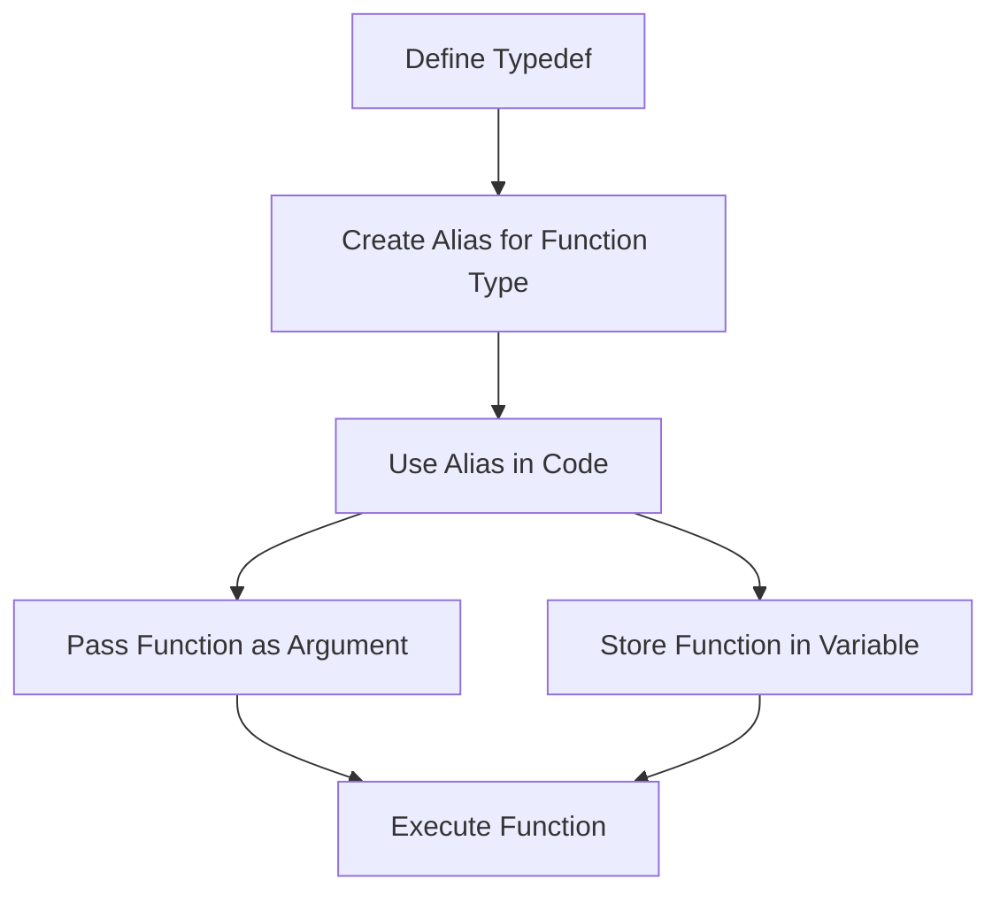

## 7.10 Use of Typedefs and Function Types

In the world of Dart programming, typedefs and function types play a crucial role in enhancing code readability and maintainability. They allow developers to create aliases for function signatures, making it easier to work with complex function types and ensuring consistency across codebases. In this section, we will delve into the intricacies of typedefs and function types, exploring their definitions, implementations, and practical applications.

### Creating Aliases for Function Signatures: Improving Code Readability

Typedefs in Dart are a powerful feature that allows you to define a name for a function type. This can significantly improve the readability of your code, especially when dealing with complex function signatures. By creating an alias, you can refer to the function type by a simple name, making your code cleaner and more understandable.

#### Implementing Typedefs in Dart

##### Defining Typedefs: Using the `typedef` Keyword

To define a typedef in Dart, you use the `typedef` keyword followed by the alias name and the function signature. This creates a new type that you can use throughout your code.

```dart
typedef IntOperation = int Function(int a, int b);

int add(int a, int b) => a + b;
int subtract(int a, int b) => a - b;

void main() {
  IntOperation operation;

  operation = add;
  print('Addition: ${operation(5, 3)}'); // Output: Addition: 8

  operation = subtract;
  print('Subtraction: ${operation(5, 3)}'); // Output: Subtraction: 2
}
```

In this example, `IntOperation` is a typedef that represents a function taking two integers and returning an integer. This alias is then used to declare a variable `operation`, which can hold any function matching the signature.

##### Using Function Types: As Parameters or Variables

Function types can be used as parameters in functions or as variables, allowing for flexible and dynamic code structures. This is particularly useful in scenarios where functions need to be passed as arguments or stored for later execution.

```dart
void performOperation(int a, int b, IntOperation operation) {
  print('Result: ${operation(a, b)}');
}

void main() {
  performOperation(10, 5, add); // Output: Result: 15
  performOperation(10, 5, subtract); // Output: Result: 5
}
```

Here, `performOperation` takes an `IntOperation` as a parameter, enabling it to execute any function that matches the typedef signature.

### Use Cases and Examples

Typedefs and function types are not just theoretical constructs; they have practical applications in real-world programming. Let's explore some common use cases.

#### Event Handlers: Defining Consistent Callback Interfaces

In Flutter, event handling often involves passing callback functions. Typedefs can be used to define consistent interfaces for these callbacks, ensuring that all handlers conform to the expected signature.

```dart
typedef ButtonCallback = void Function(String label);

class CustomButton extends StatelessWidget {
  final String label;
  final ButtonCallback onPressed;

  CustomButton({required this.label, required this.onPressed});

  @override
  Widget build(BuildContext context) {
    return ElevatedButton(
      onPressed: () => onPressed(label),
      child: Text(label),
    );
  }
}

void handleButtonPress(String label) {
  print('Button pressed: $label');
}

void main() {
  runApp(MaterialApp(
    home: Scaffold(
      body: Center(
        child: CustomButton(
          label: 'Click Me',
          onPressed: handleButtonPress,
        ),
      ),
    ),
  ));
}
```

In this example, `ButtonCallback` is a typedef for a function that takes a `String` and returns `void`. This ensures that any function passed to `onPressed` in `CustomButton` adheres to the expected signature.

#### Functional Programming: Passing Functions as Arguments

Dart's support for first-class functions allows for functional programming paradigms, where functions can be passed as arguments, returned from other functions, and assigned to variables. Typedefs make this process more manageable by providing clear and concise function signatures.

```dart
typedef Transformer = String Function(String input);

String toUpperCase(String input) => input.toUpperCase();
String toLowerCase(String input) => input.toLowerCase();

void applyTransformation(String input, Transformer transformer) {
  print('Transformed: ${transformer(input)}');
}

void main() {
  applyTransformation('Hello, World!', toUpperCase); // Output: Transformed: HELLO, WORLD!
  applyTransformation('Hello, World!', toLowerCase); // Output: Transformed: hello, world!
}
```

Here, `Transformer` is a typedef for a function that transforms a `String`. This allows `applyTransformation` to accept any function that matches the `Transformer` signature, providing flexibility and reusability.

### Visualizing Typedefs and Function Types

To better understand how typedefs and function types work in Dart, let's visualize their usage with a diagram.



**Diagram Description:** This flowchart illustrates the process of defining a typedef, creating an alias for a function type, using the alias in code, and then passing or storing functions for execution.

### Try It Yourself

Experiment with typedefs and function types by modifying the code examples provided. Try creating your own typedefs for different function signatures and use them in various contexts. Consider implementing a simple calculator that uses typedefs for different operations like addition, subtraction, multiplication, and division.

### References and Links

- [Dart Language Tour: Typedefs](https://dart.dev/guides/language/language-tour#typedefs)
- [Flutter Documentation: Callbacks](https://flutter.dev/docs/development/ui/interactive#handling-tap)
- [MDN Web Docs: First-class Functions](https://developer.mozilla.org/en-US/docs/Glossary/First-class_Function)

### Knowledge Check

- What is a typedef in Dart, and how does it improve code readability?
- How can function types be used as parameters in Dart functions?
- Provide an example of using typedefs in a Flutter event handler.

### Embrace the Journey

Remember, mastering typedefs and function types is just one step in your journey to becoming a proficient Dart developer. Keep experimenting, stay curious, and enjoy the process of learning and growing your skills.

### Quiz Time!



### What is a typedef in Dart?

- [x] An alias for a function type
- [ ] A built-in Dart function
- [ ] A class in Dart
- [ ] A variable type

> **Explanation:** A typedef in Dart is an alias for a function type, allowing for clearer and more readable code.

### How do you define a typedef in Dart?

- [x] Using the `typedef` keyword followed by the alias name and function signature
- [ ] Using the `class` keyword
- [ ] Using the `function` keyword
- [ ] Using the `alias` keyword

> **Explanation:** Typedefs are defined using the `typedef` keyword, followed by the alias name and the function signature.

### What is the primary benefit of using typedefs?

- [x] Improving code readability and maintainability
- [ ] Increasing execution speed
- [ ] Reducing memory usage
- [ ] Simplifying variable declarations

> **Explanation:** Typedefs improve code readability and maintainability by providing clear aliases for complex function signatures.

### Can typedefs be used for event handlers in Flutter?

- [x] Yes
- [ ] No

> **Explanation:** Typedefs can be used to define consistent interfaces for event handlers in Flutter, ensuring all handlers conform to the expected signature.

### What is a function type in Dart?

- [x] A type that represents a function signature
- [ ] A type that represents a class
- [ ] A type that represents a variable
- [ ] A type that represents a constant

> **Explanation:** A function type in Dart represents a function signature, allowing functions to be passed as arguments or stored in variables.

### How can function types be used in Dart?

- [x] As parameters in functions
- [x] As variables
- [ ] As classes
- [ ] As constants

> **Explanation:** Function types can be used as parameters in functions and as variables, enabling flexible and dynamic code structures.

### What is the purpose of the `typedef` keyword?

- [x] To define an alias for a function type
- [ ] To define a class
- [ ] To define a variable
- [ ] To define a constant

> **Explanation:** The `typedef` keyword is used to define an alias for a function type, making code more readable.

### Can typedefs be used in functional programming paradigms?

- [x] Yes
- [ ] No

> **Explanation:** Typedefs can be used in functional programming paradigms to manage function signatures and enhance code readability.

### What is a common use case for typedefs in Dart?

- [x] Defining consistent callback interfaces
- [ ] Defining classes
- [ ] Defining variables
- [ ] Defining constants

> **Explanation:** A common use case for typedefs in Dart is defining consistent callback interfaces, especially in event handling.

### True or False: Typedefs can only be used with functions that return `void`.

- [ ] True
- [x] False

> **Explanation:** Typedefs can be used with any function signature, not just those that return `void`.



By mastering typedefs and function types, you enhance your ability to write clean, maintainable, and flexible Dart code. Keep exploring and applying these concepts in your projects to unlock their full potential.
