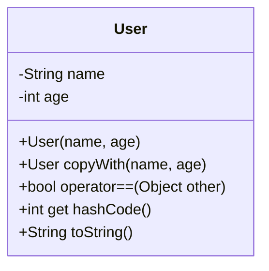

## 7.11 Data Classes and the `copyWith` Pattern

In the realm of Dart and Flutter development, managing data immutably is a crucial aspect of building robust and scalable applications. The `copyWith` pattern, in conjunction with data classes, provides a powerful mechanism to handle immutable data structures efficiently. This section delves into the intricacies of data classes and the `copyWith` pattern, offering insights into their implementation, use cases, and benefits.

### Introduction to Data Classes

Data classes in Dart are a convenient way to define classes that primarily hold data. They are characterized by their simplicity and focus on storing values rather than behavior. Data classes typically include fields, a constructor, and methods for equality comparison and string representation.

#### Key Characteristics of Data Classes

- **Fields**: Data classes consist of fields that represent the data they hold.
- **Constructors**: They often have a constructor to initialize these fields.
- **Equality and HashCode**: Overriding `==` and `hashCode` is common to ensure value equality.
- **String Representation**: Implementing `toString` for easy debugging and logging.

#### Example of a Simple Data Class

```dart
class User {
  final String name;
  final int age;

  User({required this.name, required this.age});

  @override
  bool operator ==(Object other) =>
      identical(this, other) ||
      other is User && runtimeType == other.runtimeType && name == other.name && age == other.age;

  @override
  int get hashCode => name.hashCode ^ age.hashCode;

  @override
  String toString() => 'User{name: $name, age: $age}';
}
```

### Understanding the `copyWith` Pattern

The `copyWith` pattern is a design pattern used to create modified copies of immutable objects. It allows for partial updates, meaning you can change specific fields while keeping others unchanged. This pattern is particularly useful in state management scenarios where immutability is a requirement.

#### Implementing `copyWith` Methods

To implement a `copyWith` method, you define a method within your data class that returns a new instance of the class with updated fields. The method takes optional parameters for each field, allowing you to specify which fields to update.

#### Example of a `copyWith` Method

```dart
class User {
  final String name;
  final int age;

  User({required this.name, required this.age});

  User copyWith({String? name, int? age}) {
    return User(
      name: name ?? this.name,
      age: age ?? this.age,
    );
  }

  @override
  bool operator ==(Object other) =>
      identical(this, other) ||
      other is User && runtimeType == other.runtimeType && name == other.name && age == other.age;

  @override
  int get hashCode => name.hashCode ^ age.hashCode;

  @override
  String toString() => 'User{name: $name, age: $age}';
}
```

In this example, the `copyWith` method allows you to create a new `User` object with updated `name` or `age` fields, while keeping the other fields unchanged.

### Use Cases and Examples

#### State Management

In state management patterns like Redux or BLoC, immutability is crucial for ensuring predictable state transitions. The `copyWith` pattern allows you to update the state efficiently without mutating the original state object.

##### Example: Updating State in a Redux Pattern

```dart
class AppState {
  final int counter;

  AppState({required this.counter});

  AppState copyWith({int? counter}) {
    return AppState(
      counter: counter ?? this.counter,
    );
  }
}

// Usage in a reducer
AppState reducer(AppState state, dynamic action) {
  if (action is IncrementAction) {
    return state.copyWith(counter: state.counter + 1);
  }
  return state;
}
```

In this example, the `copyWith` method is used to create a new `AppState` with an updated `counter` value, ensuring that the original state remains unchanged.

#### Immutable Models

Immutable models are essential in scenarios where data integrity and consistency are paramount. By using the `copyWith` pattern, you can modify data models without side effects, ensuring that changes are explicit and controlled.

##### Example: Modifying an Immutable Model

```dart
class Product {
  final String id;
  final String name;
  final double price;

  Product({required this.id, required this.name, required this.price});

  Product copyWith({String? id, String? name, double? price}) {
    return Product(
      id: id ?? this.id,
      name: name ?? this.name,
      price: price ?? this.price,
    );
  }
}

// Modifying a product
Product originalProduct = Product(id: '001', name: 'Laptop', price: 999.99);
Product updatedProduct = originalProduct.copyWith(price: 899.99);
```

In this example, the `copyWith` method is used to create a new `Product` with an updated `price`, while the `id` and `name` remain unchanged.

### Visualizing the `copyWith` Pattern

To better understand the `copyWith` pattern, let's visualize the process of creating a modified copy of an object using a class diagram.



This diagram illustrates the `User` class with its fields and methods, including the `copyWith` method for creating modified copies.

### Design Considerations

When implementing the `copyWith` pattern, consider the following:

- **Immutability**: Ensure that your data classes are immutable by using `final` fields and providing no setters.
- **Optional Parameters**: Use optional named parameters in the `copyWith` method to allow for partial updates.
- **Equality and HashCode**: Override `==` and `hashCode` to ensure value equality, which is crucial for comparing instances.
- **Performance**: Be mindful of performance implications when creating new instances frequently, especially in performance-critical applications.

### Differences and Similarities

The `copyWith` pattern is often compared to other patterns like the Builder pattern. While both patterns involve creating new instances, the `copyWith` pattern is specifically designed for immutable objects and partial updates, whereas the Builder pattern is more suited for constructing complex objects step-by-step.

### Try It Yourself

To solidify your understanding of the `copyWith` pattern, try modifying the code examples provided. Experiment with adding new fields to the data classes and updating them using the `copyWith` method. Observe how the pattern facilitates immutable data manipulation.

### Knowledge Check

- **Question**: What is the primary purpose of the `copyWith` pattern?
- **Challenge**: Implement a `copyWith` method for a `Book` class with fields for `title`, `author`, and `price`.

### Summary

In this section, we've explored the concept of data classes and the `copyWith` pattern in Dart. We've seen how these tools can simplify immutable data manipulation, making them invaluable in state management and data modeling scenarios. By leveraging the `copyWith` pattern, you can create efficient and predictable applications that adhere to best practices in modern software development.

### Embrace the Journey

Remember, mastering design patterns like `copyWith` is a journey. As you continue to build and refine your applications, you'll discover new ways to leverage these patterns to create more robust and maintainable code. Keep experimenting, stay curious, and enjoy the process of becoming a more proficient Dart and Flutter developer.

## Quiz Time!



### What is the primary purpose of the `copyWith` pattern?

- [x] To create modified copies of immutable objects
- [ ] To mutate existing objects directly
- [ ] To manage object lifecycles
- [ ] To enhance performance of mutable objects

> **Explanation:** The `copyWith` pattern is used to create modified copies of immutable objects, allowing for partial updates without mutating the original object.

### Which of the following is a key characteristic of data classes?

- [x] They primarily hold data
- [ ] They focus on complex behavior
- [ ] They are mutable by default
- [ ] They do not require constructors

> **Explanation:** Data classes are designed to primarily hold data, with a focus on simplicity and immutability.

### How does the `copyWith` method facilitate state management?

- [x] By allowing partial updates to state objects
- [ ] By directly mutating state objects
- [ ] By eliminating the need for state objects
- [ ] By enhancing the performance of state transitions

> **Explanation:** The `copyWith` method allows for partial updates to state objects, ensuring immutability and predictable state transitions.

### What is a common use case for the `copyWith` pattern?

- [x] Updating state in Redux or BLoC patterns
- [ ] Directly modifying UI components
- [ ] Enhancing network performance
- [ ] Managing database connections

> **Explanation:** The `copyWith` pattern is commonly used in state management scenarios like Redux or BLoC to update state immutably.

### What should be considered when implementing the `copyWith` pattern?

- [x] Immutability and performance
- [ ] Direct mutation of fields
- [ ] Avoiding constructors
- [ ] Enhancing object complexity

> **Explanation:** When implementing the `copyWith` pattern, it's important to ensure immutability and be mindful of performance implications.

### Which method is typically overridden in data classes for equality comparison?

- [x] `==`
- [ ] `toString`
- [ ] `copyWith`
- [ ] `hashCode`

> **Explanation:** The `==` operator is overridden in data classes to ensure value equality, allowing for accurate comparisons between instances.

### What is the benefit of using optional parameters in the `copyWith` method?

- [x] They allow for partial updates
- [ ] They enhance object complexity
- [ ] They eliminate the need for constructors
- [ ] They improve network performance

> **Explanation:** Optional parameters in the `copyWith` method allow for partial updates, enabling specific fields to be modified while others remain unchanged.

### How does the `copyWith` pattern differ from the Builder pattern?

- [x] `copyWith` is for immutable objects, Builder is for complex construction
- [ ] `copyWith` is for mutable objects, Builder is for immutability
- [ ] `copyWith` enhances performance, Builder simplifies code
- [ ] `copyWith` is for UI components, Builder is for data models

> **Explanation:** The `copyWith` pattern is specifically for immutable objects and partial updates, while the Builder pattern is used for constructing complex objects step-by-step.

### What is a potential performance consideration when using the `copyWith` pattern?

- [x] Frequent creation of new instances
- [ ] Direct mutation of fields
- [ ] Elimination of constructors
- [ ] Complexity of object behavior

> **Explanation:** The frequent creation of new instances can have performance implications, especially in performance-critical applications.

### True or False: The `copyWith` pattern allows for direct mutation of objects.

- [ ] True
- [x] False

> **Explanation:** False. The `copyWith` pattern does not allow for direct mutation of objects; it creates modified copies instead.


