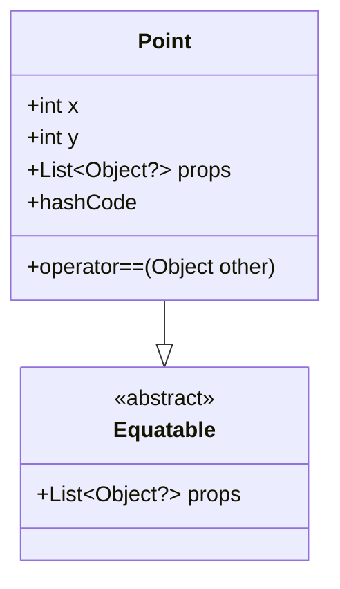

## 7.12 Equatable and Value Equality in Dart

In the world of software development, ensuring that objects are compared correctly is crucial for maintaining the integrity and efficiency of your applications. In Dart, this is particularly important when dealing with collections and state management. This section will guide you through the concepts of equatable and value equality in Dart, focusing on how to ensure correct equality comparisons, especially in collections and state management.

### Understanding Equality in Dart

Before diving into the specifics of the `equatable` package, it's essential to understand how equality works in Dart. Dart provides two types of equality:

1. **Identity Equality**: This checks if two references point to the same object in memory. It is performed using the `==` operator by default.
2. **Value Equality**: This checks if two objects have the same value, even if they are different instances. Implementing value equality requires overriding the `==` operator and the `hashCode` getter.

#### Identity Equality

Identity equality is straightforward. It checks if two variables reference the exact same object. For example:

```dart
class Point {
  final int x;
  final int y;

  Point(this.x, this.y);
}

void main() {
  var p1 = Point(1, 2);
  var p2 = Point(1, 2);
  var p3 = p1;

  print(p1 == p2); // false
  print(p1 == p3); // true
}
```

In this example, `p1` and `p2` are different instances with the same values, so `p1 == p2` returns `false`. However, `p1` and `p3` reference the same instance, so `p1 == p3` returns `true`.

#### Value Equality

To achieve value equality, you need to override the `==` operator and `hashCode` in your class. Here's how you can do it:

```dart
class Point {
  final int x;
  final int y;

  Point(this.x, this.y);

  @override
  bool operator ==(Object other) =>
      identical(this, other) ||
      other is Point &&
          runtimeType == other.runtimeType &&
          x == other.x &&
          y == other.y;

  @override
  int get hashCode => x.hashCode ^ y.hashCode;
}

void main() {
  var p1 = Point(1, 2);
  var p2 = Point(1, 2);

  print(p1 == p2); // true
}
```

In this example, `p1` and `p2` are considered equal because they have the same values for `x` and `y`.

### The Equatable Package

While overriding `==` and `hashCode` manually is possible, it can be error-prone and tedious, especially for classes with many fields. The `equatable` package simplifies this process by providing a base class that handles these overrides for you.

#### Installing Equatable

To use the `equatable` package, add it to your `pubspec.yaml` file:

```yaml
dependencies:
  equatable: ^2.0.3
```

Then, run `flutter pub get` to install the package.

#### Using Equatable

To use `equatable`, extend your class from `Equatable` and define the list of properties that should be used for equality checks.

```dart
import 'package:equatable/equatable.dart';

class Point extends Equatable {
  final int x;
  final int y;

  Point(this.x, this.y);

  @override
  List<Object?> get props => [x, y];
}

void main() {
  var p1 = Point(1, 2);
  var p2 = Point(1, 2);

  print(p1 == p2); // true
}
```

In this example, the `props` getter returns a list of properties that should be used for equality checks. The `equatable` package automatically overrides `==` and `hashCode` based on these properties.

#### Simplifying Equality

By extending the `Equatable` class, you simplify the process of implementing value equality. You no longer need to manually override `==` and `hashCode`, reducing the risk of errors and making your code cleaner and more maintainable.

### Use Cases and Examples

#### Comparing Objects

One common use case for value equality is comparing objects in unit tests or conditional statements. For example, you might want to verify that two objects are equal in a test:

```dart
import 'package:test/test.dart';

void main() {
  test('Point equality', () {
    var p1 = Point(1, 2);
    var p2 = Point(1, 2);

    expect(p1, equals(p2));
  });
}
```

In this test, `expect` checks if `p1` and `p2` are equal, which they are because they have the same values for `x` and `y`.

#### Efficiency in Collections

Using objects as keys in maps or elements in sets requires correct implementation of `==` and `hashCode`. The `equatable` package ensures that objects with the same values are treated as equal, which is crucial for collections.

```dart
void main() {
  var pointSet = <Point>{};

  var p1 = Point(1, 2);
  var p2 = Point(1, 2);

  pointSet.add(p1);
  pointSet.add(p2);

  print(pointSet.length); // 1
}
```

In this example, `pointSet` contains only one element because `p1` and `p2` are considered equal.

### Design Considerations

When using the `equatable` package, consider the following:

- **Performance**: The `equatable` package uses a list of properties to determine equality, which can impact performance for large objects or collections. Ensure that the properties included in `props` are necessary for equality checks.
- **Immutability**: Equatable works best with immutable objects. If your objects are mutable, changes to properties can affect equality checks and lead to unexpected behavior.
- **Dart Specific Features**: Dart's `identical` function is used to check if two references point to the same object. This can be useful for performance optimizations in certain scenarios.

### Differences and Similarities

The `equatable` package is often compared to other equality implementations. Here are some key differences and similarities:

- **Manual Overrides**: Manually overriding `==` and `hashCode` provides more control but is more error-prone and requires more boilerplate code.
- **Equatable vs. Built Value**: The `built_value` package also provides value equality but includes additional features like immutability and serialization. Choose the package that best fits your needs.

### Try It Yourself

To deepen your understanding, try modifying the code examples:

- Add additional properties to the `Point` class and update the `props` list.
- Create a new class that extends `Equatable` and implement value equality for it.
- Experiment with using objects as keys in maps and observe how `equatable` affects behavior.

### Visualizing Equatable and Value Equality

To better understand how equatable and value equality work, let's visualize the process using a class diagram.



**Diagram Description**: This class diagram shows the relationship between the `Point` class and the `Equatable` class. The `Point` class extends `Equatable` and overrides the `props` getter to define the properties used for equality checks.

### Knowledge Check

- What is the difference between identity equality and value equality?
- How does the `equatable` package simplify implementing value equality?
- Why is it important to correctly implement `==` and `hashCode` for objects used in collections?

### Key Takeaways

- **Identity vs. Value Equality**: Understand the difference and when to use each.
- **Equatable Package**: Simplifies value equality by automatically overriding `==` and `hashCode`.
- **Use Cases**: Essential for comparing objects in tests and using objects in collections.

Remember, mastering equality in Dart is just one step in your journey to becoming a proficient Dart and Flutter developer. Keep experimenting, stay curious, and enjoy the journey!

## Quiz Time!



### What is identity equality in Dart?

- [x] It checks if two references point to the same object in memory.
- [ ] It checks if two objects have the same value.
- [ ] It checks if two objects are of the same type.
- [ ] It checks if two objects have the same hash code.

> **Explanation:** Identity equality checks if two references point to the same object in memory, using the `==` operator by default.

### How do you achieve value equality in Dart?

- [x] By overriding the `==` operator and `hashCode`.
- [ ] By using the `identical` function.
- [ ] By using the `is` keyword.
- [ ] By using the `equatable` package without any modifications.

> **Explanation:** Value equality is achieved by overriding the `==` operator and `hashCode` to compare object values.

### What is the purpose of the `equatable` package?

- [x] To simplify the implementation of value equality.
- [ ] To provide identity equality.
- [ ] To enhance performance of Dart applications.
- [ ] To manage state in Flutter applications.

> **Explanation:** The `equatable` package simplifies the implementation of value equality by automatically overriding `==` and `hashCode`.

### Which method does the `equatable` package use to determine equality?

- [x] A list of properties defined in the `props` getter.
- [ ] The `identical` function.
- [ ] The `is` keyword.
- [ ] The `hashCode` method only.

> **Explanation:** The `equatable` package uses a list of properties defined in the `props` getter to determine equality.

### Why is it important to implement `==` and `hashCode` for objects used in collections?

- [x] To ensure objects with the same values are treated as equal.
- [ ] To improve the performance of the application.
- [ ] To enable the use of objects in asynchronous operations.
- [ ] To allow objects to be serialized.

> **Explanation:** Implementing `==` and `hashCode` ensures that objects with the same values are treated as equal, which is crucial for collections like sets and maps.

### What is a potential drawback of using the `equatable` package?

- [x] It can impact performance for large objects or collections.
- [ ] It does not support identity equality.
- [ ] It requires manual overrides of `==` and `hashCode`.
- [ ] It is incompatible with Flutter applications.

> **Explanation:** The `equatable` package can impact performance for large objects or collections due to the use of a list of properties to determine equality.

### What is the best practice when using `equatable` with mutable objects?

- [x] Avoid using `equatable` with mutable objects.
- [ ] Use `equatable` only for identity equality.
- [ ] Override `==` and `hashCode` manually.
- [ ] Use the `identical` function for equality checks.

> **Explanation:** It is best to avoid using `equatable` with mutable objects, as changes to properties can affect equality checks and lead to unexpected behavior.

### What is the `identical` function used for in Dart?

- [x] To check if two references point to the same object.
- [ ] To compare the values of two objects.
- [ ] To override the `==` operator.
- [ ] To determine the type of an object.

> **Explanation:** The `identical` function is used to check if two references point to the same object in memory.

### How does the `equatable` package affect the use of objects in collections?

- [x] It ensures objects with the same values are treated as equal.
- [ ] It prevents objects from being used as keys in maps.
- [ ] It requires manual overrides of `==` and `hashCode`.
- [ ] It enhances the performance of collections.

> **Explanation:** The `equatable` package ensures that objects with the same values are treated as equal, which is crucial for collections like sets and maps.

### True or False: The `equatable` package automatically overrides `==` and `hashCode` based on the `props` list.

- [x] True
- [ ] False

> **Explanation:** True. The `equatable` package automatically overrides `==` and `hashCode` based on the list of properties defined in the `props` getter.


