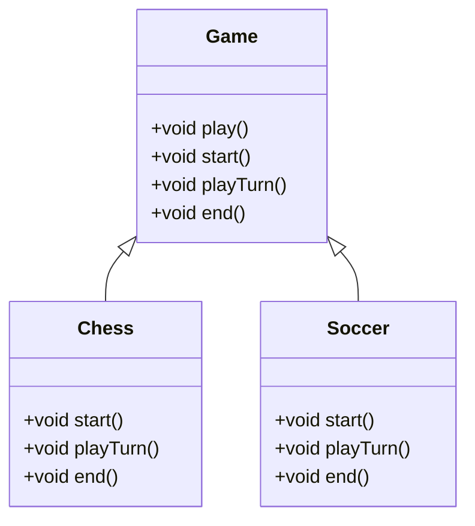

## 7.13 Slot Methods and Template Patterns

In the realm of software design, providing flexibility and extensibility is crucial for building robust and scalable applications. Slot methods and template patterns are powerful tools that allow developers to define a skeleton of an algorithm in a base class and defer some steps to subclasses. This approach provides hooks for custom behavior, enabling subclasses to override methods and inject their specific logic without altering the core algorithm. In this section, we will delve into the concepts of slot methods and template patterns, explore their implementation in Dart, and examine their use cases in Flutter development.

### Providing Hooks for Custom Behavior

Slot methods and template patterns are essential for creating flexible and maintainable codebases. By allowing subclasses to override specific methods, developers can introduce new behaviors and extend existing functionality without modifying the original code. This approach adheres to the Open/Closed Principle, one of the SOLID principles of object-oriented design, which states that software entities should be open for extension but closed for modification.

#### Implementing Slot Methods

Slot methods are abstract methods defined in a base class that subclasses must implement. They act as placeholders or "slots" for custom behavior, allowing subclasses to provide their specific implementations. This technique is particularly useful in framework design, where developers need to provide a flexible API for users to plug in their logic.

##### Defining Abstract Methods

In Dart, abstract methods are defined within abstract classes. An abstract class cannot be instantiated directly and serves as a blueprint for other classes. Let's explore how to define abstract methods in Dart:

```dart
abstract class Animal {
  // Abstract method
  void makeSound();

  // Concrete method
  void sleep() {
    print('Sleeping...');
  }
}

class Dog extends Animal {
  @override
  void makeSound() {
    print('Bark!');
  }
}

class Cat extends Animal {
  @override
  void makeSound() {
    print('Meow!');
  }
}

void main() {
  Animal dog = Dog();
  Animal cat = Cat();

  dog.makeSound(); // Output: Bark!
  cat.makeSound(); // Output: Meow!
}
```

In this example, the `Animal` class defines an abstract method `makeSound()`, which subclasses `Dog` and `Cat` must implement. This setup allows each subclass to provide its specific behavior for the `makeSound()` method.

##### Using Template Methods

Template methods are concrete methods in a base class that define the skeleton of an algorithm. They call abstract methods (slot methods) that subclasses can override to customize specific steps of the algorithm. This pattern is particularly useful when you want to define a general workflow while allowing subclasses to modify certain parts.

Let's see how to implement template methods in Dart:

```dart
abstract class Game {
  // Template method
  void play() {
    start();
    playTurn();
    end();
  }

  // Abstract methods
  void start();
  void playTurn();
  void end();
}

class Chess extends Game {
  @override
  void start() {
    print('Chess game started.');
  }

  @override
  void playTurn() {
    print('Playing a turn in chess.');
  }

  @override
  void end() {
    print('Chess game ended.');
  }
}

class Soccer extends Game {
  @override
  void start() {
    print('Soccer match started.');
  }

  @override
  void playTurn() {
    print('Playing a turn in soccer.');
  }

  @override
  void end() {
    print('Soccer match ended.');
  }
}

void main() {
  Game chess = Chess();
  Game soccer = Soccer();

  chess.play();
  // Output:
  // Chess game started.
  // Playing a turn in chess.
  // Chess game ended.

  soccer.play();
  // Output:
  // Soccer match started.
  // Playing a turn in soccer.
  // Soccer match ended.
}
```

In this example, the `Game` class defines a template method `play()`, which outlines the steps of playing a game. The `Chess` and `Soccer` classes provide specific implementations for the abstract methods `start()`, `playTurn()`, and `end()`, allowing each game to have its unique behavior.

### Use Cases and Examples

Slot methods and template patterns are widely used in various software development scenarios. Let's explore some common use cases and examples where these patterns shine.

#### Framework Design

Frameworks often need to provide a flexible API that allows developers to plug in their custom logic. Slot methods and template patterns are ideal for this purpose, as they enable developers to extend the framework's functionality without modifying its core code.

For instance, consider a UI framework that provides a base class for creating custom widgets. The framework can define abstract methods for rendering and handling user interactions, allowing developers to implement their specific logic in subclasses.

```dart
abstract class CustomWidget {
  // Template method
  void render() {
    draw();
    handleInput();
  }

  // Abstract methods
  void draw();
  void handleInput();
}

class Button extends CustomWidget {
  @override
  void draw() {
    print('Drawing a button.');
  }

  @override
  void handleInput() {
    print('Handling button input.');
  }
}

class TextField extends CustomWidget {
  @override
  void draw() {
    print('Drawing a text field.');
  }

  @override
  void handleInput() {
    print('Handling text field input.');
  }
}

void main() {
  CustomWidget button = Button();
  CustomWidget textField = TextField();

  button.render();
  // Output:
  // Drawing a button.
  // Handling button input.

  textField.render();
  // Output:
  // Drawing a text field.
  // Handling text field input.
}
```

In this example, the `CustomWidget` class provides a template method `render()`, which calls abstract methods `draw()` and `handleInput()`. The `Button` and `TextField` classes implement these methods to provide their specific rendering and input handling logic.

#### Extensibility

Slot methods and template patterns enable developers to introduce new behaviors and extend existing functionality without modifying the original code. This approach is particularly useful in large codebases where changes to core components can have widespread effects.

Consider a logging system that allows developers to customize the format and destination of log messages. By defining abstract methods for formatting and writing logs, the system can be easily extended to support new formats and destinations.

```dart
abstract class Logger {
  // Template method
  void log(String message) {
    String formattedMessage = format(message);
    write(formattedMessage);
  }

  // Abstract methods
  String format(String message);
  void write(String message);
}

class ConsoleLogger extends Logger {
  @override
  String format(String message) {
    return 'Console: $message';
  }

  @override
  void write(String message) {
    print(message);
  }
}

class FileLogger extends Logger {
  @override
  String format(String message) {
    return 'File: $message';
  }

  @override
  void write(String message) {
    // Simulate writing to a file
    print('Writing to file: $message');
  }
}

void main() {
  Logger consoleLogger = ConsoleLogger();
  Logger fileLogger = FileLogger();

  consoleLogger.log('Hello, World!');
  // Output:
  // Console: Hello, World!

  fileLogger.log('Hello, World!');
  // Output:
  // Writing to file: File: Hello, World!
}
```

In this example, the `Logger` class defines a template method `log()`, which formats and writes log messages. The `ConsoleLogger` and `FileLogger` classes provide specific implementations for the `format()` and `write()` methods, allowing logs to be formatted and written in different ways.

### Visualizing Slot Methods and Template Patterns

To better understand the structure and flow of slot methods and template patterns, let's visualize the relationships between the base class and its subclasses using Mermaid.js diagrams.

#### Class Diagram for Slot Methods and Template Patterns



In this class diagram, the `Game` class serves as the base class with abstract methods `start()`, `playTurn()`, and `end()`. The `Chess` and `Soccer` classes inherit from `Game` and provide their specific implementations for these methods.

### Design Considerations

When implementing slot methods and template patterns, it's essential to consider the following design considerations:

- **When to Use**: Use slot methods and template patterns when you need to define a general workflow or algorithm while allowing subclasses to customize specific steps. This approach is ideal for framework design and scenarios where extensibility is crucial.

- **Avoid Overuse**: While slot methods and template patterns provide flexibility, overusing them can lead to complex and hard-to-maintain code. Use these patterns judiciously and only when necessary.

- **Dart-Specific Features**: Dart's support for abstract classes and methods makes it well-suited for implementing slot methods and template patterns. Leverage Dart's language features to create clean and efficient implementations.

### Differences and Similarities

Slot methods and template patterns are often compared to other design patterns, such as strategy and state patterns. While they share some similarities, there are key differences:

- **Slot Methods vs. Strategy Pattern**: Both patterns allow for customization, but the strategy pattern involves selecting a specific algorithm at runtime, while slot methods define a fixed algorithm with customizable steps.

- **Template Pattern vs. State Pattern**: The template pattern defines a fixed workflow with customizable steps, while the state pattern allows an object to change its behavior based on its state.

### Try It Yourself

To solidify your understanding of slot methods and template patterns, try modifying the code examples provided in this section. Experiment with adding new subclasses, changing the behavior of existing methods, or introducing additional abstract methods. This hands-on approach will help you grasp the concepts and apply them to your projects.

### Knowledge Check

Before we conclude, let's summarize the key takeaways from this section:

- Slot methods and template patterns provide hooks for custom behavior, allowing subclasses to override methods and inject their specific logic.
- Abstract methods in Dart are defined within abstract classes and must be implemented by subclasses.
- Template methods define the skeleton of an algorithm, calling abstract methods that subclasses can override.
- These patterns are widely used in framework design and scenarios where extensibility is crucial.
- Use slot methods and template patterns judiciously to avoid complex and hard-to-maintain code.

### Embrace the Journey

Remember, mastering design patterns is a journey, not a destination. As you continue to explore and experiment with slot methods and template patterns, you'll gain a deeper understanding of their power and versatility. Keep experimenting, stay curious, and enjoy the journey!

## Quiz Time!



### What is the primary purpose of slot methods in Dart?

- [x] To provide hooks for custom behavior
- [ ] To define a fixed algorithm
- [ ] To manage state transitions
- [ ] To handle user input

> **Explanation:** Slot methods provide hooks for custom behavior by allowing subclasses to override methods and inject their specific logic.

### Which of the following is a key characteristic of template methods?

- [x] They define the skeleton of an algorithm
- [ ] They select an algorithm at runtime
- [ ] They manage object state
- [ ] They handle user input

> **Explanation:** Template methods define the skeleton of an algorithm and call abstract methods that subclasses can override.

### In Dart, where are abstract methods defined?

- [x] Within abstract classes
- [ ] Within concrete classes
- [ ] Within interfaces
- [ ] Within mixins

> **Explanation:** Abstract methods in Dart are defined within abstract classes and must be implemented by subclasses.

### What is a common use case for slot methods and template patterns?

- [x] Framework design
- [ ] State management
- [ ] User authentication
- [ ] Data serialization

> **Explanation:** Slot methods and template patterns are commonly used in framework design to provide a flexible API for developers to plug in their custom logic.

### How do slot methods and template patterns adhere to the Open/Closed Principle?

- [x] By allowing software entities to be open for extension but closed for modification
- [ ] By managing object state transitions
- [ ] By selecting algorithms at runtime
- [ ] By handling user input

> **Explanation:** Slot methods and template patterns adhere to the Open/Closed Principle by allowing software entities to be extended with new behaviors without modifying existing code.

### What is a potential drawback of overusing slot methods and template patterns?

- [x] Complex and hard-to-maintain code
- [ ] Limited customization options
- [ ] Poor performance
- [ ] Lack of flexibility

> **Explanation:** Overusing slot methods and template patterns can lead to complex and hard-to-maintain code, so they should be used judiciously.

### Which pattern is often compared to slot methods and template patterns?

- [x] Strategy pattern
- [ ] Singleton pattern
- [ ] Observer pattern
- [ ] Factory pattern

> **Explanation:** The strategy pattern is often compared to slot methods and template patterns, as both allow for customization, but they differ in their approach.

### What is the role of a template method in a base class?

- [x] To define the skeleton of an algorithm
- [ ] To manage object state transitions
- [ ] To handle user input
- [ ] To select an algorithm at runtime

> **Explanation:** A template method in a base class defines the skeleton of an algorithm and calls abstract methods that subclasses can override.

### How can developers experiment with slot methods and template patterns?

- [x] By modifying code examples and adding new subclasses
- [ ] By using them exclusively in state management
- [ ] By avoiding them in framework design
- [ ] By implementing them only in concrete classes

> **Explanation:** Developers can experiment with slot methods and template patterns by modifying code examples, adding new subclasses, and changing the behavior of existing methods.

### True or False: Slot methods and template patterns are only useful in small codebases.

- [ ] True
- [x] False

> **Explanation:** Slot methods and template patterns are useful in both small and large codebases, especially in scenarios where extensibility and flexibility are crucial.


