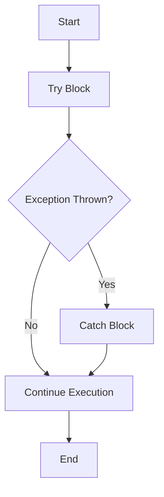

## 7.14 Effective Error Handling in Dart

In the world of software development, errors are inevitable. However, how we handle these errors can make the difference between a robust application and a fragile one. Dart, with its rich set of features, provides developers with powerful tools to manage errors effectively. In this section, we will explore various strategies for error handling in Dart, focusing on writing robust applications by anticipating and handling errors gracefully.

### Writing Robust Applications

Robust applications are those that can handle unexpected situations without crashing. This involves anticipating potential errors and implementing strategies to manage them. In Dart, error handling is primarily done through exceptions. Exceptions are events that disrupt the normal flow of a program. By handling these exceptions, we can ensure that our applications continue to function smoothly even when things go wrong.

#### Implementing Error Handling

Let's delve into the core techniques for implementing error handling in Dart.

##### Try-Catch Blocks

The most common way to handle exceptions in Dart is by using try-catch blocks. This construct allows us to capture exceptions and handle them appropriately.

```dart
void main() {
  try {
    int result = 10 ~/ 0; // This will throw an exception
    print(result);
  } catch (e) {
    print('An error occurred: $e');
  }
}
```

In the example above, the division by zero operation throws an exception. The try block captures this exception, and the catch block handles it by printing an error message. This prevents the application from crashing and allows us to provide meaningful feedback to the user.

##### Custom Exceptions

While Dart provides a set of built-in exceptions, it's often useful to define custom exceptions that are specific to your application's domain. This can make your error handling more precise and your code more readable.

```dart
class InvalidInputException implements Exception {
  final String message;
  InvalidInputException(this.message);

  @override
  String toString() => 'InvalidInputException: $message';
}

void validateInput(int input) {
  if (input < 0) {
    throw InvalidInputException('Input must be non-negative');
  }
}

void main() {
  try {
    validateInput(-1);
  } catch (e) {
    print(e);
  }
}
```

In this example, we define a custom exception `InvalidInputException` to handle invalid inputs. This allows us to throw and catch exceptions that are specific to our application's logic.

##### Asynchronous Error Handling

Dart's support for asynchronous programming introduces additional complexity in error handling. When dealing with asynchronous operations, we can use `catchError` or try-catch blocks with async functions to manage exceptions.

###### Using `catchError`

The `catchError` method is used with Futures to handle errors in asynchronous operations.

```dart
Future<int> fetchData() async {
  return Future.delayed(Duration(seconds: 2), () => throw Exception('Network error'));
}

void main() {
  fetchData().then((value) {
    print('Data: $value');
  }).catchError((error) {
    print('Caught error: $error');
  });
}
```

In this example, `fetchData` simulates a network request that throws an exception. The `catchError` method is used to handle the exception, allowing us to manage errors in a non-blocking manner.

###### Using Try-Catch with Async Functions

We can also use try-catch blocks within async functions to handle errors.

```dart
Future<void> fetchData() async {
  try {
    int data = await Future.delayed(Duration(seconds: 2), () => throw Exception('Network error'));
    print('Data: $data');
  } catch (e) {
    print('Caught error: $e');
  }
}

void main() {
  fetchData();
}
```

Here, the try-catch block is used within the async function `fetchData` to handle exceptions. This approach is often more readable and aligns with synchronous error handling patterns.

### Use Cases and Examples

To better understand error handling in Dart, let's explore some common use cases and examples.

#### Network Failures

Network operations are prone to failures due to various reasons such as timeouts or unreachable servers. Handling these errors gracefully is crucial for providing a good user experience.

```dart
import 'dart:io';

Future<void> fetchDataFromServer() async {
  try {
    final response = await HttpClient().getUrl(Uri.parse('https://example.com/data'));
    // Process response
  } on SocketException {
    print('No Internet connection.');
  } on HttpException {
    print('Could not find the data.');
  } catch (e) {
    print('Unexpected error: $e');
  }
}

void main() {
  fetchDataFromServer();
}
```

In this example, we handle different types of exceptions that may occur during a network request. By providing specific error messages, we can inform the user about the nature of the problem.

#### User Input Validation

Validating user input is another common scenario where error handling is essential. Providing meaningful feedback helps users correct their mistakes and improves the overall user experience.

```dart
void processInput(String input) {
  try {
    if (input.isEmpty) {
      throw InvalidInputException('Input cannot be empty');
    }
    int value = int.parse(input);
    print('Processed value: $value');
  } on FormatException {
    print('Invalid number format.');
  } catch (e) {
    print('Error: $e');
  }
}

void main() {
  processInput('abc'); // Invalid number format
  processInput('');    // Input cannot be empty
}
```

Here, we validate the user input and handle different types of errors, such as empty input and invalid number format, by providing specific error messages.

### Visualizing Error Handling in Dart

To better understand the flow of error handling in Dart, let's visualize it using a flowchart.



This flowchart illustrates the basic structure of error handling in Dart using try-catch blocks. The program attempts to execute the code in the try block. If an exception is thrown, it is caught and handled in the catch block. If no exception occurs, the program continues execution.

### Best Practices for Error Handling in Dart

To ensure effective error handling in your Dart applications, consider the following best practices:

- **Anticipate Errors**: Identify potential error scenarios and plan how to handle them.
- **Use Specific Exceptions**: Catch specific exceptions rather than using a generic catch-all approach. This allows for more precise error handling.
- **Provide Meaningful Feedback**: Inform users about errors in a clear and helpful manner.
- **Log Errors**: Keep a log of errors for debugging and monitoring purposes.
- **Avoid Silent Failures**: Ensure that errors are not silently ignored, as this can lead to unexpected behavior.
- **Test Error Handling**: Write tests to verify that your error handling logic works as expected.

### Try It Yourself

To reinforce your understanding of error handling in Dart, try modifying the code examples provided. Experiment with different types of exceptions and error scenarios. For instance, you can:

- Create additional custom exceptions and use them in your code.
- Simulate network failures by throwing different types of exceptions.
- Implement error handling for file I/O operations.

### Knowledge Check

Before we conclude, let's review some key takeaways:

- Dart provides powerful tools for error handling, including try-catch blocks, custom exceptions, and asynchronous error management.
- Effective error handling involves anticipating potential errors and providing meaningful feedback to users.
- Best practices include using specific exceptions, logging errors, and testing error handling logic.

### Embrace the Journey

Remember, mastering error handling is a crucial step in becoming a proficient Dart developer. As you continue to build more complex applications, you'll encounter new challenges and opportunities to refine your skills. Keep experimenting, stay curious, and enjoy the journey!

## Quiz Time!



### What is the primary construct used for error handling in Dart?

- [x] Try-Catch Blocks
- [ ] If-Else Statements
- [ ] Switch Cases
- [ ] Loops

> **Explanation:** Try-catch blocks are used to capture and handle exceptions in Dart.

### Which method is used to handle errors in asynchronous operations with Futures?

- [x] catchError
- [ ] then
- [ ] finally
- [ ] await

> **Explanation:** The catchError method is used to handle errors in asynchronous operations with Futures.

### What is the purpose of custom exceptions in Dart?

- [x] To define domain-specific error types
- [ ] To replace built-in exceptions
- [ ] To simplify error handling
- [ ] To improve performance

> **Explanation:** Custom exceptions allow developers to define error types specific to their application's domain, making error handling more precise.

### How can you handle network failures in Dart?

- [x] By using try-catch blocks to catch SocketException and HttpException
- [ ] By ignoring errors
- [ ] By using if-else statements
- [ ] By using loops

> **Explanation:** Network failures can be handled by using try-catch blocks to catch specific exceptions like SocketException and HttpException.

### What should you do to ensure effective error handling?

- [x] Anticipate errors and plan how to handle them
- [ ] Ignore errors
- [ ] Use generic catch-all approaches
- [ ] Avoid logging errors

> **Explanation:** Anticipating errors and planning how to handle them is crucial for effective error handling.

### Which of the following is a best practice for error handling?

- [x] Log errors for debugging and monitoring
- [ ] Ignore errors
- [ ] Use silent failures
- [ ] Avoid testing error handling logic

> **Explanation:** Logging errors is a best practice for debugging and monitoring purposes.

### What is the benefit of providing meaningful feedback to users?

- [x] It helps users correct their mistakes
- [ ] It hides errors from users
- [ ] It simplifies error handling
- [ ] It improves performance

> **Explanation:** Providing meaningful feedback helps users understand and correct their mistakes.

### Why should you avoid silent failures?

- [x] They can lead to unexpected behavior
- [ ] They improve performance
- [ ] They simplify error handling
- [ ] They are a best practice

> **Explanation:** Silent failures can lead to unexpected behavior and should be avoided.

### What is the role of testing in error handling?

- [x] To verify that error handling logic works as expected
- [ ] To ignore errors
- [ ] To simplify error handling
- [ ] To improve performance

> **Explanation:** Testing ensures that error handling logic works as expected and helps identify potential issues.

### True or False: Custom exceptions can replace built-in exceptions in Dart.

- [ ] True
- [x] False

> **Explanation:** Custom exceptions are used to define domain-specific error types and do not replace built-in exceptions.




