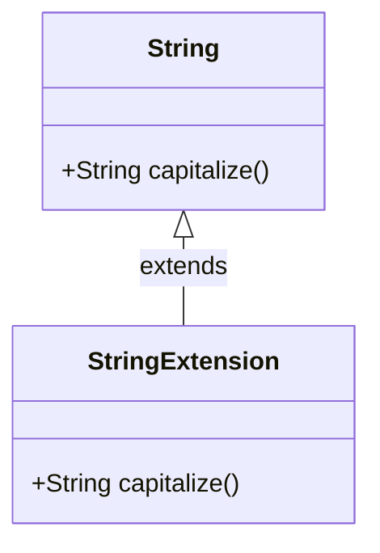

## 7.2 Effective Use of Extension Methods

In the world of software development, the ability to extend existing functionality without modifying the original source code is a powerful tool. Dart, with its modern language features, provides a mechanism called **extension methods** that allows developers to add new capabilities to existing classes seamlessly. This section will guide you through the effective use of extension methods in Dart, illustrating how they can enhance your Flutter applications.

### Adding New Functionality to Existing Classes

One of the primary benefits of extension methods is their ability to add new functionality to existing classes without altering their source code. This is particularly useful when working with third-party libraries or built-in Dart classes where direct modification is not possible or advisable.

#### Implementing Extension Methods in Dart

To implement extension methods in Dart, you need to understand the syntax and structure that Dart provides. Let's break down the process:

##### Defining Extensions

In Dart, you define an extension using the `extension` keyword followed by a name and the `on` keyword to specify the type you are extending. Here is a basic example:

```dart
extension StringExtension on String {
  // Method to capitalize the first letter of a string
  String capitalize() {
    if (this.isEmpty) return this;
    return this[0].toUpperCase() + this.substring(1);
  }
}
```

In this example, we define an extension `StringExtension` on the `String` type, adding a method `capitalize` that capitalizes the first letter of the string.

##### Accessing Extended Methods

Once an extension is defined, you can access its methods as if they are part of the original class:

```dart
void main() {
  String text = "hello world";
  print(text.capitalize()); // Output: Hello world
}
```

This seamless integration allows you to enhance existing classes with new methods that feel native to the class.

##### Namespace Management

When using extension methods, it's crucial to manage namespaces to avoid conflicts with existing methods. Dart resolves method calls by first checking the class's own methods before considering extensions. If two extensions provide the same method, you may need to use explicit imports or prefixes to resolve conflicts.

```dart
import 'string_extension.dart' as ext;

void main() {
  String text = "hello world";
  print(ext.StringExtension(text).capitalize());
}
```

By using a prefix, you can specify which extension to use, ensuring that your code remains clear and conflict-free.

### Use Cases and Examples

Extension methods are versatile and can be applied in various scenarios. Let's explore some common use cases:

#### Utility Functions

One of the most common uses of extension methods is to add utility functions to built-in types like `String`, `List`, or `DateTime`. These functions can simplify your code by encapsulating repetitive logic.

```dart
extension ListExtension<T> on List<T> {
  // Method to get the last element safely
  T? safeLast() {
    return this.isNotEmpty ? this.last : null;
  }
}

void main() {
  List<int> numbers = [1, 2, 3];
  print(numbers.safeLast()); // Output: 3

  List<int> emptyList = [];
  print(emptyList.safeLast()); // Output: null
}
```

In this example, we add a `safeLast` method to `List` that returns the last element if the list is not empty, or `null` otherwise.

#### Domain-Specific Extensions

Extension methods can also be tailored to your application's domain, adding methods that are specific to your business logic or data models.

```dart
class Order {
  final double amount;
  final DateTime date;

  Order(this.amount, this.date);
}

extension OrderExtension on Order {
  // Method to check if the order is recent
  bool isRecent() {
    return date.isAfter(DateTime.now().subtract(Duration(days: 30)));
  }
}

void main() {
  Order order = Order(150.0, DateTime.now().subtract(Duration(days: 10)));
  print(order.isRecent()); // Output: true
}
```

Here, we extend the `Order` class with an `isRecent` method that checks if the order was placed within the last 30 days.

### Visualizing Extension Methods

To better understand how extension methods integrate with existing classes, let's visualize the process using a class diagram.



**Diagram Description:** This class diagram illustrates how the `StringExtension` extends the `String` class by adding a `capitalize` method. The `String` class remains unchanged, while the extension provides additional functionality.

### Try It Yourself

To fully grasp the power of extension methods, try modifying the examples provided. Here are some suggestions:

- Add a method to the `String` extension that reverses the string.
- Create an extension on `DateTime` that formats the date as `YYYY-MM-DD`.
- Extend the `List` class with a method that returns a new list containing only the even numbers.

### References and Links

For further reading on extension methods and Dart programming, consider the following resources:

- [Dart Language Tour](https://dart.dev/guides/language/language-tour#extension-methods)
- [Effective Dart: Usage](https://dart.dev/guides/language/effective-dart/usage)
- [Flutter Documentation](https://flutter.dev/docs)

### Knowledge Check

Before we conclude, let's reinforce what we've learned:

- What is the primary benefit of using extension methods in Dart?
- How do you define an extension method?
- How can you avoid method conflicts when using multiple extensions?

### Embrace the Journey

Remember, mastering extension methods is just one step in your journey to becoming a proficient Dart and Flutter developer. Keep experimenting, stay curious, and enjoy the process of learning and building amazing applications.

### Quiz Time!



### What is the primary benefit of using extension methods in Dart?

- [x] Adding new functionality to existing classes without modifying their source code
- [ ] Improving performance of existing methods
- [ ] Reducing memory usage
- [ ] Simplifying syntax for existing methods

> **Explanation:** Extension methods allow you to add new functionality to existing classes without altering their source code, making them highly versatile.

### How do you define an extension method in Dart?

- [x] Using the `extension` keyword followed by a name and `on` type
- [ ] Using the `extend` keyword followed by a class name
- [ ] Using the `class` keyword with a new class definition
- [ ] Using the `implements` keyword with an interface

> **Explanation:** The `extension` keyword is used to define an extension method, specifying the type it extends with the `on` keyword.

### How can you avoid method conflicts when using multiple extensions?

- [x] Use explicit imports or prefixes
- [ ] Avoid using extensions altogether
- [ ] Rename existing methods
- [ ] Use a different programming language

> **Explanation:** Explicit imports or prefixes help manage namespaces and avoid conflicts when multiple extensions provide the same method.

### Which of the following is a common use case for extension methods?

- [x] Adding utility functions to built-in types
- [ ] Creating new classes from scratch
- [ ] Modifying existing class definitions
- [ ] Improving application security

> **Explanation:** Extension methods are often used to add utility functions to built-in types, simplifying code and encapsulating logic.

### What is the output of the following code snippet?

```dart
extension StringExtension on String {
  String reverse() {
    return this.split('').reversed.join('');
  }
}

void main() {
  String text = "dart";
  print(text.reverse());
}
```

- [x] trad
- [ ] dart
- [ ] error
- [ ] null

> **Explanation:** The `reverse` method splits the string into characters, reverses them, and joins them back, resulting in "trad".

### What keyword is used to specify the type an extension is applied to?

- [x] on
- [ ] for
- [ ] with
- [ ] to

> **Explanation:** The `on` keyword is used to specify the type that an extension method is applied to.

### Can extension methods override existing methods in a class?

- [ ] Yes
- [x] No

> **Explanation:** Extension methods cannot override existing methods in a class; they only add new functionality.

### What happens if two extensions provide the same method name?

- [ ] The program crashes
- [ ] The first extension is used
- [x] You need to resolve the conflict using explicit imports or prefixes
- [ ] The second extension is used

> **Explanation:** When two extensions provide the same method, you must resolve the conflict using explicit imports or prefixes.

### Which of the following is NOT a benefit of using extension methods?

- [ ] Adding new functionality to existing classes
- [ ] Keeping code organized
- [x] Increasing execution speed
- [ ] Avoiding code duplication

> **Explanation:** While extension methods offer many benefits, they do not inherently increase execution speed.

### True or False: Extension methods can be used to modify the internal state of an object.

- [ ] True
- [x] False

> **Explanation:** Extension methods cannot modify the internal state of an object; they can only add new methods.



By mastering extension methods, you unlock a powerful tool in Dart that enhances your ability to write clean, maintainable, and efficient code. Keep exploring and applying these concepts to your projects, and you'll continue to grow as a developer.
