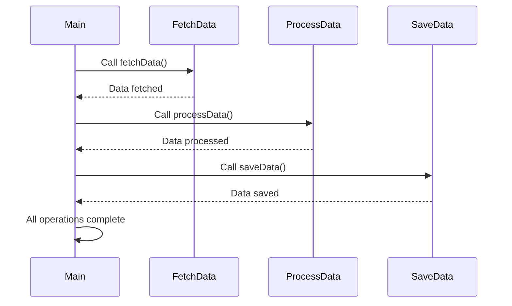

## 7.3 Futures and Async Patterns

In the realm of modern software development, handling asynchronous operations efficiently is crucial. Dart, with its robust support for asynchronous programming, provides developers with powerful tools to manage these operations seamlessly. This section delves into the intricacies of Futures and Async Patterns in Dart, offering a comprehensive guide to mastering asynchronous programming.

### Handling Asynchronous Operations Gracefully

Asynchronous programming allows applications to perform tasks without blocking the main execution thread. This is particularly important in Flutter applications, where maintaining a smooth user interface is paramount. Dart's `Future` and `async`/`await` keywords simplify the process of writing asynchronous code, making it more readable and maintainable.

#### Implementing Async Code in Dart

##### Using `async` and `await` Keywords

The `async` and `await` keywords in Dart transform asynchronous code into a more synchronous-looking structure, enhancing readability and reducing complexity.

- **`async` Keyword**: Marks a function as asynchronous, allowing it to use `await` within its body.
- **`await` Keyword**: Pauses the execution of the function until the awaited `Future` completes, returning the result.

Here's a simple example to illustrate the use of `async` and `await`:

```dart
Future<void> fetchData() async {
  print('Fetching data...');
  // Simulate a network request
  await Future.delayed(Duration(seconds: 2));
  print('Data fetched successfully!');
}

void main() async {
  await fetchData();
  print('Operation complete.');
}
```

In this example, the `fetchData` function simulates a network request using `Future.delayed`. The `await` keyword pauses the execution until the simulated delay completes, ensuring that the subsequent print statement executes only after the data is fetched.

##### Error Handling in Async Functions

Handling errors in asynchronous functions is crucial to prevent unexpected crashes and ensure robust applications. Dart provides the `try-catch` block to manage exceptions in async functions.

```dart
Future<void> fetchDataWithErrorHandling() async {
  try {
    print('Fetching data...');
    // Simulate a network request that throws an error
    await Future.delayed(Duration(seconds: 2), () {
      throw Exception('Failed to fetch data');
    });
  } catch (e) {
    print('Error: $e');
  }
}

void main() async {
  await fetchDataWithErrorHandling();
  print('Operation complete.');
}
```

In this example, the `fetchDataWithErrorHandling` function simulates a network request that throws an exception. The `try-catch` block captures the exception, allowing the program to handle it gracefully without terminating unexpectedly.

##### Chaining Futures

Chaining Futures is a technique used to manage sequences of asynchronous operations, ensuring that each operation completes before the next one begins.

```dart
Future<void> fetchData() {
  return Future.delayed(Duration(seconds: 2), () {
    print('Data fetched');
  });
}

Future<void> processData() {
  return Future.delayed(Duration(seconds: 1), () {
    print('Data processed');
  });
}

Future<void> saveData() {
  return Future.delayed(Duration(seconds: 1), () {
    print('Data saved');
  });
}

void main() {
  fetchData()
      .then((_) => processData())
      .then((_) => saveData())
      .then((_) => print('All operations complete'))
      .catchError((error) {
        print('Error: $error');
      });
}
```

In this example, `fetchData`, `processData`, and `saveData` are chained using the `then` method. This ensures that each operation completes before the next one begins, maintaining a logical flow of asynchronous tasks.

### Use Cases and Examples

#### Network Requests

Network requests are a common use case for asynchronous programming. Dart's `http` package simplifies the process of making HTTP requests and handling responses asynchronously.

```dart
import 'dart:convert';
import 'package:http/http.dart' as http;

Future<void> fetchUserData() async {
  final response = await http.get(Uri.parse('https://jsonplaceholder.typicode.com/users/1'));

  if (response.statusCode == 200) {
    final data = jsonDecode(response.body);
    print('User Name: ${data['name']}');
  } else {
    throw Exception('Failed to load user data');
  }
}

void main() async {
  try {
    await fetchUserData();
    print('User data fetched successfully');
  } catch (e) {
    print('Error: $e');
  }
}
```

In this example, the `fetchUserData` function makes an HTTP GET request to fetch user data. The `await` keyword ensures that the function waits for the response before proceeding. The response is then decoded and printed to the console.

#### File IO Operations

File IO operations, such as reading and writing files, are inherently asynchronous. Dart's `dart:io` library provides tools to handle these operations efficiently.

```dart
import 'dart:io';

Future<void> readFile() async {
  final file = File('example.txt');

  try {
    final contents = await file.readAsString();
    print('File Contents: $contents');
  } catch (e) {
    print('Error reading file: $e');
  }
}

Future<void> writeFile() async {
  final file = File('example.txt');

  try {
    await file.writeAsString('Hello, Dart!');
    print('File written successfully');
  } catch (e) {
    print('Error writing file: $e');
  }
}

void main() async {
  await writeFile();
  await readFile();
}
```

In this example, the `writeFile` function writes a string to a file asynchronously, while the `readFile` function reads the file's contents. Both functions use `await` to ensure that the file operations complete before proceeding.

### Visualizing Asynchronous Operations

To better understand the flow of asynchronous operations, let's visualize the sequence of events using a Mermaid.js sequence diagram.



This diagram illustrates the sequence of asynchronous operations, highlighting the flow from fetching data to processing and saving it.

### Knowledge Check

Before we conclude, let's reinforce our understanding with a few questions:

1. What is the purpose of the `async` keyword in Dart?
2. How does the `await` keyword affect the execution of an asynchronous function?
3. What is the role of the `try-catch` block in async functions?
4. How can you chain multiple Futures in Dart?
5. Why is asynchronous programming important in Flutter applications?

### Embrace the Journey

Remember, mastering asynchronous programming in Dart is a journey. As you continue to explore and experiment with Futures and Async Patterns, you'll gain a deeper understanding of how to build efficient, responsive applications. Keep experimenting, stay curious, and enjoy the journey!

## Quiz Time!



### What is the primary purpose of the `async` keyword in Dart?

- [x] To mark a function as asynchronous, allowing the use of `await`.
- [ ] To pause the execution of a function.
- [ ] To handle errors in asynchronous functions.
- [ ] To chain multiple Futures together.

> **Explanation:** The `async` keyword is used to mark a function as asynchronous, enabling the use of `await` within its body.

### How does the `await` keyword affect the execution of an asynchronous function?

- [x] It pauses the execution until the awaited `Future` completes.
- [ ] It marks a function as asynchronous.
- [ ] It handles errors in asynchronous functions.
- [ ] It chains multiple Futures together.

> **Explanation:** The `await` keyword pauses the execution of an asynchronous function until the awaited `Future` completes, allowing the function to resume with the result.

### What is the role of the `try-catch` block in async functions?

- [x] To handle exceptions and errors gracefully.
- [ ] To pause the execution of a function.
- [ ] To chain multiple Futures together.
- [ ] To mark a function as asynchronous.

> **Explanation:** The `try-catch` block is used to handle exceptions and errors in async functions, preventing the program from crashing unexpectedly.

### How can you chain multiple Futures in Dart?

- [x] Using the `then` method.
- [ ] Using the `async` keyword.
- [ ] Using the `await` keyword.
- [ ] Using the `try-catch` block.

> **Explanation:** The `then` method is used to chain multiple Futures in Dart, ensuring that each operation completes before the next one begins.

### Why is asynchronous programming important in Flutter applications?

- [x] To maintain a smooth user interface by preventing blocking operations.
- [ ] To handle errors in asynchronous functions.
- [ ] To mark functions as asynchronous.
- [ ] To chain multiple Futures together.

> **Explanation:** Asynchronous programming is crucial in Flutter applications to maintain a smooth user interface by preventing blocking operations that could cause the UI to freeze.

### What does the `Future.delayed` function do in Dart?

- [x] Simulates a delay before completing a Future.
- [ ] Marks a function as asynchronous.
- [ ] Handles errors in asynchronous functions.
- [ ] Chains multiple Futures together.

> **Explanation:** The `Future.delayed` function simulates a delay before completing a Future, often used to mimic network requests or time-consuming operations.

### Which package is commonly used for making HTTP requests in Dart?

- [x] `http`
- [ ] `dart:io`
- [ ] `async`
- [ ] `flutter`

> **Explanation:** The `http` package is commonly used for making HTTP requests in Dart, providing tools to handle network operations asynchronously.

### What is the purpose of the `File` class in Dart?

- [x] To perform file IO operations asynchronously.
- [ ] To handle HTTP requests.
- [ ] To mark functions as asynchronous.
- [ ] To chain multiple Futures together.

> **Explanation:** The `File` class in Dart is used to perform file IO operations asynchronously, such as reading and writing files.

### How can you handle errors in a Future chain?

- [x] Using the `catchError` method.
- [ ] Using the `async` keyword.
- [ ] Using the `await` keyword.
- [ ] Using the `File` class.

> **Explanation:** The `catchError` method is used to handle errors in a Future chain, allowing the program to manage exceptions gracefully.

### True or False: The `await` keyword can be used outside of an `async` function.

- [ ] True
- [x] False

> **Explanation:** The `await` keyword can only be used within an `async` function, as it requires the function to be marked as asynchronous.


