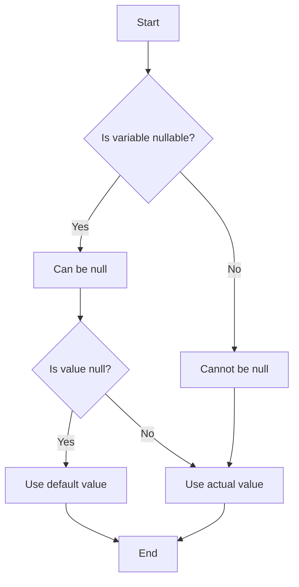

## 7.4 Null Safety and Avoiding Null Reference Errors

Null reference errors have long been a bane for developers, often leading to unexpected crashes and bugs. Dart's null safety feature aims to eliminate these errors by ensuring that variables cannot contain null values unless explicitly allowed. This section will guide you through understanding and implementing null safety in Dart, enhancing your code's safety and reliability.

### Preventing Null Reference Exceptions at Compile Time

Null safety in Dart is a powerful feature that prevents null reference exceptions at compile time, rather than at runtime. This proactive approach ensures that potential null-related issues are caught early in the development process, reducing the likelihood of runtime errors.

#### Implementing Null Safety in Dart

Dart's null safety is built around the concept of nullable and non-nullable types, null-aware operators, and late variables. Let's explore each of these components in detail.

##### Nullable and Non-Nullable Types

In Dart, every variable is either nullable or non-nullable. By default, variables are non-nullable, meaning they cannot hold a null value. To allow a variable to be null, you must explicitly declare it as nullable by appending a question mark (`?`) to its type.

```dart
// Non-nullable variable
int nonNullableInt = 42;

// Nullable variable
int? nullableInt = null;
```

In the above example, `nonNullableInt` is a non-nullable integer, while `nullableInt` is a nullable integer that can hold a null value.

##### Null-Aware Operators

Dart provides several null-aware operators to handle nullable values gracefully:

- **`?` (Null-aware access operator):** Safely access a member of an object that might be null.

```dart
String? name;
print(name?.length); // Prints: null
```

- **`!` (Null assertion operator):** Assert that a nullable expression is non-null.

```dart
String? nullableName = 'Dart';
print(nullableName!.length); // Prints: 4
```

- **`??` (Null-coalescing operator):** Provide a default value if the expression is null.

```dart
String? name;
print(name ?? 'Default Name'); // Prints: Default Name
```

- **`??=` (Null-aware assignment operator):** Assign a value only if the variable is null.

```dart
String? name;
name ??= 'Assigned Name';
print(name); // Prints: Assigned Name
```

##### Late Variables

Late variables in Dart allow you to defer the initialization of a non-nullable variable until it is accessed for the first time. This is particularly useful for variables that are initialized asynchronously or depend on other computations.

```dart
late String description;

void initializeDescription() {
  description = 'This is a late variable';
}

void main() {
  initializeDescription();
  print(description); // Prints: This is a late variable
}
```

### Use Cases and Examples

Let's explore some practical use cases and examples to understand how null safety can be effectively implemented in Dart.

#### Optional Parameters

In Dart, you can define optional parameters in functions, which can either be positional or named. By default, optional parameters are nullable, but you can provide default values to ensure they are non-nullable.

```dart
void greet(String name, [String? title]) {
  print('Hello, ${title ?? 'Mr./Ms.'} $name');
}

greet('Alice'); // Prints: Hello, Mr./Ms. Alice
greet('Bob', 'Dr.'); // Prints: Hello, Dr. Bob
```

In the above example, the `title` parameter is optional and nullable. If not provided, it defaults to 'Mr./Ms.'.

#### Defensive Programming

Defensive programming involves writing code that anticipates and handles potential null values, ensuring that your functions behave correctly even when faced with unexpected inputs.

```dart
int calculateLength(String? text) {
  return text?.length ?? 0;
}

void main() {
  print(calculateLength('Dart')); // Prints: 4
  print(calculateLength(null)); // Prints: 0
}
```

In this example, the `calculateLength` function safely handles a nullable `text` parameter, returning 0 if `text` is null.

### Visualizing Null Safety in Dart

To better understand how null safety works in Dart, let's visualize the flow of null-aware operations using a flowchart.



**Figure 1: Flowchart of Null Safety Operations in Dart**

This flowchart illustrates the decision-making process when dealing with nullable and non-nullable variables in Dart. It highlights how null-aware operators provide default values or safely access members of nullable objects.

### References and Links

For further reading on Dart's null safety, consider exploring the following resources:

- [Dart Null Safety Overview](https://dart.dev/null-safety)
- [Null Safety in Dart: A Deep Dive](https://medium.com/dartlang/understanding-null-safety-in-dart-1e8e8e8e8e8e)
- [Effective Dart: Null Safety](https://dart.dev/guides/language/effective-dart/null-safety)

### Knowledge Check

To reinforce your understanding of null safety in Dart, consider the following questions:

1. What is the primary purpose of null safety in Dart?
2. How do you declare a nullable variable in Dart?
3. What is the role of the null-aware access operator (`?`)?
4. How does the null-coalescing operator (`??`) work?
5. When would you use a late variable in Dart?

### Embrace the Journey

Remember, mastering null safety is just one step in your journey to becoming a proficient Dart developer. As you continue to explore Dart and Flutter, you'll discover more features and patterns that enhance your code's reliability and performance. Keep experimenting, stay curious, and enjoy the journey!

### Formatting and Structure

Organize your code with clear headings and subheadings, and use bullet points to break down complex information. Highlight important terms or concepts using bold or italic text sparingly.

### Writing Style

Use first-person plural (we, let's) to create a collaborative feel, and avoid gender-specific pronouns. Define acronyms and abbreviations upon first use.

## Quiz Time!



### What is the primary purpose of null safety in Dart?

- [x] To prevent null reference exceptions at compile time
- [ ] To allow variables to hold null values by default
- [ ] To make all variables nullable
- [ ] To eliminate the need for error handling

> **Explanation:** Null safety in Dart is designed to prevent null reference exceptions at compile time, enhancing code reliability.

### How do you declare a nullable variable in Dart?

- [ ] By using the `late` keyword
- [x] By appending a question mark (`?`) to the type
- [ ] By using the `!` operator
- [ ] By using the `??` operator

> **Explanation:** In Dart, you declare a nullable variable by appending a question mark (`?`) to its type.

### What is the role of the null-aware access operator (`?`)?

- [x] To safely access a member of an object that might be null
- [ ] To assert that a nullable expression is non-null
- [ ] To provide a default value if the expression is null
- [ ] To assign a value only if the variable is null

> **Explanation:** The null-aware access operator (`?`) is used to safely access a member of an object that might be null.

### How does the null-coalescing operator (`??`) work?

- [ ] It asserts that a nullable expression is non-null
- [ ] It safely accesses a member of an object that might be null
- [x] It provides a default value if the expression is null
- [ ] It assigns a value only if the variable is null

> **Explanation:** The null-coalescing operator (`??`) provides a default value if the expression is null.

### When would you use a late variable in Dart?

- [ ] When you want a variable to be nullable
- [x] When you want to defer initialization until the variable is accessed
- [ ] When you want to provide a default value
- [ ] When you want to safely access a member of an object

> **Explanation:** Late variables in Dart are used to defer initialization until the variable is accessed for the first time.

### What does the `??=` operator do in Dart?

- [ ] It asserts that a nullable expression is non-null
- [ ] It safely accesses a member of an object that might be null
- [ ] It provides a default value if the expression is null
- [x] It assigns a value only if the variable is null

> **Explanation:** The `??=` operator assigns a value to a variable only if the variable is null.

### What is the default state of variables in Dart regarding nullability?

- [x] Non-nullable
- [ ] Nullable
- [ ] Late
- [ ] Null

> **Explanation:** By default, variables in Dart are non-nullable.

### How can you ensure a function parameter is non-nullable?

- [ ] By using the `late` keyword
- [x] By not appending a question mark (`?`) to the type
- [ ] By using the `!` operator
- [ ] By using the `??` operator

> **Explanation:** To ensure a function parameter is non-nullable, do not append a question mark (`?`) to its type.

### What is defensive programming in the context of null safety?

- [ ] Writing code that allows null values
- [x] Writing code that anticipates and handles potential null values
- [ ] Writing code that defers initialization
- [ ] Writing code that uses null-aware operators

> **Explanation:** Defensive programming involves writing code that anticipates and handles potential null values, ensuring functions behave correctly.

### True or False: Late variables can be initialized at any time before they are accessed.

- [x] True
- [ ] False

> **Explanation:** Late variables in Dart can be initialized at any time before they are accessed, allowing for deferred initialization.




