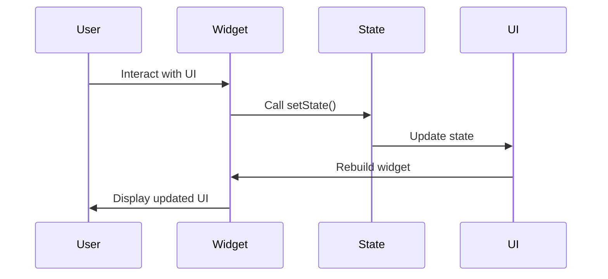

## 7.5 Handling State in Flutter Applications

In the world of Flutter development, managing application state is crucial for creating dynamic and responsive user interfaces. As Flutter applications grow in complexity, so does the need for effective state management strategies. In this section, we will explore various approaches to handling state in Flutter applications, focusing on stateful and stateless widgets, lifting state up, and practical use cases such as form inputs and animations.

### Understanding State in Flutter

Before diving into specific strategies, it's essential to understand what "state" means in the context of Flutter. In Flutter, state refers to any data that can change over time and affect the UI. This can include user inputs, animations, or data fetched from a network.

#### Stateful vs. Stateless Widgets

Flutter provides two types of widgets to manage state: **Stateful Widgets** and **Stateless Widgets**.

- **Stateless Widgets**: These widgets do not have any mutable state. They are immutable and are used when the UI does not depend on any data that might change over time. Examples include static text or images.

- **Stateful Widgets**: These widgets maintain a mutable state that can change during the widget's lifecycle. They are used when the UI needs to update dynamically in response to user interactions or other events.

### Implementing State Management

#### Stateful Widgets: Using `setState()`

Stateful widgets are the backbone of dynamic UIs in Flutter. They allow you to update the UI in response to changes in state. The `setState()` method is used to notify the framework that the state has changed and the widget should be rebuilt.

```dart
import 'package:flutter/material.dart';

class CounterWidget extends StatefulWidget {
  @override
  _CounterWidgetState createState() => _CounterWidgetState();
}

class _CounterWidgetState extends State<CounterWidget> {
  int _counter = 0;

  void _incrementCounter() {
    setState(() {
      _counter++;
    });
  }

  @override
  Widget build(BuildContext context) {
    return Column(
      mainAxisAlignment: MainAxisAlignment.center,
      children: <Widget>[
        Text('You have pushed the button this many times:'),
        Text(
          '$_counter',
          style: Theme.of(context).textTheme.headline4,
        ),
        ElevatedButton(
          onPressed: _incrementCounter,
          child: Text('Increment'),
        ),
      ],
    );
  }
}
```

In this example, the `_counter` variable is part of the widget's state. The `setState()` method is called whenever the button is pressed, causing the widget to rebuild and display the updated counter value.

#### Stateless Widgets: When UI Does Not Depend on Mutable State

Stateless widgets are used when the UI does not need to change dynamically. They are simple and efficient, as they do not require any state management.

```dart
import 'package:flutter/material.dart';

class GreetingWidget extends StatelessWidget {
  final String greeting;

  GreetingWidget({required this.greeting});

  @override
  Widget build(BuildContext context) {
    return Text(greeting);
  }
}
```

In this example, the `GreetingWidget` is a stateless widget that displays a static greeting message. Since the message does not change, there's no need for state management.

#### Lifting State Up: Sharing State Among Multiple Widgets

In Flutter, it's common to have multiple widgets that need to share the same state. This is where the concept of "lifting state up" comes into play. The idea is to move the state to the nearest common ancestor of the widgets that need to access it.

```dart
import 'package:flutter/material.dart';

class ParentWidget extends StatefulWidget {
  @override
  _ParentWidgetState createState() => _ParentWidgetState();
}

class _ParentWidgetState extends State<ParentWidget> {
  bool _isActive = false;

  void _toggleActive() {
    setState(() {
      _isActive = !_isActive;
    });
  }

  @override
  Widget build(BuildContext context) {
    return Column(
      children: <Widget>[
        ChildWidget(
          isActive: _isActive,
          onToggle: _toggleActive,
        ),
      ],
    );
  }
}

class ChildWidget extends StatelessWidget {
  final bool isActive;
  final VoidCallback onToggle;

  ChildWidget({required this.isActive, required this.onToggle});

  @override
  Widget build(BuildContext context) {
    return GestureDetector(
      onTap: onToggle,
      child: Container(
        color: isActive ? Colors.green : Colors.red,
        child: Text(isActive ? 'Active' : 'Inactive'),
      ),
    );
  }
}
```

In this example, the `ParentWidget` manages the `_isActive` state and passes it down to the `ChildWidget` along with a callback to toggle the state. This allows the `ChildWidget` to update the state without directly managing it.

### Use Cases and Examples

#### Form Inputs and Validation: Handling User Input Dynamically

Forms are a common use case for state management in Flutter applications. Handling user input and validation requires maintaining the state of form fields and responding to changes.

```dart
import 'package:flutter/material.dart';

class LoginForm extends StatefulWidget {
  @override
  _LoginFormState createState() => _LoginFormState();
}

class _LoginFormState extends State<LoginForm> {
  final _formKey = GlobalKey<FormState>();
  String _email = '';
  String _password = '';

  void _submitForm() {
    if (_formKey.currentState!.validate()) {
      _formKey.currentState!.save();
      // Process data
    }
  }

  @override
  Widget build(BuildContext context) {
    return Form(
      key: _formKey,
      child: Column(
        children: <Widget>[
          TextFormField(
            decoration: InputDecoration(labelText: 'Email'),
            validator: (value) {
              if (value == null || value.isEmpty) {
                return 'Please enter your email';
              }
              return null;
            },
            onSaved: (value) {
              _email = value!;
            },
          ),
          TextFormField(
            decoration: InputDecoration(labelText: 'Password'),
            obscureText: true,
            validator: (value) {
              if (value == null || value.isEmpty) {
                return 'Please enter your password';
              }
              return null;
            },
            onSaved: (value) {
              _password = value!;
            },
          ),
          ElevatedButton(
            onPressed: _submitForm,
            child: Text('Submit'),
          ),
        ],
      ),
    );
  }
}
```

In this example, the `LoginForm` widget uses a `GlobalKey` to manage the form's state. The `TextFormField` widgets handle user input and validation, while the `onSaved` callbacks update the state variables `_email` and `_password`.

#### Animating Widgets: Reacting to Changes in State Over Time

Animations are another area where state management is crucial. Flutter provides powerful animation APIs that allow you to create smooth and responsive animations based on changes in state.

```dart
import 'package:flutter/material.dart';

class AnimatedBox extends StatefulWidget {
  @override
  _AnimatedBoxState createState() => _AnimatedBoxState();
}

class _AnimatedBoxState extends State<AnimatedBox>
    with SingleTickerProviderStateMixin {
  late AnimationController _controller;
  late Animation<double> _animation;

  @override
  void initState() {
    super.initState();
    _controller = AnimationController(
      duration: const Duration(seconds: 2),
      vsync: this,
    )..repeat(reverse: true);

    _animation = CurvedAnimation(
      parent: _controller,
      curve: Curves.easeInOut,
    );
  }

  @override
  void dispose() {
    _controller.dispose();
    super.dispose();
  }

  @override
  Widget build(BuildContext context) {
    return AnimatedBuilder(
      animation: _animation,
      builder: (context, child) {
        return Transform.scale(
          scale: _animation.value,
          child: child,
        );
      },
      child: Container(
        width: 100,
        height: 100,
        color: Colors.blue,
      ),
    );
  }
}
```

In this example, the `AnimatedBox` widget uses an `AnimationController` to manage the animation state. The `AnimatedBuilder` widget rebuilds the UI whenever the animation value changes, creating a smooth scaling effect.

### Visualizing State Management in Flutter

To better understand how state management works in Flutter, let's visualize the flow of state changes and widget rebuilding using a sequence diagram.



This diagram illustrates the typical flow of state changes in a Flutter application. The user interacts with the UI, triggering a state change via `setState()`. The state is updated, and the widget is rebuilt to reflect the changes.

### Best Practices for State Management

- **Keep State Localized**: Whenever possible, keep state localized to the widget that needs it. This reduces complexity and makes the code easier to maintain.

- **Use InheritedWidget for Shared State**: When multiple widgets need to access the same state, consider using an `InheritedWidget` to share the state efficiently.

- **Avoid Excessive Rebuilding**: Minimize the number of widgets that need to be rebuilt by keeping the widget tree shallow and using `const` constructors where possible.

- **Leverage Flutter's Built-in Widgets**: Flutter provides a rich set of widgets for managing state, such as `ValueNotifier` and `ChangeNotifier`. Use these widgets to simplify state management.

### Try It Yourself

To solidify your understanding of state management in Flutter, try modifying the code examples provided. For instance, you can:

- Add a reset button to the `CounterWidget` example to reset the counter to zero.
- Implement additional form fields and validation rules in the `LoginForm` example.
- Experiment with different animation curves and durations in the `AnimatedBox` example.

### Knowledge Check

- What is the difference between stateful and stateless widgets?
- How does the `setState()` method work in Flutter?
- What is the purpose of lifting state up in Flutter applications?
- How can you handle form validation in Flutter?
- What are some best practices for managing state in Flutter applications?

### Conclusion

Managing state in Flutter applications is a fundamental skill for creating dynamic and responsive UIs. By understanding the differences between stateful and stateless widgets, lifting state up, and implementing practical use cases, you can build robust Flutter applications with ease. Remember, mastering state management is an ongoing journey. Keep experimenting, stay curious, and enjoy the process!

## Quiz Time!



### What is the primary difference between stateful and stateless widgets in Flutter?

- [x] Stateful widgets maintain a mutable state, while stateless widgets do not.
- [ ] Stateless widgets can update their state, while stateful widgets cannot.
- [ ] Stateful widgets are used for static content, while stateless widgets are for dynamic content.
- [ ] Stateless widgets require more resources than stateful widgets.

> **Explanation:** Stateful widgets maintain a mutable state that can change over time, whereas stateless widgets do not have any mutable state.

### How does the `setState()` method function in a stateful widget?

- [x] It notifies the framework that the state has changed and the widget should be rebuilt.
- [ ] It permanently changes the widget's state without rebuilding.
- [ ] It resets the widget's state to its initial value.
- [ ] It updates the widget's state without notifying the framework.

> **Explanation:** The `setState()` method is used to notify the framework that the state has changed, prompting the widget to rebuild.

### What is the purpose of lifting state up in Flutter applications?

- [x] To share state among multiple widgets by moving it to the nearest common ancestor.
- [ ] To reduce the number of widgets in the widget tree.
- [ ] To isolate state within individual widgets.
- [ ] To increase the performance of the application.

> **Explanation:** Lifting state up involves moving state to the nearest common ancestor of widgets that need to access it, allowing for shared state management.

### Which widget is commonly used for form validation in Flutter?

- [x] `Form`
- [ ] `Container`
- [ ] `Column`
- [ ] `Row`

> **Explanation:** The `Form` widget is used to group form fields and manage form validation in Flutter.

### What is a best practice for minimizing widget rebuilding in Flutter?

- [x] Use `const` constructors where possible.
- [ ] Avoid using stateful widgets.
- [ ] Keep all state in a global variable.
- [ ] Use only stateless widgets.

> **Explanation:** Using `const` constructors helps minimize widget rebuilding by allowing Flutter to reuse widget instances.

### How can you share state efficiently among multiple widgets in Flutter?

- [x] Use an `InheritedWidget`.
- [ ] Use a global variable.
- [ ] Use a `StatelessWidget`.
- [ ] Use a `Container`.

> **Explanation:** An `InheritedWidget` allows you to efficiently share state among multiple widgets in the widget tree.

### What is a common use case for stateful widgets in Flutter?

- [x] Handling user interactions that change the UI.
- [ ] Displaying static text.
- [ ] Rendering images.
- [ ] Creating layout structures.

> **Explanation:** Stateful widgets are commonly used for handling user interactions that result in UI changes.

### Which method is used to dispose of resources in a stateful widget?

- [x] `dispose()`
- [ ] `initState()`
- [ ] `setState()`
- [ ] `build()`

> **Explanation:** The `dispose()` method is used to release resources when a stateful widget is removed from the widget tree.

### What is the role of an `AnimationController` in Flutter animations?

- [x] It manages the animation's state and controls its duration and playback.
- [ ] It renders the animation on the screen.
- [ ] It defines the animation's visual appearance.
- [ ] It handles user input during the animation.

> **Explanation:** An `AnimationController` manages the state of an animation, including its duration and playback.

### True or False: Stateless widgets can update their UI in response to user interactions.

- [ ] True
- [x] False

> **Explanation:** Stateless widgets cannot update their UI in response to user interactions because they do not maintain any mutable state.


