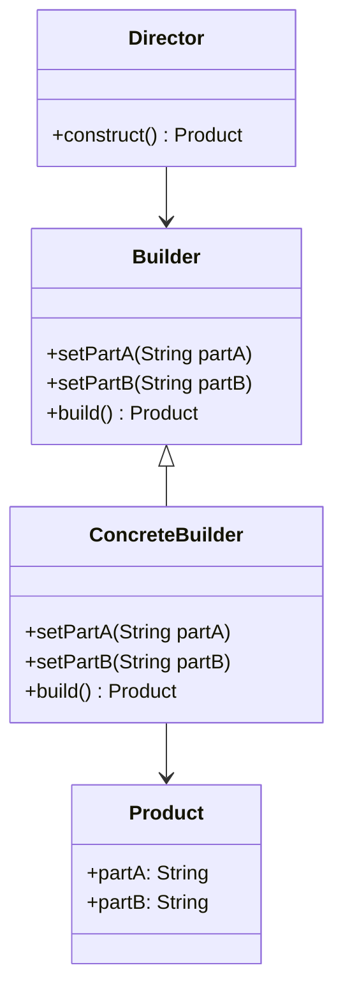

## 7.6 Builder Pattern with Fluent Interfaces

In the realm of software design, creating objects with flexible configurations is a common requirement. The Builder Pattern, coupled with Fluent Interfaces, offers a powerful solution to this challenge. This section delves into the intricacies of the Builder Pattern with Fluent Interfaces in Dart, providing you with the tools to construct complex objects with ease and clarity.

### Understanding the Builder Pattern

**Design Pattern Name:** Builder Pattern  
**Category:** Creational Design Pattern  
**Intent:** The Builder Pattern aims to separate the construction of a complex object from its representation, allowing the same construction process to create different representations.

#### Key Participants

- **Builder**: Specifies an abstract interface for creating parts of a Product object.
- **ConcreteBuilder**: Constructs and assembles parts of the product by implementing the Builder interface. It defines and keeps track of the representation it creates and provides an interface for retrieving the product.
- **Director**: Constructs an object using the Builder interface.
- **Product**: Represents the complex object under construction.

#### Applicability

Use the Builder Pattern when:

- The algorithm for creating a complex object should be independent of the parts that make up the object and how they're assembled.
- The construction process must allow different representations for the object that's constructed.

### Implementing Fluent Interfaces in Dart

Fluent Interfaces enhance the readability of code by allowing method chaining, where each method returns the current object (`this`), enabling a sequence of method calls to be linked together.

#### Method Chaining

Method chaining is a technique where each method returns the current object, allowing multiple method calls to be chained together. This approach is particularly useful in Dart for creating fluent interfaces.

```dart
class QueryBuilder {
  String _query = '';

  QueryBuilder select(String fields) {
    _query += 'SELECT $fields ';
    return this;
  }

  QueryBuilder from(String table) {
    _query += 'FROM $table ';
    return this;
  }

  QueryBuilder where(String condition) {
    _query += 'WHERE $condition ';
    return this;
  }

  String build() {
    return _query.trim();
  }
}

void main() {
  var query = QueryBuilder()
      .select('name, age')
      .from('users')
      .where('age > 18')
      .build();

  print(query); // Outputs: SELECT name, age FROM users WHERE age > 18
}
```

**Explanation:** In the above example, the `QueryBuilder` class uses method chaining to build a SQL query. Each method modifies the internal state and returns `this`, allowing calls to be chained.

#### Builder Classes

Builder classes encapsulate the construction of complex objects, providing a clear and flexible way to create instances with various configurations.

```dart
class Pizza {
  final String dough;
  final String sauce;
  final String topping;

  Pizza._builder(PizzaBuilder builder)
      : dough = builder._dough,
        sauce = builder._sauce,
        topping = builder._topping;

  @override
  String toString() {
    return 'Pizza with $dough dough, $sauce sauce, and $topping topping';
  }
}

class PizzaBuilder {
  String _dough = 'regular';
  String _sauce = 'tomato';
  String _topping = 'cheese';

  PizzaBuilder setDough(String dough) {
    _dough = dough;
    return this;
  }

  PizzaBuilder setSauce(String sauce) {
    _sauce = sauce;
    return this;
  }

  PizzaBuilder setTopping(String topping) {
    _topping = topping;
    return this;
  }

  Pizza build() {
    return Pizza._builder(this);
  }
}

void main() {
  var pizza = PizzaBuilder()
      .setDough('thin')
      .setSauce('pesto')
      .setTopping('pepperoni')
      .build();

  print(pizza); // Outputs: Pizza with thin dough, pesto sauce, and pepperoni topping
}
```

**Explanation:** The `PizzaBuilder` class encapsulates the construction of a `Pizza` object. It provides methods to set various properties and a `build` method to create the final `Pizza` instance.

### Use Cases and Examples

#### Creating Complex Widgets

In Flutter, creating complex widgets often requires configuring multiple properties. The Builder Pattern with Fluent Interfaces can simplify this process.

```dart
class CustomButton {
  final String label;
  final Color color;
  final double width;
  final double height;

  CustomButton._builder(CustomButtonBuilder builder)
      : label = builder._label,
        color = builder._color,
        width = builder._width,
        height = builder._height;

  @override
  String toString() {
    return 'CustomButton(label: $label, color: $color, width: $width, height: $height)';
  }
}

class CustomButtonBuilder {
  String _label = 'Button';
  Color _color = Colors.blue;
  double _width = 100.0;
  double _height = 50.0;

  CustomButtonBuilder setLabel(String label) {
    _label = label;
    return this;
  }

  CustomButtonBuilder setColor(Color color) {
    _color = color;
    return this;
  }

  CustomButtonBuilder setWidth(double width) {
    _width = width;
    return this;
  }

  CustomButtonBuilder setHeight(double height) {
    _height = height;
    return this;
  }

  CustomButton build() {
    return CustomButton._builder(this);
  }
}

void main() {
  var button = CustomButtonBuilder()
      .setLabel('Submit')
      .setColor(Colors.green)
      .setWidth(120.0)
      .setHeight(60.0)
      .build();

  print(button); // Outputs: CustomButton(label: Submit, color: Color(0xff00ff00), width: 120.0, height: 60.0)
}
```

**Explanation:** The `CustomButtonBuilder` class allows for the flexible configuration of a `CustomButton` widget, demonstrating the power of the Builder Pattern with Fluent Interfaces in UI development.

#### Setting Up Network Requests

Configuring network requests often involves setting multiple parameters. The Builder Pattern with Fluent Interfaces can streamline this process.

```dart
class NetworkRequest {
  final String url;
  final String method;
  final Map<String, String> headers;
  final String body;

  NetworkRequest._builder(NetworkRequestBuilder builder)
      : url = builder._url,
        method = builder._method,
        headers = builder._headers,
        body = builder._body;

  @override
  String toString() {
    return 'NetworkRequest(url: $url, method: $method, headers: $headers, body: $body)';
  }
}

class NetworkRequestBuilder {
  String _url = '';
  String _method = 'GET';
  Map<String, String> _headers = {};
  String _body = '';

  NetworkRequestBuilder setUrl(String url) {
    _url = url;
    return this;
  }

  NetworkRequestBuilder setMethod(String method) {
    _method = method;
    return this;
  }

  NetworkRequestBuilder addHeader(String key, String value) {
    _headers[key] = value;
    return this;
  }

  NetworkRequestBuilder setBody(String body) {
    _body = body;
    return this;
  }

  NetworkRequest build() {
    return NetworkRequest._builder(this);
  }
}

void main() {
  var request = NetworkRequestBuilder()
      .setUrl('https://api.example.com/data')
      .setMethod('POST')
      .addHeader('Content-Type', 'application/json')
      .setBody('{"key": "value"}')
      .build();

  print(request); // Outputs: NetworkRequest(url: https://api.example.com/data, method: POST, headers: {Content-Type: application/json}, body: {"key": "value"})
}
```

**Explanation:** The `NetworkRequestBuilder` class provides a fluent interface for configuring network requests, making it easy to set various parameters.

### Visualizing the Builder Pattern with Fluent Interfaces

To better understand the Builder Pattern with Fluent Interfaces, let's visualize the process using a class diagram.



**Diagram Description:** This class diagram illustrates the relationship between the Builder, ConcreteBuilder, Director, and Product classes. The ConcreteBuilder implements the Builder interface, and the Director uses the Builder to construct a Product.

### Design Considerations

When implementing the Builder Pattern with Fluent Interfaces in Dart, consider the following:

- **Immutability**: Ensure that the final product is immutable to prevent unintended modifications.
- **Validation**: Implement validation logic within the builder to ensure that the constructed object is in a valid state.
- **Complexity**: Use the Builder Pattern for objects with multiple optional parameters or complex construction logic.

### Differences and Similarities

The Builder Pattern is often confused with the Factory Method Pattern. While both are creational patterns, the Builder Pattern focuses on constructing complex objects step by step, whereas the Factory Method Pattern deals with creating objects without specifying the exact class of object that will be created.

### Try It Yourself

Experiment with the Builder Pattern and Fluent Interfaces by modifying the code examples provided. Try adding new methods to the builders, changing the order of method calls, or creating new builder classes for different use cases.

### Knowledge Check

- What is the primary intent of the Builder Pattern?
- How does method chaining enhance the readability of code?
- What are some common use cases for the Builder Pattern with Fluent Interfaces in Dart?

### Embrace the Journey

Remember, mastering design patterns is a journey. As you continue to explore the Builder Pattern with Fluent Interfaces, you'll gain a deeper understanding of how to create flexible and maintainable code. Keep experimenting, stay curious, and enjoy the journey!

## Quiz Time!



### What is the primary intent of the Builder Pattern?

- [x] To separate the construction of a complex object from its representation
- [ ] To create objects without specifying the exact class
- [ ] To provide a way to access the elements of an aggregate object sequentially
- [ ] To define an interface for creating a single object

> **Explanation:** The Builder Pattern's primary intent is to separate the construction of a complex object from its representation, allowing the same construction process to create different representations.

### How does method chaining enhance code readability?

- [x] By allowing multiple method calls to be linked together
- [ ] By reducing the number of lines of code
- [ ] By making code execution faster
- [ ] By enforcing strict typing

> **Explanation:** Method chaining enhances code readability by allowing multiple method calls to be linked together, creating a fluent interface that is easy to read and understand.

### Which class in the Builder Pattern is responsible for constructing the object?

- [ ] Product
- [ ] Builder
- [x] ConcreteBuilder
- [ ] Director

> **Explanation:** The ConcreteBuilder class is responsible for constructing and assembling parts of the product by implementing the Builder interface.

### What is a common use case for the Builder Pattern with Fluent Interfaces in Dart?

- [ ] Creating simple objects with few parameters
- [x] Configuring complex widgets in Flutter
- [ ] Implementing singleton objects
- [ ] Managing state in Flutter applications

> **Explanation:** A common use case for the Builder Pattern with Fluent Interfaces in Dart is configuring complex widgets in Flutter, where multiple properties need to be set.

### What should the final product of a builder be?

- [x] Immutable
- [ ] Mutable
- [ ] Dynamic
- [ ] Static

> **Explanation:** The final product of a builder should be immutable to prevent unintended modifications and ensure consistency.

### What is the difference between the Builder Pattern and the Factory Method Pattern?

- [x] The Builder Pattern constructs complex objects step by step, while the Factory Method Pattern creates objects without specifying the exact class
- [ ] The Builder Pattern is used for creating single objects, while the Factory Method Pattern is used for creating multiple objects
- [ ] The Builder Pattern is a structural pattern, while the Factory Method Pattern is a behavioral pattern
- [ ] The Builder Pattern is used for creating immutable objects, while the Factory Method Pattern is used for creating mutable objects

> **Explanation:** The Builder Pattern constructs complex objects step by step, whereas the Factory Method Pattern deals with creating objects without specifying the exact class of object that will be created.

### What is a key consideration when implementing the Builder Pattern?

- [x] Implementing validation logic within the builder
- [ ] Ensuring the builder is a singleton
- [ ] Using inheritance to extend the builder
- [ ] Avoiding method chaining

> **Explanation:** A key consideration when implementing the Builder Pattern is to implement validation logic within the builder to ensure that the constructed object is in a valid state.

### What is the role of the Director class in the Builder Pattern?

- [x] To construct an object using the Builder interface
- [ ] To define the parts of the product
- [ ] To implement the Builder interface
- [ ] To provide an interface for retrieving the product

> **Explanation:** The Director class constructs an object using the Builder interface, orchestrating the construction process.

### How can you experiment with the Builder Pattern and Fluent Interfaces?

- [x] By modifying the code examples, adding new methods, and creating new builder classes
- [ ] By using the builder pattern for all object creation
- [ ] By avoiding the use of method chaining
- [ ] By implementing the builder pattern in a single class

> **Explanation:** You can experiment with the Builder Pattern and Fluent Interfaces by modifying the code examples, adding new methods, and creating new builder classes for different use cases.

### True or False: The Builder Pattern is only applicable to Dart and Flutter.

- [ ] True
- [x] False

> **Explanation:** False. The Builder Pattern is a general design pattern applicable to many programming languages and frameworks, not just Dart and Flutter.




