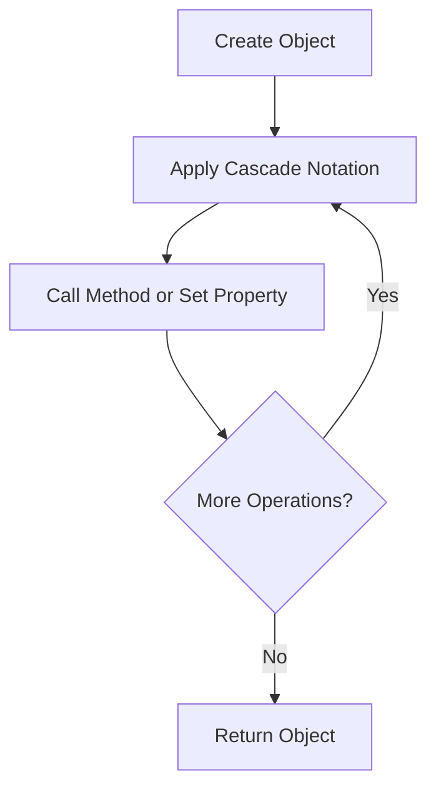

## 7.7 Dart's Cascade Notation and Method Chaining

In the realm of Dart programming, particularly when working with Flutter, the ability to write clean, concise, and expressive code is paramount. Dart's cascade notation and method chaining are powerful tools that enable developers to perform multiple operations on the same object without repeating the object reference. This section will delve into these concepts, providing a comprehensive understanding of their syntax, use cases, and best practices.

### Understanding Cascade Notation

The cascade notation in Dart is represented by the `..` operator. It allows you to perform a sequence of operations on the same object, enhancing code readability and reducing redundancy. This operator is particularly useful when you need to call multiple methods or set multiple properties on an object.

#### Syntax of Cascade Notation

The cascade notation is straightforward to use. You apply the `..` operator before method calls or property assignments. Here's a basic example:

```dart
class Car {
  String color;
  int speed;

  void accelerate(int increment) {
    speed += increment;
  }

  void repaint(String newColor) {
    color = newColor;
  }
}

void main() {
  var myCar = Car()
    ..color = 'Red'
    ..speed = 0
    ..accelerate(10)
    ..repaint('Blue');
}
```

In this example, the `Car` object `myCar` is initialized and then modified using the cascade notation. The `..` operator allows us to set the `color` and `speed` properties and call the `accelerate` and `repaint` methods in a single, fluent expression.

#### Combining Cascade Notation with Constructors

One of the strengths of cascade notation is its ability to combine with constructors. This feature allows you to initialize and configure an object in one concise expression, which is particularly useful in Flutter when dealing with complex widget trees.

```dart
class Person {
  String name;
  int age;

  Person(this.name, this.age);

  void celebrateBirthday() {
    age++;
  }
}

void main() {
  var person = Person('Alice', 30)
    ..celebrateBirthday()
    ..name = 'Alice Cooper';
}
```

Here, we create a `Person` object and immediately call the `celebrateBirthday` method and update the `name` property using the cascade notation. This approach keeps the code clean and easy to follow.

### Use Cases and Examples

Cascade notation is versatile and can be applied in various scenarios. Let's explore some common use cases where this feature shines.

#### Initializing Widgets in Flutter

In Flutter, widgets are the building blocks of the user interface. Often, you need to set multiple properties on a widget, and cascade notation can simplify this process.

```dart
Widget build(BuildContext context) {
  return Container()
    ..width = 100
    ..height = 100
    ..color = Colors.blue
    ..alignment = Alignment.center;
}
```

In this example, a `Container` widget is configured with multiple properties using the cascade notation. This approach reduces boilerplate code and improves readability.

#### Configuring Objects in Unit Tests

When writing unit tests, you often need to set up objects with specific states. Cascade notation can streamline this setup process.

```dart
void main() {
  test('Car should accelerate correctly', () {
    var car = Car()
      ..speed = 0
      ..accelerate(20);

    expect(car.speed, equals(20));
  });
}
```

In this test case, the `Car` object is configured using cascade notation, making the test setup concise and focused on the test logic.

### Method Chaining in Dart

Method chaining is a programming technique where multiple methods are called on the same object in a single statement. This technique is often used in conjunction with cascade notation to create fluent interfaces.

#### Implementing Method Chaining

To implement method chaining, ensure that each method returns the object itself. This allows subsequent method calls to be chained together.

```dart
class Builder {
  String _result = '';

  Builder add(String value) {
    _result += value;
    return this;
  }

  String build() {
    return _result;
  }
}

void main() {
  var builder = Builder()
    .add('Hello, ')
    .add('World!')
    .build();

  print(builder); // Output: Hello, World!
}
```

In this example, the `Builder` class uses method chaining to concatenate strings. Each `add` method returns the `Builder` object, allowing multiple `add` calls to be chained together.

#### Combining Cascade Notation and Method Chaining

Cascade notation and method chaining can be combined to create powerful and expressive code. This combination is particularly useful in scenarios where you need to configure an object and perform operations on it.

```dart
class Query {
  String _query = '';

  Query select(String fields) {
    _query += 'SELECT $fields ';
    return this;
  }

  Query from(String table) {
    _query += 'FROM $table ';
    return this;
  }

  Query where(String condition) {
    _query += 'WHERE $condition ';
    return this;
  }

  String build() {
    return _query;
  }
}

void main() {
  var query = Query()
    ..select('*')
    ..from('users')
    ..where('age > 18')
    ..build();

  print(query); // Output: SELECT * FROM users WHERE age > 18
}
```

In this example, the `Query` class uses both cascade notation and method chaining to build a SQL query. The combination of these techniques results in clean and readable code.

### Visualizing Cascade Notation and Method Chaining

To better understand how cascade notation and method chaining work, let's visualize the process using a flowchart.



This flowchart illustrates the process of applying cascade notation and method chaining to an object. The object is created, and then multiple operations are performed using the `..` operator. If more operations are needed, the process repeats; otherwise, the object is returned.

### Best Practices for Using Cascade Notation and Method Chaining

While cascade notation and method chaining are powerful tools, it's important to use them judiciously to maintain code readability and maintainability.

#### When to Use Cascade Notation

- **Object Initialization**: Use cascade notation when initializing objects with multiple properties or methods.
- **Fluent Interfaces**: Implement cascade notation in classes that benefit from a fluent interface, such as builders or query builders.
- **Widget Configuration**: Apply cascade notation in Flutter to configure widgets with multiple properties.

#### When to Avoid Cascade Notation

- **Complex Logic**: Avoid using cascade notation for complex logic that may obscure the flow of the code.
- **Error Handling**: Be cautious when using cascade notation in scenarios that require error handling, as it can make debugging more challenging.

### Differences and Similarities with Other Patterns

Cascade notation and method chaining are often compared to other patterns, such as the builder pattern. While they share similarities, there are key differences:

- **Builder Pattern**: The builder pattern is a creational pattern that provides a way to construct complex objects step by step. It often uses method chaining to achieve a fluent interface.
- **Cascade Notation**: Cascade notation is a syntactic feature of Dart that allows multiple operations on the same object. It is not limited to object construction and can be used in various contexts.

### Try It Yourself

To solidify your understanding of cascade notation and method chaining, try modifying the code examples provided. Experiment with different classes and methods to see how these techniques can simplify your code.

### Knowledge Check

Before moving on, let's summarize the key takeaways from this section:

- **Cascade Notation**: Use the `..` operator to perform multiple operations on the same object.
- **Method Chaining**: Implement method chaining by returning the object itself from each method.
- **Use Cases**: Apply these techniques in object initialization, widget configuration, and fluent interfaces.
- **Best Practices**: Use cascade notation and method chaining judiciously to maintain code readability.

Remember, mastering these techniques will enhance your ability to write clean and expressive Dart code. Keep experimenting, stay curious, and enjoy the journey!

## Quiz Time!



### What is the primary purpose of Dart's cascade notation?

- [x] To perform multiple operations on the same object without repeating the object reference.
- [ ] To create complex objects using a builder pattern.
- [ ] To handle asynchronous operations more efficiently.
- [ ] To improve error handling in Dart applications.

> **Explanation:** Cascade notation allows multiple operations on the same object, enhancing code readability and reducing redundancy.

### How is the cascade notation represented in Dart?

- [x] Using the `..` operator.
- [ ] Using the `=>` operator.
- [ ] Using the `??` operator.
- [ ] Using the `??=` operator.

> **Explanation:** The `..` operator is used in Dart to apply cascade notation.

### Which of the following is a benefit of using method chaining?

- [x] It creates fluent interfaces that enhance code readability.
- [ ] It improves the performance of asynchronous operations.
- [ ] It simplifies error handling in complex applications.
- [ ] It reduces the need for null safety checks.

> **Explanation:** Method chaining creates fluent interfaces, making code more readable and expressive.

### What should each method return to implement method chaining?

- [x] The object itself.
- [ ] A boolean value.
- [ ] A string representation of the object.
- [ ] A list of method names.

> **Explanation:** Each method should return the object itself to allow subsequent method calls to be chained together.

### When is it advisable to avoid using cascade notation?

- [x] When dealing with complex logic that may obscure code flow.
- [ ] When initializing objects with multiple properties.
- [ ] When configuring widgets in Flutter.
- [ ] When implementing fluent interfaces.

> **Explanation:** Cascade notation should be avoided in complex logic scenarios to maintain code clarity.

### Which pattern is often compared to cascade notation due to its use of method chaining?

- [x] Builder pattern.
- [ ] Singleton pattern.
- [ ] Observer pattern.
- [ ] Factory pattern.

> **Explanation:** The builder pattern often uses method chaining to create fluent interfaces, similar to cascade notation.

### What is a key difference between cascade notation and the builder pattern?

- [x] Cascade notation is a syntactic feature, while the builder pattern is a creational pattern.
- [ ] Cascade notation is used for error handling, while the builder pattern is not.
- [ ] Cascade notation improves performance, while the builder pattern does not.
- [ ] Cascade notation is specific to Flutter, while the builder pattern is not.

> **Explanation:** Cascade notation is a syntactic feature of Dart, whereas the builder pattern is a design pattern for constructing complex objects.

### How can cascade notation be combined with constructors?

- [x] By initializing and configuring an object in one concise expression.
- [ ] By creating multiple instances of the same object.
- [ ] By handling exceptions during object creation.
- [ ] By improving the performance of object initialization.

> **Explanation:** Cascade notation allows for initializing and configuring an object in a single expression, enhancing code conciseness.

### What is a common use case for cascade notation in Flutter?

- [x] Configuring widgets with multiple properties.
- [ ] Handling asynchronous operations.
- [ ] Implementing state management.
- [ ] Managing dependencies in large applications.

> **Explanation:** Cascade notation is commonly used in Flutter to configure widgets with multiple properties succinctly.

### True or False: Cascade notation can be used to handle error handling scenarios effectively.

- [ ] True
- [x] False

> **Explanation:** Cascade notation is not ideal for error handling scenarios, as it can make debugging more challenging.


