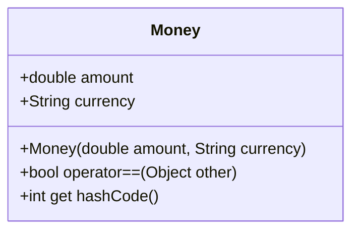

## 7.8 Implementing Value Objects

In the realm of software development, particularly when working with Dart and Flutter, the concept of value objects plays a crucial role in ensuring that our applications are both robust and maintainable. Value objects are immutable classes that represent simple entities defined by their values rather than their identities. This section will guide you through the intricacies of implementing value objects in Dart, focusing on creating immutable classes with value equality.

### Understanding Value Objects

Value objects are a fundamental concept in Domain-Driven Design (DDD). They are used to model elements of the domain that are defined by their attributes rather than a unique identity. For instance, a `Money` object might be defined by its amount and currency, while a `Coordinate` object is defined by its latitude and longitude.

#### Key Characteristics of Value Objects

1. **Immutability**: Once created, the state of a value object cannot be changed. This ensures consistency and predictability in your code.
2. **Value Equality**: Two value objects are considered equal if all their attributes are equal. This contrasts with entity objects, which are equal if they share the same identity.
3. **Self-Validation**: Value objects validate their own state upon creation, ensuring that they are always in a valid state.

### Creating Immutable Classes in Dart

Dart provides several features that make it an excellent choice for implementing value objects. Let's explore how to create immutable classes in Dart.

#### Using `@immutable` Annotation

The `@immutable` annotation is a powerful tool in Dart that helps enforce immutability. By marking a class as immutable, you signal to other developers (and yourself) that instances of this class should not change after they are created.

```dart
import 'package:meta/meta.dart';

@immutable
class Money {
  final double amount;
  final String currency;

  const Money(this.amount, this.currency);
}
```

In this example, the `Money` class is marked with the `@immutable` annotation. The `const` constructor ensures that instances of `Money` are immutable.

#### Overriding `==` and `hashCode`

To ensure value equality, you must override the `==` operator and `hashCode` method. This allows Dart to compare instances based on their values rather than their identities.

```dart
@override
bool operator ==(Object other) {
  if (identical(this, other)) return true;
  return other is Money &&
      other.amount == amount &&
      other.currency == currency;
}

@override
int get hashCode => amount.hashCode ^ currency.hashCode;
```

In this code, the `==` operator checks if another object is a `Money` instance with the same amount and currency. The `hashCode` method combines the hash codes of the amount and currency using the XOR operator.

#### Factory Constructors

Factory constructors provide a way to control instance creation. They can be used to enforce invariants or return existing instances.

```dart
class Money {
  final double amount;
  final String currency;

  static final Map<String, Money> _cache = {};

  factory Money(double amount, String currency) {
    final key = '$amount-$currency';
    if (_cache.containsKey(key)) {
      return _cache[key]!;
    } else {
      final money = Money._internal(amount, currency);
      _cache[key] = money;
      return money;
    }
  }

  Money._internal(this.amount, this.currency);
}
```

In this example, the `Money` class uses a factory constructor to cache instances. If an instance with the same amount and currency already exists, it returns the cached instance, ensuring that identical value objects are reused.

### Use Cases and Examples

Value objects are particularly useful in domain models where you need to represent concepts like money, coordinates, or dates. Let's explore some common use cases.

#### Domain Models

1. **Money**: Represents an amount and currency. Useful in financial applications where precision and consistency are crucial.
2. **Coordinates**: Represents a geographical location with latitude and longitude. Essential for mapping and location-based services.
3. **Date**: Represents a specific point in time. Useful in scheduling and time-based applications.

#### Ensuring Consistency

By preventing state changes after creation, value objects ensure consistency across your application. This is particularly important in distributed systems where data integrity is paramount.

### Visualizing Value Objects

To better understand the concept of value objects, let's visualize their structure and behavior using a class diagram.



This diagram illustrates the `Money` class, highlighting its attributes and methods. The `operator==` and `hashCode` methods are crucial for ensuring value equality.

### Design Considerations

When implementing value objects in Dart, consider the following:

- **Immutability**: Use `final` fields and `const` constructors to enforce immutability.
- **Equality**: Override `==` and `hashCode` to ensure value equality.
- **Validation**: Validate the state of value objects upon creation to prevent invalid instances.
- **Performance**: Use factory constructors and caching to optimize performance.

### Differences and Similarities

Value objects are often confused with entities. Here are some key differences:

- **Identity**: Entities have a unique identity, while value objects are defined by their attributes.
- **Mutability**: Entities can change over time, while value objects are immutable.
- **Equality**: Entities are compared by identity, while value objects are compared by value.

### Try It Yourself

To solidify your understanding of value objects, try modifying the `Money` class to include additional attributes, such as a description or category. Experiment with different ways to enforce immutability and value equality.

### Knowledge Check

1. What is the primary characteristic of a value object?
2. How does the `@immutable` annotation help enforce immutability?
3. Why is it important to override `==` and `hashCode` in value objects?
4. What are some common use cases for value objects in domain models?

### Embrace the Journey

Implementing value objects in Dart is a rewarding journey that enhances the robustness and maintainability of your applications. Remember, this is just the beginning. As you progress, you'll discover more advanced patterns and techniques that will elevate your development skills. Keep experimenting, stay curious, and enjoy the journey!

## Quiz Time!



### What is a key characteristic of value objects?

- [x] Immutability
- [ ] Identity
- [ ] Mutability
- [ ] Statefulness

> **Explanation:** Value objects are immutable, meaning their state cannot change after creation.

### How does the `@immutable` annotation help in Dart?

- [x] It signals that a class should be immutable.
- [ ] It enforces runtime checks for immutability.
- [ ] It automatically overrides `==` and `hashCode`.
- [ ] It prevents the use of `final` fields.

> **Explanation:** The `@immutable` annotation indicates that instances of the class should not change after they are created.

### Why should you override `==` and `hashCode` in value objects?

- [x] To ensure value equality.
- [ ] To enable identity comparison.
- [ ] To enforce immutability.
- [ ] To prevent caching.

> **Explanation:** Overriding `==` and `hashCode` ensures that value objects are compared based on their values.

### What is a common use case for value objects?

- [x] Representing money in financial applications.
- [ ] Managing user sessions.
- [ ] Handling mutable state.
- [ ] Implementing identity-based logic.

> **Explanation:** Value objects are ideal for representing concepts like money, where consistency and precision are crucial.

### Which of the following is NOT a characteristic of value objects?

- [ ] Immutability
- [ ] Value equality
- [x] Unique identity
- [ ] Self-validation

> **Explanation:** Value objects do not have a unique identity; they are defined by their values.

### What is the purpose of a factory constructor in value objects?

- [x] To control instance creation and enforce invariants.
- [ ] To automatically override `==` and `hashCode`.
- [ ] To make the class mutable.
- [ ] To prevent the use of `final` fields.

> **Explanation:** Factory constructors allow you to control how instances are created, ensuring that invariants are maintained.

### How can you optimize performance with value objects?

- [x] Use caching in factory constructors.
- [ ] Avoid using `final` fields.
- [ ] Implement mutable state.
- [ ] Use identity-based comparison.

> **Explanation:** Caching in factory constructors can optimize performance by reusing identical instances.

### What is the difference between entities and value objects?

- [x] Entities have a unique identity, while value objects are defined by their values.
- [ ] Entities are immutable, while value objects are mutable.
- [ ] Entities are compared by value, while value objects are compared by identity.
- [ ] Entities do not require validation, while value objects do.

> **Explanation:** Entities are identified by a unique identity, whereas value objects are defined by their attributes.

### Which method is crucial for ensuring value equality in Dart?

- [x] Overriding `==` and `hashCode`
- [ ] Using `@immutable`
- [ ] Implementing `toString()`
- [ ] Using `final` fields

> **Explanation:** Overriding `==` and `hashCode` ensures that value objects are compared based on their values.

### True or False: Value objects can change state after creation.

- [ ] True
- [x] False

> **Explanation:** Value objects are immutable, meaning their state cannot change after they are created.


