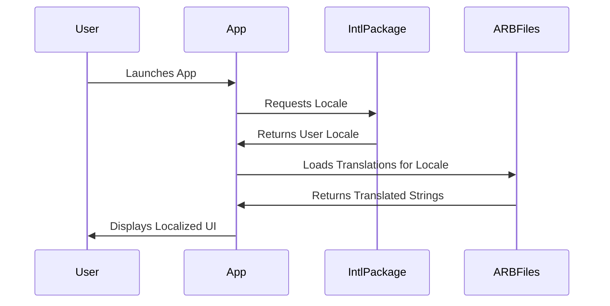

## 7.9 Localization and Internationalization Patterns

In today's interconnected world, developing applications that cater to a global audience is more important than ever. Localization and internationalization (often abbreviated as L10n and i18n, respectively) are crucial processes in adapting software for different languages and regions. In this section, we will explore how to effectively implement these patterns in Flutter applications using Dart, focusing on the `intl` package, ARB files, and locale resolution.

### Introduction to Localization and Internationalization

Localization refers to the adaptation of software to meet the language, cultural, and other requirements of a specific target market. This involves translating text, formatting dates and numbers according to regional conventions, and ensuring that the application is culturally appropriate.

Internationalization, on the other hand, is the process of designing software so that it can be easily adapted to various languages and regions without requiring engineering changes. This involves abstracting language-specific elements and providing mechanisms to switch between different locales.

### Implementing Localization in Flutter

#### Using the `intl` Package

The `intl` package is a powerful tool for managing localization in Flutter applications. It provides support for message translation, date and number formatting, and more. Here’s how you can use it to implement localization:

1. **Add the `intl` package to your project**:

   Add the following dependency to your `pubspec.yaml` file:

   ```yaml
   dependencies:
     flutter:
       sdk: flutter
     intl: ^0.17.0
   ```

2. **Define localized messages**:

   Use the `intl` package to define messages that need translation. For example:

   ```dart
   import 'package:intl/intl.dart';

   class AppLocalizations {
     String get welcomeMessage => Intl.message(
       'Welcome to our application!',
       name: 'welcomeMessage',
       desc: 'Welcome message for the application',
     );
   }
   ```

3. **Generate ARB files**:

   ARB (Application Resource Bundle) files are used to manage translations. They are JSON-like files that contain key-value pairs for each message. Use the `intl_translation` package to generate these files:

   ```bash
   flutter pub run intl_translation:extract_to_arb --output-dir=lib/l10n lib/main.dart
   ```

   This command extracts messages from your Dart files and creates a default ARB file.

4. **Translate ARB files**:

   Create translated ARB files for each locale. For example, for Spanish, you might have a file named `intl_es.arb`:

   ```json
   {
     "@@locale": "es",
     "welcomeMessage": "¡Bienvenido a nuestra aplicación!",
     "@welcomeMessage": {
       "description": "Welcome message for the application"
     }
   }
   ```

5. **Load translations in your app**:

   Use the `intl` package to load the appropriate translations based on the user's locale. Update your `MaterialApp` to include a `localizationsDelegates` and `supportedLocales`:

   ```dart
   import 'package:flutter/material.dart';
   import 'package:flutter_localizations/flutter_localizations.dart';
   import 'app_localizations.dart';

   void main() {
     runApp(MyApp());
   }

   class MyApp extends StatelessWidget {
     @override
     Widget build(BuildContext context) {
       return MaterialApp(
         localizationsDelegates: [
           AppLocalizations.delegate,
           GlobalMaterialLocalizations.delegate,
           GlobalWidgetsLocalizations.delegate,
         ],
         supportedLocales: [
           const Locale('en', ''), // English
           const Locale('es', ''), // Spanish
         ],
         home: HomeScreen(),
       );
     }
   }
   ```

6. **Implement `AppLocalizationsDelegate`**:

   Create a delegate to load the appropriate localization resources:

   ```dart
   import 'package:flutter/material.dart';
   import 'package:flutter_localizations/flutter_localizations.dart';
   import 'app_localizations.dart';

   class AppLocalizationsDelegate extends LocalizationsDelegate<AppLocalizations> {
     const AppLocalizationsDelegate();

     @override
     bool isSupported(Locale locale) => ['en', 'es'].contains(locale.languageCode);

     @override
     Future<AppLocalizations> load(Locale locale) async {
       return AppLocalizations(locale);
     }

     @override
     bool shouldReload(AppLocalizationsDelegate old) => false;
   }
   ```

#### Locale Resolution

Locale resolution is the process of determining which locale to use based on the user's preferences and the application's supported locales. Flutter provides a mechanism to automatically resolve the locale, but you can also implement custom logic if needed.

1. **Automatic Locale Resolution**:

   By default, Flutter uses the device's locale settings to determine the appropriate locale. You can specify supported locales in your `MaterialApp`:

   ```dart
   supportedLocales: [
     const Locale('en', ''), // English
     const Locale('es', ''), // Spanish
   ],
   ```

2. **Custom Locale Resolution**:

   Implement a custom locale resolution callback if you need more control over the process:

   ```dart
   localeResolutionCallback: (Locale locale, Iterable<Locale> supportedLocales) {
     for (var supportedLocale in supportedLocales) {
       if (supportedLocale.languageCode == locale.languageCode) {
         return supportedLocale;
       }
     }
     return supportedLocales.first;
   },
   ```

### Use Cases and Examples

#### Multi-Language Support

Providing multi-language support is a common requirement for global applications. By using the `intl` package and ARB files, you can easily switch between different languages based on the user's preferences.

**Example**: Displaying UI text in different languages

```dart
import 'package:flutter/material.dart';
import 'app_localizations.dart';

class HomeScreen extends StatelessWidget {
  @override
  Widget build(BuildContext context) {
    final localizations = AppLocalizations.of(context);

    return Scaffold(
      appBar: AppBar(
        title: Text(localizations.welcomeMessage),
      ),
      body: Center(
        child: Text(localizations.welcomeMessage),
      ),
    );
  }
}
```

#### Formatting Dates and Numbers

Different regions have different conventions for formatting dates and numbers. The `intl` package provides tools to format these elements according to the user's locale.

**Example**: Formatting dates and numbers

```dart
import 'package:intl/intl.dart';

void main() {
  var now = DateTime.now();
  var formatter = DateFormat.yMMMMd('en_US');
  print(formatter.format(now)); // Output: October 17, 2024

  var number = 1234567.89;
  var numberFormatter = NumberFormat.currency(locale: 'en_US', symbol: '\$');
  print(numberFormatter.format(number)); // Output: $1,234,567.89
}
```

### Visualizing Localization and Internationalization

To better understand the process of localization and internationalization, let's visualize the workflow using a sequence diagram.



**Diagram Explanation**: This sequence diagram illustrates the process of loading and displaying localized content in a Flutter application. When the user launches the app, it requests the user's locale from the `intl` package, loads the appropriate translations from ARB files, and displays the localized UI.

### Design Considerations

When implementing localization and internationalization, consider the following:

- **Resource Management**: Keep translations organized and up-to-date. Use tools to manage ARB files and ensure consistency across languages.
- **Cultural Sensitivity**: Be mindful of cultural differences and ensure that your application is appropriate for all target markets.
- **Testing**: Test your application in different locales to ensure that translations are accurate and the UI is displayed correctly.

### Differences and Similarities

Localization and internationalization are often confused, but they serve different purposes. Internationalization is the process of designing software to be easily adaptable, while localization is the actual adaptation of the software for specific regions. Both are essential for creating applications that can reach a global audience.

### Try It Yourself

To deepen your understanding of localization and internationalization in Flutter, try the following exercises:

1. **Add a new language**: Extend the example application to support French. Create a new ARB file with French translations and update the `supportedLocales` and `AppLocalizationsDelegate` accordingly.

2. **Custom Locale Resolution**: Implement a custom locale resolution strategy that prioritizes a specific language if the user's preferred language is not supported.

3. **Date and Number Formatting**: Experiment with different date and number formats for various locales. Observe how the output changes based on the locale settings.

### Knowledge Check

- **What is the difference between localization and internationalization?**
- **How does the `intl` package help in managing translations?**
- **What are ARB files, and how are they used in localization?**
- **How can you implement custom locale resolution in Flutter?**

### Embrace the Journey

Remember, mastering localization and internationalization is a journey. As you continue to develop applications for a global audience, you'll encounter new challenges and opportunities to learn. Keep experimenting, stay curious, and enjoy the process of making your software accessible to users around the world.

## Quiz Time!



### What is the primary purpose of localization in software development?

- [x] Adapting software to meet language and cultural requirements of a specific market
- [ ] Designing software to be easily adaptable to different languages
- [ ] Managing translations and resources
- [ ] Formatting dates and numbers according to regional conventions

> **Explanation:** Localization involves adapting software to meet the specific language and cultural requirements of a target market.

### Which package is commonly used in Flutter for managing localization?

- [x] intl
- [ ] flutter_localizations
- [ ] localization_manager
- [ ] dart_localization

> **Explanation:** The `intl` package is commonly used in Flutter for managing localization, including message translation and formatting.

### What are ARB files used for in localization?

- [x] Managing translation files
- [ ] Formatting dates and numbers
- [ ] Detecting user locale
- [ ] Storing user preferences

> **Explanation:** ARB files are used to manage translation files in localization, containing key-value pairs for each message.

### How can you specify supported locales in a Flutter application?

- [x] By adding them to the `supportedLocales` property of `MaterialApp`
- [ ] By creating a separate configuration file
- [ ] By using the `locale` property of `MaterialApp`
- [ ] By setting them in the `pubspec.yaml` file

> **Explanation:** Supported locales are specified in the `supportedLocales` property of `MaterialApp`.

### What is the role of `AppLocalizationsDelegate` in a Flutter app?

- [x] Loading the appropriate localization resources
- [ ] Formatting dates and numbers
- [ ] Managing user preferences
- [ ] Detecting user locale

> **Explanation:** `AppLocalizationsDelegate` is responsible for loading the appropriate localization resources in a Flutter app.

### What is the default behavior of Flutter's locale resolution?

- [x] It uses the device's locale settings
- [ ] It defaults to English
- [ ] It prompts the user to select a locale
- [ ] It uses the first supported locale

> **Explanation:** By default, Flutter uses the device's locale settings to determine the appropriate locale.

### How can you implement custom locale resolution in Flutter?

- [x] By using the `localeResolutionCallback` property of `MaterialApp`
- [ ] By modifying the `intl` package
- [ ] By creating a custom ARB file
- [ ] By setting a default locale in `pubspec.yaml`

> **Explanation:** Custom locale resolution can be implemented using the `localeResolutionCallback` property of `MaterialApp`.

### What is the purpose of the `Intl.message` function?

- [x] Defining messages that need translation
- [ ] Formatting dates and numbers
- [ ] Detecting user locale
- [ ] Managing translation files

> **Explanation:** The `Intl.message` function is used to define messages that need translation in the `intl` package.

### Which of the following is a benefit of internationalization?

- [x] Designing software to be easily adaptable to various languages
- [ ] Translating text for different languages
- [ ] Formatting dates and numbers according to regional conventions
- [ ] Managing translation files

> **Explanation:** Internationalization involves designing software to be easily adaptable to various languages and regions.

### True or False: Localization and internationalization are the same processes.

- [ ] True
- [x] False

> **Explanation:** Localization and internationalization are different processes; localization adapts software for specific regions, while internationalization designs software to be adaptable.


