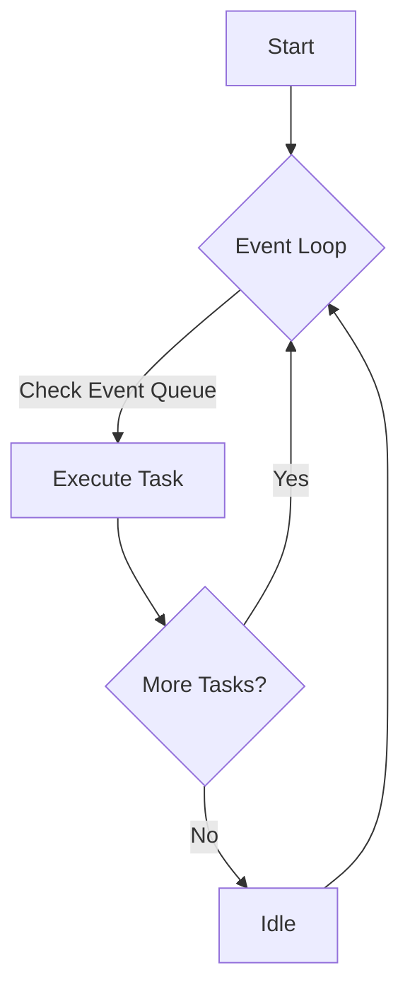
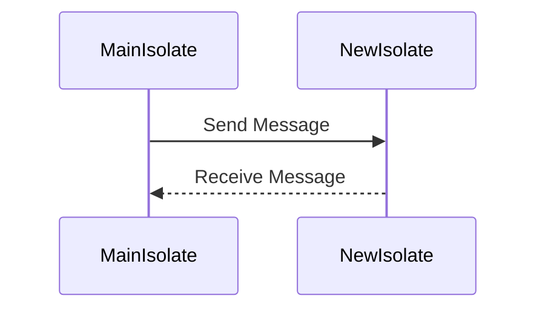
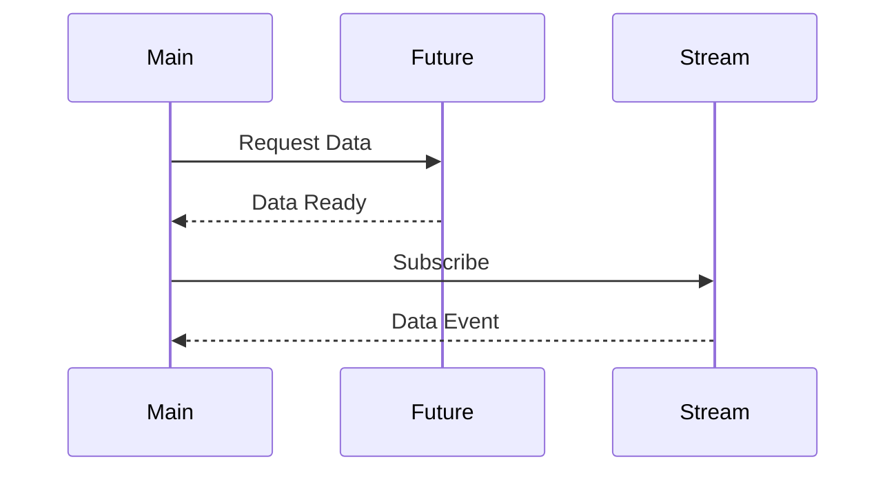

## 8.1 Introduction to Concurrency in Dart

Concurrency is a fundamental aspect of modern software development, enabling applications to perform multiple tasks simultaneously, thereby improving efficiency and responsiveness. In this section, we will explore how Dart handles concurrency, focusing on its single-threaded model, the event loop, microtask queue, isolates, and asynchronous programming. By understanding these concepts, you will be equipped to build high-performance applications using Dart and Flutter.

### Understanding Dart's Single-Threaded Model

Dart operates primarily on a single-threaded model, which means that all Dart code runs in a single thread of execution. This model simplifies programming by avoiding many of the complexities associated with multi-threaded programming, such as race conditions and deadlocks. However, it also requires a robust mechanism to handle tasks that might block the thread, such as I/O operations or long computations.

#### The Event Loop

The event loop is the core of Dart's concurrency model. It is responsible for managing the execution of code, handling events, and processing asynchronous operations. The event loop continuously checks for tasks to execute, ensuring that the application remains responsive.



**Diagram 1: Visualizing Dart's Event Loop**

- **Event Queue**: This queue holds tasks that are ready to be executed. Tasks are added to the event queue when asynchronous operations complete, such as receiving data from a network request.
- **Microtask Queue**: A higher-priority queue that is processed before the event queue. Microtasks are typically used for small, quick tasks that need to be executed immediately after the current operation completes.

#### Microtask Queue

The microtask queue is a crucial part of Dart's event loop, allowing for the scheduling of tasks that need to be executed immediately after the current operation. Microtasks are often used for tasks like completing a `Future` or updating the state of an application.

```dart
import 'dart:async';

void main() {
  print('Start');

  Future(() => print('Future 1'))
      .then((_) => print('Future 1 then'));

  scheduleMicrotask(() => print('Microtask 1'));

  Future(() => print('Future 2'))
      .then((_) => print('Future 2 then'));

  scheduleMicrotask(() => print('Microtask 2'));

  print('End');
}
```

**Output:**
```
Start
End
Microtask 1
Microtask 2
Future 1
Future 1 then
Future 2
Future 2 then
```

**Explanation:**
- The `scheduleMicrotask` function adds tasks to the microtask queue, which are executed before the event queue tasks.
- The `Future` tasks are added to the event queue and executed after all microtasks.

### Isolates: Dart's Way of Achieving True Parallelism

While Dart's single-threaded model simplifies concurrency, it can be limiting for CPU-bound tasks that require parallel execution. Dart addresses this limitation with isolates, which are independent workers that run in their own memory space. Isolates can communicate with each other using message passing, allowing for true parallelism.

#### Creating and Using Isolates

To create an isolate, you use the `Isolate.spawn` function, which takes a function and an argument to pass to that function.

```dart
import 'dart:isolate';

void isolateFunction(String message) {
  print('Isolate received: $message');
}

void main() async {
  final receivePort = ReceivePort();
  await Isolate.spawn(isolateFunction, 'Hello from main isolate');

  receivePort.listen((message) {
    print('Main isolate received: $message');
  });

  receivePort.sendPort.send('Hello from main isolate');
}
```

**Explanation:**
- An isolate is created using `Isolate.spawn`, which runs `isolateFunction` in a separate isolate.
- `ReceivePort` is used to receive messages from the isolate.
- `SendPort` is used to send messages to the isolate.

#### Visualizing Isolate Communication



**Diagram 2: Communication Between Isolates**

### Asynchronous Programming: Managing Tasks Without Blocking the UI

Asynchronous programming is essential for building responsive applications, especially in environments like Flutter, where blocking the UI thread can lead to a poor user experience. Dart provides several constructs for asynchronous programming, including `Future`, `async/await`, and `Stream`.

#### Futures and async/await

A `Future` represents a value that will be available at some point in the future. You can use the `async` and `await` keywords to work with futures in a more readable and maintainable way.

```dart
Future<String> fetchData() async {
  await Future.delayed(Duration(seconds: 2));
  return 'Data fetched';
}

void main() async {
  print('Fetching data...');
  String data = await fetchData();
  print(data);
}
```

**Explanation:**
- The `fetchData` function simulates a network request by delaying for 2 seconds.
- The `await` keyword pauses the execution of `main` until `fetchData` completes.

#### Streams: Handling Multiple Asynchronous Events

While `Future` is suitable for single asynchronous results, `Stream` is used for handling a sequence of asynchronous events. Streams are particularly useful for handling data that arrives over time, such as user input or network data.

```dart
import 'dart:async';

void main() {
  Stream<int> numberStream = Stream.fromIterable([1, 2, 3, 4, 5]);

  numberStream.listen((number) {
    print('Received: $number');
  });
}
```

**Explanation:**
- `Stream.fromIterable` creates a stream from a list of numbers.
- The `listen` method is used to process each number as it arrives.

### Visualizing Asynchronous Programming



**Diagram 3: Asynchronous Programming with Future and Stream**

### Try It Yourself

To deepen your understanding of Dart's concurrency model, try modifying the code examples provided:

1. **Experiment with Microtasks**: Add more microtasks and observe their execution order relative to futures.
2. **Create Multiple Isolates**: Spawn additional isolates and implement a simple communication protocol between them.
3. **Stream Manipulation**: Create a stream that emits data at regular intervals and apply transformations to the data.

### Knowledge Check

- Explain the difference between the event queue and the microtask queue.
- Describe how isolates achieve parallelism in Dart.
- Demonstrate how to use `async` and `await` to handle asynchronous operations.

### Summary

In this section, we've explored Dart's concurrency model, focusing on the event loop, microtask queue, isolates, and asynchronous programming. By mastering these concepts, you can build efficient and responsive applications that leverage Dart's unique concurrency features.

### Further Reading

- [Dart Language Tour: Asynchronous Programming](https://dart.dev/guides/language/language-tour#asynchrony-support)
- [Understanding Dart Isolates](https://dart.dev/articles/concurrency/)

### Embrace the Journey

Remember, mastering concurrency is a journey. As you continue to experiment and build with Dart, you'll gain a deeper understanding of how to harness the power of concurrency to create high-performance applications. Keep exploring, stay curious, and enjoy the process!

## Quiz Time!



### What is the primary purpose of the event loop in Dart?

- [x] To manage the execution of code and handle asynchronous operations
- [ ] To execute synchronous code only
- [ ] To manage memory allocation
- [ ] To compile Dart code

> **Explanation:** The event loop is responsible for managing the execution of code, handling events, and processing asynchronous operations.

### How do isolates achieve parallelism in Dart?

- [x] By running in their own memory space and communicating via message passing
- [ ] By sharing memory with the main thread
- [ ] By using multiple threads within the same isolate
- [ ] By executing tasks sequentially

> **Explanation:** Isolates run in their own memory space and communicate with each other using message passing, allowing for true parallelism.

### What is the difference between the event queue and the microtask queue?

- [x] The microtask queue has higher priority and is processed before the event queue
- [ ] The event queue has higher priority and is processed before the microtask queue
- [ ] Both queues have the same priority
- [ ] The microtask queue is only used for error handling

> **Explanation:** The microtask queue is processed before the event queue, allowing for immediate execution of small tasks after the current operation.

### Which Dart construct is used for handling a sequence of asynchronous events?

- [x] Stream
- [ ] Future
- [ ] Isolate
- [ ] Event Loop

> **Explanation:** Streams are used for handling a sequence of asynchronous events, such as user input or network data.

### What is the role of the `await` keyword in Dart?

- [x] To pause the execution of a function until a future completes
- [ ] To start a new isolate
- [ ] To schedule a microtask
- [ ] To handle errors in asynchronous code

> **Explanation:** The `await` keyword pauses the execution of a function until the future it is waiting for completes.

### How can you create an isolate in Dart?

- [x] Using the `Isolate.spawn` function
- [ ] Using the `Future` constructor
- [ ] Using the `Stream` constructor
- [ ] Using the `async` keyword

> **Explanation:** The `Isolate.spawn` function is used to create a new isolate in Dart.

### What is a common use case for microtasks in Dart?

- [x] Completing a `Future` or updating application state
- [ ] Handling user input
- [ ] Performing long-running computations
- [ ] Managing network requests

> **Explanation:** Microtasks are often used for tasks like completing a `Future` or updating the state of an application.

### What is the output order of the following code snippet?

```dart
print('Start');
Future(() => print('Future'));
scheduleMicrotask(() => print('Microtask'));
print('End');
```

- [x] Start, End, Microtask, Future
- [ ] Start, Microtask, End, Future
- [ ] Start, Future, Microtask, End
- [ ] Start, End, Future, Microtask

> **Explanation:** The microtask is executed after the current operation, but before the future, resulting in the order: Start, End, Microtask, Future.

### True or False: Isolates in Dart share memory with the main thread.

- [ ] True
- [x] False

> **Explanation:** Isolates do not share memory with the main thread; they run in their own memory space.

### Which of the following is NOT a feature of Dart's concurrency model?

- [ ] Event Loop
- [ ] Microtask Queue
- [ ] Isolates
- [x] Shared Memory Threads

> **Explanation:** Dart's concurrency model does not use shared memory threads; it uses isolates for parallelism.


