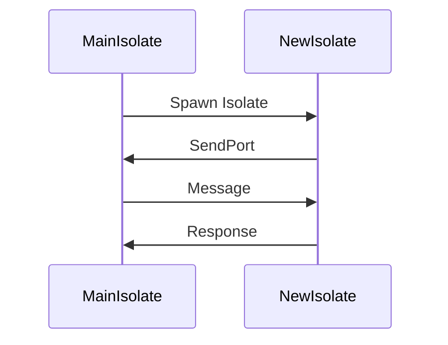

## 8.10 Background Processing with Isolates

In the world of mobile and web applications, ensuring a smooth and responsive user experience is paramount. One of the key challenges developers face is running long-running tasks without disrupting the main application thread. Dart, the language behind Flutter, offers a powerful concurrency model through **isolates**. In this section, we will delve into the intricacies of background processing with isolates, exploring how they can be used to handle long-running tasks efficiently.

### Understanding Isolates in Dart

Isolates are Dart's way of achieving concurrency. Unlike threads in other programming languages, isolates do not share memory. Each isolate has its own memory heap and communicates with other isolates via message passing. This design eliminates the need for locks and makes Dart's concurrency model safer and easier to reason about.

#### Key Characteristics of Isolates

- **Memory Isolation**: Each isolate runs in its own memory space, preventing data races and making concurrent programming safer.
- **Message Passing**: Isolates communicate by sending messages through ports, which are essentially queues.
- **No Shared State**: Since isolates do not share memory, there is no need for synchronization mechanisms like mutexes.

### Running Long-Running Tasks

To maintain a responsive UI, it's crucial to offload long-running tasks to a separate isolate. This ensures that the main isolate, which handles the UI, remains unblocked and responsive.

#### Implementing Background Tasks

Let's explore how to implement background tasks using isolates in Dart.

##### Creating and Managing Isolates

To create an isolate, you can use the `Isolate.spawn` function. This function takes a top-level function or a static method as an entry point for the new isolate.

```dart
import 'dart:isolate';

// Entry point for the new isolate
void backgroundTask(SendPort sendPort) {
  // Perform long-running task
  int result = performComputation();
  
  // Send result back to the main isolate
  sendPort.send(result);
}

void main() async {
  // Create a ReceivePort to receive messages from the isolate
  ReceivePort receivePort = ReceivePort();

  // Spawn a new isolate
  await Isolate.spawn(backgroundTask, receivePort.sendPort);

  // Listen for messages from the isolate
  receivePort.listen((message) {
    print('Received result from isolate: $message');
  });
}

int performComputation() {
  // Simulate a long-running computation
  return 42;
}
```

In this example, we create a new isolate to perform a computation and send the result back to the main isolate using a `SendPort`.

##### Persistent Isolates

For tasks that require continuous processing, such as monitoring a data stream or handling real-time updates, you can keep an isolate alive indefinitely. This is achieved by maintaining a reference to the isolate and ensuring it doesn't exit.

```dart
import 'dart:isolate';

void persistentTask(SendPort sendPort) {
  // Keep the isolate alive
  Timer.periodic(Duration(seconds: 1), (timer) {
    // Perform periodic task
    int result = performPeriodicComputation();
    sendPort.send(result);
  });
}

void main() async {
  ReceivePort receivePort = ReceivePort();
  await Isolate.spawn(persistentTask, receivePort.sendPort);

  receivePort.listen((message) {
    print('Periodic result from isolate: $message');
  });
}

int performPeriodicComputation() {
  // Simulate a periodic computation
  return DateTime.now().millisecondsSinceEpoch;
}
```

In this example, we use a `Timer` to perform a task periodically, keeping the isolate alive.

### Flutter Plugins for Background Execution

Flutter provides plugins that allow you to execute code in the background, even when the app is not in the foreground. These plugins are essential for platform-specific background tasks, such as handling notifications or performing background fetches.

#### Using the `flutter_background` Plugin

The `flutter_background` plugin enables background execution on both Android and iOS. Here's how you can use it:

1. **Add the Plugin**: Add `flutter_background` to your `pubspec.yaml` file.

```yaml
dependencies:
  flutter:
    sdk: flutter
  flutter_background: ^0.9.0
```

2. **Initialize the Plugin**: Initialize the plugin in your app's main function.

```dart
import 'package:flutter_background/flutter_background.dart';

void main() async {
  WidgetsFlutterBinding.ensureInitialized();

  // Initialize the plugin
  await FlutterBackground.initialize();

  runApp(MyApp());
}
```

3. **Enable Background Execution**: Enable background execution when needed.

```dart
void enableBackgroundExecution() async {
  bool success = await FlutterBackground.enableBackgroundExecution();
  if (success) {
    print('Background execution enabled');
  } else {
    print('Failed to enable background execution');
  }
}
```

### Use Cases and Examples

Let's explore some practical use cases for background processing with isolates.

#### Download Managers

Handling large file downloads is a common requirement in many applications. By offloading the download task to an isolate, you can ensure that the UI remains responsive.

```dart
import 'dart:isolate';
import 'dart:io';

void downloadFile(SendPort sendPort) async {
  // Simulate a file download
  await Future.delayed(Duration(seconds: 5));
  sendPort.send('Download complete');
}

void main() async {
  ReceivePort receivePort = ReceivePort();
  await Isolate.spawn(downloadFile, receivePort.sendPort);

  receivePort.listen((message) {
    print(message);
  });
}
```

In this example, the file download is simulated with a delay, and the completion message is sent back to the main isolate.

#### Scheduled Tasks

Scheduled tasks, such as periodic updates or cleanups, can be efficiently handled using persistent isolates.

```dart
import 'dart:isolate';

void scheduledTask(SendPort sendPort) {
  Timer.periodic(Duration(hours: 1), (timer) {
    // Perform scheduled task
    sendPort.send('Scheduled task executed');
  });
}

void main() async {
  ReceivePort receivePort = ReceivePort();
  await Isolate.spawn(scheduledTask, receivePort.sendPort);

  receivePort.listen((message) {
    print(message);
  });
}
```

Here, a `Timer` is used to execute a task every hour, demonstrating how scheduled tasks can be managed with isolates.

### Visualizing Isolate Communication

To better understand how isolates communicate, let's visualize the process using a sequence diagram.



**Diagram Description**: This sequence diagram illustrates the communication between the main isolate and a new isolate. The main isolate spawns a new isolate, sends a message, and receives a response.

### Design Considerations

When using isolates for background processing, consider the following:

- **Resource Management**: Isolates consume system resources. Ensure that you manage them efficiently to avoid performance issues.
- **Error Handling**: Implement robust error handling to manage isolate failures gracefully.
- **Platform Limitations**: Be aware of platform-specific limitations, especially when using Flutter plugins for background execution.

### Differences and Similarities with Threads

While isolates and threads both enable concurrent execution, they differ in key aspects:

- **Memory Sharing**: Threads share memory, while isolates do not. This makes isolates safer but may require more overhead for data exchange.
- **Communication**: Isolates communicate via message passing, whereas threads can directly access shared data.

### Try It Yourself

Experiment with the provided code examples by modifying the tasks performed in the isolates. For instance, try implementing a simple data processing task or a network request within an isolate.

### Knowledge Check

- **What are isolates, and how do they differ from threads?**
- **How can you keep an isolate alive for continuous processing?**
- **What are some practical use cases for background processing with isolates?**

### Embrace the Journey

Remember, mastering concurrency with isolates is just the beginning. As you progress, you'll build more complex and efficient applications. Keep experimenting, stay curious, and enjoy the journey!

### References and Links

- [Dart Isolates](https://dart.dev/guides/libraries/concurrency)
- [Flutter Background Plugin](https://pub.dev/packages/flutter_background)
- [Concurrency in Dart](https://dart.dev/tutorials/language/concurrency)

## Quiz Time!



### What is a key characteristic of isolates in Dart?

- [x] Memory Isolation
- [ ] Shared Memory
- [ ] Thread Synchronization
- [ ] Direct Data Access

> **Explanation:** Isolates in Dart run in their own memory space, ensuring memory isolation.

### How do isolates communicate with each other?

- [x] Message Passing
- [ ] Shared Variables
- [ ] Direct Memory Access
- [ ] Mutex Locks

> **Explanation:** Isolates communicate via message passing using ports.

### What function is used to create a new isolate in Dart?

- [x] Isolate.spawn
- [ ] Isolate.create
- [ ] Isolate.new
- [ ] Isolate.start

> **Explanation:** The `Isolate.spawn` function is used to create a new isolate.

### What is the purpose of a `ReceivePort` in Dart?

- [x] To receive messages from an isolate
- [ ] To send messages to an isolate
- [ ] To manage isolate lifecycle
- [ ] To share memory between isolates

> **Explanation:** A `ReceivePort` is used to receive messages from an isolate.

### What plugin can be used for background execution in Flutter?

- [x] flutter_background
- [ ] flutter_isolate
- [ ] flutter_thread
- [ ] flutter_async

> **Explanation:** The `flutter_background` plugin enables background execution in Flutter.

### How can you keep an isolate alive for continuous processing?

- [x] Use a Timer to perform periodic tasks
- [ ] Use a loop to keep the isolate busy
- [ ] Continuously send messages to the isolate
- [ ] Use a static method as the entry point

> **Explanation:** A Timer can be used to perform periodic tasks, keeping the isolate alive.

### What is a practical use case for background processing with isolates?

- [x] Download Managers
- [ ] UI Rendering
- [ ] Database Queries
- [ ] User Input Handling

> **Explanation:** Download managers can offload file downloads to an isolate.

### What is a key difference between isolates and threads?

- [x] Isolates do not share memory
- [ ] Isolates use mutex locks
- [ ] Threads communicate via message passing
- [ ] Threads do not share memory

> **Explanation:** Isolates do not share memory, unlike threads.

### What should you consider when using isolates for background processing?

- [x] Resource Management
- [ ] Direct Memory Access
- [ ] Thread Synchronization
- [ ] Shared Variables

> **Explanation:** Efficient resource management is crucial when using isolates.

### True or False: Isolates in Dart can directly access shared memory.

- [ ] True
- [x] False

> **Explanation:** Isolates do not share memory and communicate via message passing.


