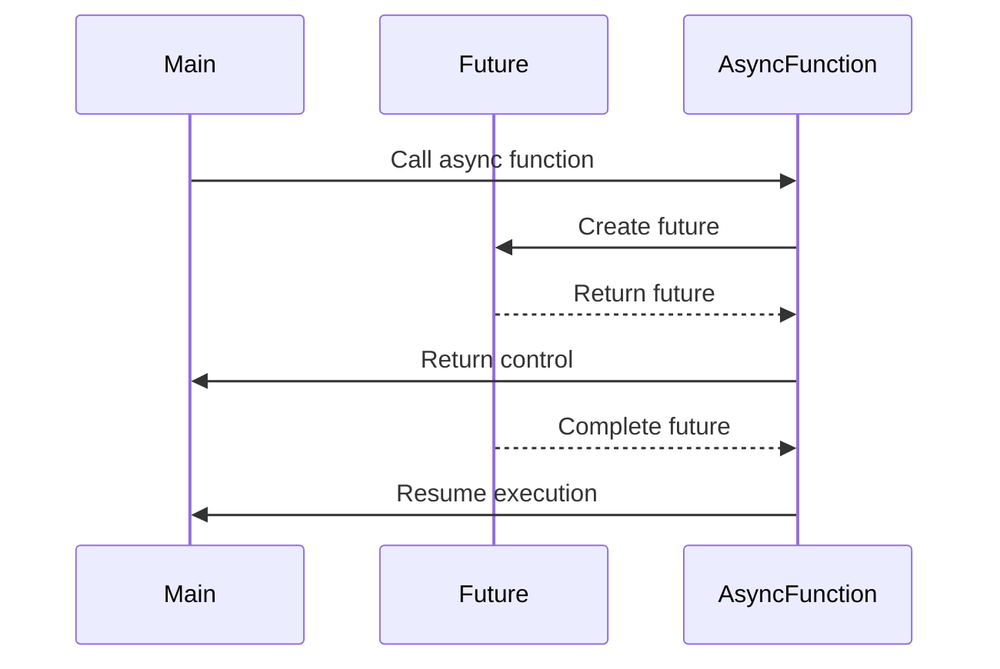

## 8.2 Async/Await and Futures

Asynchronous programming is a cornerstone of modern software development, enabling applications to perform tasks concurrently without blocking the main execution thread. In Dart, the `async/await` syntax and `Future` class provide a powerful and intuitive way to handle asynchronous operations. This section will guide you through the concepts of async/await and futures, demonstrating how they simplify asynchronous code, making it more readable and maintainable.

### Simplifying Asynchronous Code

The primary goal of using async/await and futures is to simplify asynchronous code. By transforming callback-based code into a more linear and readable format, developers can write code that is easier to understand and maintain.

#### Implementing Futures

Futures in Dart represent a potential value or error that will be available at some point in the future. They are a core part of Dart's asynchronous programming model.

##### Creating Futures

Futures can be created using the `Future` constructors. There are several ways to create a future, each serving different use cases:

1. **Using `Future.value`**: This constructor is used to create a future that is immediately completed with a value.

   ```dart
   Future<int> immediateFuture = Future.value(42);
   ```

2. **Using `Future.error`**: This constructor creates a future that is immediately completed with an error.

   ```dart
   Future<int> errorFuture = Future.error('An error occurred');
   ```

3. **Using `Future.delayed`**: This constructor creates a future that completes after a specified delay.

   ```dart
   Future<String> delayedFuture = Future.delayed(Duration(seconds: 2), () => 'Hello, Future!');
   ```

4. **Using `Future` constructor**: This allows you to perform asynchronous operations within a future.

   ```dart
   Future<String> fetchData() {
     return Future(() {
       // Simulate a network call
       return 'Fetched Data';
     });
   }
   ```

##### Async Functions

Async functions are functions that return a `Future`. They are declared using the `async` keyword, which allows you to use the `await` keyword within the function body.

- **Declaring an Async Function**: Use the `async` keyword after the function signature.

  ```dart
  Future<void> printDelayedMessage() async {
    await Future.delayed(Duration(seconds: 1));
    print('This message is printed after a delay');
  }
  ```

- **Returning a Future**: An async function always returns a `Future`, even if it doesn't explicitly return a value.

  ```dart
  Future<int> calculateSum(int a, int b) async {
    return a + b;
  }
  ```

##### Awaiting Results

The `await` keyword is used to pause the execution of an async function until a future completes. This makes asynchronous code appear synchronous, improving readability.

- **Using `await`**: Place the `await` keyword before a future to pause execution until the future completes.

  ```dart
  Future<void> fetchDataAndPrint() async {
    String data = await fetchData();
    print(data);
  }
  ```

- **Handling Errors with `try-catch`**: Use `try-catch` blocks to handle errors in async functions.

  ```dart
  Future<void> fetchDataWithErrorHandling() async {
    try {
      String data = await fetchData();
      print(data);
    } catch (e) {
      print('Error: $e');
    }
  }
  ```

### Use Cases and Examples

Let's explore some common use cases for async/await and futures in Dart, along with practical examples.

#### Fetching Data from APIs

One of the most common use cases for async/await is fetching data from APIs. When making HTTP requests, you often need to wait for a response before proceeding.

- **Example: Fetching Data from an API**

  ```dart
  import 'dart:convert';
  import 'package:http/http.dart' as http;

  Future<void> fetchUserData() async {
    final response = await http.get(Uri.parse('https://jsonplaceholder.typicode.com/users/1'));

    if (response.statusCode == 200) {
      Map<String, dynamic> userData = jsonDecode(response.body);
      print('User Name: ${userData['name']}');
    } else {
      throw Exception('Failed to load user data');
    }
  }
  ```

  In this example, we use the `http` package to make a GET request to a placeholder API. The `await` keyword is used to wait for the HTTP response, and the response is then processed.

#### Delaying Execution

Another use case for futures is delaying execution. This can be useful for creating animations, scheduling tasks, or simulating network delays.

- **Example: Delaying Execution**

  ```dart
  Future<void> delayedPrint() async {
    print('Starting delay...');
    await Future.delayed(Duration(seconds: 3));
    print('This message is printed after a 3-second delay');
  }
  ```

  In this example, the `Future.delayed` constructor is used to create a delay of 3 seconds before printing a message.

### Visualizing Async/Await and Futures

To better understand how async/await and futures work, let's visualize the flow of asynchronous operations using a sequence diagram.



**Diagram Description**: This sequence diagram illustrates the flow of an async function call. The main function calls an async function, which creates a future. Control is returned to the main function while the future is pending. Once the future completes, the async function resumes execution.

### References and Links

For further reading on async/await and futures in Dart, consider the following resources:

- [Dart Language Tour: Asynchronous Programming](https://dart.dev/guides/language/language-tour#asynchrony-support)
- [Effective Dart: Asynchronous Programming](https://dart.dev/guides/language/effective-dart/usage#asynchronous-programming)
- [Dart API Documentation: Future](https://api.dart.dev/stable/dart-async/Future-class.html)

### Knowledge Check

Let's reinforce what we've learned with some questions and exercises:

1. **Question**: What is the purpose of the `async` keyword in Dart?
2. **Exercise**: Modify the `fetchUserData` example to handle errors using a `try-catch` block.
3. **Question**: How does the `await` keyword affect the execution of an async function?
4. **Exercise**: Create a function that simulates a network delay using `Future.delayed`.

### Embrace the Journey

Remember, mastering async/await and futures is just the beginning of your journey into asynchronous programming in Dart. As you progress, you'll build more complex and interactive applications. Keep experimenting, stay curious, and enjoy the journey!

### Formatting and Structure

To ensure clarity and readability, this section is organized with clear headings and subheadings. Bullet points are used to break down complex information, and important terms are highlighted using bold text.

### Writing Style

This guide uses first-person plural (we, let's) to create a collaborative feel. Gender-specific pronouns are avoided, and acronyms are defined upon first use.

## Quiz Time!



### What is the primary purpose of using async/await in Dart?

- [x] To simplify asynchronous code and make it more readable
- [ ] To execute code faster
- [ ] To handle errors more efficiently
- [ ] To improve memory management

> **Explanation:** Async/await is used to simplify asynchronous code, making it more readable and maintainable by transforming callback-based code into a linear format.

### How do you declare an async function in Dart?

- [ ] By using the `await` keyword
- [x] By using the `async` keyword
- [ ] By using the `future` keyword
- [ ] By using the `defer` keyword

> **Explanation:** An async function is declared using the `async` keyword, which allows the use of `await` within the function body.

### What does the `await` keyword do in an async function?

- [x] Pauses execution until a future completes
- [ ] Speeds up the execution of a future
- [ ] Cancels a future
- [ ] Converts a future into a stream

> **Explanation:** The `await` keyword pauses the execution of an async function until the future it is waiting for completes.

### Which constructor is used to create a future that completes after a delay?

- [ ] `Future.value`
- [ ] `Future.error`
- [x] `Future.delayed`
- [ ] `Future.complete`

> **Explanation:** The `Future.delayed` constructor is used to create a future that completes after a specified delay.

### What is the return type of an async function in Dart?

- [ ] `void`
- [x] `Future`
- [ ] `Stream`
- [ ] `List`

> **Explanation:** An async function always returns a `Future`, even if it doesn't explicitly return a value.

### How can you handle errors in an async function?

- [ ] By using `try-catch` blocks
- [ ] By using `finally` blocks
- [ ] By using `catchError` method
- [x] All of the above

> **Explanation:** Errors in an async function can be handled using `try-catch` blocks, `finally` blocks, and the `catchError` method.

### What package is commonly used for making HTTP requests in Dart?

- [ ] `dart:io`
- [x] `http`
- [ ] `dart:async`
- [ ] `dart:convert`

> **Explanation:** The `http` package is commonly used for making HTTP requests in Dart.

### What does the `Future.value` constructor do?

- [x] Creates a future that is immediately completed with a value
- [ ] Creates a future that completes after a delay
- [ ] Creates a future that is immediately completed with an error
- [ ] Creates a future that never completes

> **Explanation:** The `Future.value` constructor creates a future that is immediately completed with a specified value.

### Which keyword is used to pause execution in an async function?

- [ ] `pause`
- [x] `await`
- [ ] `stop`
- [ ] `halt`

> **Explanation:** The `await` keyword is used to pause execution in an async function until a future completes.

### True or False: An async function can return a value directly without wrapping it in a Future.

- [ ] True
- [x] False

> **Explanation:** False. An async function always returns a `Future`, even if it doesn't explicitly return a value.


