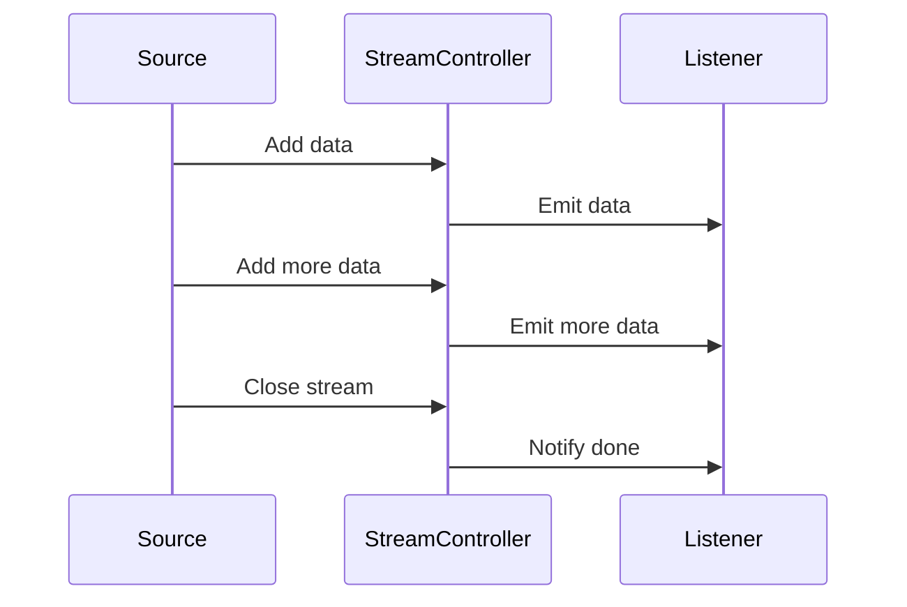

## 8.3 Working with Streams

In the realm of Dart programming, streams are a powerful tool for handling sequences of asynchronous events. They allow us to process data as it becomes available, making them ideal for real-time applications and scenarios where data is continuously flowing. In this section, we will delve into the intricacies of working with streams in Dart, exploring how to implement, listen to, and transform streams effectively.

### Handling Multiple Asynchronous Events

Streams in Dart are akin to a sequence of events that can be processed asynchronously. They are particularly useful when dealing with data that arrives over time, such as user inputs, sensor data, or server-sent events. By leveraging streams, we can efficiently manage these asynchronous data sequences without blocking the main thread.

#### Implementing Streams in Dart

To harness the power of streams, we first need to understand how to implement them. Dart provides several ways to create streams, but one of the most flexible methods is through the use of stream controllers.

##### Stream Controllers: Creating Custom Streams

A `StreamController` in Dart acts as a bridge between the data source and the stream. It allows us to create custom streams and control the flow of data. Here's a basic example of how to create a stream using a `StreamController`:

```dart
import 'dart:async';

void main() {
  // Create a StreamController
  final controller = StreamController<int>();

  // Add data to the stream
  controller.sink.add(1);
  controller.sink.add(2);
  controller.sink.add(3);

  // Close the stream
  controller.close();

  // Listen to the stream
  controller.stream.listen(
    (data) {
      print('Received: $data');
    },
    onDone: () {
      print('Stream closed');
    },
    onError: (error) {
      print('Error: $error');
    },
  );
}
```

In this example, we create a `StreamController` for integers, add some data to the stream, and then listen for incoming data. The `onDone` callback is triggered when the stream is closed, and `onError` handles any errors that occur.

##### Listening to Streams: Using `listen`, `onData`, `onError`, `onDone`

Listening to a stream is a crucial part of working with streams. The `listen` method allows us to react to data as it arrives. We can specify callbacks for data, errors, and completion:

- **`onData`**: Called whenever new data is available.
- **`onError`**: Called if an error occurs.
- **`onDone`**: Called when the stream is closed.

Here's an example that demonstrates these callbacks:

```dart
void main() {
  final controller = StreamController<String>();

  controller.stream.listen(
    (data) {
      print('Data received: $data');
    },
    onError: (error) {
      print('Error: $error');
    },
    onDone: () {
      print('Stream is done');
    },
  );

  controller.sink.add('Hello');
  controller.sink.add('World');
  controller.sink.addError('Oops!');
  controller.close();
}
```

In this code, we listen to a stream of strings and handle data, errors, and completion events.

##### Transforming Streams: Using Methods like `map`, `where`, `asyncMap`

Streams in Dart can be transformed using a variety of methods. These transformations allow us to modify the data as it flows through the stream, enabling powerful data processing capabilities.

- **`map`**: Transforms each element of the stream.
- **`where`**: Filters elements based on a condition.
- **`asyncMap`**: Asynchronously transforms each element.

Here's an example that demonstrates these transformations:

```dart
void main() {
  final controller = StreamController<int>();

  // Transform the stream
  final transformedStream = controller.stream
      .map((data) => data * 2)
      .where((data) => data > 2)
      .asyncMap((data) async => 'Number: $data');

  transformedStream.listen(
    (data) {
      print(data);
    },
    onDone: () {
      print('Transformation complete');
    },
  );

  controller.sink.add(1);
  controller.sink.add(2);
  controller.sink.add(3);
  controller.close();
}
```

In this example, we double each number, filter out numbers less than or equal to 2, and then asynchronously convert each number to a string.

### Use Cases and Examples

Streams are versatile and can be applied to a wide range of scenarios. Let's explore some common use cases where streams shine.

#### Real-Time Data: Listening to Sensor Data or User Input Events

In real-time applications, such as those involving sensor data or user inputs, streams provide an efficient way to handle continuous data flow. For instance, consider a scenario where we need to process accelerometer data from a device:

```dart
import 'dart:async';

void main() {
  final accelerometerStream = Stream.periodic(Duration(seconds: 1), (count) {
    return {'x': count, 'y': count * 2, 'z': count * 3};
  });

  accelerometerStream.listen((data) {
    print('Accelerometer data: x=${data['x']}, y=${data['y']}, z=${data['z']}');
  });
}
```

In this example, we simulate accelerometer data using a periodic stream that generates data every second. This approach can be extended to handle real sensor data in a Flutter application.

#### Server-Sent Events: Handling Continuous Data Streams from a Server

Streams are also ideal for handling server-sent events, where data is continuously pushed from a server to a client. This is common in applications that require real-time updates, such as chat applications or live sports scores.

```dart
import 'dart:async';

void main() {
  final serverStream = Stream.periodic(Duration(seconds: 2), (count) {
    return 'Server message $count';
  });

  serverStream.listen((message) {
    print('Received: $message');
  });
}
```

In this example, we simulate server-sent events using a periodic stream that sends a new message every two seconds. This pattern can be adapted to handle real server data in a production environment.

### Visualizing Stream Processing

To better understand how streams process data, let's visualize the flow of data through a stream using a sequence diagram.



This diagram illustrates the interaction between a data source, a stream controller, and a listener. Data is added to the stream by the source, emitted to the listener by the stream controller, and the listener is notified when the stream is closed.

### Try It Yourself

To deepen your understanding of streams, try modifying the examples provided:

- **Experiment with Different Data Types**: Change the data type of the stream and see how it affects the transformations.
- **Implement Error Handling**: Introduce errors into the stream and handle them gracefully.
- **Create a Custom Stream**: Use a `StreamController` to create a custom stream that emits data based on user input or other events.

### Knowledge Check

Before we conclude, let's reinforce what we've learned with a few questions:

1. What is the purpose of a `StreamController` in Dart?
2. How can you transform data in a stream?
3. What are some common use cases for streams in real-time applications?

### Summary

In this section, we've explored the power of streams in Dart for handling multiple asynchronous events. We've learned how to implement, listen to, and transform streams, and we've seen how streams can be applied to real-time data processing and server-sent events. By mastering streams, you can build efficient, responsive applications that handle asynchronous data with ease.

Remember, this is just the beginning. As you continue to explore Dart and Flutter, you'll discover even more ways to leverage streams to create powerful, real-time applications. Keep experimenting, stay curious, and enjoy the journey!

## Quiz Time!



### What is the primary purpose of streams in Dart?

- [x] To handle sequences of asynchronous events
- [ ] To manage synchronous data processing
- [ ] To replace all asynchronous programming
- [ ] To simplify synchronous code execution

> **Explanation:** Streams in Dart are designed to handle sequences of asynchronous events, allowing data to be processed as it becomes available.

### Which method is used to listen to a stream in Dart?

- [x] `listen`
- [ ] `subscribe`
- [ ] `observe`
- [ ] `watch`

> **Explanation:** The `listen` method is used to listen to a stream and react to incoming data.

### What does the `map` method do in a stream?

- [x] Transforms each element of the stream
- [ ] Filters elements based on a condition
- [ ] Asynchronously transforms each element
- [ ] Combines multiple streams into one

> **Explanation:** The `map` method transforms each element of the stream, allowing for data modification.

### How can you handle errors in a stream?

- [x] Using the `onError` callback
- [ ] Using the `catch` method
- [ ] Using the `try` block
- [ ] Using the `finally` block

> **Explanation:** Errors in a stream can be handled using the `onError` callback provided in the `listen` method.

### What is a common use case for streams in real-time applications?

- [x] Listening to sensor data
- [ ] Processing batch data
- [ ] Managing synchronous tasks
- [ ] Handling static data

> **Explanation:** Streams are commonly used in real-time applications to listen to continuous data, such as sensor data.

### What is the role of a `StreamController`?

- [x] To create and manage custom streams
- [ ] To listen to streams
- [ ] To transform stream data
- [ ] To handle errors in streams

> **Explanation:** A `StreamController` is used to create and manage custom streams, controlling the flow of data.

### Which method filters elements in a stream?

- [x] `where`
- [ ] `map`
- [ ] `asyncMap`
- [ ] `reduce`

> **Explanation:** The `where` method filters elements in a stream based on a specified condition.

### How can you asynchronously transform elements in a stream?

- [x] Using the `asyncMap` method
- [ ] Using the `map` method
- [ ] Using the `where` method
- [ ] Using the `filter` method

> **Explanation:** The `asyncMap` method allows for asynchronous transformation of elements in a stream.

### What happens when a stream is closed?

- [x] The `onDone` callback is triggered
- [ ] The `onError` callback is triggered
- [ ] The stream continues to emit data
- [ ] The stream is reset

> **Explanation:** When a stream is closed, the `onDone` callback is triggered to notify listeners.

### True or False: Streams can only handle integer data types.

- [ ] True
- [x] False

> **Explanation:** Streams in Dart can handle any data type, not just integers.


