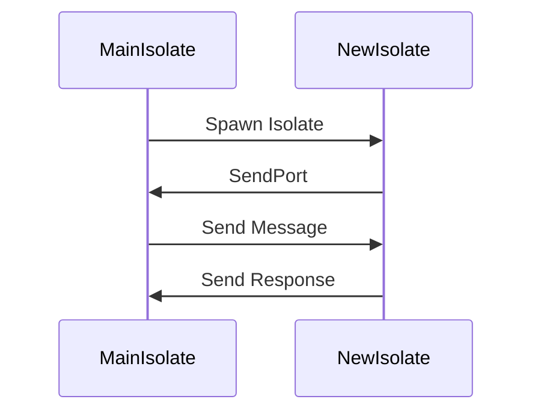

## 8.4 Isolates for Parallel Execution

In the world of modern software development, leveraging multiple CPU cores for parallel execution is crucial for building high-performance applications. Dart, the language behind Flutter, provides a powerful concurrency model through isolates. This section will guide you through understanding and implementing isolates in Dart, enabling you to run code in parallel and keep your applications responsive and efficient.

### Leveraging Multiple CPU Cores

Dart's concurrency model is built around the concept of isolates. Unlike traditional threads, isolates are independent workers that do not share memory. This design choice eliminates the need for locks and reduces the complexity of concurrent programming. Instead, isolates communicate by passing messages, making them ideal for parallel execution on multiple CPU cores.

#### Implementing Isolates in Dart

To harness the power of isolates, we need to understand how to create and manage them effectively. Let's delve into the key aspects of implementing isolates in Dart.

##### Spawning Isolates: Using `Isolate.spawn`

The `Isolate.spawn` function is the primary method for creating new isolates. It allows you to run a function in a separate isolate, effectively parallelizing your code. Here's a basic example:

```dart
import 'dart:isolate';

// Function to be executed in a separate isolate
void isolateFunction(SendPort sendPort) {
  // Perform some computation
  int result = 42; // Example computation
  // Send the result back to the main isolate
  sendPort.send(result);
}

void main() async {
  // Create a ReceivePort to receive messages from the isolate
  ReceivePort receivePort = ReceivePort();

  // Spawn a new isolate
  await Isolate.spawn(isolateFunction, receivePort.sendPort);

  // Listen for messages from the isolate
  receivePort.listen((message) {
    print('Received from isolate: $message');
    receivePort.close();
  });
}
```

In this example, we define a function `isolateFunction` that performs a computation and sends the result back to the main isolate using a `SendPort`. The main isolate creates a `ReceivePort` to receive messages and spawns a new isolate with `Isolate.spawn`, passing the `SendPort` as an argument.

##### Communication Between Isolates: Using `SendPort` and `ReceivePort`

Communication between isolates is achieved through `SendPort` and `ReceivePort`. These ports allow isolates to send and receive messages asynchronously. It's important to note that only data that can be serialized can be sent between isolates. This includes primitive types, lists, and maps, but not complex objects or closures.

Here's an example demonstrating bidirectional communication between isolates:

```dart
import 'dart:isolate';

// Function to be executed in a separate isolate
void isolateFunction(SendPort mainSendPort) {
  // Create a ReceivePort for receiving messages from the main isolate
  ReceivePort isolateReceivePort = ReceivePort();

  // Send the port to the main isolate
  mainSendPort.send(isolateReceivePort.sendPort);

  // Listen for messages from the main isolate
  isolateReceivePort.listen((message) {
    print('Isolate received: $message');
    // Send a response back to the main isolate
    mainSendPort.send('Hello from isolate!');
  });
}

void main() async {
  // Create a ReceivePort to receive messages from the isolate
  ReceivePort mainReceivePort = ReceivePort();

  // Spawn a new isolate
  await Isolate.spawn(isolateFunction, mainReceivePort.sendPort);

  // Listen for the SendPort from the isolate
  SendPort? isolateSendPort;
  mainReceivePort.listen((message) {
    if (message is SendPort) {
      isolateSendPort = message;
      // Send a message to the isolate
      isolateSendPort?.send('Hello from main!');
    } else {
      print('Main received: $message');
      mainReceivePort.close();
    }
  });
}
```

In this example, the main isolate sends a message to the spawned isolate, which then responds back. This demonstrates how isolates can communicate back and forth using ports.

##### Limitations: Data Must Be Transferable Between Isolates

While isolates provide a robust model for parallel execution, they come with certain limitations. The most significant is that data must be transferable between isolates. This means you cannot directly share complex objects or closures. Instead, you must serialize data into a transferable format, such as JSON, or use primitive types, lists, and maps.

### Use Cases and Examples

Now that we understand how to implement and communicate with isolates, let's explore some practical use cases where isolates shine.

#### Computationally Intensive Tasks

Isolates are particularly useful for offloading computationally intensive tasks, such as image processing or complex calculations, to prevent blocking the main thread. Here's an example of using isolates for image processing:

```dart
import 'dart:isolate';
import 'dart:typed_data';

// Function to process image data in a separate isolate
void processImage(SendPort sendPort) {
  // Simulate image processing
  Uint8List processedImageData = Uint8List.fromList([/* processed data */]);
  // Send the processed image data back to the main isolate
  sendPort.send(processedImageData);
}

void main() async {
  ReceivePort receivePort = ReceivePort();

  // Spawn an isolate for image processing
  await Isolate.spawn(processImage, receivePort.sendPort);

  // Listen for the processed image data
  receivePort.listen((message) {
    if (message is Uint8List) {
      print('Received processed image data');
      // Handle the processed image data
    }
    receivePort.close();
  });
}
```

In this example, we simulate image processing in a separate isolate, allowing the main isolate to remain responsive.

#### Background Processing

Isolates are also ideal for performing background processing tasks, such as data fetching or file I/O, without blocking the UI. This is crucial for maintaining a smooth user experience in Flutter applications.

Consider an example where we fetch data from a network in a separate isolate:

```dart
import 'dart:isolate';
import 'dart:convert';
import 'package:http/http.dart' as http;

// Function to fetch data in a separate isolate
void fetchData(SendPort sendPort) async {
  final response = await http.get(Uri.parse('https://api.example.com/data'));
  if (response.statusCode == 200) {
    final data = jsonDecode(response.body);
    sendPort.send(data);
  } else {
    sendPort.send('Failed to fetch data');
  }
}

void main() async {
  ReceivePort receivePort = ReceivePort();

  // Spawn an isolate for data fetching
  await Isolate.spawn(fetchData, receivePort.sendPort);

  // Listen for the fetched data
  receivePort.listen((message) {
    print('Received data: $message');
    receivePort.close();
  });
}
```

In this example, we perform a network request in a separate isolate, ensuring that the main isolate remains free to handle UI updates.

### Visualizing Isolate Communication

To better understand how isolates communicate, let's visualize the process using a sequence diagram.



**Diagram Description**: This sequence diagram illustrates the communication flow between the main isolate and a newly spawned isolate. The main isolate spawns the new isolate, receives a `SendPort`, sends a message, and receives a response.

### Design Considerations

When using isolates, consider the following design considerations:

- **Data Transfer**: Ensure that data passed between isolates is serializable. Use JSON or other serialization formats for complex data structures.
- **Resource Management**: Isolates consume system resources. Be mindful of the number of isolates you spawn, especially on resource-constrained devices.
- **Error Handling**: Implement robust error handling for communication between isolates. Consider using try-catch blocks and status messages to handle failures gracefully.

### Differences and Similarities

Isolates are often compared to threads in other programming languages. Here are some key differences and similarities:

- **Memory Isolation**: Unlike threads, isolates do not share memory. This eliminates race conditions and the need for locks.
- **Message Passing**: Communication between isolates is achieved through message passing, similar to actor models in other languages.
- **Concurrency Model**: Isolates provide a simpler concurrency model compared to traditional threading, reducing complexity.

### Try It Yourself

Now that we've covered the basics of isolates, it's time to experiment. Try modifying the code examples to:

- Pass complex data structures between isolates using JSON serialization.
- Implement error handling for network requests in the data fetching example.
- Create multiple isolates to perform different tasks concurrently.

### Knowledge Check

Before we conclude, let's reinforce what we've learned with a few questions:

- What is the primary method for creating new isolates in Dart?
- How do isolates communicate with each other?
- What are some limitations of using isolates for parallel execution?

### Embrace the Journey

Remember, mastering concurrency with isolates is just the beginning. As you continue your journey in Dart and Flutter development, you'll discover more advanced techniques and patterns to build efficient, responsive applications. Keep experimenting, stay curious, and enjoy the process!

## Quiz Time!



### What is the primary method for creating new isolates in Dart?

- [x] Isolate.spawn
- [ ] Isolate.create
- [ ] Isolate.start
- [ ] Isolate.init

> **Explanation:** The `Isolate.spawn` function is used to create new isolates in Dart.

### How do isolates communicate with each other?

- [x] Through message passing using SendPort and ReceivePort
- [ ] By sharing memory
- [ ] Using global variables
- [ ] Through direct method calls

> **Explanation:** Isolates communicate by passing messages using `SendPort` and `ReceivePort`.

### What is a limitation of using isolates for parallel execution?

- [x] Data must be transferable between isolates
- [ ] Isolates can share memory
- [ ] Isolates cannot run in parallel
- [ ] Isolates are slower than threads

> **Explanation:** Data must be serializable to be transferred between isolates, as they do not share memory.

### Which of the following is NOT a use case for isolates?

- [ ] Image processing
- [ ] Background data fetching
- [x] UI rendering
- [ ] Complex calculations

> **Explanation:** Isolates are used for computationally intensive tasks and background processing, not for UI rendering.

### What is the main advantage of isolates over traditional threads?

- [x] Memory isolation eliminates race conditions
- [ ] They are faster than threads
- [ ] They can share memory
- [ ] They are easier to debug

> **Explanation:** Isolates do not share memory, eliminating race conditions and the need for locks.

### What type of data can be sent between isolates?

- [x] Serializable data
- [ ] Complex objects
- [ ] Closures
- [ ] Functions

> **Explanation:** Only data that can be serialized, such as primitive types, lists, and maps, can be sent between isolates.

### What is the role of a ReceivePort in isolate communication?

- [x] To receive messages from other isolates
- [ ] To send messages to other isolates
- [ ] To share memory between isolates
- [ ] To execute code in parallel

> **Explanation:** A `ReceivePort` is used to receive messages from other isolates.

### How can you handle errors in isolate communication?

- [x] Using try-catch blocks and status messages
- [ ] By ignoring them
- [ ] Using global error handlers
- [ ] By restarting the isolate

> **Explanation:** Implement robust error handling using try-catch blocks and status messages to handle failures gracefully.

### What is a key difference between isolates and threads?

- [x] Isolates do not share memory
- [ ] Isolates are slower
- [ ] Threads use message passing
- [ ] Threads are easier to implement

> **Explanation:** Isolates do not share memory, unlike threads, which can share memory.

### True or False: Isolates can be used to keep the UI responsive during heavy tasks.

- [x] True
- [ ] False

> **Explanation:** Isolates can offload heavy tasks to keep the UI responsive by running them in parallel.


