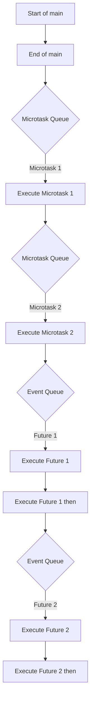

## 8.5 Event Loops and Microtasks in Dart

In the world of Dart programming, understanding the event loop and microtask queue is crucial for mastering concurrency patterns. These concepts are fundamental to building responsive and efficient applications, especially in Flutter, where UI responsiveness is key. This section will guide you through the intricacies of task scheduling in Dart, focusing on how the language prioritizes tasks, the differences between the event queue and the microtask queue, and practical use cases for optimizing performance and ensuring the correct order of execution.

### Understanding Task Scheduling in Dart

Task scheduling in Dart is a mechanism that determines the order in which tasks are executed. Dart uses an event-driven architecture, which means that it processes tasks asynchronously. This architecture is essential for handling I/O operations, user interactions, and other asynchronous events without blocking the main thread.

#### The Event Loop

The event loop is the core component of Dart's concurrency model. It continuously checks for tasks in the event queue and executes them one by one. The event loop ensures that the application remains responsive by processing tasks as they arrive.

- **Event Queue**: This queue holds tasks that originate from external events, such as I/O operations, timers, and user interactions. Tasks in the event queue are executed in the order they are received.

- **Microtask Queue**: This queue is used for internal tasks that need to be executed before the next event in the event queue. Microtasks are typically used for tasks that are generated by the application itself, such as completing a `Future`.

#### Event Queue vs. Microtask Queue

Understanding the distinction between the event queue and the microtask queue is crucial for effective task scheduling.

- **Event Queue**: The event queue is designed for tasks that are triggered by external events. These tasks are executed in the order they are added to the queue. Examples include network requests, file I/O, and user input events.

- **Microtask Queue**: The microtask queue is used for tasks that need to be executed immediately after the current task completes but before any tasks in the event queue. This queue is ideal for tasks that are generated by the application itself, such as updating the state of a widget or completing a `Future`.

### Implementing Microtasks in Dart

Microtasks are a powerful tool for managing internal tasks that need to be executed promptly. Dart provides the `scheduleMicrotask` function to add tasks to the microtask queue.

#### Using `scheduleMicrotask`

The `scheduleMicrotask` function allows you to schedule a function to be executed as a microtask. This function is part of the `dart:async` library and is used to ensure that a task runs as soon as possible after the current task completes.

```dart
import 'dart:async';

void main() {
  print('Start of main');

  scheduleMicrotask(() {
    print('Microtask 1');
  });

  Future(() {
    print('Future 1');
  }).then((_) {
    print('Future 1 then');
  });

  scheduleMicrotask(() {
    print('Microtask 2');
  });

  print('End of main');
}
```

**Output:**
```
Start of main
End of main
Microtask 1
Microtask 2
Future 1
Future 1 then
```

In this example, the microtasks are executed immediately after the main function completes, before any futures. This demonstrates the priority of the microtask queue over the event queue.

### Use Cases and Examples

Understanding when and how to use microtasks can significantly impact the performance and responsiveness of your Dart applications.

#### Optimizing Performance

Microtasks can be used to defer tasks that need to be executed soon but not immediately. This can help optimize performance by ensuring that the main thread is not blocked by long-running tasks.

- **Example**: Use microtasks to update the UI state after processing data in the background. This ensures that the UI remains responsive while the data is being processed.

```dart
void processData() {
  // Simulate data processing
  Future.delayed(Duration(seconds: 2), () {
    print('Data processed');
    scheduleMicrotask(() {
      print('Update UI');
    });
  });
}

void main() {
  print('Start processing data');
  processData();
  print('Continue with other tasks');
}
```

**Output:**
```
Start processing data
Continue with other tasks
Data processed
Update UI
```

In this example, the UI update is deferred until the data processing is complete, ensuring that the application remains responsive.

#### Ensuring Order of Execution

Microtasks can also be used to manage dependencies between tasks, ensuring that certain tasks are executed in a specific order.

- **Example**: Use microtasks to ensure that a sequence of operations is completed before proceeding to the next step.

```dart
void main() {
  print('Start of main');

  Future(() {
    print('Future 1');
  }).then((_) {
    print('Future 1 then');
  });

  scheduleMicrotask(() {
    print('Microtask 1');
  });

  Future(() {
    print('Future 2');
  }).then((_) {
    print('Future 2 then');
  });

  scheduleMicrotask(() {
    print('Microtask 2');
  });

  print('End of main');
}
```

**Output:**
```
Start of main
End of main
Microtask 1
Microtask 2
Future 1
Future 1 then
Future 2
Future 2 then
```

In this example, the microtasks ensure that certain operations are completed before the futures are executed, maintaining the desired order of execution.

### Visualizing Event Loops and Microtasks

To better understand how the event loop and microtask queue work, let's visualize the process using a flowchart.



**Description**: This flowchart illustrates the order of execution for tasks in the event loop and microtask queue. The microtasks are executed immediately after the main function completes, before any futures in the event queue.

### References and Links

For further reading on Dart's event loop and microtask queue, consider the following resources:

- [Dart Asynchronous Programming: Futures, async, await](https://dart.dev/codelabs/async-await)
- [Understanding Dart's Event Loop](https://medium.com/dartlang/dart-asynchronous-programming-isolates-and-event-loops-bffc3e296a6a)
- [Dart Language Tour: Asynchrony Support](https://dart.dev/guides/language/language-tour#asynchrony-support)

### Knowledge Check

Let's reinforce what we've learned with a few questions:

1. What is the primary purpose of the microtask queue in Dart?
2. How does the event loop prioritize tasks in Dart?
3. When should you use `scheduleMicrotask` in your Dart applications?
4. What is the difference between the event queue and the microtask queue?
5. How can microtasks be used to optimize performance in Dart applications?

### Embrace the Journey

Remember, mastering Dart's event loop and microtask queue is just the beginning of your journey into concurrency patterns. As you continue to explore and experiment with these concepts, you'll gain a deeper understanding of how to build responsive and efficient applications. Keep experimenting, stay curious, and enjoy the journey!

## Quiz Time!



### What is the primary purpose of the microtask queue in Dart?

- [x] To execute internal tasks before the next event in the event queue.
- [ ] To handle external events like I/O operations.
- [ ] To manage user interactions.
- [ ] To prioritize network requests.

> **Explanation:** The microtask queue is used for internal tasks that need to be executed before the next event in the event queue.

### How does the event loop prioritize tasks in Dart?

- [x] It executes microtasks before tasks in the event queue.
- [ ] It executes tasks in the event queue before microtasks.
- [ ] It executes tasks randomly.
- [ ] It executes tasks based on their complexity.

> **Explanation:** The event loop prioritizes microtasks over tasks in the event queue, ensuring they are executed first.

### When should you use `scheduleMicrotask` in your Dart applications?

- [x] For tasks that need to run soon after the current task completes.
- [ ] For tasks that require user input.
- [ ] For tasks that involve network requests.
- [ ] For tasks that are computationally intensive.

> **Explanation:** `scheduleMicrotask` is used for tasks that need to run soon after the current task completes, before any tasks in the event queue.

### What is the difference between the event queue and the microtask queue?

- [x] The event queue handles external events, while the microtask queue handles internal tasks.
- [ ] The event queue handles internal tasks, while the microtask queue handles external events.
- [ ] The event queue is faster than the microtask queue.
- [ ] The microtask queue is slower than the event queue.

> **Explanation:** The event queue handles external events, while the microtask queue handles internal tasks that need to be executed before the next event.

### How can microtasks be used to optimize performance in Dart applications?

- [x] By deferring tasks that need to run soon but not immediately.
- [ ] By executing all tasks at once.
- [ ] By handling user interactions.
- [ ] By prioritizing network requests.

> **Explanation:** Microtasks can be used to defer tasks that need to run soon but not immediately, optimizing performance by ensuring the main thread is not blocked.

### What is the role of the event loop in Dart's concurrency model?

- [x] To continuously check and execute tasks in the event and microtask queues.
- [ ] To handle only I/O operations.
- [ ] To manage user interface updates.
- [ ] To execute tasks in parallel.

> **Explanation:** The event loop continuously checks and executes tasks in the event and microtask queues, ensuring the application remains responsive.

### Which function is used to add tasks to the microtask queue in Dart?

- [x] `scheduleMicrotask`
- [ ] `addMicrotask`
- [ ] `enqueueMicrotask`
- [ ] `executeMicrotask`

> **Explanation:** The `scheduleMicrotask` function is used to add tasks to the microtask queue in Dart.

### What happens if a microtask throws an exception in Dart?

- [x] The exception is propagated to the event loop.
- [ ] The exception is ignored.
- [ ] The application crashes.
- [ ] The microtask is retried.

> **Explanation:** If a microtask throws an exception, it is propagated to the event loop, which can handle it appropriately.

### In what order are tasks executed in Dart's event loop?

- [x] Microtasks first, then tasks in the event queue.
- [ ] Tasks in the event queue first, then microtasks.
- [ ] Random order.
- [ ] Based on task complexity.

> **Explanation:** Tasks are executed in the order of microtasks first, then tasks in the event queue.

### True or False: The microtask queue is used for tasks that originate from external events.

- [ ] True
- [x] False

> **Explanation:** False. The microtask queue is used for internal tasks that need to be executed before the next event in the event queue.


