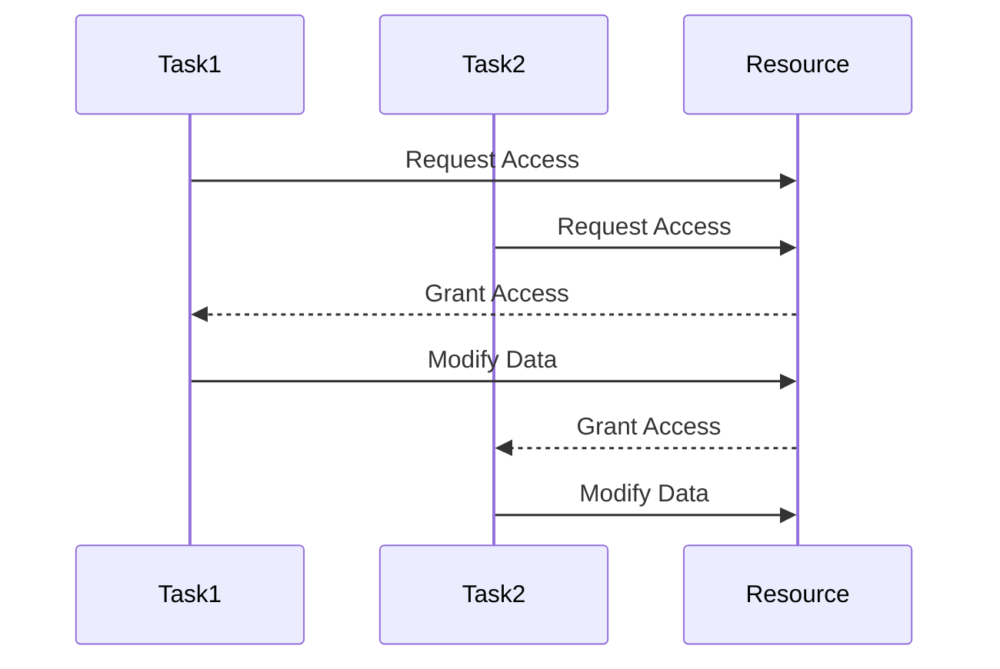

## 8.6 Concurrency Best Practices

Concurrency is a powerful tool in software development, enabling applications to perform multiple tasks simultaneously. In Dart, concurrency is primarily achieved through asynchronous programming using `Futures`, `Streams`, and `Isolates`. However, with great power comes great responsibility. Mismanaging concurrency can lead to race conditions, deadlocks, and other issues that can compromise the stability and performance of your applications. In this section, we will explore best practices for managing concurrency in Dart, focusing on avoiding race conditions and deadlocks, using immutable data, managing resources effectively, and implementing cancellation tokens.

### Understanding Concurrency Challenges

Before diving into best practices, it's essential to understand the common challenges associated with concurrency:

- **Race Conditions**: Occur when two or more threads or tasks attempt to modify shared data simultaneously, leading to unpredictable results.
- **Deadlocks**: Happen when two or more tasks are waiting for each other to release resources, causing a standstill.
- **Resource Management**: Involves ensuring that resources such as memory, file handles, and network connections are properly allocated and released.
- **Task Cancellation**: Refers to the ability to stop a task that is no longer needed, freeing up resources and improving responsiveness.

### Best Practices for Avoiding Race Conditions and Deadlocks

#### 1. Use Immutable Data

Immutable data structures are a cornerstone of safe concurrent programming. By ensuring that data cannot be modified once created, you eliminate the risk of race conditions. Dart provides several ways to work with immutable data:

- **Final and Const**: Use `final` and `const` keywords to create immutable variables and objects.

```dart
final List<int> numbers = [1, 2, 3]; // Immutable list
const pi = 3.14159; // Immutable constant
```

- **Immutable Collections**: Use packages like `built_collection` to create immutable collections.

```dart
import 'package:built_collection/built_collection.dart';

final BuiltList<int> immutableList = BuiltList<int>([1, 2, 3]);
```

- **Data Classes**: Use data classes to encapsulate immutable data.

```dart
class Point {
  final int x;
  final int y;

  const Point(this.x, this.y);
}
```

#### 2. Properly Manage Resources

Effective resource management is crucial for avoiding deadlocks and ensuring that your application runs smoothly. Here are some strategies:

- **Use `try-finally` Blocks**: Ensure that resources are released even if an error occurs.

```dart
void readFile(String path) {
  var file = File(path);
  try {
    // Read file
  } finally {
    file.close(); // Ensure file is closed
  }
}
```

- **Limit Resource Usage**: Use resource pools to limit the number of resources in use at any time.

```dart
class ResourcePool {
  final int maxResources;
  int _currentResources = 0;

  ResourcePool(this.maxResources);

  Future<void> acquire() async {
    while (_currentResources >= maxResources) {
      await Future.delayed(Duration(milliseconds: 100));
    }
    _currentResources++;
  }

  void release() {
    _currentResources--;
  }
}
```

- **Avoid Nested Locks**: Nested locks can lead to deadlocks. Instead, acquire all necessary locks at once.

#### 3. Asynchronous Initialization

Ensure that resources are ready before use by initializing them asynchronously. This is particularly important for resources that require network access or other asynchronous operations.

```dart
Future<void> initializeResource() async {
  var resource = await fetchResource();
  // Use resource
}
```

#### 4. Implement Cancellation Tokens

Cancellation tokens allow you to cancel tasks that are no longer needed, freeing up resources and improving responsiveness.

- **Create a Cancellation Token**: Use a `Completer` to create a cancellation token.

```dart
class CancellationToken {
  final Completer<void> _completer = Completer<void>();

  Future<void> get token => _completer.future;

  void cancel() {
    if (!_completer.isCompleted) {
      _completer.complete();
    }
  }
}
```

- **Use the Cancellation Token**: Check the token periodically in your asynchronous tasks.

```dart
Future<void> performTask(CancellationToken token) async {
  while (true) {
    if (token.token.isCompleted) {
      print('Task cancelled');
      return;
    }
    // Perform task
    await Future.delayed(Duration(seconds: 1));
  }
}
```

### Visualizing Concurrency Challenges

To better understand the challenges of concurrency, let's visualize a scenario where multiple tasks compete for the same resource, leading to a race condition.



In this diagram, both Task1 and Task2 request access to the same resource. If the resource is not properly synchronized, Task2 may overwrite changes made by Task1, leading to a race condition.

### Use Cases and Examples

#### Use Case 1: Asynchronous Initialization

Consider a scenario where you need to fetch data from a remote server before displaying it in your application. Asynchronous initialization ensures that the data is ready before use.

```dart
Future<void> fetchData() async {
  var data = await fetchFromServer();
  displayData(data);
}

Future<String> fetchFromServer() async {
  // Simulate network delay
  await Future.delayed(Duration(seconds: 2));
  return 'Data from server';
}

void displayData(String data) {
  print(data);
}
```

#### Use Case 2: Cancellation Tokens

Imagine a scenario where a user initiates a search operation but decides to cancel it before it completes. Cancellation tokens allow you to stop the search operation and free up resources.

```dart
void main() {
  var token = CancellationToken();
  performSearch(token);

  // Simulate user cancelling the search
  Future.delayed(Duration(seconds: 1), () {
    token.cancel();
  });
}

Future<void> performSearch(CancellationToken token) async {
  while (true) {
    if (token.token.isCompleted) {
      print('Search cancelled');
      return;
    }
    // Simulate search operation
    print('Searching...');
    await Future.delayed(Duration(milliseconds: 500));
  }
}
```

### Try It Yourself

Experiment with the code examples provided in this section. Try modifying the `fetchData` function to simulate a network error and see how it affects the application. Implement a cancellation token in a different context, such as a file download operation, and observe how it improves resource management.

### Knowledge Check

- **What is a race condition, and how can it be avoided?**
- **Explain the importance of using immutable data in concurrent programming.**
- **How can cancellation tokens improve resource management in asynchronous tasks?**

### Embrace the Journey

Concurrency can be challenging, but with the right practices, you can harness its power to build responsive and efficient applications. Remember, this is just the beginning. As you progress, you'll encounter more complex scenarios that require creative solutions. Keep experimenting, stay curious, and enjoy the journey!

### References and Links

- [Dart Asynchronous Programming](https://dart.dev/codelabs/async-await)
- [Effective Dart: Usage](https://dart.dev/guides/language/effective-dart/usage)
- [Built Collection Package](https://pub.dev/packages/built_collection)

## Quiz Time!



### What is a race condition?

- [x] A situation where two or more tasks attempt to modify shared data simultaneously.
- [ ] A situation where a task waits indefinitely for a resource.
- [ ] A method of optimizing resource usage.
- [ ] A technique for managing asynchronous tasks.

> **Explanation:** A race condition occurs when multiple tasks attempt to modify shared data at the same time, leading to unpredictable results.

### How can immutable data help in concurrent programming?

- [x] By eliminating the risk of race conditions.
- [ ] By increasing the speed of data processing.
- [ ] By reducing memory usage.
- [ ] By simplifying error handling.

> **Explanation:** Immutable data cannot be modified once created, which eliminates the risk of race conditions in concurrent programming.

### What is the purpose of a cancellation token?

- [x] To allow tasks to be canceled when they are no longer needed.
- [ ] To increase the speed of task execution.
- [ ] To manage memory usage.
- [ ] To synchronize access to shared resources.

> **Explanation:** Cancellation tokens allow tasks to be canceled, freeing up resources and improving responsiveness.

### What is a deadlock?

- [x] A situation where two or more tasks wait indefinitely for each other to release resources.
- [ ] A method of optimizing resource usage.
- [ ] A technique for managing asynchronous tasks.
- [ ] A situation where a task completes without errors.

> **Explanation:** A deadlock occurs when tasks wait indefinitely for each other to release resources, causing a standstill.

### Which of the following is a strategy for avoiding deadlocks?

- [x] Avoiding nested locks.
- [ ] Increasing the number of resources.
- [ ] Using more threads.
- [ ] Reducing task execution time.

> **Explanation:** Avoiding nested locks can help prevent deadlocks by ensuring that tasks do not wait indefinitely for each other to release resources.

### How can you ensure that resources are released even if an error occurs?

- [x] By using `try-finally` blocks.
- [ ] By increasing the number of resources.
- [ ] By using more threads.
- [ ] By reducing task execution time.

> **Explanation:** `try-finally` blocks ensure that resources are released even if an error occurs, preventing resource leaks.

### What is the benefit of using resource pools?

- [x] Limiting the number of resources in use at any time.
- [ ] Increasing the speed of task execution.
- [ ] Simplifying error handling.
- [ ] Reducing memory usage.

> **Explanation:** Resource pools limit the number of resources in use at any time, preventing resource exhaustion and improving stability.

### How can asynchronous initialization improve application performance?

- [x] By ensuring resources are ready before use.
- [ ] By increasing the speed of task execution.
- [ ] By reducing memory usage.
- [ ] By simplifying error handling.

> **Explanation:** Asynchronous initialization ensures that resources are ready before use, preventing delays and improving application performance.

### What is the role of `final` and `const` in Dart?

- [x] To create immutable variables and objects.
- [ ] To increase the speed of data processing.
- [ ] To manage memory usage.
- [ ] To simplify error handling.

> **Explanation:** `final` and `const` are used to create immutable variables and objects, which are essential for safe concurrent programming.

### True or False: Nested locks can lead to deadlocks.

- [x] True
- [ ] False

> **Explanation:** Nested locks can lead to deadlocks because tasks may wait indefinitely for each other to release resources.


