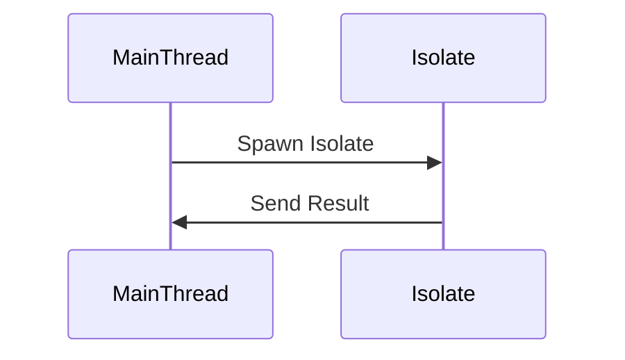
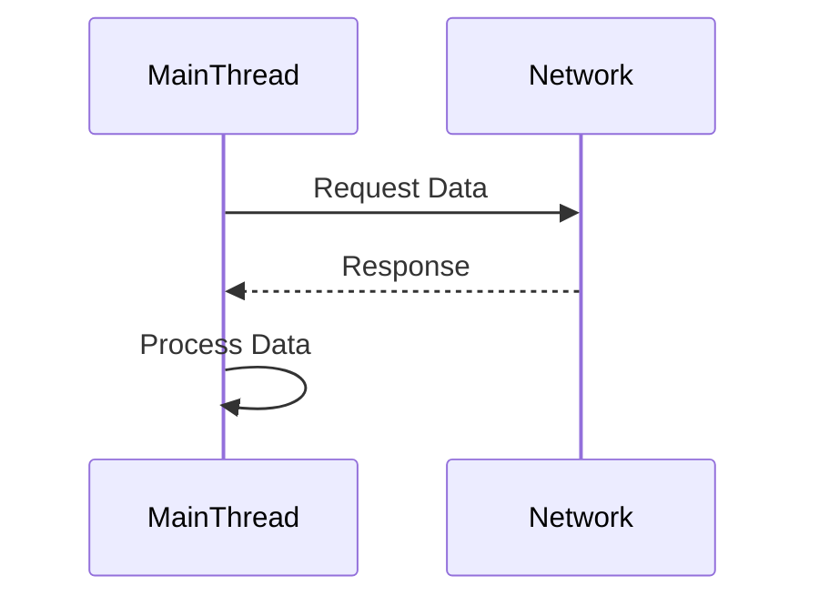
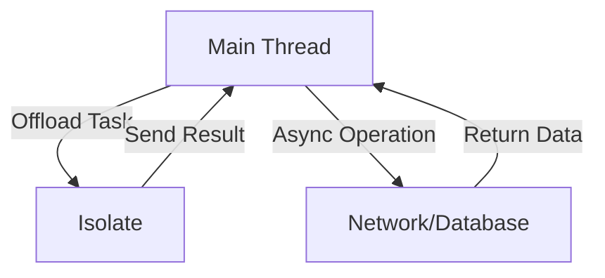

## 8.7 Managing the UI Thread in Flutter

In the world of mobile application development, ensuring a smooth and responsive user interface (UI) is paramount. Flutter, with its rich set of widgets and reactive framework, provides developers with the tools to create beautiful and performant applications. However, managing the UI thread effectively is crucial to prevent jank and maintain a seamless user experience. In this section, we will explore strategies and best practices for managing the UI thread in Flutter applications, focusing on keeping the UI responsive by avoiding long-running operations on the main thread.

### Keeping the UI Responsive

The UI thread, also known as the main thread, is responsible for rendering the UI and handling user interactions. Any long-running operations on this thread can lead to UI freezes or jank, which negatively impacts the user experience. To keep the UI responsive, it's essential to offload heavy computations and blocking operations to separate threads or processes.

#### Implementing Off-Main-Thread Operations

Flutter provides several mechanisms to perform operations off the main thread, including asynchronous functions and isolates. Let's delve into these techniques and understand how they can be used to enhance the performance of Flutter applications.

##### Using Isolates for Heavy Computations

Isolates are Dart's way of achieving concurrency. Unlike threads in other programming languages, isolates do not share memory and communicate by passing messages. This makes them ideal for heavy computations that can be run in parallel without affecting the UI thread.

###### Creating and Using Isolates

To create an isolate in Flutter, you can use the `Isolate.spawn` function. Here's a simple example demonstrating how to use an isolate for a CPU-intensive task:

```dart
import 'dart:async';
import 'dart:isolate';

// Function to perform heavy computation
void heavyComputation(SendPort sendPort) {
  int result = 0;
  for (int i = 0; i < 1000000000; i++) {
    result += i;
  }
  sendPort.send(result);
}

void main() async {
  // ReceivePort to receive messages from the isolate
  final receivePort = ReceivePort();

  // Spawning an isolate
  await Isolate.spawn(heavyComputation, receivePort.sendPort);

  // Listening for messages from the isolate
  receivePort.listen((message) {
    print('Result from isolate: $message');
    receivePort.close();
  });
}
```

In this example, the `heavyComputation` function performs a simple summation operation, which is offloaded to an isolate. The main thread remains free to handle UI updates and user interactions.

###### Visualizing Isolate Communication



*Diagram: Communication between the main thread and an isolate using message passing.*

##### Asynchronous Functions to Prevent Blocking

Asynchronous programming is another powerful tool in Dart and Flutter to prevent blocking the UI thread. By using `async` and `await`, you can perform non-blocking operations, such as network requests or file I/O, without freezing the UI.

###### Example of Asynchronous Function

Here's an example of using asynchronous functions to fetch data from a network:

```dart
import 'dart:convert';
import 'package:http/http.dart' as http;

// Function to fetch data from a network
Future<void> fetchData() async {
  final response = await http.get(Uri.parse('https://api.example.com/data'));

  if (response.statusCode == 200) {
    final data = jsonDecode(response.body);
    print('Data fetched: $data');
  } else {
    throw Exception('Failed to load data');
  }
}

void main() {
  fetchData();
  print('Fetching data...');
}
```

In this example, the `fetchData` function performs a network request asynchronously, allowing the main thread to remain responsive while the data is being fetched.

###### Visualizing Asynchronous Execution



*Diagram: Asynchronous data fetching and processing without blocking the main thread.*

### Use Cases and Examples

Let's explore some common use cases where managing the UI thread effectively is crucial, along with examples demonstrating best practices.

#### Image Decoding: Processing Images Without Freezing the UI

Image processing can be computationally expensive, especially when dealing with large images or applying complex transformations. To prevent the UI from freezing, it's essential to perform image decoding and processing off the main thread.

##### Example of Image Decoding Using Isolates

Here's an example of using an isolate to decode an image:

```dart
import 'dart:typed_data';
import 'dart:isolate';
import 'package:flutter/material.dart';
import 'package:flutter/services.dart';
import 'package:image/image.dart' as img;

// Function to decode image
void decodeImage(SendPort sendPort) async {
  final ByteData data = await rootBundle.load('assets/sample.jpg');
  final Uint8List bytes = data.buffer.asUint8List();
  final img.Image image = img.decodeImage(bytes)!;
  sendPort.send(image);
}

void main() {
  runApp(MyApp());
}

class MyApp extends StatelessWidget {
  @override
  Widget build(BuildContext context) {
    return MaterialApp(
      home: ImageScreen(),
    );
  }
}

class ImageScreen extends StatefulWidget {
  @override
  _ImageScreenState createState() => _ImageScreenState();
}

class _ImageScreenState extends State<ImageScreen> {
  img.Image? _image;

  @override
  void initState() {
    super.initState();
    _loadImage();
  }

  Future<void> _loadImage() async {
    final receivePort = ReceivePort();
    await Isolate.spawn(decodeImage, receivePort.sendPort);

    receivePort.listen((message) {
      setState(() {
        _image = message as img.Image;
      });
      receivePort.close();
    });
  }

  @override
  Widget build(BuildContext context) {
    return Scaffold(
      appBar: AppBar(title: Text('Image Decoding')),
      body: Center(
        child: _image == null
            ? CircularProgressIndicator()
            : Image.memory(Uint8List.fromList(img.encodePng(_image!))),
      ),
    );
  }
}
```

In this example, the image is decoded in an isolate, ensuring that the UI remains responsive while the image is being processed.

#### Database Operations: Querying Large Datasets Asynchronously

Database operations, such as querying large datasets, can be time-consuming and should be performed asynchronously to avoid blocking the UI thread.

##### Example of Asynchronous Database Query

Here's an example of querying a database asynchronously using the `sqflite` package:

```dart
import 'package:flutter/material.dart';
import 'package:sqflite/sqflite.dart';
import 'package:path/path.dart';

void main() {
  runApp(MyApp());
}

class MyApp extends StatelessWidget {
  @override
  Widget build(BuildContext context) {
    return MaterialApp(
      home: DatabaseScreen(),
    );
  }
}

class DatabaseScreen extends StatefulWidget {
  @override
  _DatabaseScreenState createState() => _DatabaseScreenState();
}

class _DatabaseScreenState extends State<DatabaseScreen> {
  List<Map<String, dynamic>> _data = [];

  @override
  void initState() {
    super.initState();
    _fetchData();
  }

  Future<void> _fetchData() async {
    final database = openDatabase(
      join(await getDatabasesPath(), 'example.db'),
      onCreate: (db, version) {
        return db.execute(
          "CREATE TABLE items(id INTEGER PRIMARY KEY, name TEXT)",
        );
      },
      version: 1,
    );

    final db = await database;
    final List<Map<String, dynamic>> data = await db.query('items');

    setState(() {
      _data = data;
    });
  }

  @override
  Widget build(BuildContext context) {
    return Scaffold(
      appBar: AppBar(title: Text('Database Query')),
      body: ListView.builder(
        itemCount: _data.length,
        itemBuilder: (context, index) {
          return ListTile(
            title: Text(_data[index]['name']),
          );
        },
      ),
    );
  }
}
```

In this example, the database query is performed asynchronously, allowing the UI to remain responsive while the data is being fetched.

### Try It Yourself

To deepen your understanding, try modifying the code examples provided. For instance, in the image decoding example, experiment with different image transformations or apply filters. In the database query example, try adding more complex queries or updating the database schema. These exercises will help reinforce the concepts and give you hands-on experience with managing the UI thread in Flutter.

### Visualizing UI Thread Management



*Diagram: Offloading tasks to isolates and performing asynchronous operations to keep the UI thread responsive.*

### References and Links

For further reading on managing the UI thread in Flutter, consider exploring the following resources:

- [Flutter Documentation on Isolates](https://flutter.dev/docs/development/platform-integration/platform-channels)
- [Dart Asynchronous Programming: Futures, async, await](https://dart.dev/codelabs/async-await)
- [Effective Dart: Performance](https://dart.dev/guides/language/effective-dart/performance)

### Knowledge Check

To reinforce your understanding, consider the following questions:

1. Why is it important to manage the UI thread effectively in Flutter applications?
2. How do isolates differ from threads in other programming languages?
3. What are some common use cases for using isolates in Flutter?
4. How can asynchronous programming help prevent blocking the UI thread?
5. What are some best practices for performing database operations in Flutter?

### Embrace the Journey

Remember, mastering UI thread management in Flutter is a journey. As you continue to explore and experiment with these concepts, you'll gain the skills needed to build high-performance, responsive applications. Keep experimenting, stay curious, and enjoy the journey!

### Formatting and Structure

Organize your code and projects with clear headings and subheadings. Use bullet points to break down complex information and highlight important terms or concepts using bold or italic text sparingly.

### Writing Style

Use first-person plural (we, let's) to create a collaborative feel. Avoid gender-specific pronouns and define acronyms and abbreviations upon first use.

## Quiz Time!



### Why is it important to manage the UI thread effectively in Flutter applications?

- [x] To ensure a smooth and responsive user interface
- [ ] To increase the size of the application
- [ ] To make the application more complex
- [ ] To reduce the number of widgets used

> **Explanation:** Managing the UI thread effectively is crucial to prevent jank and maintain a seamless user experience.

### How do isolates differ from threads in other programming languages?

- [x] Isolates do not share memory and communicate by passing messages
- [ ] Isolates share memory and communicate directly
- [ ] Isolates are slower than threads
- [ ] Isolates can only be used for network operations

> **Explanation:** Isolates do not share memory and communicate by passing messages, making them ideal for parallel computations.

### What is the primary benefit of using asynchronous functions in Flutter?

- [x] To perform non-blocking operations without freezing the UI
- [ ] To increase the complexity of the code
- [ ] To make the application slower
- [ ] To reduce the number of lines of code

> **Explanation:** Asynchronous functions allow non-blocking operations, keeping the UI responsive.

### Which of the following is a common use case for using isolates in Flutter?

- [x] Heavy computations
- [ ] Simple arithmetic operations
- [ ] UI rendering
- [ ] Button click handling

> **Explanation:** Isolates are commonly used for heavy computations that can be run in parallel.

### What is the purpose of the `ReceivePort` in Dart isolates?

- [x] To receive messages from an isolate
- [ ] To send messages to an isolate
- [ ] To create a new isolate
- [ ] To terminate an isolate

> **Explanation:** `ReceivePort` is used to receive messages from an isolate.

### How can you ensure that a database query does not block the UI thread?

- [x] Perform the query asynchronously
- [ ] Perform the query synchronously
- [ ] Use a separate thread for the query
- [ ] Use a global variable for the query

> **Explanation:** Performing the query asynchronously ensures that the UI thread remains responsive.

### What is the role of the `async` keyword in Dart?

- [x] To indicate that a function is asynchronous
- [ ] To make a function synchronous
- [ ] To increase the speed of a function
- [ ] To reduce the memory usage of a function

> **Explanation:** The `async` keyword indicates that a function is asynchronous and can use `await`.

### Which package is commonly used for asynchronous database operations in Flutter?

- [x] sqflite
- [ ] http
- [ ] provider
- [ ] flutter_bloc

> **Explanation:** The `sqflite` package is commonly used for asynchronous database operations in Flutter.

### What is the benefit of using `await` in an asynchronous function?

- [x] It allows the function to wait for a future to complete
- [ ] It makes the function run faster
- [ ] It reduces the complexity of the function
- [ ] It increases the memory usage of the function

> **Explanation:** `await` allows the function to wait for a future to complete, enabling non-blocking code execution.

### True or False: Isolates can share memory with the main thread.

- [ ] True
- [x] False

> **Explanation:** Isolates do not share memory with the main thread; they communicate by passing messages.


