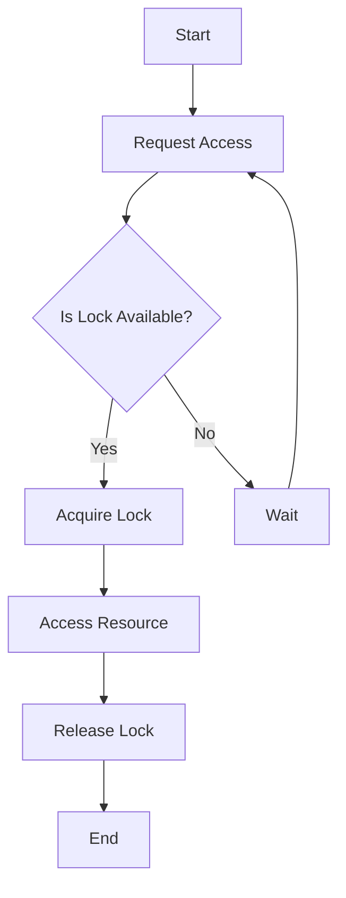

## 8.8 Synchronization and Mutex Patterns

In the realm of concurrent programming, managing access to shared resources is crucial to prevent data corruption and ensure the integrity of your applications. Dart, with its asynchronous nature and support for isolates, provides several mechanisms to handle synchronization effectively. In this section, we will delve into synchronization and mutex patterns, exploring how they can be implemented in Dart to control access to shared resources.

### Controlling Access to Shared Resources

Concurrency introduces the challenge of managing access to shared resources. When multiple threads or isolates attempt to read or modify the same data simultaneously, it can lead to race conditions, data corruption, and unpredictable behavior. Synchronization is the process of coordinating access to these resources to ensure that only one thread or isolate can access the resource at a time.

#### Implementing Synchronization in Dart

Dart provides several tools and patterns to implement synchronization, including locks and synchronized blocks. These mechanisms help ensure that critical sections of code are executed by only one thread or isolate at a time, preventing race conditions and ensuring data consistency.

##### Using Locks: Implementing Mutexes with Packages

A mutex (short for mutual exclusion) is a synchronization primitive that allows only one thread or isolate to access a resource at a time. In Dart, mutexes can be implemented using packages such as `synchronized`. This package provides a simple and effective way to create locks and ensure that only one piece of code can access a resource at a time.

```dart
import 'package:synchronized/synchronized.dart';

void main() {
  final lock = Lock();
  int sharedCounter = 0;

  Future<void> incrementCounter() async {
    await lock.synchronized(() async {
      // Critical section
      sharedCounter++;
      print('Counter: $sharedCounter');
    });
  }

  // Simulate concurrent access
  Future.wait([
    incrementCounter(),
    incrementCounter(),
    incrementCounter(),
  ]);
}
```

In this example, we use the `synchronized` package to create a lock. The `synchronized` method ensures that the critical section, where the shared counter is incremented, is accessed by only one isolate at a time.

##### Synchronized Blocks: Ensuring Exclusive Access

Synchronized blocks are another way to ensure exclusive access to shared resources. By wrapping critical sections of code within synchronized blocks, you can prevent multiple threads or isolates from executing the code simultaneously.

```dart
import 'package:synchronized/synchronized.dart';

void main() {
  final lock = Lock();
  String sharedResource = 'Initial Value';

  Future<void> updateResource(String newValue) async {
    await lock.synchronized(() async {
      // Critical section
      sharedResource = newValue;
      print('Resource updated to: $sharedResource');
    });
  }

  // Simulate concurrent updates
  Future.wait([
    updateResource('Value 1'),
    updateResource('Value 2'),
    updateResource('Value 3'),
  ]);
}
```

In this example, the `updateResource` function updates a shared resource. The `synchronized` block ensures that only one update occurs at a time, preventing data corruption.

### Use Cases and Examples

Synchronization and mutex patterns are essential in various scenarios where shared resources are accessed concurrently. Let's explore some common use cases and examples.

#### Shared Counters: Incrementing Counters Safely

Shared counters are a classic example of a resource that requires synchronization. When multiple threads or isolates attempt to increment a counter simultaneously, it can lead to incorrect values due to race conditions. By using locks or synchronized blocks, you can ensure that the counter is incremented safely.

```dart
import 'package:synchronized/synchronized.dart';

void main() {
  final lock = Lock();
  int counter = 0;

  Future<void> incrementCounter() async {
    await lock.synchronized(() async {
      // Critical section
      counter++;
      print('Counter: $counter');
    });
  }

  // Simulate concurrent increments
  Future.wait([
    incrementCounter(),
    incrementCounter(),
    incrementCounter(),
  ]);
}
```

In this example, the `incrementCounter` function safely increments the counter using a lock to prevent concurrent access.

#### File Access: Preventing Simultaneous Writes

File access is another scenario where synchronization is crucial. When multiple threads or isolates attempt to write to the same file simultaneously, it can lead to data corruption. By using locks, you can ensure that only one write operation occurs at a time.

```dart
import 'dart:io';
import 'package:synchronized/synchronized.dart';

void main() {
  final lock = Lock();
  final file = File('example.txt');

  Future<void> writeToFile(String content) async {
    await lock.synchronized(() async {
      // Critical section
      await file.writeAsString(content, mode: FileMode.append);
      print('Content written: $content');
    });
  }

  // Simulate concurrent writes
  Future.wait([
    writeToFile('Hello, Dart!\n'),
    writeToFile('Synchronization is key.\n'),
    writeToFile('Mutex patterns in action.\n'),
  ]);
}
```

In this example, the `writeToFile` function writes content to a file. The lock ensures that only one write operation occurs at a time, preventing data corruption.

### Visualizing Synchronization and Mutex Patterns

To better understand synchronization and mutex patterns, let's visualize the process using a flowchart. This diagram illustrates how a lock is used to control access to a shared resource.



**Figure 1: Flowchart of Synchronization Using a Lock**

This flowchart demonstrates the process of requesting access to a shared resource. If the lock is available, it is acquired, and the resource is accessed. Once the operation is complete, the lock is released. If the lock is not available, the process waits until it becomes available.

### Design Considerations

When implementing synchronization and mutex patterns, consider the following design considerations:

- **Deadlocks**: Ensure that your synchronization strategy does not lead to deadlocks, where two or more threads or isolates are waiting indefinitely for each other to release locks.
- **Performance**: While locks provide safety, they can also introduce performance bottlenecks. Use them judiciously to balance safety and performance.
- **Granularity**: Choose the appropriate level of granularity for your locks. Fine-grained locks can improve performance but increase complexity, while coarse-grained locks are simpler but may reduce concurrency.

### Differences and Similarities

Synchronization and mutex patterns are often compared to other concurrency patterns, such as semaphores and monitors. While they share similarities in controlling access to resources, they differ in their implementation and use cases. Mutexes are typically used for mutual exclusion, while semaphores can allow multiple threads to access a resource simultaneously.

### Try It Yourself

To deepen your understanding of synchronization and mutex patterns, try modifying the code examples provided. Experiment with different scenarios, such as increasing the number of concurrent operations or introducing delays to simulate real-world conditions. Observe how the synchronization mechanisms ensure data consistency and prevent race conditions.

### References and Links

For further reading on synchronization and mutex patterns, consider exploring the following resources:

- [Dart Language Tour](https://dart.dev/guides/language/language-tour)
- [Dart Asynchronous Programming](https://dart.dev/codelabs/async-await)
- [Synchronized Package Documentation](https://pub.dev/packages/synchronized)

### Knowledge Check

Before moving on, take a moment to reflect on the key concepts covered in this section. Consider the following questions:

- What is the purpose of synchronization in concurrent programming?
- How do locks and synchronized blocks prevent race conditions?
- What are some common use cases for synchronization and mutex patterns?

### Embrace the Journey

Remember, mastering synchronization and mutex patterns is a journey. As you continue to explore Dart and Flutter, you'll encounter more complex scenarios that require careful synchronization. Keep experimenting, stay curious, and enjoy the process of building robust and reliable applications.

## Quiz Time!



### What is the primary purpose of synchronization in concurrent programming?

- [x] To prevent data corruption and ensure data consistency
- [ ] To increase the speed of execution
- [ ] To allow multiple threads to access resources simultaneously
- [ ] To reduce memory usage

> **Explanation:** Synchronization is used to prevent data corruption and ensure data consistency by controlling access to shared resources.

### Which Dart package is commonly used to implement mutexes?

- [x] synchronized
- [ ] async
- [ ] isolate
- [ ] concurrency

> **Explanation:** The `synchronized` package is commonly used in Dart to implement mutexes and ensure exclusive access to resources.

### What is a mutex?

- [x] A synchronization primitive that allows only one thread to access a resource at a time
- [ ] A data structure for storing multiple values
- [ ] A function for executing code asynchronously
- [ ] A tool for debugging concurrent programs

> **Explanation:** A mutex is a synchronization primitive that ensures only one thread or isolate can access a resource at a time.

### How do synchronized blocks help in concurrent programming?

- [x] By ensuring that only one piece of code accesses a resource at a time
- [ ] By allowing multiple threads to execute code simultaneously
- [ ] By reducing the need for locks
- [ ] By increasing the complexity of code

> **Explanation:** Synchronized blocks ensure that only one piece of code accesses a resource at a time, preventing race conditions.

### What is a common use case for synchronization and mutex patterns?

- [x] Incrementing shared counters safely
- [ ] Executing code faster
- [ ] Reducing memory usage
- [ ] Simplifying code structure

> **Explanation:** Synchronization and mutex patterns are commonly used to increment shared counters safely, preventing race conditions.

### What is a potential drawback of using locks in concurrent programming?

- [x] They can introduce performance bottlenecks
- [ ] They simplify code structure
- [ ] They increase memory usage
- [ ] They allow multiple threads to access resources simultaneously

> **Explanation:** While locks provide safety, they can introduce performance bottlenecks if not used judiciously.

### What is a deadlock?

- [x] A situation where two or more threads are waiting indefinitely for each other to release locks
- [ ] A tool for debugging concurrent programs
- [ ] A method for executing code asynchronously
- [ ] A data structure for storing multiple values

> **Explanation:** A deadlock occurs when two or more threads are waiting indefinitely for each other to release locks, preventing progress.

### How can you prevent simultaneous writes to a file in Dart?

- [x] By using locks to ensure only one write operation occurs at a time
- [ ] By using async/await
- [ ] By using multiple threads
- [ ] By increasing the number of file handles

> **Explanation:** Using locks ensures that only one write operation occurs at a time, preventing simultaneous writes and data corruption.

### What is the difference between mutexes and semaphores?

- [x] Mutexes allow only one thread to access a resource, while semaphores can allow multiple threads
- [ ] Mutexes are faster than semaphores
- [ ] Mutexes are used for debugging, while semaphores are used for execution
- [ ] Mutexes are data structures, while semaphores are functions

> **Explanation:** Mutexes allow only one thread to access a resource at a time, while semaphores can allow multiple threads to access a resource simultaneously.

### True or False: Synchronization is only necessary in multi-threaded applications.

- [ ] True
- [x] False

> **Explanation:** Synchronization is necessary in any concurrent programming scenario, including multi-threaded and multi-isolate applications, to prevent data corruption and ensure data consistency.


