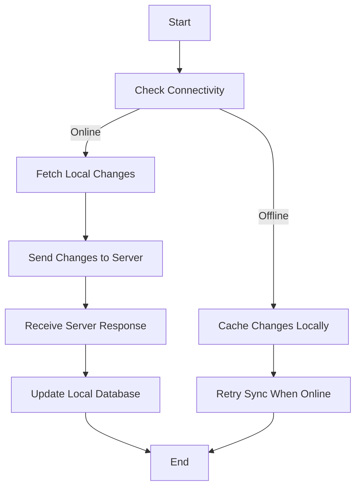

## 8.9 Data Synchronization in Flutter Apps

In today's interconnected world, ensuring data consistency across multiple devices and platforms is crucial for delivering a seamless user experience. This section delves into the intricacies of data synchronization in Flutter apps, focusing on strategies for handling updates and conflicts, implementing synchronization services, and providing offline support. By mastering these concepts, you'll be equipped to build robust, real-time applications that maintain data integrity across various environments.

### Keeping Data Consistent Across Devices

Data consistency is the backbone of any application that operates across multiple devices or platforms. It ensures that users have access to the same data, regardless of the device they are using. This is particularly important in collaborative applications, where multiple users may be interacting with the same data simultaneously.

#### Handling Updates and Conflicts

When multiple devices or users are involved, conflicts can arise. These conflicts occur when two or more changes are made to the same piece of data simultaneously. Handling such conflicts intelligently is vital to maintaining data integrity.

**Conflict Resolution Strategies:**

1. **Last Write Wins (LWW):** This simple strategy resolves conflicts by accepting the most recent change. While easy to implement, it may lead to data loss if not used carefully.

2. **Merge Changes:** This involves intelligently merging changes from different sources. For example, in a collaborative text editor, changes from different users can be merged line by line or word by word.

3. **Operational Transformation (OT):** Commonly used in collaborative applications like Google Docs, OT allows multiple users to edit a document simultaneously by transforming operations to maintain consistency.

4. **Custom Conflict Resolution:** Implement custom logic to resolve conflicts based on the application's specific needs. For instance, in a financial application, you might prioritize transactions based on timestamps or user roles.

### Implementing Synchronization Strategies

Implementing effective synchronization strategies involves choosing the right tools and platforms. Let's explore some popular options and how they can be integrated into Flutter apps.

#### Data Synchronization Services

**Firebase Realtime Database:**

Firebase offers a powerful real-time database that automatically synchronizes data across all connected clients. It provides built-in conflict resolution and offline support, making it an excellent choice for many applications.

- **Real-time Updates:** Firebase ensures that all connected clients receive updates in real-time, providing a seamless user experience.

- **Offline Support:** Firebase caches data locally, allowing apps to function offline and synchronize changes once connectivity is restored.

**Example:**

```dart
import 'package:firebase_database/firebase_database.dart';

final databaseReference = FirebaseDatabase.instance.reference();

void addData() {
  databaseReference.child("users").push().set({
    'name': 'John Doe',
    'age': 30,
  });
}

void updateData() {
  databaseReference.child('users').child('user_id').update({
    'age': 31,
  });
}

void deleteData() {
  databaseReference.child('users').child('user_id').remove();
}
```

**Firestore:**

Firestore, another Firebase service, offers more advanced querying capabilities and better scalability than the Realtime Database. It also supports offline data persistence and real-time updates.

- **Advanced Queries:** Firestore allows complex queries, making it suitable for applications with intricate data structures.

- **Scalability:** Designed to handle large datasets and high traffic, Firestore is ideal for growing applications.

**Example:**

```dart
import 'package:cloud_firestore/cloud_firestore.dart';

final firestoreInstance = FirebaseFirestore.instance;

void addUser() {
  firestoreInstance.collection("users").add({
    "name": "Jane Doe",
    "age": 25,
  }).then((value) {
    print("User Added");
  });
}

void updateUser() {
  firestoreInstance.collection("users").doc("user_id").update({
    "age": 26,
  }).then((value) {
    print("User Updated");
  });
}

void deleteUser() {
  firestoreInstance.collection("users").doc("user_id").delete().then((value) {
    print("User Deleted");
  });
}
```

**AWS AppSync:**

AWS AppSync is a managed GraphQL service that simplifies data synchronization and offline support. It integrates seamlessly with AWS services, providing robust security and scalability.

- **GraphQL API:** AppSync uses GraphQL, allowing clients to request only the data they need, reducing bandwidth usage.

- **Offline Support:** AppSync provides offline capabilities, enabling apps to function without connectivity and sync changes later.

**Example:**

```graphql
mutation CreateUser {
  createUser(input: {name: "Alice", age: 28}) {
    id
    name
    age
  }
}

mutation UpdateUser {
  updateUser(input: {id: "user_id", age: 29}) {
    id
    name
    age
  }
}

mutation DeleteUser {
  deleteUser(input: {id: "user_id"}) {
    id
  }
}
```

### Use Cases and Examples

Data synchronization is essential in various applications, from collaborative tools to offline-first apps. Let's explore some common use cases and how to implement them in Flutter.

#### Collaborative Apps

Collaborative applications, such as real-time editors or messaging platforms, require efficient data synchronization to ensure all users see the same data.

**Real-time Editing:**

In a collaborative text editor, multiple users can edit the same document simultaneously. Implementing operational transformation or conflict-free replicated data types (CRDTs) can help maintain consistency.

**Example:**

```dart
// Pseudo-code for a collaborative text editor
class CollaborativeEditor {
  List<String> document = [];

  void applyEdit(String userId, String change) {
    // Apply operational transformation to merge changes
    document = transform(document, change);
    notifyUsers();
  }

  void notifyUsers() {
    // Notify all connected users of the change
  }
}
```

**Real-time Messaging:**

Messaging apps require real-time updates to deliver messages instantly. Using Firebase or WebSockets can provide the necessary infrastructure for real-time communication.

**Example:**

```dart
import 'package:web_socket_channel/web_socket_channel.dart';

final channel = WebSocketChannel.connect(
  Uri.parse('wss://example.com/socket'),
);

void sendMessage(String message) {
  channel.sink.add(message);
}

void receiveMessages() {
  channel.stream.listen((message) {
    print('Received: $message');
  });
}
```

#### Offline Support

Offline support is crucial for applications that need to function without an internet connection. Implementing local caching and synchronization strategies ensures data consistency once connectivity is restored.

**Local Caching:**

Use local databases like SQLite or Hive to store data offline. Synchronize changes with the server when the device reconnects.

**Example:**

```dart
import 'package:hive/hive.dart';

void saveDataLocally(String key, dynamic value) {
  var box = Hive.box('myBox');
  box.put(key, value);
}

dynamic getDataLocally(String key) {
  var box = Hive.box('myBox');
  return box.get(key);
}

void syncDataWithServer() {
  // Fetch local changes and send them to the server
}
```

**Syncing Data:**

Implement a synchronization mechanism to detect changes and update the server and local database accordingly.

**Example:**

```dart
void syncData() {
  // Fetch changes from the server
  fetchServerChanges().then((serverData) {
    // Merge server data with local data
    mergeData(serverData);
    // Update local database
    updateLocalDatabase(serverData);
  });
}

Future<List<dynamic>> fetchServerChanges() async {
  // Fetch changes from the server
  return [];
}

void mergeData(List<dynamic> serverData) {
  // Merge server data with local data
}

void updateLocalDatabase(List<dynamic> serverData) {
  // Update local database with merged data
}
```

### Visualizing Data Synchronization

To better understand data synchronization, let's visualize the process using a flowchart. This diagram illustrates the steps involved in synchronizing data between a client and a server.



**Diagram Description:** This flowchart represents the data synchronization process. It starts by checking connectivity. If online, local changes are fetched and sent to the server. The server response is then used to update the local database. If offline, changes are cached locally and retried when connectivity is restored.

### Knowledge Check

Before we conclude, let's reinforce our understanding with a few questions:

1. What is the primary purpose of data synchronization in Flutter apps?
2. How does Firebase Realtime Database handle offline support?
3. What is the difference between Firestore and Firebase Realtime Database?
4. How can operational transformation help in collaborative applications?
5. What are some common conflict resolution strategies?

### Embrace the Journey

Remember, mastering data synchronization is a journey. As you experiment with different strategies and tools, you'll gain a deeper understanding of how to build robust, real-time applications. Keep exploring, stay curious, and enjoy the process!

### References and Links

- [Firebase Realtime Database Documentation](https://firebase.google.com/docs/database)
- [Firestore Documentation](https://firebase.google.com/docs/firestore)
- [AWS AppSync Documentation](https://docs.aws.amazon.com/appsync/latest/devguide/what-is-appsync.html)
- [Operational Transformation](https://en.wikipedia.org/wiki/Operational_transformation)

## Quiz Time!



### What is the primary purpose of data synchronization in Flutter apps?

- [x] To ensure data consistency across multiple devices
- [ ] To improve app performance
- [ ] To reduce data storage requirements
- [ ] To enhance user interface design

> **Explanation:** Data synchronization ensures that users have access to the same data across different devices, maintaining consistency and integrity.

### How does Firebase Realtime Database handle offline support?

- [x] By caching data locally and synchronizing changes when online
- [ ] By storing data only on the server
- [ ] By using a separate offline database
- [ ] By disabling app functionality when offline

> **Explanation:** Firebase Realtime Database caches data locally, allowing apps to function offline and synchronize changes once connectivity is restored.

### What is the difference between Firestore and Firebase Realtime Database?

- [x] Firestore offers more advanced querying capabilities and better scalability
- [ ] Firebase Realtime Database supports offline data persistence
- [ ] Firestore is only for small datasets
- [ ] Firebase Realtime Database is more expensive

> **Explanation:** Firestore provides advanced querying and scalability, while Firebase Realtime Database is simpler and supports offline persistence.

### How can operational transformation help in collaborative applications?

- [x] By allowing multiple users to edit the same document simultaneously
- [ ] By storing data in a central server
- [ ] By reducing data storage requirements
- [ ] By improving app performance

> **Explanation:** Operational transformation allows multiple users to edit a document simultaneously by transforming operations to maintain consistency.

### What are some common conflict resolution strategies?

- [x] Last Write Wins, Merge Changes, Operational Transformation
- [ ] Data Compression, Data Encryption, Data Caching
- [ ] Load Balancing, Data Sharding, Data Replication
- [ ] User Authentication, Data Validation, Error Handling

> **Explanation:** Common conflict resolution strategies include Last Write Wins, Merge Changes, and Operational Transformation.

### Which service provides a managed GraphQL API for data synchronization?

- [x] AWS AppSync
- [ ] Firebase Realtime Database
- [ ] Firestore
- [ ] SQLite

> **Explanation:** AWS AppSync provides a managed GraphQL API, simplifying data synchronization and offline support.

### What is a key feature of Firestore?

- [x] Advanced querying capabilities
- [ ] Only supports small datasets
- [ ] Requires manual conflict resolution
- [ ] Does not support offline persistence

> **Explanation:** Firestore offers advanced querying capabilities, making it suitable for applications with complex data structures.

### What is the role of local caching in offline support?

- [x] To store data locally and sync with the server when online
- [ ] To improve app performance
- [ ] To reduce data storage requirements
- [ ] To enhance user interface design

> **Explanation:** Local caching stores data offline, allowing apps to function without connectivity and synchronize changes later.

### How does AWS AppSync handle offline support?

- [x] By providing offline capabilities and syncing changes later
- [ ] By storing data only on the server
- [ ] By using a separate offline database
- [ ] By disabling app functionality when offline

> **Explanation:** AWS AppSync provides offline capabilities, enabling apps to function without connectivity and sync changes later.

### True or False: Firebase Realtime Database automatically resolves conflicts using Last Write Wins.

- [x] True
- [ ] False

> **Explanation:** Firebase Realtime Database uses Last Write Wins as a simple conflict resolution strategy, accepting the most recent change.


