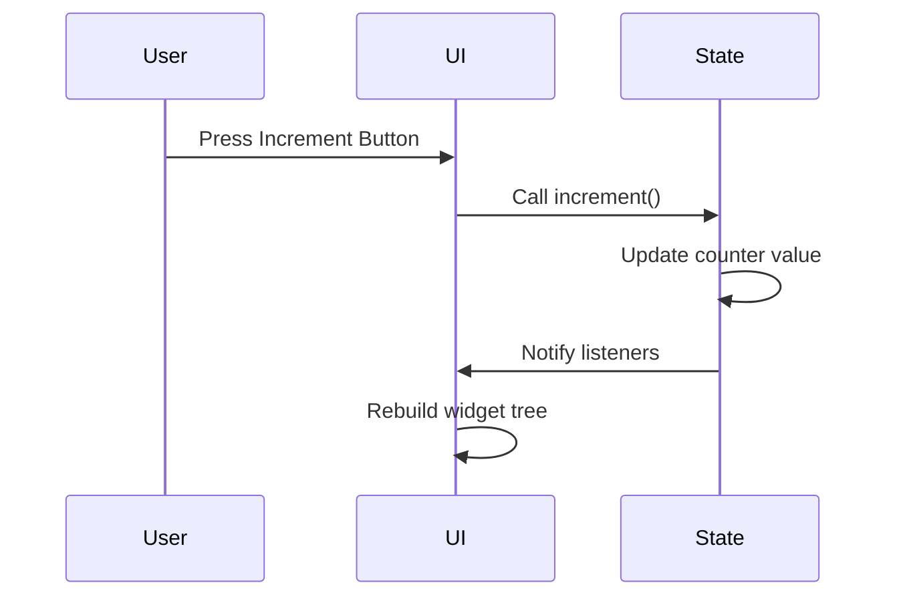

## 9.1 Introduction to State Management

State management is a cornerstone of Flutter development, enabling developers to build responsive and interactive applications. In this section, we will delve into the intricacies of state management, exploring the difference between ephemeral and app state, the importance of managing state effectively, and the common challenges developers face in this domain.

### Understanding State in Flutter

State in Flutter refers to any data that can change over time and affect the UI. Flutter applications are built using widgets, which are the building blocks of the UI. These widgets can be either stateless or stateful, depending on whether they need to maintain state.

#### Stateless vs. Stateful Widgets

- **Stateless Widgets**: These widgets do not store any state. They are immutable, meaning once they are built, they cannot change. Examples include `Text`, `Icon`, and `Container`.

- **Stateful Widgets**: These widgets can store state and are mutable. They can change over time in response to user interactions or other events. Examples include `Checkbox`, `Slider`, and `TextField`.

#### Ephemeral State vs. App State

In Flutter, state can be categorized into two types: ephemeral state and app state.

- **Ephemeral State**: This is the state that is local to a widget and does not need to be shared across the application. It is short-lived and can be managed using the `State` object of a `StatefulWidget`. Examples include the current page in a `PageView` or the selected tab in a `TabBar`.

- **App State**: This is the state that needs to be shared across multiple parts of the application. It is often long-lived and can include user preferences, authentication status, or data fetched from a server. Managing app state requires more sophisticated solutions, such as `Provider`, `BLoC`, or `Redux`.

### Importance of State Management

Effective state management is crucial for building responsive and interactive applications. It ensures that the UI is always in sync with the underlying data, providing a seamless user experience. Here are some reasons why state management is important:

- **Consistency**: State management ensures that the UI consistently reflects the current state of the application, preventing discrepancies and bugs.

- **Scalability**: As applications grow in complexity, managing state becomes more challenging. A robust state management solution can help scale the application without introducing technical debt.

- **Maintainability**: By separating state management from UI logic, developers can create more maintainable codebases. This separation of concerns makes it easier to test, debug, and extend the application.

### Common Challenges in State Management

Managing state in Flutter can be challenging, especially for complex applications. Some common challenges include:

- **Keeping UI in Sync with Data**: Ensuring that the UI updates correctly in response to state changes can be difficult, especially when dealing with asynchronous data sources.

- **Managing State Across Widgets**: Sharing state across different parts of the application can lead to tightly coupled code and make it difficult to manage dependencies.

- **Performance**: Inefficient state management can lead to performance issues, such as unnecessary widget rebuilds or slow UI updates.

- **Testing**: Testing stateful components can be more complex than testing stateless ones, requiring careful consideration of different state scenarios.

### Code Example: Managing Ephemeral State

Let's start with a simple example of managing ephemeral state using a `StatefulWidget`. Consider a counter app where the user can increment a counter by pressing a button.

```dart
import 'package:flutter/material.dart';

void main() => runApp(MyApp());

class MyApp extends StatelessWidget {
  @override
  Widget build(BuildContext context) {
    return MaterialApp(
      home: CounterScreen(),
    );
  }
}

class CounterScreen extends StatefulWidget {
  @override
  _CounterScreenState createState() => _CounterScreenState();
}

class _CounterScreenState extends State<CounterScreen> {
  int _counter = 0;

  void _incrementCounter() {
    setState(() {
      _counter++;
    });
  }

  @override
  Widget build(BuildContext context) {
    return Scaffold(
      appBar: AppBar(
        title: Text('Counter App'),
      ),
      body: Center(
        child: Column(
          mainAxisAlignment: MainAxisAlignment.center,
          children: <Widget>[
            Text(
              'You have pushed the button this many times:',
            ),
            Text(
              '$_counter',
              style: Theme.of(context).textTheme.headline4,
            ),
          ],
        ),
      ),
      floatingActionButton: FloatingActionButton(
        onPressed: _incrementCounter,
        tooltip: 'Increment',
        child: Icon(Icons.add),
      ),
    );
  }
}
```

In this example, the `_counter` variable is an ephemeral state managed by the `_CounterScreenState` class. The `setState` method is used to update the state and trigger a rebuild of the widget tree.

### Code Example: Managing App State with Provider

For managing app state, we can use the `Provider` package, which is a popular state management solution in Flutter. Here's an example of using `Provider` to manage a simple counter app.

```dart
import 'package:flutter/material.dart';
import 'package:provider/provider.dart';

void main() => runApp(
      ChangeNotifierProvider(
        create: (context) => Counter(),
        child: MyApp(),
      ),
    );

class MyApp extends StatelessWidget {
  @override
  Widget build(BuildContext context) {
    return MaterialApp(
      home: CounterScreen(),
    );
  }
}

class Counter with ChangeNotifier {
  int _value = 0;

  int get value => _value;

  void increment() {
    _value++;
    notifyListeners();
  }
}

class CounterScreen extends StatelessWidget {
  @override
  Widget build(BuildContext context) {
    final counter = Provider.of<Counter>(context);

    return Scaffold(
      appBar: AppBar(
        title: Text('Counter App with Provider'),
      ),
      body: Center(
        child: Column(
          mainAxisAlignment: MainAxisAlignment.center,
          children: <Widget>[
            Text(
              'You have pushed the button this many times:',
            ),
            Text(
              '${counter.value}',
              style: Theme.of(context).textTheme.headline4,
            ),
          ],
        ),
      ),
      floatingActionButton: FloatingActionButton(
        onPressed: counter.increment,
        tooltip: 'Increment',
        child: Icon(Icons.add),
      ),
    );
  }
}
```

In this example, the `Counter` class extends `ChangeNotifier`, which allows it to notify listeners when the state changes. The `ChangeNotifierProvider` widget is used to provide the `Counter` instance to the widget tree, and the `Provider.of<Counter>(context)` method is used to access the counter value and increment method.

### Visualizing State Management

To better understand state management in Flutter, let's visualize the flow of state changes using a sequence diagram.



This diagram illustrates the flow of state changes in a Flutter application. When the user presses the increment button, the UI calls the `increment` method on the state object, which updates the counter value and notifies listeners. The UI then rebuilds the widget tree to reflect the updated state.

### Try It Yourself

To deepen your understanding of state management in Flutter, try modifying the code examples above. Here are some suggestions:

- **Add a Decrement Button**: Modify the counter app to include a decrement button that decreases the counter value.

- **Display a Message**: Add a message that displays when the counter reaches a certain value, such as "You've reached 10 clicks!"

- **Persist State**: Implement a solution to persist the counter value across app restarts using a package like `shared_preferences`.

### Knowledge Check

Before moving on, let's review some key concepts:

- **What is the difference between ephemeral and app state?**
- **Why is state management important in Flutter development?**
- **What are some common challenges in managing state?**

### Embrace the Journey

Remember, mastering state management is a journey. As you continue to build more complex applications, you'll encounter new challenges and opportunities to refine your skills. Keep experimenting, stay curious, and enjoy the process of learning and growing as a Flutter developer.

### References and Links

For further reading on state management in Flutter, check out these resources:

- [Flutter Documentation on State Management](https://flutter.dev/docs/development/data-and-backend/state-mgmt/intro)
- [Provider Package on pub.dev](https://pub.dev/packages/provider)
- [Flutter Community Articles on State Management](https://medium.com/flutter-community)

## Quiz Time!



### What is the primary difference between ephemeral state and app state in Flutter?

- [x] Ephemeral state is local to a widget, while app state is shared across the application.
- [ ] Ephemeral state is shared across the application, while app state is local to a widget.
- [ ] Ephemeral state is long-lived, while app state is short-lived.
- [ ] Ephemeral state is managed using Provider, while app state is managed using setState.

> **Explanation:** Ephemeral state is local to a widget and does not need to be shared, whereas app state is shared across multiple parts of the application.

### Why is state management important in Flutter development?

- [x] It ensures the UI is in sync with the underlying data.
- [ ] It allows for the use of stateless widgets only.
- [ ] It eliminates the need for asynchronous programming.
- [ ] It simplifies the use of animations.

> **Explanation:** State management is crucial for keeping the UI consistent with the application's data, providing a seamless user experience.

### Which of the following is a common challenge in state management?

- [x] Keeping the UI in sync with data.
- [ ] Using only stateless widgets.
- [ ] Avoiding the use of asynchronous programming.
- [ ] Implementing animations.

> **Explanation:** One of the main challenges in state management is ensuring that the UI updates correctly in response to state changes.

### What is the role of the `setState` method in a `StatefulWidget`?

- [x] It updates the state and triggers a rebuild of the widget tree.
- [ ] It initializes the state of the widget.
- [ ] It disposes of the widget's resources.
- [ ] It manages asynchronous operations.

> **Explanation:** The `setState` method is used to update the state and trigger a rebuild of the widget tree in a `StatefulWidget`.

### How does the `Provider` package help in managing app state?

- [x] It allows state to be shared across the widget tree.
- [ ] It eliminates the need for `setState`.
- [ ] It provides built-in animations.
- [ ] It simplifies the use of stateless widgets.

> **Explanation:** The `Provider` package helps manage app state by allowing state to be shared across the widget tree.

### What is a `ChangeNotifier` in the context of the `Provider` package?

- [x] A class that notifies listeners when the state changes.
- [ ] A widget that manages ephemeral state.
- [ ] A method for handling asynchronous operations.
- [ ] A tool for debugging state changes.

> **Explanation:** `ChangeNotifier` is a class that notifies listeners when the state changes, allowing the UI to update accordingly.

### Which of the following is a benefit of separating state management from UI logic?

- [x] Improved maintainability of the codebase.
- [ ] Reduced need for asynchronous programming.
- [ ] Elimination of stateless widgets.
- [ ] Simplified use of animations.

> **Explanation:** Separating state management from UI logic improves the maintainability of the codebase by creating a clear separation of concerns.

### What is the purpose of the `notifyListeners` method in a `ChangeNotifier` class?

- [x] To notify all registered listeners of a state change.
- [ ] To initialize the state of the widget.
- [ ] To dispose of the widget's resources.
- [ ] To manage asynchronous operations.

> **Explanation:** The `notifyListeners` method is used to notify all registered listeners of a state change, prompting the UI to update.

### In the context of state management, what does "rebuilding the widget tree" mean?

- [x] Updating the UI to reflect the current state.
- [ ] Initializing the state of the widget.
- [ ] Disposing of the widget's resources.
- [ ] Managing asynchronous operations.

> **Explanation:** Rebuilding the widget tree means updating the UI to reflect the current state of the application.

### True or False: Stateless widgets can store state that changes over time.

- [ ] True
- [x] False

> **Explanation:** Stateless widgets are immutable and cannot store state that changes over time. They are used for static content that does not change.


