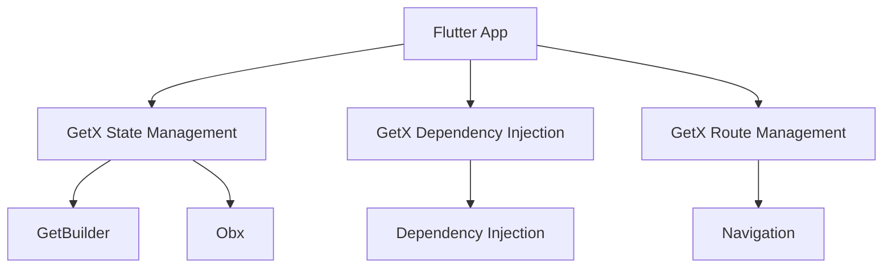

## 9.10 GetX Package for State Management

In the world of Flutter development, managing state efficiently is crucial for building high-performance applications. The GetX package emerges as a powerful solution, offering an all-in-one approach to state, dependency, and route management. This comprehensive guide will delve into the intricacies of GetX, providing you with the knowledge to harness its full potential in your Flutter projects.

### An All-in-One Solution

GetX is more than just a state management library; it is a complete ecosystem that simplifies various aspects of Flutter development. It provides:

- **State Management**: Efficiently manage the state of your application with minimal boilerplate code.
- **Dependency Injection**: Easily inject dependencies and manage them throughout your app's lifecycle.
- **Route Management**: Simplify navigation and routing without the need for a `BuildContext`.

Let's explore each of these components in detail.

### Implementing GetX

#### Reactive State Management

GetX offers two primary ways to manage state reactively: `GetBuilder` and `Obx`.

##### GetBuilder

`GetBuilder` is a simple and efficient way to manage state in GetX. It is ideal for scenarios where you need to update the UI in response to changes in the state.

```dart
import 'package:flutter/material.dart';
import 'package:get/get.dart';

class CounterController extends GetxController {
  var count = 0;

  void increment() {
    count++;
    update(); // Notify GetBuilder to rebuild the UI
  }
}

class CounterPage extends StatelessWidget {
  @override
  Widget build(BuildContext context) {
    return Scaffold(
      appBar: AppBar(title: Text('GetBuilder Example')),
      body: Center(
        child: GetBuilder<CounterController>(
          init: CounterController(),
          builder: (controller) => Text(
            'Count: ${controller.count}',
            style: TextStyle(fontSize: 24),
          ),
        ),
      ),
      floatingActionButton: FloatingActionButton(
        onPressed: () => Get.find<CounterController>().increment(),
        child: Icon(Icons.add),
      ),
    );
  }
}
```

In this example, `GetBuilder` listens to changes in the `CounterController` and rebuilds the UI when `update()` is called.

##### Obx

`Obx` is a more reactive approach, leveraging Dart's `Rx` types to automatically update the UI when the state changes.

```dart
import 'package:flutter/material.dart';
import 'package:get/get.dart';

class CounterController extends GetxController {
  var count = 0.obs; // Observable integer

  void increment() => count++;
}

class CounterPage extends StatelessWidget {
  final CounterController controller = Get.put(CounterController());

  @override
  Widget build(BuildContext context) {
    return Scaffold(
      appBar: AppBar(title: Text('Obx Example')),
      body: Center(
        child: Obx(() => Text(
          'Count: ${controller.count}',
          style: TextStyle(fontSize: 24),
        )),
      ),
      floatingActionButton: FloatingActionButton(
        onPressed: controller.increment,
        child: Icon(Icons.add),
      ),
    );
  }
}
```

Here, `Obx` automatically rebuilds the widget when `count` changes, thanks to the reactive nature of `Rx`.

#### Easy Navigation

GetX simplifies navigation by removing the need for a `BuildContext`. This is particularly useful for navigating between screens or showing dialogs.

```dart
import 'package:flutter/material.dart';
import 'package:get/get.dart';

class HomePage extends StatelessWidget {
  @override
  Widget build(BuildContext context) {
    return Scaffold(
      appBar: AppBar(title: Text('Home')),
      body: Center(
        child: ElevatedButton(
          onPressed: () => Get.to(SecondPage()),
          child: Text('Go to Second Page'),
        ),
      ),
    );
  }
}

class SecondPage extends StatelessWidget {
  @override
  Widget build(BuildContext context) {
    return Scaffold(
      appBar: AppBar(title: Text('Second Page')),
      body: Center(
        child: ElevatedButton(
          onPressed: () => Get.back(),
          child: Text('Back to Home'),
        ),
      ),
    );
  }
}
```

With GetX, you can navigate to a new page using `Get.to()` and return to the previous page with `Get.back()`.

### Use Cases and Examples

#### Rapid Development

GetX reduces boilerplate code, allowing for rapid development. Its concise syntax and powerful features enable developers to focus on building features rather than managing state.

#### High-Performance Apps

GetX is optimized for speed and efficiency. It minimizes rebuilds and ensures that only the necessary parts of the UI are updated, resulting in high-performance applications.

### Visualizing GetX Architecture

To better understand how GetX integrates into a Flutter application, let's visualize its architecture using a Mermaid.js diagram.



**Diagram Description**: This diagram illustrates the integration of GetX into a Flutter application, highlighting its three main components: state management, dependency injection, and route management.

### Design Considerations

When using GetX, consider the following:

- **State Management**: Choose between `GetBuilder` and `Obx` based on your needs. Use `GetBuilder` for simple state updates and `Obx` for more reactive scenarios.
- **Dependency Injection**: Leverage GetX's dependency injection to manage dependencies efficiently. Use `Get.put()` to instantiate controllers and `Get.find()` to retrieve them.
- **Route Management**: Simplify navigation with GetX's routing capabilities. Use `Get.to()` for navigation and `Get.back()` to return to the previous screen.

### Differences and Similarities

GetX is often compared to other state management solutions like Provider, BLoC, and Redux. Here are some key differences and similarities:

- **Provider**: Both GetX and Provider offer dependency injection and state management. However, GetX provides a more comprehensive solution with built-in routing.
- **BLoC**: BLoC focuses on separating business logic from UI, while GetX offers a more integrated approach with less boilerplate.
- **Redux**: Redux is a more complex state management solution, suitable for large applications. GetX is simpler and more lightweight, making it ideal for smaller projects.

### Try It Yourself

Experiment with the code examples provided in this guide. Try modifying the `CounterController` to include additional functionality, such as decrementing the count or resetting it to zero. Explore GetX's routing capabilities by adding more pages to the navigation example.

### References and Links

For further reading on GetX and Flutter state management, consider the following resources:

- [GetX Documentation](https://pub.dev/packages/get)
- [Flutter State Management](https://flutter.dev/docs/development/data-and-backend/state-mgmt)
- [Reactive Programming in Dart](https://dart.dev/tutorials/language/streams)

### Knowledge Check

- What are the two primary ways to manage state in GetX?
- How does GetX simplify navigation in Flutter applications?
- What are the benefits of using GetX for state management?

### Embrace the Journey

Remember, mastering GetX is just the beginning of your Flutter development journey. As you continue to explore and experiment with GetX, you'll discover new ways to optimize your applications and enhance user experiences. Stay curious, keep learning, and enjoy the process!

## Quiz Time!



### What are the two primary ways to manage state in GetX?

- [x] GetBuilder and Obx
- [ ] Provider and BLoC
- [ ] Redux and MobX
- [ ] ScopedModel and Riverpod

> **Explanation:** GetX provides GetBuilder and Obx for state management, each offering different levels of reactivity.

### How does GetX simplify navigation in Flutter applications?

- [x] By removing the need for a BuildContext
- [ ] By using complex routing logic
- [ ] By requiring additional libraries
- [ ] By using traditional Navigator methods

> **Explanation:** GetX simplifies navigation by allowing developers to navigate between screens without needing a BuildContext.

### What is the main advantage of using Obx in GetX?

- [x] Automatic UI updates when state changes
- [ ] Manual UI updates with update()
- [ ] Complex state management
- [ ] Requires more boilerplate code

> **Explanation:** Obx automatically rebuilds the UI when the observed state changes, providing a reactive approach to state management.

### Which method is used to navigate to a new page in GetX?

- [x] Get.to()
- [ ] Navigator.push()
- [ ] Get.navigate()
- [ ] Get.route()

> **Explanation:** Get.to() is used in GetX to navigate to a new page, simplifying the navigation process.

### What is the purpose of Get.put() in GetX?

- [x] To instantiate and store a controller
- [ ] To navigate to a new page
- [ ] To update the UI
- [ ] To remove a controller

> **Explanation:** Get.put() is used to instantiate and store a controller in GetX's dependency injection system.

### Which of the following is NOT a feature of GetX?

- [ ] State Management
- [ ] Dependency Injection
- [ ] Route Management
- [x] Database Management

> **Explanation:** GetX provides state management, dependency injection, and route management, but it does not handle database management.

### What is the benefit of using GetX's dependency injection?

- [x] Efficient management of dependencies
- [ ] Increased code complexity
- [ ] Requires more boilerplate
- [ ] Limited to small projects

> **Explanation:** GetX's dependency injection allows for efficient management of dependencies, reducing boilerplate and simplifying code.

### How does GetX optimize performance in Flutter apps?

- [x] By minimizing rebuilds and updating only necessary parts of the UI
- [ ] By increasing the number of rebuilds
- [ ] By using complex algorithms
- [ ] By requiring more resources

> **Explanation:** GetX optimizes performance by minimizing rebuilds and ensuring that only the necessary parts of the UI are updated.

### Which of the following is a key difference between GetX and Redux?

- [x] GetX is simpler and more lightweight
- [ ] Redux is simpler and more lightweight
- [ ] GetX requires more boilerplate
- [ ] Redux provides built-in routing

> **Explanation:** GetX is simpler and more lightweight compared to Redux, which is more complex and suitable for larger applications.

### True or False: GetX requires a BuildContext for navigation.

- [ ] True
- [x] False

> **Explanation:** GetX does not require a BuildContext for navigation, simplifying the process of moving between screens.


