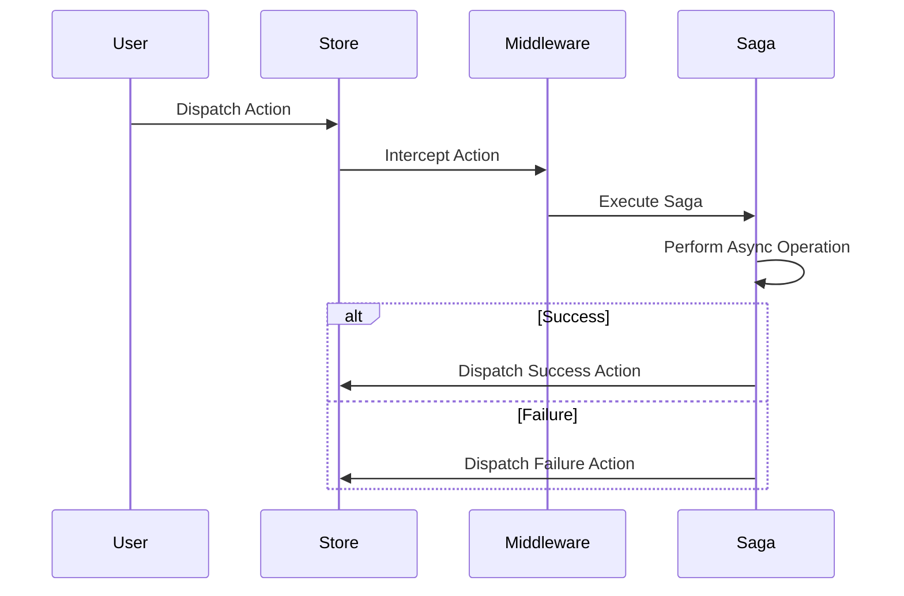

## 9.11 Managing Side Effects with Sagas

In the world of Flutter development, managing side effects and asynchronous operations is crucial for building responsive and reliable applications. Sagas provide a robust pattern for handling complex asynchronous logic, ensuring that side effects are managed in a predictable and maintainable manner. In this section, we will delve into the concept of Sagas, explore their implementation in Flutter, and examine practical use cases.

### Understanding Sagas

**Sagas** are a design pattern used to manage side effects in an application, particularly in the context of asynchronous operations. They are commonly used in state management libraries to handle complex workflows that involve multiple steps, such as API calls, data processing, and state updates. Sagas allow developers to define a sequence of operations that can be paused, resumed, or canceled, providing a high level of control over asynchronous logic.

#### Key Concepts of Sagas

- **Side Effects**: Operations that affect the outside world, such as network requests, file I/O, or state changes.
- **Asynchronous Logic**: Code that executes independently of the main program flow, often involving callbacks, promises, or async/await.
- **Middleware**: Software that intercepts and processes actions before they reach the reducer, allowing for side effects to be handled separately from state updates.

### Implementing Sagas in Flutter

To implement Sagas in Flutter, we typically use a middleware approach. Middleware acts as an intermediary layer that intercepts actions dispatched to the store, allowing us to handle side effects before they reach the reducer. This separation of concerns makes the codebase more maintainable and testable.

#### Using Middleware to Intercept and Handle Actions

Middleware in Flutter can be implemented using various state management libraries, such as Redux or BLoC. The middleware intercepts actions and determines whether they require side effects to be executed. If so, it delegates the task to a Saga, which orchestrates the asynchronous operations.

```dart
import 'package:flutter/material.dart';
import 'package:flutter_redux/flutter_redux.dart';
import 'package:redux/redux.dart';

// Define the action
class FetchDataAction {}

// Define the middleware
void sagaMiddleware(Store store, action, NextDispatcher next) {
  if (action is FetchDataAction) {
    // Handle the side effect
    fetchDataSaga(store);
  }
  next(action);
}

// Define the saga
void fetchDataSaga(Store store) async {
  try {
    // Simulate an API call
    final data = await fetchDataFromApi();
    // Dispatch a success action with the data
    store.dispatch(FetchDataSuccessAction(data));
  } catch (error) {
    // Dispatch a failure action with the error
    store.dispatch(FetchDataFailureAction(error));
  }
}

// Simulate an API call
Future<String> fetchDataFromApi() async {
  await Future.delayed(Duration(seconds: 2));
  return 'Fetched Data';
}

// Define the success and failure actions
class FetchDataSuccessAction {
  final String data;
  FetchDataSuccessAction(this.data);
}

class FetchDataFailureAction {
  final String error;
  FetchDataFailureAction(this.error);
}

void main() {
  final store = Store<String>(
    (state, action) {
      if (action is FetchDataSuccessAction) {
        return action.data;
      } else if (action is FetchDataFailureAction) {
        return 'Error: ${action.error}';
      }
      return state;
    },
    initialState: '',
    middleware: [sagaMiddleware],
  );

  runApp(MyApp(store: store));
}

class MyApp extends StatelessWidget {
  final Store<String> store;

  MyApp({required this.store});

  @override
  Widget build(BuildContext context) {
    return StoreProvider<String>(
      store: store,
      child: MaterialApp(
        home: Scaffold(
          appBar: AppBar(title: Text('Saga Example')),
          body: Center(
            child: StoreConnector<String, String>(
              converter: (store) => store.state,
              builder: (context, state) {
                return Text(state);
              },
            ),
          ),
          floatingActionButton: FloatingActionButton(
            onPressed: () {
              store.dispatch(FetchDataAction());
            },
            child: Icon(Icons.refresh),
          ),
        ),
      ),
    );
  }
}
```

In this example, we define a simple Redux store with a middleware that intercepts the `FetchDataAction`. The middleware invokes the `fetchDataSaga`, which simulates an API call and dispatches either a success or failure action based on the result.

#### Coordinating Async Operations

Sagas excel at coordinating complex asynchronous operations, such as sequencing API calls and managing business logic. They allow us to define workflows that can be paused, resumed, or canceled, providing a high level of control over the execution flow.

```dart
import 'package:flutter/material.dart';
import 'package:flutter_redux/flutter_redux.dart';
import 'package:redux/redux.dart';

// Define the actions
class StartTransactionAction {}
class TransactionSuccessAction {}
class TransactionFailureAction {}

// Define the middleware
void transactionSagaMiddleware(Store store, action, NextDispatcher next) {
  if (action is StartTransactionAction) {
    // Handle the transaction saga
    transactionSaga(store);
  }
  next(action);
}

// Define the transaction saga
void transactionSaga(Store store) async {
  try {
    // Step 1: Validate input
    await validateInput();
    // Step 2: Process payment
    await processPayment();
    // Step 3: Update database
    await updateDatabase();
    // Dispatch a success action
    store.dispatch(TransactionSuccessAction());
  } catch (error) {
    // Dispatch a failure action
    store.dispatch(TransactionFailureAction());
  }
}

// Simulate validation
Future<void> validateInput() async {
  await Future.delayed(Duration(seconds: 1));
}

// Simulate payment processing
Future<void> processPayment() async {
  await Future.delayed(Duration(seconds: 2));
}

// Simulate database update
Future<void> updateDatabase() async {
  await Future.delayed(Duration(seconds: 1));
}

void main() {
  final store = Store<String>(
    (state, action) {
      if (action is TransactionSuccessAction) {
        return 'Transaction Successful';
      } else if (action is TransactionFailureAction) {
        return 'Transaction Failed';
      }
      return state;
    },
    initialState: '',
    middleware: [transactionSagaMiddleware],
  );

  runApp(MyApp(store: store));
}

class MyApp extends StatelessWidget {
  final Store<String> store;

  MyApp({required this.store});

  @override
  Widget build(BuildContext context) {
    return StoreProvider<String>(
      store: store,
      child: MaterialApp(
        home: Scaffold(
          appBar: AppBar(title: Text('Transaction Saga Example')),
          body: Center(
            child: StoreConnector<String, String>(
              converter: (store) => store.state,
              builder: (context, state) {
                return Text(state);
              },
            ),
          ),
          floatingActionButton: FloatingActionButton(
            onPressed: () {
              store.dispatch(StartTransactionAction());
            },
            child: Icon(Icons.payment),
          ),
        ),
      ),
    );
  }
}
```

In this example, we define a transaction saga that coordinates multiple asynchronous operations: validating input, processing payment, and updating the database. The saga ensures that each step is completed before proceeding to the next, and it handles errors gracefully by dispatching a failure action if any step fails.

### Use Cases and Examples

Sagas are particularly useful in scenarios where complex asynchronous logic needs to be managed in a predictable and maintainable way. Let's explore some common use cases and examples.

#### Transaction Management

In applications that involve transactions, such as e-commerce or banking apps, ensuring consistency across operations is crucial. Sagas can be used to manage the entire transaction process, coordinating multiple steps and handling errors gracefully.

```dart
import 'package:flutter/material.dart';
import 'package:flutter_redux/flutter_redux.dart';
import 'package:redux/redux.dart';

// Define the actions
class StartPurchaseAction {}
class PurchaseSuccessAction {}
class PurchaseFailureAction {}

// Define the middleware
void purchaseSagaMiddleware(Store store, action, NextDispatcher next) {
  if (action is StartPurchaseAction) {
    // Handle the purchase saga
    purchaseSaga(store);
  }
  next(action);
}

// Define the purchase saga
void purchaseSaga(Store store) async {
  try {
    // Step 1: Validate cart
    await validateCart();
    // Step 2: Process payment
    await processPayment();
    // Step 3: Update inventory
    await updateInventory();
    // Dispatch a success action
    store.dispatch(PurchaseSuccessAction());
  } catch (error) {
    // Dispatch a failure action
    store.dispatch(PurchaseFailureAction());
  }
}

// Simulate cart validation
Future<void> validateCart() async {
  await Future.delayed(Duration(seconds: 1));
}

// Simulate payment processing
Future<void> processPayment() async {
  await Future.delayed(Duration(seconds: 2));
}

// Simulate inventory update
Future<void> updateInventory() async {
  await Future.delayed(Duration(seconds: 1));
}

void main() {
  final store = Store<String>(
    (state, action) {
      if (action is PurchaseSuccessAction) {
        return 'Purchase Successful';
      } else if (action is PurchaseFailureAction) {
        return 'Purchase Failed';
      }
      return state;
    },
    initialState: '',
    middleware: [purchaseSagaMiddleware],
  );

  runApp(MyApp(store: store));
}

class MyApp extends StatelessWidget {
  final Store<String> store;

  MyApp({required this.store});

  @override
  Widget build(BuildContext context) {
    return StoreProvider<String>(
      store: store,
      child: MaterialApp(
        home: Scaffold(
          appBar: AppBar(title: Text('Purchase Saga Example')),
          body: Center(
            child: StoreConnector<String, String>(
              converter: (store) => store.state,
              builder: (context, state) {
                return Text(state);
              },
            ),
          ),
          floatingActionButton: FloatingActionButton(
            onPressed: () {
              store.dispatch(StartPurchaseAction());
            },
            child: Icon(Icons.shopping_cart),
          ),
        ),
      ),
    );
  }
}
```

In this example, we define a purchase saga that manages the entire purchase process, including cart validation, payment processing, and inventory update. The saga ensures that each step is completed successfully before proceeding to the next, and it handles errors gracefully by dispatching a failure action if any step fails.

#### Retry Mechanisms

In scenarios where network requests or other operations may fail, implementing retry mechanisms is essential for ensuring reliability. Sagas can be used to implement retry logic, allowing operations to be retried a specified number of times before failing.

```dart
import 'package:flutter/material.dart';
import 'package:flutter_redux/flutter_redux.dart';
import 'package:redux/redux.dart';

// Define the actions
class StartRetryAction {}
class RetrySuccessAction {}
class RetryFailureAction {}

// Define the middleware
void retrySagaMiddleware(Store store, action, NextDispatcher next) {
  if (action is StartRetryAction) {
    // Handle the retry saga
    retrySaga(store);
  }
  next(action);
}

// Define the retry saga
void retrySaga(Store store) async {
  int retryCount = 0;
  const maxRetries = 3;

  while (retryCount < maxRetries) {
    try {
      // Simulate an API call
      await fetchDataFromApi();
      // Dispatch a success action
      store.dispatch(RetrySuccessAction());
      return;
    } catch (error) {
      retryCount++;
      if (retryCount >= maxRetries) {
        // Dispatch a failure action
        store.dispatch(RetryFailureAction());
        return;
      }
    }
  }
}

// Simulate an API call
Future<void> fetchDataFromApi() async {
  await Future.delayed(Duration(seconds: 1));
  throw Exception('Network Error');
}

void main() {
  final store = Store<String>(
    (state, action) {
      if (action is RetrySuccessAction) {
        return 'Retry Successful';
      } else if (action is RetryFailureAction) {
        return 'Retry Failed';
      }
      return state;
    },
    initialState: '',
    middleware: [retrySagaMiddleware],
  );

  runApp(MyApp(store: store));
}

class MyApp extends StatelessWidget {
  final Store<String> store;

  MyApp({required this.store});

  @override
  Widget build(BuildContext context) {
    return StoreProvider<String>(
      store: store,
      child: MaterialApp(
        home: Scaffold(
          appBar: AppBar(title: Text('Retry Saga Example')),
          body: Center(
            child: StoreConnector<String, String>(
              converter: (store) => store.state,
              builder: (context, state) {
                return Text(state);
              },
            ),
          ),
          floatingActionButton: FloatingActionButton(
            onPressed: () {
              store.dispatch(StartRetryAction());
            },
            child: Icon(Icons.refresh),
          ),
        ),
      ),
    );
  }
}
```

In this example, we define a retry saga that attempts to fetch data from an API up to three times before failing. The saga uses a loop to retry the operation, and it dispatches a success or failure action based on the result.

### Visualizing Sagas

To better understand the flow of Sagas, let's visualize the process using a sequence diagram. This diagram illustrates the interaction between the middleware, saga, and store during the execution of a Saga.



In this sequence diagram, we see the user dispatching an action to the store, which is intercepted by the middleware. The middleware then executes the Saga, which performs the asynchronous operation. Depending on the outcome, the Saga dispatches either a success or failure action back to the store.

### Design Considerations

When implementing Sagas in Flutter, there are several design considerations to keep in mind:

- **Separation of Concerns**: Sagas should focus on managing side effects and asynchronous logic, while reducers should handle state updates.
- **Error Handling**: Sagas should include robust error handling to ensure that failures are managed gracefully.
- **Testing**: Sagas should be tested independently of the UI to ensure that they function correctly in isolation.
- **Performance**: Sagas should be optimized to minimize the impact on application performance, particularly in scenarios involving large numbers of concurrent operations.

### Differences and Similarities

Sagas are often compared to other patterns for managing side effects, such as **Thunks** and **Epics**. While all three patterns serve similar purposes, there are key differences:

- **Thunks**: Simpler to implement, but less powerful than Sagas. They are suitable for handling basic asynchronous logic but may become unwieldy for complex workflows.
- **Epics**: Similar to Sagas, but based on reactive programming principles. They are well-suited for applications that require real-time data processing and event-driven architectures.

### Try It Yourself

To gain a deeper understanding of Sagas, try modifying the code examples provided in this section. Experiment with different scenarios, such as adding additional steps to the transaction saga or implementing custom retry logic. By experimenting with the code, you'll gain valuable insights into how Sagas work and how they can be applied to your own projects.

### Knowledge Check

Before moving on, take a moment to reflect on what you've learned about managing side effects with Sagas. Consider the following questions:

- How do Sagas differ from other patterns for managing side effects?
- What are some common use cases for Sagas in Flutter applications?
- How can Sagas be used to implement retry mechanisms?

### Embrace the Journey

Remember, mastering Sagas is just one step on your journey to becoming a proficient Flutter developer. As you continue to explore state management patterns and asynchronous programming, you'll gain the skills needed to build complex, high-performance applications. Keep experimenting, stay curious, and enjoy the journey!

## Quiz Time!



### What is the primary purpose of Sagas in Flutter applications?

- [x] To manage side effects and asynchronous logic
- [ ] To update the UI directly
- [ ] To handle user input
- [ ] To manage state transitions

> **Explanation:** Sagas are used to manage side effects and asynchronous logic, providing a structured way to handle complex workflows.

### How do Sagas differ from Thunks?

- [x] Sagas are more powerful and suitable for complex workflows
- [ ] Thunks are more powerful and suitable for complex workflows
- [ ] Sagas are simpler to implement than Thunks
- [ ] Thunks are based on reactive programming principles

> **Explanation:** Sagas are more powerful than Thunks and are better suited for managing complex workflows involving multiple asynchronous operations.

### What role does middleware play in implementing Sagas?

- [x] It intercepts actions and delegates side effects to Sagas
- [ ] It updates the UI directly
- [ ] It manages state transitions
- [ ] It handles user input

> **Explanation:** Middleware intercepts actions dispatched to the store and delegates side effects to Sagas for handling.

### Which of the following is a common use case for Sagas?

- [x] Transaction management
- [ ] UI rendering
- [ ] User authentication
- [ ] Data validation

> **Explanation:** Sagas are commonly used for transaction management, coordinating multiple asynchronous operations to ensure consistency.

### How can Sagas be used to implement retry mechanisms?

- [x] By defining retry logic within the Saga
- [ ] By updating the UI directly
- [ ] By handling user input
- [ ] By managing state transitions

> **Explanation:** Sagas can implement retry mechanisms by defining retry logic within the Saga, allowing operations to be retried a specified number of times.

### What is a key design consideration when implementing Sagas?

- [x] Separation of concerns
- [ ] Direct UI manipulation
- [ ] Ignoring error handling
- [ ] Minimizing code comments

> **Explanation:** Sagas should focus on managing side effects and asynchronous logic, while reducers handle state updates, ensuring separation of concerns.

### What is the primary benefit of using Sagas for managing side effects?

- [x] Predictable and maintainable code
- [ ] Faster UI rendering
- [ ] Simplified user input handling
- [ ] Direct state updates

> **Explanation:** Sagas provide a structured way to manage side effects, resulting in more predictable and maintainable code.

### How do Sagas handle errors during asynchronous operations?

- [x] By dispatching failure actions
- [ ] By updating the UI directly
- [ ] By ignoring the errors
- [ ] By retrying indefinitely

> **Explanation:** Sagas handle errors by dispatching failure actions, allowing the application to respond appropriately.

### What is a common alternative to Sagas for managing side effects in Flutter?

- [x] Thunks
- [ ] Widgets
- [ ] Streams
- [ ] Providers

> **Explanation:** Thunks are a common alternative to Sagas for managing side effects, although they are less powerful for complex workflows.

### True or False: Sagas can be paused, resumed, or canceled during execution.

- [x] True
- [ ] False

> **Explanation:** Sagas provide a high level of control over asynchronous operations, allowing them to be paused, resumed, or canceled as needed.


